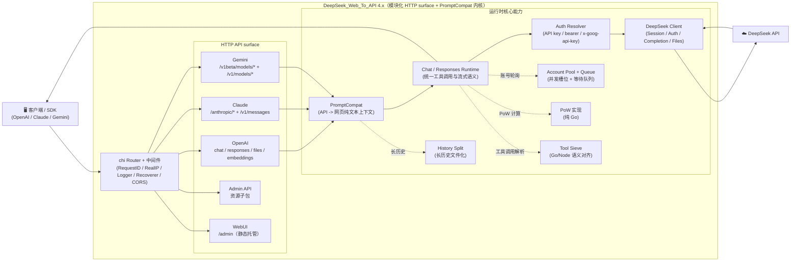

# DeepSeek_Web_To_API

语言 / Language: [中文](README.MD) | [English](README.en.md)

将 DeepSeek Web 对话能力转换为 OpenAI、Claude 与 Gemini 兼容 API。核心后端以 **Go** 实现，前端为 React WebUI 管理台（源码在 `webui/`，部署时自动构建到 `static/admin`）。

文档入口：[文档导航](docs/README.md) / [架构说明](docs/ARCHITECTURE.md) / [接口文档](API.md)

> **重要免责声明**
>
> 本仓库仅供学习、研究、个人实验和内部验证使用，不提供任何形式的商业授权、适用性保证或结果保证。
>
> 作者及仓库维护者不对因使用、修改、分发、部署或依赖本项目而产生的任何直接或间接损失、账号封禁、数据丢失、法律风险或第三方索赔负责。
>
> 请勿将本项目用于违反服务条款、协议、法律法规或平台规则的场景。商业使用前请自行确认 `LICENSE`、相关协议以及你是否获得了作者的书面许可。

## 目录

- [架构概览（摘要）](#架构概览摘要)
- [核心能力](#核心能力)
- [平台兼容矩阵](#平台兼容矩阵)
- [模型支持](#模型支持)
  - [OpenAI 接口](#openai-接口get-v1models)
  - [Claude 接口](#claude-接口get-anthropicv1models)
  - [Gemini 接口](#gemini-接口)
- [快速开始](#快速开始)
  - [方式一：下载 Release 构建包](#方式一下载-release-构建包)
  - [方式二：Docker 运行](#方式二docker-运行)
  - [方式三：本地源码运行](#方式三本地源码运行)
- [配置说明](#配置说明)
- [鉴权模式](#鉴权模式)
- [并发模型](#并发模型)
- [Tool Call 适配](#tool-call-适配)
- [本地开发抓包工具](#本地开发抓包工具)
- [文档索引](#文档索引)
- [测试](#测试)
- [Release 自动构建（GitHub Actions）](#release-自动构建github-actions)
- [免责声明](#免责声明)

## 架构概览（摘要）



详细架构拆分与目录职责见 [docs/ARCHITECTURE.md](docs/ARCHITECTURE.md)。

- **后端**：Go（`cmd/DeepSeek_Web_To_API/`、`internal/`），不依赖 Python 运行时
- **前端**：React 管理台（`webui/`），运行时托管静态构建产物
- **部署**：Release 二进制、Docker / GHCR、Zeabur、Linux systemd、本地源码运行

## 核心能力

| 能力 | 说明 |
| --- | --- |
| OpenAI 兼容 | `GET /v1/models`、`GET /v1/models/{id}`、`POST /v1/chat/completions`、`POST /v1/responses`、`GET /v1/responses/{response_id}`、`POST /v1/embeddings`、`POST /v1/files` |
| Claude 兼容 | `GET /anthropic/v1/models`、`POST /anthropic/v1/messages`、`POST /anthropic/v1/messages/count_tokens`（及快捷路径 `/v1/messages`、`/messages`） |
| Gemini 兼容 | `POST /v1beta/models/{model}:generateContent`、`POST /v1beta/models/{model}:streamGenerateContent`（及 `/v1/models/{model}:*` 路径） |
| 统一 CORS 兼容 | `/v1/*`、`/anthropic/*`、`/v1beta/models/*`、`/admin/*` 统一走同一套 CORS 策略，尽量减少第三方预检请求头限制 |
| 多账号轮询 | 自动 token 刷新、邮箱/手机号双登录方式 |
| 并发队列控制 | 每账号 in-flight 上限 + 等待队列，动态计算建议并发值 |
| DeepSeek PoW | 纯 Go 高性能实现（DeepSeekHashV1），毫秒级响应 |
| Tool Calling | 防泄漏处理：非代码块高置信特征识别、DeepSeek/Claude 工具结果边界 token 清洗、`delta.tool_calls` 早发、结构化增量输出 |
| Admin API | 配置管理、运行时设置热更新、代理管理、账号测试 / 批量测试、会话清理、导入导出、版本检查 |
| WebUI 管理台 | `/admin` 单页应用（中英文双语、深色模式，支持查看服务器端对话记录） |
| 运维探针 | `GET /healthz`（存活）、`GET /readyz`（就绪） |

OpenAI `/v1/*` 仍是推荐的规范路径；同时支持 `/models`、`/chat/completions`、`/responses`、`/embeddings`、`/files` 等根路径快捷路由，方便只配置 DeepSeek_Web_To_API 根地址的第三方客户端。对少数会把 `/v1` 重复拼接成 `/v1/v1/*` 的客户端，后端也提供等价别名以避免直接 404。

## 平台兼容矩阵

| 级别 | 平台 | 当前状态 |
| --- | --- | --- |
| P0 | Codex CLI/SDK（`wire_api=chat` / `wire_api=responses`） | ✅ |
| P0 | OpenAI SDK（JS/Python，chat + responses） | ✅ |
| P0 | Anthropic SDK（messages） | ✅ |
| P0 | Google Gemini SDK（generateContent） | ✅ |
| P1 | LangChain / LlamaIndex / OpenWebUI（OpenAI 兼容接入） | ✅ |

## 模型支持

### OpenAI 接口（`GET /v1/models`）

| 模型类型 | 模型 ID | thinking | search |
| --- | --- | --- | --- |
| default | `deepseek-v4-flash` | 默认开启，可由请求参数控制 | ❌ |
| default | `deepseek-v4-flash-nothinking` | 永久关闭，不受请求参数影响 | ❌ |
| expert | `deepseek-v4-pro` | 默认开启，可由请求参数控制 | ❌ |
| expert | `deepseek-v4-pro-nothinking` | 永久关闭，不受请求参数影响 | ❌ |
| default | `deepseek-v4-flash-search` | 默认开启，可由请求参数控制 | ✅ |
| default | `deepseek-v4-flash-search-nothinking` | 永久关闭，不受请求参数影响 | ✅ |
| expert | `deepseek-v4-pro-search` | 默认开启，可由请求参数控制 | ✅ |
| expert | `deepseek-v4-pro-search-nothinking` | 永久关闭，不受请求参数影响 | ✅ |
| vision | `deepseek-v4-vision` | 默认开启，可由请求参数控制 | ❌ |
| vision | `deepseek-v4-vision-nothinking` | 永久关闭，不受请求参数影响 | ❌ |

除原生模型外，也支持常见 alias 输入（如 `gpt-4.1`、`gpt-5`、`gpt-5-codex`、`o3`、`claude-*`、`gemini-*` 等），但 `/v1/models` 返回的是规范化后的 DeepSeek 原生模型 ID。若 alias 名本身追加 `-nothinking` 后缀，也会映射到对应的强制关思考模型。完整 alias 行为以 [API.md](API.md#模型-alias-解析策略) 和 `config.example.json` 为准。
当前上游视觉模型只暴露 `vision` 通道，不提供独立的联网搜索视觉变体。

### Claude 接口（`GET /anthropic/v1/models`）

| 当前常用模型 | 默认映射 |
| --- | --- |
| `claude-sonnet-4-6` | `deepseek-v4-flash` |
| `claude-sonnet-4-6-nothinking` | `deepseek-v4-flash-nothinking` |
| `claude-haiku-4-5`（兼容 `claude-3-5-haiku-latest`） | `deepseek-v4-flash` |
| `claude-haiku-4-5-nothinking` | `deepseek-v4-flash-nothinking` |
| `claude-opus-4-6` | `deepseek-v4-pro` |
| `claude-opus-4-6-nothinking` | `deepseek-v4-pro-nothinking` |

可通过配置中的 `model_aliases` 覆盖映射关系；若请求模型名带 `-nothinking`，会在最终映射结果上强制追加无思考语义。
`/anthropic/v1/models` 除上述主别名外，还会返回 Claude 4.x snapshots、3.x 历史模型 ID 与常见 alias，便于旧客户端直接兼容。

#### Claude Code 接入避坑（实测）

- `ANTHROPIC_BASE_URL` 推荐直接指向 DeepSeek_Web_To_API 根地址（例如 `http://127.0.0.1:5001`），Claude Code 会请求 `/v1/messages?beta=true`。
- 如果客户端误把基础地址配置为 `.../v1` 后又自动拼接 `/v1/messages`，服务端会兼容 `/v1/v1/messages` 与 `/v1/v1/messages/count_tokens`，但新接入仍建议修正为根地址。
- `ANTHROPIC_API_KEY` 需要与 `config.json` 中 `keys` 一致；建议同时保留常规 key 与 `sk-ant-*` 形态 key，兼容不同客户端校验习惯。
- 若系统设置了代理，建议对 DeepSeek_Web_To_API 地址配置 `NO_PROXY=127.0.0.1,localhost,<你的主机IP>`，避免本地回环请求被代理拦截。
- Claude Code 主 Agent / 子 Agent 会按稳定会话 root + 子任务 lane 生成账号亲和 key：同一个子 Agent 多轮会回到同一账号，不同子 Agent 会尽量分散到不同托管账号；账号池仍遵守每账号 in-flight 上限。
- 如遇“工具调用输出成文本、未执行”问题，请优先检查模型输出是否为推荐的 DSML 工具块：`<|DSML|tool_calls><|DSML|invoke name="..."><|DSML|parameter name="...">...`。兼容层也接受旧式 canonical XML：`<tool_calls><invoke name="..."><parameter name="...">...`；旧式 `<tools>` / `<tool_call>` / `<tool_name>` / `<param>`、`<function_call>`、`tool_use` 或纯 JSON `tool_calls` 片段不会执行。客户端回传工具结果时，DeepSeek_Web_To_API 会尽量纠正漏传/错传 `tool_call_id`、误用 `role:user`、Anthropic 风格 `tool_result` 混入 OpenAI 消息等常见偏差，优先保持会话继续；如果上游把 `<｜tool_result｜>`、`<｜end▁f▁of▁tool_result｜>` 等工具结果边界 token 当正文流出，Claude 流式层会跨分片抑制该内部块，避免污染 Claude Code 输出。

### Gemini 接口

Gemini 适配器将模型名通过 `model_aliases` 或内置规则映射到 DeepSeek 原生模型，支持 `generateContent` 和 `streamGenerateContent` 两种调用方式，并完整支持 Tool Calling（`functionDeclarations` → `functionCall` 输出）。若 Gemini 模型名带 `-nothinking` 后缀，例如 `gemini-2.5-pro-nothinking`，会映射到对应的强制关闭思考模型。

## 快速开始

### 部署方式优先级建议

推荐按以下顺序选择部署方式：

1. **下载 Release 构建包运行**：最省事，产物已编译完成，最适合大多数用户。
2. **Docker / GHCR 镜像部署**：适合需要容器化、编排或云环境部署。
3. **本地源码运行 / 自行编译**：适合开发、调试或需要自行修改代码的场景。

### 通用第一步（所有部署方式）

把 `config.json` 作为唯一配置源（推荐做法）：

```bash
cp config.example.json config.json
# 编辑 config.json
```

`config.example.json.Annotation` 是同结构字段说明，用于维护者检查每个配置项的含义、默认值、范围和可选环境变量覆盖；它不参与运行，真实配置仍只提交到本地 `config.json`。

后续部署建议：
- 本地运行：直接读取 `config.json`
- Docker / 云平台：由 `config.json` 生成 `DEEPSEEK_WEB_TO_API_CONFIG_JSON`（Base64）注入环境变量，也可以直接写原始 JSON

WebUI 管理台里的“全量配置模板”也直接复用同一份 `config.example.json`，所以更新示例文件后，前端模板会自动保持一致。

### 方式一：下载 Release 构建包

每次发布 Release 时，GitHub Actions 会自动构建多平台二进制包：

```bash
# 下载对应平台的压缩包后
tar -xzf deepseek-web-to-api_<tag>_linux_amd64.tar.gz
cd deepseek-web-to-api_<tag>_linux_amd64
cp config.example.json config.json
# 编辑 config.json
./deepseek-web-to-api
```

### 方式二：Docker 运行

```bash
# 1. 准备单一运行配置
cp .env.example .env
cp config.example.json config.json

# 2. 编辑 config.json（admin.key、admin.jwt_secret、keys、accounts 等都写在这里）
#    .env 只保留 DEEPSEEK_WEB_TO_API_HOST_PORT、DEEPSEEK_WEB_TO_API_CONFIG_PATH 等部署层覆盖项

# 3. 启动
docker-compose up -d

# 4. 查看日志
docker-compose logs -f
```

默认 `docker-compose.yml` 会把宿主机 `6011` 映射到容器内的 `5001`。如果你希望直接对外暴露 `5001`，请设置 `DEEPSEEK_WEB_TO_API_HOST_PORT=5001`（或者手动调整 `ports` 配置）。Compose 模板会挂载 `./config.json:/data/config.json` 并设置 `DEEPSEEK_WEB_TO_API_CONFIG_PATH=/data/config.json`；旧容器未设置该变量时，程序会在 `/data` 不存在时回退读取 `/app/config.json`。

更新镜像：`docker-compose up -d --build`

#### Zeabur 一键部署（Dockerfile）

1. 点击上方 “Deploy on Zeabur” 按钮，一键部署。
2. 部署完成后访问 `/admin`，使用 `config.json` 中的 `admin.key` 登录。
3. 在管理台导入/编辑配置（会写入并持久化到 `/data/config.json`）。

说明：Zeabur 使用仓库内 `Dockerfile` 直接构建时，不需要额外传入 `BUILD_VERSION`；镜像会优先读取该构建参数，未提供时自动回退到仓库根目录的 `VERSION` 文件。

### 方式三：本地源码运行

**前置要求**：Go 1.26+，Node.js `20.19+` 或 `22.12+`（仅在需要构建 WebUI 时）；同时确保 `npm` 可用，建议 `npm 10+`

```bash
# 1. 克隆仓库
git clone https://github.com/Meow-Calculations/DeepSeek_Web_To_API.git
cd deepseek-web-to-api

# 2. 配置
cp config.example.json config.json
# 编辑 config.json，填入你的 DeepSeek 账号信息和 API key

# 3. 启动
go run ./cmd/DeepSeek_Web_To_API
```

默认本地访问地址：`http://127.0.0.1:5001`

服务实际绑定：`0.0.0.0:5001`，因此同一局域网设备通常也可以通过你的内网 IP 访问。

> **WebUI 自动构建**：本地首次启动时，若 `static/admin` 不存在，会自动尝试执行 `npm ci`（仅在缺少依赖时）和 `npm run build -- --outDir static/admin --emptyOutDir`（需要本机有 Node.js 和 npm）。你也可以手动构建：`./scripts/build-webui.sh`

## 配置说明

`README` 只保留快速入口，完整字段请以 [config.example.json](config.example.json) 为模板，并参考 [部署指南](docs/DEPLOY.md#0-前置要求) 与 [API 配置最佳实践](API.md#配置最佳实践)。

常用字段：

- `keys` / `api_keys`：客户端访问密钥，`api_keys` 支持 `name` 与 `remark` 元信息，`keys` 继续兼容。
- `accounts`：DeepSeek 托管账号，支持 `email` 或 `mobile` 登录，可配置代理、名称和备注。
- `storage.chat_history_sqlite_path`：服务器端对话历史 SQLite 文件；详情会 gzip 压缩写入，旧 `storage.chat_history_path` 仅作为首次导入来源。
- `model_aliases`：OpenAI / Claude / Gemini 共用的模型 alias 映射。
- `runtime`：账号并发、队列与 token 刷新策略，可通过 Admin Settings 热更新。
- `auto_delete.mode`：请求结束后的远端会话清理策略，支持 `none` / `single` / `all`。
- `history_split`：旧轮次拆分字段，已废弃并忽略，仅保留兼容旧配置。
- `current_input_file`：唯一生效的独立拆分策略；默认开启且阈值为 `0`，触发时将完整上下文合并上传为 `DEEPSEEK_WEB_TO_API_HISTORY.txt` 上下文文件。
- 如果关闭 `current_input_file`，请求会直接透传，不上传拆分上下文文件。
- `thinking_injection`：默认开启；在最新 user 消息末尾追加思考增强提示词，提高高强度推理与工具调用前的思考稳定性；`prompt` 留空时使用内置默认提示词。

环境变量完整列表见 [部署指南](docs/DEPLOY.md)，接口鉴权规则见 [API.md](API.md#鉴权规则)。

## 鉴权模式

调用业务接口（`/v1/*`、`/anthropic/*`、Gemini 路由）时支持两种模式：

| 模式 | 说明 |
| --- | --- |
| **托管账号模式** | `Bearer` 或 `x-api-key` 传入 `config.keys` 中的 key，由服务自动轮询选择账号 |
| **直通 token 模式** | 传入 token 不在 `config.keys` 中时，直接作为 DeepSeek token 使用 |

可选请求头 `X-DeepSeek-Web-To-API-Target-Account`：指定使用某个托管账号（值为 email 或 mobile）。
如果指定账号不存在，或者当前管理账号队列已满，请求会返回 `429`；当前 `429` 不附带 `Retry-After` 头。若账号存在但登录/刷新失败，则返回对应的鉴权错误。
Gemini 路由还可以使用 `x-goog-api-key`，或在没有认证头时使用 `?key=` / `?api_key=` 作为调用方凭据。

## 并发模型

```
每账号可用并发 = DEEPSEEK_WEB_TO_API_ACCOUNT_MAX_INFLIGHT（默认 2）
建议并发值 = 账号数量 × 每账号并发上限
等待队列上限 = DEEPSEEK_WEB_TO_API_ACCOUNT_MAX_QUEUE（默认 = 建议并发值）
429 阈值 = in-flight + 等待队列 ≈ 账号数量 × 4
```

- 当 in-flight 槽位满时，请求进入等待队列，**不会立即 429**
- Claude Code 子 Agent 会先按子任务 lane 分配账号；子 Agent 数量超过 `账号数量 × 每账号并发上限` 时，超出的请求进入等待队列，而不是继续挤到同一个账号。
- 超出总承载上限后才返回 `429 Too Many Requests`
- `GET /admin/queue/status` 返回实时并发状态

## Tool Call 适配

当请求中带 `tools` 时，DeepSeek_Web_To_API 会做防泄漏处理与结构化转译：

1. 只在**非代码块上下文**启用执行型 toolcall 识别（代码块示例默认不触发）
2. 解析层当前把 DSML 外壳视为推荐可执行调用：`<|DSML|tool_calls>` → `<|DSML|invoke name="...">` → `<|DSML|parameter name="...">`；兼容旧式 canonical XML `<tool_calls>` → `<invoke name="...">` → `<parameter name="...">`。DSML 只是外壳别名，内部仍以 XML 解析语义为准；旧式 `<tools>` / `<tool_call>` / `<tool_name>` / `<param>`、`<function_call>`、`tool_use` / antml 变体与纯 JSON `tool_calls` 片段都会按普通文本处理
3. `responses` 流式严格使用官方 item 生命周期事件（`response.output_item.*`、`response.content_part.*`、`response.function_call_arguments.*`）
4. `responses` 支持并执行 `tool_choice`（`auto`/`none`/`required`/强制函数）；`required` 违规时非流式返回 `422`，流式返回 `response.failed`
5. 客户端请求哪种协议，就按该协议返回工具调用（OpenAI/Claude/Gemini 各自原生结构）；模型侧优先约束输出规范 XML，再由兼容层转译
6. 输出清洗层会移除泄漏的 DeepSeek/Claude 内部边界 token，包含畸形 `tool_result` 块与 `end▁f▁of...` 变体；Claude native stream 会跨 SSE 分片抑制这类内部工具结果块

> 说明：当前版本 parser 层以”尽量解析成功”为优先，所有格式合法的 XML 工具调用都会通过，不做工具名 allow-list 过滤。
>
> 想评估”把工具调用封装成 XML 再输入模型”的方案，可参考：`docs/toolcall-semantics.md`。

## 本地开发抓包工具

用于定位「responses 思考流/工具调用」等问题。开启后会自动记录最近 N 条 DeepSeek 对话上游请求体与响应体（默认 20 条，超出自动淘汰；单条响应体默认最多记录 5 MB）。

启用示例：

```bash
DEEPSEEK_WEB_TO_API_DEV_PACKET_CAPTURE=true \
DEEPSEEK_WEB_TO_API_DEV_PACKET_CAPTURE_LIMIT=20 \
go run ./cmd/DeepSeek_Web_To_API
```

查询/清空（需 Admin JWT）：

- `GET /admin/dev/captures`：查看抓包列表（最新在前）
- `DELETE /admin/dev/captures`：清空抓包
- `GET /admin/dev/raw-samples/query?q=关键词&limit=20`：按问题关键词查询当前内存抓包，并按 `chat_session_id` 归并 `completion + continue` 链
- `POST /admin/dev/raw-samples/save`：把命中的某条抓包链保存为 `tests/raw_stream_samples/<sample-id>/` 回放样本

返回字段包含：

- `request_body`：发送给 DeepSeek 的完整请求体
- `response_body`：上游返回的原始流式内容拼接文本
- `response_truncated`：是否触发单条大小截断

保存接口支持用 `query`、`chain_key` 或 `capture_id` 选中目标。例如：

```json
{"query":"广州天气","sample_id":"gz-weather-from-memory"}
```

## 文档索引

| 文档 | 说明 |
| --- | --- |
| [API.md](API.md) / [API.en.md](API.en.md) | API 接口文档（含请求/响应示例） |
| [DEPLOY.md](docs/DEPLOY.md) / [DEPLOY.en.md](docs/DEPLOY.en.md) | 部署指南（Release/Docker/Zeabur/systemd/本地源码） |
| [CONTRIBUTING.md](docs/CONTRIBUTING.md) / [CONTRIBUTING.en.md](docs/CONTRIBUTING.en.md) | 贡献指南 |
| [TESTING.md](docs/TESTING.md) | 测试集使用指南 |
| [security-audit-2026-05-02.md](docs/security-audit-2026-05-02.md) | 安全扫描、修复项与复跑命令 |

## 测试

详细测试指南请参阅 [docs/TESTING.md](docs/TESTING.md)。

### 快速测试命令

```bash
# 本地 PR 门禁
./scripts/lint.sh
./tests/scripts/check-refactor-line-gate.sh
./tests/scripts/run-unit-all.sh
npm run build --prefix webui

# 安全扫描
gosec ./...
govulncheck ./...
npm audit --prefix webui --audit-level=high --registry=https://registry.npmjs.org

# 端到端全链路测试（真实账号，生成完整请求/响应日志）
./tests/scripts/run-live.sh
```

## Release 自动构建（GitHub Actions）

工作流文件：`.github/workflows/release-artifacts.yml`

- **触发条件**：默认仅在 GitHub Release `published` 时自动触发；也支持在 Actions 页面手动 `workflow_dispatch`，并填写 `release_tag` 复跑/补发
- **构建产物**：多平台二进制包（`linux/amd64`、`linux/arm64`、`linux/armv7`、`darwin/amd64`、`darwin/arm64`、`windows/amd64`、`windows/arm64`）、Linux Docker 镜像导出包 + `sha256sums.txt`
- **容器镜像发布**：仅推送到 GHCR（`ghcr.io/meow-calculations/deepseek-web-to-api`）
- **每个二进制压缩包包含**：`deepseek-web-to-api` 可执行文件、`static/admin`、`config.example.json`、`.env.example`、`README.MD`、`README.en.md`、`LICENSE`

## 免责声明

本项目基于逆向方式实现，仅供学习、研究、个人实验和内部验证使用，不提供任何商业授权、稳定性保证或可用性保证。
作者及仓库维护者不对因使用、修改、分发、部署或依赖本项目而产生的任何直接或间接损失、账号封禁、数据丢失、法律风险或第三方索赔负责。

请勿将本项目用于违反服务条款、协议、法律法规或平台规则的场景。商业使用前请自行确认 `LICENSE`、相关协议以及你是否获得了作者的书面许可。
