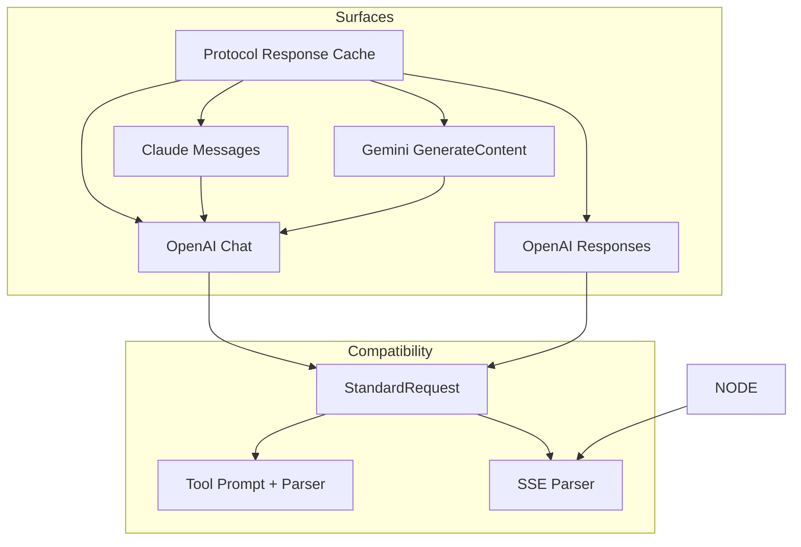
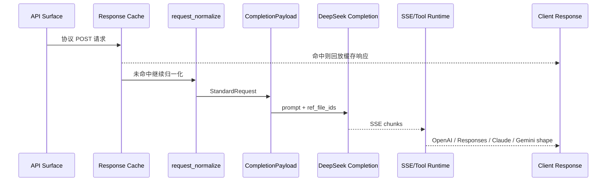

# API Compatibility System

<cite>
**本文档引用的文件**
- [internal/server/router.go](file://internal/server/router.go)
- [internal/responsecache/cache.go](file://internal/responsecache/cache.go)
- [internal/httpapi/openai/responses/cache_replay.go](file://internal/httpapi/openai/responses/cache_replay.go)
- [internal/httpapi/openai/chat/handler_chat.go](file://internal/httpapi/openai/chat/handler_chat.go)
- [internal/httpapi/openai/responses/responses_handler.go](file://internal/httpapi/openai/responses/responses_handler.go)
- [internal/httpapi/claude/handler_messages.go](file://internal/httpapi/claude/handler_messages.go)
- [internal/httpapi/gemini/handler_generate.go](file://internal/httpapi/gemini/handler_generate.go)
- [internal/promptcompat/request_normalize.go](file://internal/promptcompat/request_normalize.go)
- [internal/promptcompat/standard_request.go](file://internal/promptcompat/standard_request.go)
- [internal/sse/parser.go](file://internal/sse/parser.go)
- [internal/toolcall/toolcalls_parse.go](file://internal/toolcall/toolcalls_parse.go)
- [internal/toolstream/tool_sieve_core.go](file://internal/toolstream/tool_sieve_core.go)
</cite>

## 目录
1. [简介](#简介)
2. [项目结构](#项目结构)
3. [核心组件](#核心组件)
4. [架构总览](#架构总览)
5. [详细组件分析](#详细组件分析)
6. [依赖分析](#依赖分析)
7. [性能考虑](#性能考虑)
8. [故障排查指南](#故障排查指南)
9. [结论](#结论)

## 简介

API Compatibility System 负责把 OpenAI、Claude、Gemini 请求统一成 DeepSeek completion 可执行的上下文，并把 DeepSeek SSE 或非流式结果还原为客户端期望的响应格式。路由层还提供统一协议响应缓存，所有协议 POST 请求在进入 handler 前先尝试 5 分钟且最多 3.8GB 的内存缓存，以及 4 小时且最多 16GB 的 gzip 磁盘缓存。该系统的维护重点不是单个接口字段，而是协议语义在缓存、标准化、prompt、tool、文件、stream 和错误收尾之间是否一致。

**章节来源**
- [router.go:72-87](file://internal/server/router.go#L72-L87)
- [cache.go:131-181](file://internal/responsecache/cache.go#L131-L181)
- [handler_chat.go:21-154](file://internal/httpapi/openai/chat/handler_chat.go#L21-L154)
- [responses_handler.go:51-175](file://internal/httpapi/openai/responses/responses_handler.go#L51-L175)
- [request_normalize.go:16-156](file://internal/promptcompat/request_normalize.go#L16-L156)

## 项目结构

**图表来源**
- [router.go:72-87](file://internal/server/router.go#L72-L87)
- [cache.go:184-208](file://internal/responsecache/cache.go#L184-L208)
- [handler_chat.go:21-154](file://internal/httpapi/openai/chat/handler_chat.go#L21-L154)
- [responses_handler.go:51-175](file://internal/httpapi/openai/responses/responses_handler.go#L51-L175)
- [handler_messages.go:20-133](file://internal/httpapi/claude/handler_messages.go#L20-L133)
- [handler_generate.go:20-129](file://internal/httpapi/gemini/handler_generate.go#L20-L129)

**章节来源**
- [prompt-compatibility.md](file://docs/prompt-compatibility.md)

## 核心组件

- Protocol Response Cache：覆盖 OpenAI Chat/Responses/Embeddings、Claude/Anthropic Messages/CountTokens、Gemini GenerateContent/StreamGenerateContent；缓存键按调用方和协议输入隔离，命中后直接回放原协议响应。
- OpenAI Chat：完整执行 Chat Completions，包含 inline file、current input file、history capture、空回复重试和 auto delete。
- OpenAI Responses：支持 `input` 宽输入、response store、Responses SSE 事件和 `GET /v1/responses/{response_id}`。
- Claude：提供模型列表、messages、count_tokens，并通过直接标准化或 OpenAI proxy 复用核心语义。
- Gemini：提供 generateContent/streamGenerateContent，并映射 thinkingBudget 到 OpenAI thinking 开关。
- SSE parser：拆分 thinking/text、过滤状态 path、采集 citation link、识别 content filter。
- Tool parser/sieve：统一 DSML/XML 工具调用提示、解析、修复和流式缓冲。

**章节来源**
- [cache.go:41-181](file://internal/responsecache/cache.go#L41-L181)
- [cache.go:210-272](file://internal/responsecache/cache.go#L210-L272)
- [handler_chat.go:21-320](file://internal/httpapi/openai/chat/handler_chat.go#L21-L320)
- [responses_handler.go:21-300](file://internal/httpapi/openai/responses/responses_handler.go#L21-L300)
- [handler_messages.go:20-133](file://internal/httpapi/claude/handler_messages.go#L20-L133)
- [handler_generate.go:20-170](file://internal/httpapi/gemini/handler_generate.go#L20-L170)
- [parser.go:17-469](file://internal/sse/parser.go#L17-L469)
- [toolcalls_parse.go:1-284](file://internal/toolcall/toolcalls_parse.go#L1-L284)

## 架构总览

**图表来源**
- [cache.go:131-181](file://internal/responsecache/cache.go#L131-L181)
- [request_normalize.go:16-156](file://internal/promptcompat/request_normalize.go#L16-L156)
- [standard_request.go:42-89](file://internal/promptcompat/standard_request.go#L42-L89)
- [consumer.go:21-119](file://internal/sse/consumer.go#L21-L119)

**章节来源**
- [prompt-compatibility.md](file://docs/prompt-compatibility.md)

## 详细组件分析

### 标准化边界

`StandardRequest` 是协议边界。它保留 surface、请求模型、解析模型、响应模型、原始消息、工具、最终 prompt、工具策略、stream、thinking、search、文件引用和 passthrough 参数。任何新增协议都应先产出该结构，再进入 DeepSeek client。

### 缓存边界

`responsecache.Cache` 是协议响应边界。它不理解具体协议字段，而是基于调用方、HTTP 方法、协议归一路径、查询参数、影响输出的协议请求头和请求体摘要生成 key；OpenAI root alias、双 `/v1` alias 与 Claude/Anthropic alias 会映射到同一语义路径。缓存只保存 2xx 且无 `Set-Cookie` / `no-store` 的响应；内存层保留 5 分钟且最多 3.8GB，磁盘层保留 4 小时且最多 16GB 并写入 gzip 文件。请求可通过 `Cache-Control: no-cache` / `no-store` 或 `X-DeepSeek-Web-To-API-Cache-Control: bypass` 绕过缓存。Responses 缓存命中会从缓存体恢复 response 对象并回填 response store，避免 GET 查询与缓存回放脱节。

### 输出边界

非流式路径使用 `sse.CollectStream` 聚合 DeepSeek SSE，再由格式化层生成 OpenAI/Responses/Claude/Gemini 响应。流式路径使用 `stream.ConsumeSSE` 和各 surface 的 runtime emitter 增量输出，并在 finalize 阶段处理工具调用、usage、空回复和 content filter。

### Node 对齐

**章节来源**
- [cache.go:184-208](file://internal/responsecache/cache.go#L184-L208)
- [cache.go:210-272](file://internal/responsecache/cache.go#L210-L272)
- [cache.go:281-512](file://internal/responsecache/cache.go#L281-L512)
- [cache.go:544-572](file://internal/responsecache/cache.go#L544-L572)
- [cache_replay.go:13-75](file://internal/httpapi/openai/responses/cache_replay.go#L13-L75)
- [standard_request.go:1-89](file://internal/promptcompat/standard_request.go#L1-L89)
- [consumer.go:21-119](file://internal/sse/consumer.go#L21-L119)
- [engine.go:21-146](file://internal/stream/engine.go#L21-L146)

## 依赖分析

兼容系统依赖路由中间件、模型解析、账号鉴权、DeepSeek client、SSE parser、tool parser、translatorcliproxy 和格式化层。Claude/Gemini 的 translator 引入了协议转换依赖，因此改动其请求字段时必须同时验证 OpenAI 共享路径；缓存 key 相关请求头变化也必须同步验证所有协议命中隔离。

**章节来源**
- [router.go:72-87](file://internal/server/router.go#L72-L87)
- [cache.go:196-208](file://internal/responsecache/cache.go#L196-L208)
- [models.go:1-210](file://internal/config/models.go#L1-L210)
- [request.go:37-139](file://internal/auth/request.go#L37-L139)
- [handler_messages.go:20-133](file://internal/httpapi/claude/handler_messages.go#L20-L133)
- [handler_generate.go:20-129](file://internal/httpapi/gemini/handler_generate.go#L20-L129)

## 性能考虑

兼容系统要避免四类开销失控：重复上游协议调用、超大请求体、流式工具块无限缓冲、Responses store 长时间保留。当前代码通过路由级响应缓存、`http.MaxBytesReader`、tool sieve flush、Responses TTL、stream idle timeout 和 request trace 限制风险；缓存层会快速跳过声明超过上限的请求体，对未知长度或 chunked 请求只做上限 +1 字节的有界读取，并把内存缓存限制在 3.8GB、磁盘缓存限制在 16GB，避免为了缓存提前吞入或长期保留过大的数据。

**章节来源**
- [cache.go:131-181](file://internal/responsecache/cache.go#L131-L181)
- [cache.go:255-279](file://internal/responsecache/cache.go#L255-L279)
- [handler_chat.go:35-48](file://internal/httpapi/openai/chat/handler_chat.go#L35-L48)
- [responses_handler.go:51-66](file://internal/httpapi/openai/responses/responses_handler.go#L51-L66)
- [response_store.go:22-76](file://internal/httpapi/openai/responses/response_store.go#L22-L76)
- [tool_sieve_core.go:9-220](file://internal/toolstream/tool_sieve_core.go#L9-L220)

## 故障排查指南

- 协议返回形状错误：先确认是否走了正确 surface，再看 formatter 和 translator。
- 缓存命中/未命中异常：检查 `X-DeepSeek-Web-To-API-Cache`、请求体、模型、协议归一路径、`Anthropic-Version`、`Anthropic-Beta`、`X-DeepSeek-Web-To-API-Target-Account` 和缓存绕过请求头。
- tool 调用丢失：检查工具 schema 是否进入 `injectToolPrompt`，再看 parser 是否识别 DSML/XML wrapper。
- thinking 泄漏或缺失：检查模型 `-nothinking`、请求 override、stream runtime 和 `ExposeReasoning`。

**章节来源**
- [cache.go:184-208](file://internal/responsecache/cache.go#L184-L208)
- [cache.go:669-681](file://internal/responsecache/cache.go#L669-L681)
- [tool_prompt.go:1-66](file://internal/promptcompat/tool_prompt.go#L1-L66)
- [toolcalls_parse.go:1-80](file://internal/toolcall/toolcalls_parse.go#L1-L80)
- [sse_parse_impl.js:1-636](file://internal/js/chat-stream/sse_parse_impl.js#L1-L636)
- [parser.go:17-469](file://internal/sse/parser.go#L17-L469)

## 结论

协议兼容系统的正确性来自共享中间语义和统一路由边界，而不是每个协议各自维护一套规则。新增字段、模型、工具策略、缓存相关请求头或流式行为时，应先确认缓存 key 与 `StandardRequest` 是否表达清楚，再同步 Go 与 Node 两套流式解析实现。

**章节来源**
- [cache.go:196-208](file://internal/responsecache/cache.go#L196-L208)
- [standard_request.go:1-89](file://internal/promptcompat/standard_request.go#L1-L89)
- [prompt-compatibility.md](file://docs/prompt-compatibility.md)
