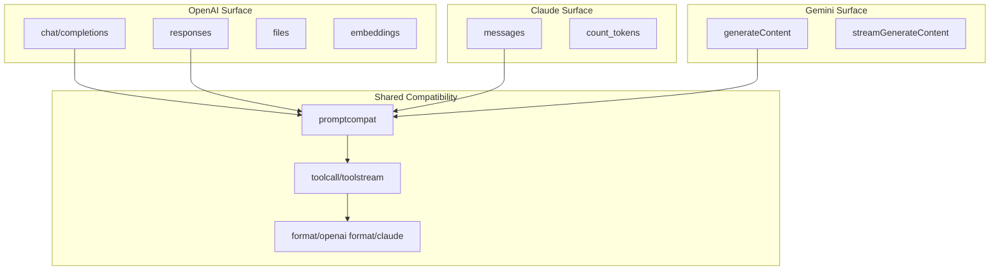
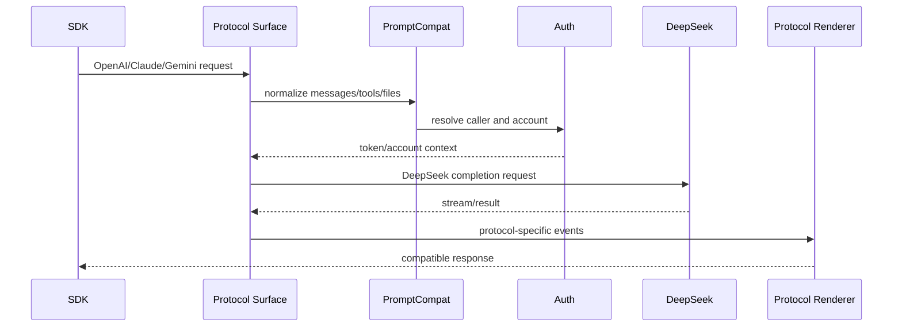

# API 兼容系统

<cite>
**本文档引用的文件**
- [internal/server/router.go](file://internal/server/router.go)
- [internal/httpapi/openai/chat/handler.go](file://internal/httpapi/openai/chat/handler.go)
- [internal/httpapi/openai/responses/handler.go](file://internal/httpapi/openai/responses/handler.go)
- [internal/httpapi/claude/handler_routes.go](file://internal/httpapi/claude/handler_routes.go)
- [internal/httpapi/gemini/handler_routes.go](file://internal/httpapi/gemini/handler_routes.go)
- [internal/promptcompat/request_normalize.go](file://internal/promptcompat/request_normalize.go)
</cite>

## 目录

1. [简介](#简介)
2. [项目结构](#项目结构)
3. [核心组件](#核心组件)
4. [架构总览](#架构总览)
5. [详细组件分析](#详细组件分析)
6. [故障排查指南](#故障排查指南)
7. [结论](#结论)

## 简介

API 兼容系统负责接受 OpenAI、Claude、Gemini 风格请求，把消息、工具、文件引用、模型 alias、stream 参数和上下文转成 DeepSeek Web 可处理的请求，再把上游结果渲染回原协议形态。

**章节来源**
- [internal/server/router.go](file://internal/server/router.go)
- [API.md](file://API.md)

## 项目结构

**图表来源**
- [internal/server/router.go](file://internal/server/router.go)
- [internal/promptcompat/request_normalize.go](file://internal/promptcompat/request_normalize.go)

**章节来源**
- [internal/httpapi/openai/chat/handler.go](file://internal/httpapi/openai/chat/handler.go)
- [internal/httpapi/openai/responses/handler.go](file://internal/httpapi/openai/responses/handler.go)

## 核心组件

- OpenAI Chat：主力对话接口，支持流式、工具调用、文件引用和历史捕获。
- OpenAI Responses：兼容 Responses 输入结构、暂存 Response 和流式事件。
- Claude Messages：兼容 Claude Code 与 Anthropic SDK 的 messages/count_tokens 路由。
- Gemini GenerateContent：兼容 Google 风格 contents、parts、tools 和 streamGenerateContent。
- PromptCompat：统一消息归一化、工具提示注入、历史文本拼接和当前输入文件处理。
- Toolcall：解析 DSML、XML 和 JSON 风格工具调用，尽量修复客户端提交的常见畸形片段。

**章节来源**
- [internal/promptcompat/standard_request.go](file://internal/promptcompat/standard_request.go)
- [internal/toolcall/toolcalls_parse.go](file://internal/toolcall/toolcalls_parse.go)
- [internal/toolstream/tool_sieve_core.go](file://internal/toolstream/tool_sieve_core.go)

## 架构总览

**图表来源**
- [internal/httpapi/openai/chat/handler_chat.go](file://internal/httpapi/openai/chat/handler_chat.go)
- [internal/httpapi/claude/stream_runtime_core.go](file://internal/httpapi/claude/stream_runtime_core.go)
- [internal/httpapi/gemini/handler_stream_runtime.go](file://internal/httpapi/gemini/handler_stream_runtime.go)

**章节来源**
- [internal/format/openai/render_stream_events.go](file://internal/format/openai/render_stream_events.go)
- [internal/format/claude/render.go](file://internal/format/claude/render.go)

## 详细组件分析

### 路由别名

OpenAI 支持规范 `/v1/*`、根路径别名和 `/v1/v1/*` 兜底。Claude 支持 `/anthropic/v1/messages`、`/v1/messages`、`/messages`。Gemini 支持 `/v1beta/models/*` 和 `/v1/models/*`。

### 模型 alias

模型解析会先接受原生 DeepSeek 模型，再查默认 alias 和 `config.json` 的 `model_aliases`。`-nothinking` 后缀会保留为禁用 thinking 的兼容变体。

### 工具调用

工具调用以“尽量接受、严格输出”为目标：对常见 DSML/XML/JSON 形态做解析和窄修复，流式阶段通过 sieve 防止工具标签泄漏到普通文本。

**章节来源**
- [internal/server/router.go](file://internal/server/router.go)
- [internal/config/models.go](file://internal/config/models.go)
- [internal/toolcall/toolcalls_dsml.go](file://internal/toolcall/toolcalls_dsml.go)

## 故障排查指南

- SDK 拼出 `/v1/v1/*`：后端已有别名，优先检查客户端 baseURL 是否重复带 `/v1`。
- Claude Code 不流式：检查请求是否命中 `/anthropic/v1/messages` 或 `/v1/messages`，以及客户端是否开启 stream。
- 工具调用泄漏为普通文本：查看 [工具调用语义](file://docs/toolcall-semantics.md)，确认模型输出结构是否可被窄修复。
- 缓存命中低：检查请求体中是否包含每次变化的字段，以及调用方 API Key 是否一致。

**章节来源**
- [docs/toolcall-semantics.md](file://docs/toolcall-semantics.md)
- [internal/responsecache/cache.go](file://internal/responsecache/cache.go)

## 结论

兼容系统不是简单转发层，而是请求归一化、上下文合成、工具修复、流式渲染和上游调用的组合。保持它的文档与 `docs/prompt-compatibility.md` 同步，是后续兼容 Claude Code、Codex 和各类 SDK 的关键。

**章节来源**
- [docs/prompt-compatibility.md](file://docs/prompt-compatibility.md)
