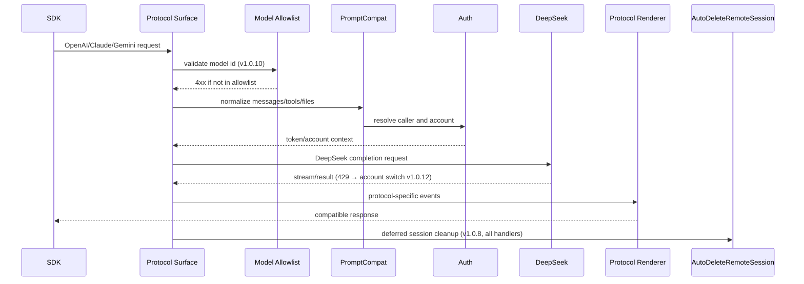

# API 兼容系统

<cite>
**本文档引用的文件**
- [internal/server/router.go](file://internal/server/router.go)
- [internal/httpapi/openai/chat/handler.go](file://internal/httpapi/openai/chat/handler.go)
- [internal/httpapi/openai/responses/handler.go](file://internal/httpapi/openai/responses/handler.go)
- [internal/httpapi/claude/handler_routes.go](file://internal/httpapi/claude/handler_routes.go)
- [internal/httpapi/gemini/handler_routes.go](file://internal/httpapi/gemini/handler_routes.go)
- [internal/promptcompat/request_normalize.go](file://internal/promptcompat/request_normalize.go)
- [internal/config/models.go](file://internal/config/models.go)
- [CHANGELOG.md](file://CHANGELOG.md)
</cite>

## 目录

1. [简介](#简介)
2. [项目结构](#项目结构)
3. [核心组件](#核心组件)
4. [架构总览](#架构总览)
5. [详细组件分析](#详细组件分析)
6. [故障排查指南](#故障排查指南)
7. [结论](#结论)

## 简介

API 兼容系统负责接受 OpenAI、Claude、Gemini 风格请求，把消息、工具、文件引用、模型 alias、stream 参数和上下文转成 DeepSeek Web 可处理的请求，再把上游结果渲染回原协议形态。

**v1.0.8 – v1.0.12 关键行为变更（运维人员必读）：**

| 版本 | 变更 | 影响 |
|------|------|------|
| v1.0.8 | `AutoDeleteRemoteSession` 统一接入 chat / responses / claude 三条 handler 链 | `/v1/messages`（Claude Code）现在正确执行 WebUI “结束后全部删除” 会话清理 |
| v1.0.10 | 移除模型族前缀启发式兜底；严格 allowlist | 任何不在 allowlist 的模型 id 返回 4xx；自定义 id 必须在 WebUI 添加 Model Aliases |
| v1.0.10 | `deepseek-v4-vision` 从 `/v1/models` 中隐藏并在所有端点拒绝 | 使用该 id 的客户端需切换别名 |
| v1.0.12 | 上游 429 触发账号切换，不消耗重试配额 | 峰值时段 429 暴露率显著降低 |

**章节来源**
- [internal/server/router.go](file://internal/server/router.go)
- [API.md](file://API.md)
- [CHANGELOG.md](file://CHANGELOG.md)

## 项目结构

```mermaid
graph TB
subgraph “OpenAI Surface”
CHAT[“/v1/chat/completions”]
RESP[“/v1/responses”]
FILES[“/v1/files”]
EMB[“/v1/embeddings”]
MODELS[“/v1/models / /v1/models/{id}”]
end
subgraph “Claude Surface”
MSG[“/v1/messages + /anthropic/v1/messages”]
TOK[“/v1/messages/count_tokens”]
end
subgraph “Gemini Surface”
GEN[“/v1beta/models/{model}:generateContent”]
STREAMGEN[“/v1beta/models/{model}:streamGenerateContent”]
end
subgraph “Shared Compatibility”
PROMPT[“promptcompat”]
TOOL[“toolcall/toolstream”]
FORMAT[“format/openai · format/claude”]
AUTODEL[“AutoDeleteRemoteSession”]
ALLOWLIST[“Model Allowlist v1.0.10”]
FAILOVER[“429 Elastic Fail-over v1.0.12”]
end
CHAT --> PROMPT
RESP --> PROMPT
MSG --> PROMPT
GEN --> PROMPT
PROMPT --> TOOL
TOOL --> FORMAT
FORMAT --> AUTODEL
PROMPT --> ALLOWLIST
ALLOWLIST --> FAILOVER
```

**图表来源**
- [internal/server/router.go](file://internal/server/router.go)
- [internal/promptcompat/request_normalize.go](file://internal/promptcompat/request_normalize.go)
- [internal/config/models.go](file://internal/config/models.go)

**章节来源**
- [internal/httpapi/openai/chat/handler.go](file://internal/httpapi/openai/chat/handler.go)
- [internal/httpapi/openai/responses/handler.go](file://internal/httpapi/openai/responses/handler.go)

## 核心组件

- **OpenAI Chat**：主力对话接口，支持流式、工具调用、文件引用和历史捕获。v1.0.8 起在 deferred cleanup 阶段调用 `AutoDeleteRemoteSession`。
- **OpenAI Responses**：兼容 Responses 输入结构、暂存 Response 和流式事件。v1.0.8 起同样接入 `AutoDeleteRemoteSession`。
- **Claude Messages**：兼容 Claude Code 与 Anthropic SDK 的 messages/count_tokens 路由。v1.0.8 修复：即使 WebUI 开启”结束后全部删除”，该路由之前不执行远程会话清理，现已统一修复（Issue #20）。
- **Gemini GenerateContent**：兼容 Google 风格 contents、parts、tools 和 streamGenerateContent。
- **PromptCompat**：统一消息归一化、工具提示注入、历史文本拼接和当前输入文件处理。
- **Toolcall**：解析 DSML、XML 和 JSON 风格工具调用，尽量修复客户端提交的常见畸形片段。
- **Model Allowlist（v1.0.10）**：移除了模型族前缀启发式兜底（`gpt-` / `claude-` / `gemini-` / `o1` / `o3` / `llama-` / `qwen-` / `mistral-` / `command-` 等前缀不再自动路由到默认 DeepSeek 模型）。现在未在 allowlist 中的 id 直接返回 4xx 并附带严格 allowlist 提示。`DefaultModelAliases` 覆盖约 100 个常见 OpenAI/Claude/Gemini id，大多数真实客户端无需操作。
- **429 弹性故障转移（v1.0.12）**：上游返回 429 时触发账号切换而不消耗重试配额，对客户端完全透明。

**章节来源**
- [internal/promptcompat/standard_request.go](file://internal/promptcompat/standard_request.go)
- [internal/toolcall/toolcalls_parse.go](file://internal/toolcall/toolcalls_parse.go)
- [internal/toolstream/tool_sieve_core.go](file://internal/toolstream/tool_sieve_core.go)
- [internal/config/models.go](file://internal/config/models.go)

## 架构总览



**图表来源**
- [internal/httpapi/openai/chat/handler_chat.go](file://internal/httpapi/openai/chat/handler_chat.go)
- [internal/httpapi/claude/stream_runtime_core.go](file://internal/httpapi/claude/stream_runtime_core.go)
- [internal/httpapi/gemini/handler_stream_runtime.go](file://internal/httpapi/gemini/handler_stream_runtime.go)

**章节来源**
- [internal/format/openai/render_stream_events.go](file://internal/format/openai/render_stream_events.go)
- [internal/format/claude/render.go](file://internal/format/claude/render.go)

## 详细组件分析

### 端点矩阵

| 端点 | 方法 | 协议 | 缓存 | 自动删会话 |
|------|------|------|------|-----------|
| `/v1/chat/completions` | POST | OpenAI Chat Completions | SharedAcrossCallers（非流式） | v1.0.8+ |
| `/v1/responses` | POST | OpenAI Responses API | 暂存 response_id | v1.0.8+ |
| `/v1/embeddings` | POST | OpenAI Embeddings | SharedAcrossCallers（确定性） | 不适用 |
| `/v1/messages` + `/anthropic/v1/messages` | POST | Anthropic / Claude Code | SharedAcrossCallers（count_tokens） | v1.0.8 修复 |
| `/v1/messages/count_tokens` | POST | Anthropic | SharedAcrossCallers | 不适用 |
| `/v1/files` | POST | OpenAI Files | 无 | 不适用 |
| `/v1/models`, `/v1/models/{id}` | GET | OpenAI Models | 无 | 不适用 |
| `/v1beta/models/{model}:generateContent` | POST | Gemini | SharedAcrossCallers | 不适用 |
| `/v1beta/models/{model}:streamGenerateContent` | POST | Gemini 流式 | 无 | 不适用 |
| `/admin/*` | 多种 | 管理接口 | 无 | 不适用 |

### 路由别名

OpenAI 支持规范 `/v1/*`、根路径别名和 `/v1/v1/*` 兜底。Claude 支持 `/anthropic/v1/messages`、`/v1/messages`、`/messages`。Gemini 支持 `/v1beta/models/*` 和 `/v1/models/*`。

### 模型 Allowlist（v1.0.10 破坏性变更）

v1.0.10 前：未知模型 id 若匹配 `gpt-` / `claude-` / `gemini-` / `o1` / `o3` / `llama-` / `qwen-` / `mistral-` / `command-` 等前缀，会静默路由到默认 DeepSeek 模型。

v1.0.10 起：该行为已移除。任何不在 `DefaultModelAliases`（约 100 条）或 WebUI 配置的 Model Aliases 中的 id，均返回 4xx 并附带严格 allowlist 错误消息。`deepseek-v4-vision` 被从 `/v1/models` 隐藏并在所有端点拒绝。

**运维操作**：若客户端使用的是自定义 id（如 `my-gpt`、`company-claude`），需在 WebUI Settings → Model Aliases 中添加显式映射，配置热重载无需重启。

### 429 弹性故障转移（v1.0.12）

上游返回 HTTP 429 时，账号切换逻辑在不消耗重试配额的情况下切换到池中下一个账号。客户端仅在整个池的所有账号同时触发限流时才会收到 429。

### 自动删除远程会话（v1.0.8 修复）

`AutoDeleteRemoteSession` 共享 helper 已接入 chat、responses、claude 三条 handler 的 deferred cleanup 路径。修复前，`/v1/messages`（Claude Code 使用的端点）即使 WebUI 开启了”结束后全部删除”也不执行会话清理，导致会话在服务端堆积（Issue #20）。

### 工具调用

工具调用以”尽量接受、严格输出”为目标：对常见 DSML/XML/JSON 形态做解析和窄修复，流式阶段通过 sieve 防止工具标签泄漏到普通文本。

**章节来源**
- [internal/server/router.go](file://internal/server/router.go)
- [internal/config/models.go](file://internal/config/models.go)
- [internal/toolcall/toolcalls_dsml.go](file://internal/toolcall/toolcalls_dsml.go)

## 故障排查指南

- **SDK 拼出 `/v1/v1/*`**：后端已有别名，优先检查客户端 baseURL 是否重复带 `/v1`。
- **Claude Code 会话未被清理（v1.0.8 前）**：升级到 v1.0.8 后，WebUI 的”结束后全部删除”开关会正确触发 `/v1/messages` 请求结束后的远程会话删除。
- **模型 id 返回 4xx（v1.0.10 后）**：客户端使用了不在 allowlist 中的 id。检查 WebUI Settings → Model Aliases，添加从客户端 id 到实际 DeepSeek 模型的映射。`deepseek-v4-vision` 已被永久封禁。
- **峰值 429（v1.0.12 后）**：若仍收到 429，说明账号池中所有账号均已触发限流，应增加账号数量或降低并发。
- **Claude Code 不流式**：检查请求是否命中 `/anthropic/v1/messages` 或 `/v1/messages`，以及客户端是否开启 stream。
- **工具调用泄漏为普通文本**：查看 [工具调用语义](file://docs/toolcall-semantics.md)，确认模型输出结构是否可被窄修复。
- **缓存命中低**：检查请求体中是否包含每次变化的字段，以及调用方 API Key 是否一致。

**章节来源**
- [docs/toolcall-semantics.md](file://docs/toolcall-semantics.md)
- [internal/responsecache/cache.go](file://internal/responsecache/cache.go)
- [CHANGELOG.md](file://CHANGELOG.md)

## 结论

兼容系统不是简单转发层，而是请求归一化、上下文合成、工具修复、流式渲染和上游调用的组合。v1.0.8 统一了会话清理行为，v1.0.10 收紧了模型 allowlist，v1.0.12 引入了 429 弹性故障转移——三项变更共同提升了高并发场景下的稳定性与可预期性。保持它的文档与 `docs/prompt-compatibility.md` 同步，是后续兼容 Claude Code、Codex 和各类 SDK 的关键。

**章节来源**
- [docs/prompt-compatibility.md](file://docs/prompt-compatibility.md)
- [CHANGELOG.md](file://CHANGELOG.md)
