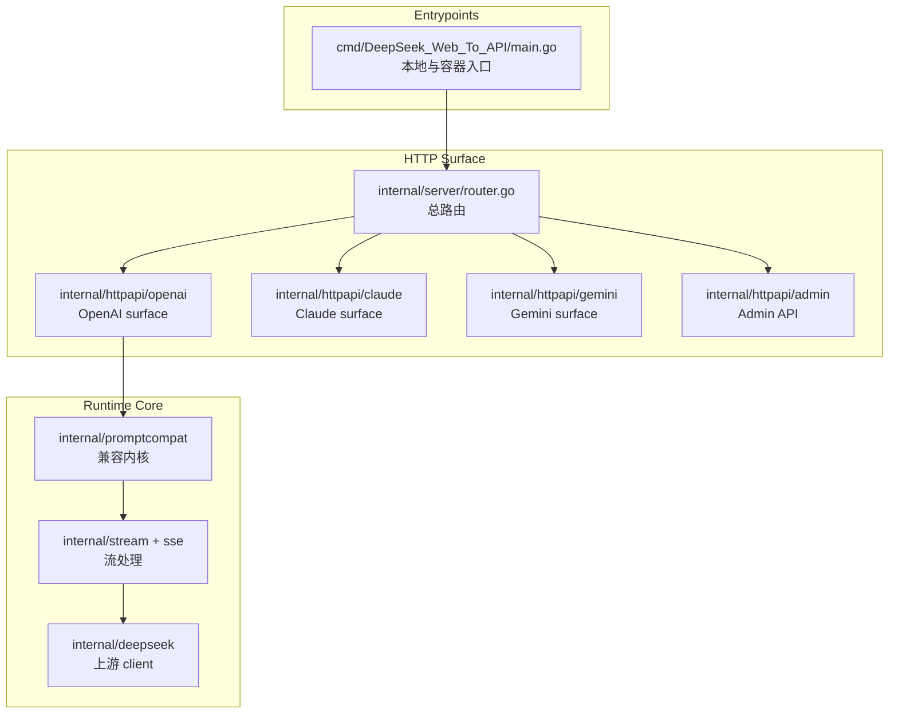
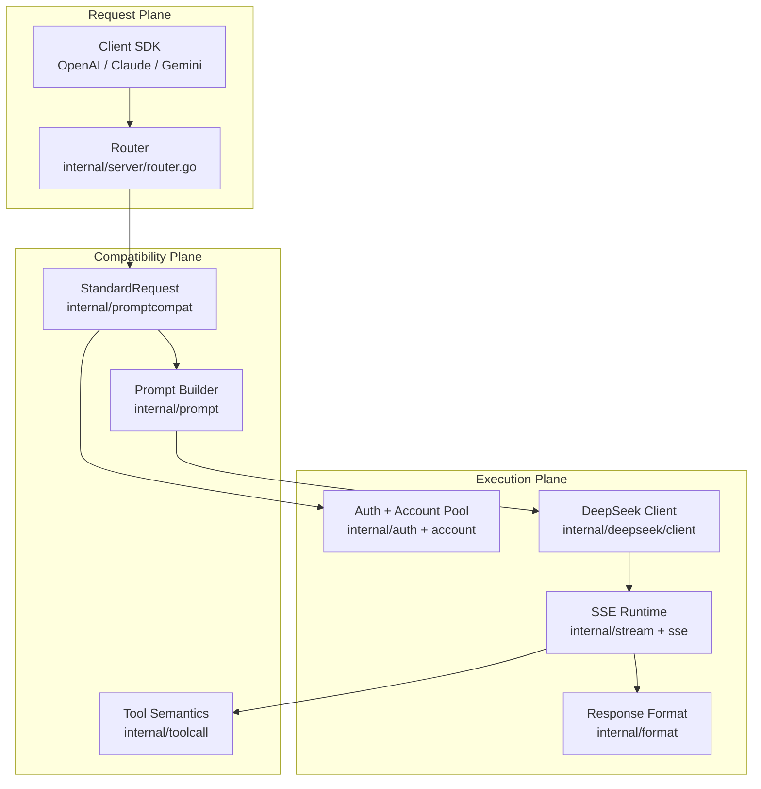

# DeepSeek_Web_To_API 架构说明

<cite>
**本文档引用的文件**
- [cmd/DeepSeek_Web_To_API/main.go](file://cmd/DeepSeek_Web_To_API/main.go)
- [internal/server/router.go](file://internal/server/router.go)
- [internal/httpapi/openai/chat/handler_chat.go](file://internal/httpapi/openai/chat/handler_chat.go)
- [internal/httpapi/openai/responses/responses_handler.go](file://internal/httpapi/openai/responses/responses_handler.go)
- [internal/httpapi/claude/handler_messages.go](file://internal/httpapi/claude/handler_messages.go)
- [internal/httpapi/gemini/handler_generate.go](file://internal/httpapi/gemini/handler_generate.go)
- [internal/deepseek/client/client_completion.go](file://internal/deepseek/client/client_completion.go)
</cite>

## 目录
1. [简介](#简介)
2. [项目结构](#项目结构)
3. [核心组件](#核心组件)
4. [架构总览](#架构总览)
5. [详细组件分析](#详细组件分析)
6. [依赖分析](#依赖分析)
7. [性能考虑](#性能考虑)
8. [故障排查指南](#故障排查指南)
9. [结论](#结论)

## 简介

DeepSeek_Web_To_API 的架构目标是把多个主流 API surface 收敛到同一套 DeepSeek Web 对话执行链路。Go 服务负责主要路由、配置、鉴权、账号池、prompt 兼容、SSE 解析和输出格式化。

**章节来源**
- [main.go:1-127](file://cmd/DeepSeek_Web_To_API/main.go#L1-L127)

## 项目结构

**图表来源**
- [main.go:19-89](file://cmd/DeepSeek_Web_To_API/main.go#L19-L89)
- [router.go:41-105](file://internal/server/router.go#L41-L105)

**章节来源**
- [Architecture Design.md](file://docs/Architecture%20Design/Architecture%20Design.md)
- [router.go:41-105](file://internal/server/router.go#L41-L105)

## 核心组件

- `internal/server`：创建 `config.Store`、`account.Pool`、`auth.Resolver`、`deepseek.Client`，并挂载所有 HTTP 路由、中间件、CORS 与安全响应头。
- `internal/httpapi/openai`：提供 `/v1/models`、`/v1/chat/completions`、`/v1/responses`、`/v1/files`、`/v1/embeddings`。
- `internal/httpapi/claude` 与 `internal/httpapi/gemini`：将协议请求转为 OpenAI 兼容请求或使用标准化链路，保持模型、thinking、tool 和流式行为一致。
- `internal/promptcompat`：把结构化请求转换成 `StandardRequest`，再生成 DeepSeek completion payload。
- `internal/stream`、`internal/sse`、`internal/toolcall`、`internal/toolstream`：处理 DeepSeek SSE、思考/正文拆分、工具调用解析和流式防泄漏。
- `internal/deepseek`：完成登录、建会话、PoW、completion、continue、文件上传、会话删除和代理传输。

**章节来源**
- [router.go:41-105](file://internal/server/router.go#L41-L105)
- [handler_chat.go:21-154](file://internal/httpapi/openai/chat/handler_chat.go#L21-L154)
- [responses_handler.go:51-175](file://internal/httpapi/openai/responses/responses_handler.go#L51-L175)
- [client_auth.go:53-160](file://internal/deepseek/client/client_auth.go#L53-L160)

## 架构总览

**图表来源**
- [request_normalize.go:16-156](file://internal/promptcompat/request_normalize.go#L16-L156)
- [standard_request.go:42-89](file://internal/promptcompat/standard_request.go#L42-L89)
- [engine.go:21-146](file://internal/stream/engine.go#L21-L146)
- [toolcalls_parse.go:1-80](file://internal/toolcall/toolcalls_parse.go#L1-L80)

**章节来源**
- [request_normalize.go:16-156](file://internal/promptcompat/request_normalize.go#L16-L156)
- [client_completion.go:15-89](file://internal/deepseek/client/client_completion.go#L15-L89)

## 详细组件分析

### 服务入口

`cmd/DeepSeek_Web_To_API/main.go` 负责加载部署层 `.env` 覆盖项、从单一 `config.json` 建立运行配置、刷新 logger、确保 WebUI 构建、初始化 `server.NewApp`、校验 Admin 安全材料，并启动带超时配置的 HTTP server。

### 路由装配

`internal/server/router.go` 在 `NewApp` 中初始化配置、账号池、鉴权解析器、DeepSeek client、chat history store 和各协议 handler，再通过 chi 挂载健康检查、OpenAI、Claude、Gemini、Admin 与 WebUI。

### 协议执行

OpenAI Chat 与 Responses 都采用“读 body、确定 caller、标准化历史、获取账号、预处理文件、创建 DeepSeek 会话、获取 PoW、调用 completion、按 stream/non-stream 输出”的结构。Claude 与 Gemini 通过 translator/adapter 进入同一 OpenAI 兼容语义。

**章节来源**
- [main.go:19-89](file://cmd/DeepSeek_Web_To_API/main.go#L19-L89)
- [router.go:41-105](file://internal/server/router.go#L41-L105)
- [handler_chat.go:21-154](file://internal/httpapi/openai/chat/handler_chat.go#L21-L154)
- [responses_handler.go:51-175](file://internal/httpapi/openai/responses/responses_handler.go#L51-L175)
- [handler_messages.go:20-133](file://internal/httpapi/claude/handler_messages.go#L20-L133)
- [handler_generate.go:20-129](file://internal/httpapi/gemini/handler_generate.go#L20-L129)

## 依赖分析

核心 Go 依赖包括 `go-chi/chi` 路由、`uuid`、`utls`、`CLIProxyAPI` 协议转换、`x/net/proxy` 代理支持和压缩/加密相关库。前端由 React、Vite、React Router、lucide-react、Tailwind 生态组成。部署层由 Docker、docker-compose 和 Zeabur 配置共同覆盖。

**章节来源**
- [go.mod:1-24](file://go.mod#L1-L24)
- [webui/package.json:1-27](file://webui/package.json#L1-L27)
- [Dockerfile:1-57](file://Dockerfile#L1-L57)

## 性能考虑

服务端设置了请求头读取、总读写和 idle timeout；账号池支持单账号并发、全局并发、等待队列和会话亲缘绑定；流式链路带 keepalive、idle timeout、空内容重试与自动 continue；DeepSeek 传输层使用 Safari 指纹 TLS，并在失败时回退到标准 transport。

**章节来源**
- [main.go:51-58](file://cmd/DeepSeek_Web_To_API/main.go#L51-L58)
- [pool_core.go:17-73](file://internal/account/pool_core.go#L17-L73)
- [affinity.go:19-160](file://internal/account/affinity.go#L19-L160)
- [engine.go:37-146](file://internal/stream/engine.go#L37-L146)
- [transport.go:24-113](file://internal/deepseek/transport/transport.go#L24-L113)

## 故障排查指南

- 管理台无法登录：检查 `config.json` 中的 `admin.key` 或 `admin.password_hash`，并确保 `admin.jwt_secret` 已设置；旧部署仍可用同名环境变量覆盖。
- 请求返回无可用账号：检查 `config.json` 中 `accounts`、`keys`、账号池并发与代理连通性。
- 流式请求长时间无输出：检查 `DEEPSEEK_WEB_TO_API_STREAM_IDLE_TIMEOUT_SECONDS`、上游 PoW、账号 token、代理和 `content_filter` 终态。

**章节来源**
- [admin.go:40-70](file://internal/auth/admin.go#L40-L70)
- [request.go:37-139](file://internal/auth/request.go#L37-L139)
- [client_auth.go:53-160](file://internal/deepseek/client/client_auth.go#L53-L160)

## 结论

DeepSeek_Web_To_API 的核心架构不是多个协议各自独立实现，而是多个入口共享一套标准化、账号租约、DeepSeek completion 和 SSE 输出语义。这样的设计降低了协议漂移风险，但也要求任何 prompt、tool、history、file、stream 行为变化都同步更新 `docs/prompt-compatibility.md` 与模块化文档。

**章节来源**
- [router.go:41-105](file://internal/server/router.go#L41-L105)
- [prompt-compatibility.md](file://docs/prompt-compatibility.md)
