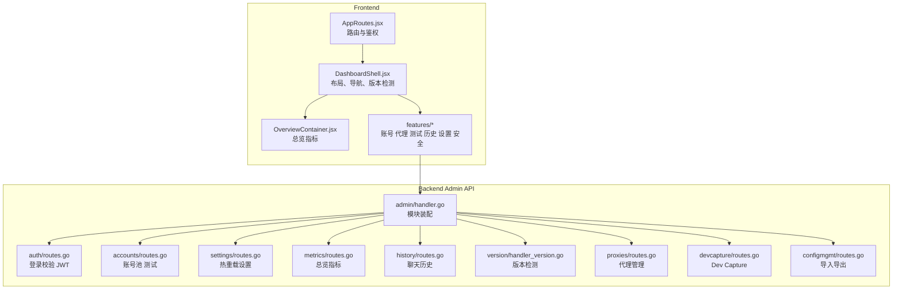
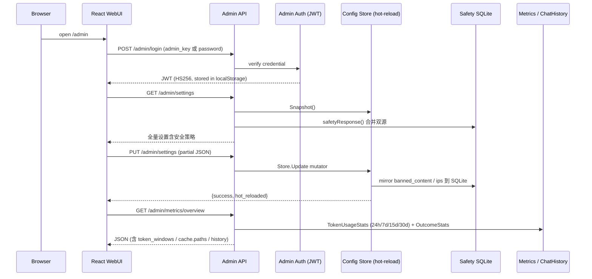

# Admin WebUI 系统

<cite>
**本文档引用的文件**
- [webui/src/app/AppRoutes.jsx](file://webui/src/app/AppRoutes.jsx)
- [webui/src/layout/DashboardShell.jsx](file://webui/src/layout/DashboardShell.jsx)
- [webui/src/features/overview/OverviewContainer.jsx](file://webui/src/features/overview/OverviewContainer.jsx)
- [internal/httpapi/admin/handler.go](file://internal/httpapi/admin/handler.go)
- [internal/httpapi/admin/auth/routes.go](file://internal/httpapi/admin/auth/routes.go)
- [internal/httpapi/admin/settings/handler_settings_write.go](file://internal/httpapi/admin/settings/handler_settings_write.go)
- [internal/httpapi/admin/settings/handler_settings_read.go](file://internal/httpapi/admin/settings/handler_settings_read.go)
- [internal/httpapi/admin/metrics/handler.go](file://internal/httpapi/admin/metrics/handler.go)
- [internal/chathistory/metrics.go](file://internal/chathistory/metrics.go)
- [internal/webui/build.go](file://internal/webui/build.go)
</cite>

## 目录

1. [简介](#简介)
2. [项目结构](#项目结构)
3. [核心组件](#核心组件)
4. [架构总览](#架构总览)
5. [详细组件分析](#详细组件分析)
6. [故障排查指南](#故障排查指南)
7. [结论](#结论)

## 简介

Admin WebUI 是内置管理台，负责日常运维操作：查看总览指标、管理账号和代理、测试 API、查看历史记录、批量导入账号、修改运行设置、配置安全策略。前端由 React/Vite 构建，后端由 Go 静态托管。所有设置均通过 `PUT /admin/settings` 单一端点提交，服务端局部 JSON 合并后**立即热重载**，无需重启进程。

**章节来源**
- [webui/package.json](file://webui/package.json)
- [internal/webui/build.go](file://internal/webui/build.go)
- [internal/httpapi/admin/settings/handler_settings_write.go](file://internal/httpapi/admin/settings/handler_settings_write.go)

## 项目结构

**图表来源**
- [webui/src/app/AppRoutes.jsx](file://webui/src/app/AppRoutes.jsx)
- [webui/src/layout/DashboardShell.jsx](file://webui/src/layout/DashboardShell.jsx)
- [internal/httpapi/admin/handler.go](file://internal/httpapi/admin/handler.go)

**章节来源**
- [internal/httpapi/admin/accounts/routes.go](file://internal/httpapi/admin/accounts/routes.go)
- [internal/httpapi/admin/configmgmt/routes.go](file://internal/httpapi/admin/configmgmt/routes.go)

## 核心组件

- **`AppRoutes`**：负责生产/开发路由、登录态检测、配置拉取和进入仪表盘。
- **`DashboardShell`**：负责侧边导航、状态卡片、版本信息、新版本检测（30s 轮询 GitHub API）和子页面挂载。
- **`OverviewContainer`**：周期性请求 `/admin/queue/status`、`/admin/chat-history` 和 `/admin/metrics/overview`；呈现成功率、吞吐量、缓存命中率、账号负载等指标。
- **`SafetyPolicySection`**：安全策略管理控件——违禁词列表、违禁正则、越狱模式开关、IP 黑/白名单、自动拉黑阈值/窗口、会话 ID 封锁；数据来自 `safetyResponse` 合并双源后返回。
- **Admin API 模块**：按领域拆分为 `auth`、`accounts`、`settings`、`proxies`、`history`、`metrics`、`version`、`devcapture`、`configmgmt` 等。
- **`webui.EnsureBuiltOnStartup`**：静态文件缺失且允许自动构建时，启动时执行 `npm ci && npm run build`。
- **热重载链**：`PUT /admin/settings` → `Store.Update` mutator → `Pool.ApplyRuntimeLimits` + `ResponseCache.ApplyOptions` + `policyCache.signature` 置空（触发下次请求重建安全策略）+ 别名映射快照更新。

**章节来源**
- [webui/src/app/AppRoutes.jsx](file://webui/src/app/AppRoutes.jsx)
- [webui/src/layout/DashboardShell.jsx](file://webui/src/layout/DashboardShell.jsx)
- [webui/src/features/overview/OverviewContainer.jsx](file://webui/src/features/overview/OverviewContainer.jsx)
- [internal/httpapi/admin/settings/handler_settings_write.go](file://internal/httpapi/admin/settings/handler_settings_write.go)
- [internal/webui/build.go](file://internal/webui/build.go)

## 架构总览

**图表来源**
- [internal/httpapi/admin/auth/routes.go](file://internal/httpapi/admin/auth/routes.go)
- [internal/httpapi/admin/settings/handler_settings_write.go](file://internal/httpapi/admin/settings/handler_settings_write.go)
- [internal/httpapi/admin/metrics/handler.go](file://internal/httpapi/admin/metrics/handler.go)

**章节来源**
- [internal/httpapi/admin/settings/handler_settings_read.go](file://internal/httpapi/admin/settings/handler_settings_read.go)
- [internal/httpapi/admin/history/routes.go](file://internal/httpapi/admin/history/routes.go)

## 详细组件分析

### 页面清单

| 页面 | 路由/功能 | 后端端点 |
|---|---|---|
| 总览 | 吞吐 QPS、成功率、Token 用量、缓存命中率、主机信息 | `GET /admin/metrics/overview` |
| 账号 | 账号池 CRUD、测试账号、测试 API、强制重登、状态持久化 | `accounts/*` |
| 代理 | HTTP 代理管理（出站调用） | `proxies/*` |
| 历史 | 分页 / 搜索（IP / caller / model）/ 详情 / 手动删除 / 自动删除模式 | `history/*` |
| 设置 | 运行时限流、兼容性、缓存、**安全策略（含 auto_ban）**、别名、模型 | `PUT /admin/settings` |
| Dev Capture | 原始上游 payload 抽样（调试用） | `devcapture/*` |
| 导入/导出 | 配置 JSON 全量导入导出 | `configmgmt/*` |
| 版本检测 | 当前版本 vs GitHub latest release | `GET /admin/version` |

页面文案支持中英文，翻译资源在 `webui/src/locales`。

**章节来源**
- [internal/httpapi/admin/handler.go](file://internal/httpapi/admin/handler.go)
- [webui/src/app/AppRoutes.jsx](file://webui/src/app/AppRoutes.jsx)

### 鉴权（Auth）

管理台登录使用 `admin_key` 或 `password_hash`（二者之一必须配置，否则拒绝启动）。登录成功后返回 HS256 JWT，存入 `localStorage`（v1.0.8 起，防止硬刷新丢失）；支持 `jwt_valid_after_unix` 截断旧 token。管理员可在设置页修改密码，修改后 `jwt_valid_after_unix` 自动更新，所有旧 session 立刻失效。

**章节来源**
- [internal/httpapi/admin/auth/handler_auth.go](file://internal/httpapi/admin/auth/handler_auth.go)
- [internal/auth/admin.go](file://internal/auth/admin.go)

### 设置与热重载

`PUT /admin/settings` 接受**局部 JSON**（partial merge），仅更新传入的字段。写入流程：

1. `Store.Update` mutator 原子性修改内存 `Config`。
2. `SafetyWords.ReplaceKind` + `SafetyIPs.Replace*` 镜像写入对应 SQLite。
3. `Pool.ApplyRuntimeLimits` 更新账号并发限制。
4. `ResponseCache.ApplyOptions` 更新缓存 TTL / 容量。
5. `policyCache.signature` 置空，下一请求重建安全策略（含新违禁词/IP 黑名单）。

v1.0.7 修复：移除了之前 path-policy 中硬编码 TTL 覆盖逻辑（该逻辑静默绕过了 `Store` 配置），所有缓存 TTL 现在完全来自 `Store.ResponseCacheDiskTTL()` / `Store.ResponseCacheMemoryTTL()`。

**章节来源**
- [internal/httpapi/admin/settings/handler_settings_write.go](file://internal/httpapi/admin/settings/handler_settings_write.go)
- [internal/httpapi/admin/settings/handler_settings_runtime.go](file://internal/httpapi/admin/settings/handler_settings_runtime.go)

### 账号管理

- **账号池 CRUD**：新增 / 编辑 / 删除账号；identifier 为 email 或规范化手机号。
- **测试账号**：通过 DeepSeek 登录接口获取 token，发起一次完整推理请求验证账号可用性；结果持久化到 `accounts.sqlite`，重启后保留。
- **测试 API**：使用当前账号直接调用 OpenAI 兼容 chat completions 接口，验证全链路。
- **强制重登**：清除缓存 token，下次请求自动触发重新登录。
- **状态持久化**（`AccountTestStatus`）：运行时状态写入 `accTest` map，不进入 `config.json`。

**章节来源**
- [internal/httpapi/admin/accounts/handler_accounts_crud.go](file://internal/httpapi/admin/accounts/handler_accounts_crud.go)
- [internal/httpapi/admin/accounts/handler_accounts_testing.go](file://internal/httpapi/admin/accounts/handler_accounts_testing.go)
- [internal/httpapi/admin/accounts/handler_accounts_test_account.go](file://internal/httpapi/admin/accounts/handler_accounts_test_account.go)

### 聊天历史

- 分页查询（默认 100 条 / 页，最大 500）；支持按 IP / caller / model 过滤。
- 详情视图：展开单条请求的完整 prompt、finish_reason、token 用量、耗时、`request_ip`、`conversation_id`。
- 手动删除单条或批量删除。
- **自动删除模式**（`auto_delete.mode`）：`none`（保留）/ `single`（完成后删除本次）/ `all`（完成后删除全部）；`auto_delete.sessions` 控制会话粒度删除。
- **安全拦截条目**：被 `requestguard` 拦截的请求以 `status=error`、`finish_reason=policy_blocked`、`status_code=403` 写入历史，可在历史页面审计。

**章节来源**
- [internal/httpapi/admin/history/handler_chat_history.go](file://internal/httpapi/admin/history/handler_chat_history.go)
- [internal/requestguard/guard.go](file://internal/requestguard/guard.go)

### 总览指标

`GET /admin/metrics/overview` 返回如下字段（v1.0.7 4 卡 + 缓存路径细分）：

| 字段 | 说明 |
|---|---|
| `throughput.qps` | 近 1 分钟请求 QPS |
| `throughput.tokens_per_second` | 近 1 分钟 token 产出速率 |
| `token_windows.{24h,7d,15d,30d}` | 各时间窗口 token 用量（input/output/total/cache_hit/cache_miss，按 model 分组） |
| `cache.hit_rate` / `cache.cacheable_hit_rate` | 全量 / 可缓存请求命中率 |
| `cache.paths` | 按路径细分缓存统计（lookups / hits / misses / stores / memory_hits / disk_hits / shared） |
| `history.success_rate` | 成功率（排除 401/403/502/504/524） |
| `history.excluded_from_failure_rate` | 被排除于成功率计算的请求计数（含安全拦截 403） |
| `history.excluded_status_codes` | 当前排除列表 `[401, 403, 502, 504, 524]` |
| `host` | CPU、内存、磁盘、Go 版本等主机信息 |
| `current_input_prefix` | `current_input_file` 功能的活跃状态快照 |
| `pool` | 账号池并发状态 |

**成功率排除说明**：安全策略拦截（HTTP 403 / `policy_blocked`）不计入失败率；`ExcludedFromFailureRate` 计数器单独呈现，不影响 `success_rate`。

**章节来源**
- [internal/httpapi/admin/metrics/handler.go](file://internal/httpapi/admin/metrics/handler.go)
- [internal/chathistory/metrics.go](file://internal/chathistory/metrics.go)

### 新版本检测

`DashboardShell` 启动后通过 `/admin/version` 读取当前版本，再每 30 秒请求 GitHub API 的 latest release。若仓库还没有 Release，则回退读取最新 tag。前端用语义化版本比较确认远端版本大于当前版本后，在侧边栏版本卡片显示"发现新版本"，并通过 toast 提醒一次；点击提示会打开 GitHub Releases 页面。临时网络错误或 GitHub 限流不会清空已经发现的更新提示，下一次成功轮询会自动修正状态。`/admin/version` 本身不主动拉取远端，只返回当前编译版本和 `update_policy=self_managed`。

**章节来源**
- [webui/src/layout/DashboardShell.jsx](file://webui/src/layout/DashboardShell.jsx)
- [internal/httpapi/admin/version/handler_version.go](file://internal/httpapi/admin/version/handler_version.go)

### 静态托管

生产模式下 Go 服务托管 `static/admin`。如果静态文件不存在且 `server.auto_build_webui=true`，启动时会自动执行 `npm ci && npm run build`。

**章节来源**
- [internal/webui/build.go](file://internal/webui/build.go)
- [internal/webui/handler.go](file://internal/webui/handler.go)

## 故障排查指南

- **页面仍显示旧内容**：确认浏览器缓存、`static/admin` 是否已重新构建、服务是否重启。
- **登录后立刻退出**：检查 Admin JWT secret、JWT 过期时间、系统时间；确认 `localStorage` 中的 JWT 未被手动清除。
- **总览数据为 0**：检查 `/admin/metrics/overview`、`/admin/queue/status` 是否返回 200；确认 `data/` 目录下 SQLite 文件可读。
- **没有新版本提醒**：确认浏览器能访问 `api.github.com`，以及 GitHub 仓库是否存在大于当前 `/admin/version` 的 Release 或 tag。
- **WebUI 自动构建失败**：确认部署环境有 npm，或提前构建并复制 `static/admin`。
- **设置保存后未生效**：查看 Admin API 日志，确认 `Store.Update` 无报错；安全策略热重载依赖 `policyCache.signature` 置空——若 SQLite 写入失败仅记录 warn，策略仍然从 config 端生效。
- **成功率显示偏低**：确认 `FailureRateExcludedStatusCodes` 覆盖了所有已知基础设施错误码；安全拦截（403 `policy_blocked`）正常情况下计入 `excluded_from_failure_rate` 而非 `failed`。
- **token_windows 数据异常**：v1.0.5 后统一使用 `completed_at`（为 0 则回退 `created_at`）作为窗口归属时间戳，24h/7d/15d/30d 四个窗口计数一致。

**章节来源**
- [internal/webui/build.go](file://internal/webui/build.go)
- [webui/src/app/useAdminAuth.js](file://webui/src/app/useAdminAuth.js)
- [internal/httpapi/admin/metrics/handler.go](file://internal/httpapi/admin/metrics/handler.go)

## 结论

Admin WebUI 是当前项目的控制面，不只是静态页面。它与后端 Admin API 强绑定，`PUT /admin/settings` 单端点覆盖所有运行时可调参数（含完整安全策略），热重载保证修改秒级生效。部署时必须同时覆盖前端构建产物与后端管理接口，并确保 `data/` 目录权限和 JWT secret 安全存储。

**章节来源**
- [internal/httpapi/admin/handler.go](file://internal/httpapi/admin/handler.go)
- [internal/httpapi/admin/settings/handler_settings_write.go](file://internal/httpapi/admin/settings/handler_settings_write.go)
