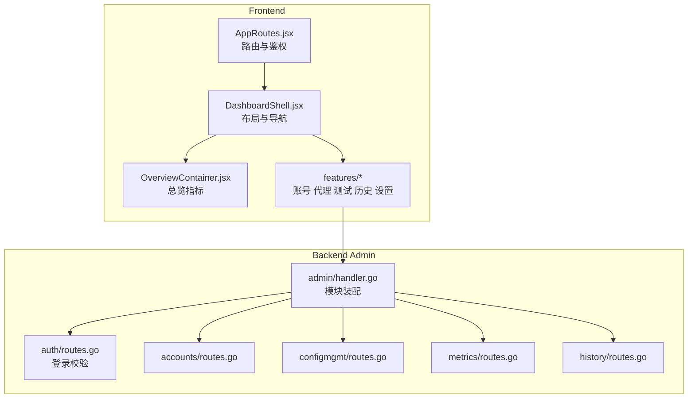
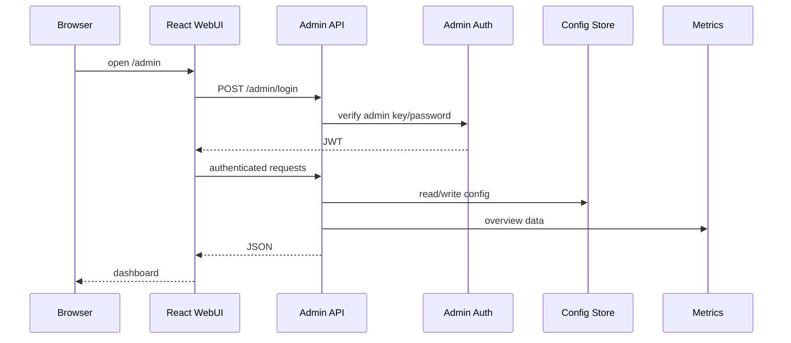

# Admin WebUI 系统

<cite>
**本文档引用的文件**
- [webui/src/app/AppRoutes.jsx](file://webui/src/app/AppRoutes.jsx)
- [webui/src/layout/DashboardShell.jsx](file://webui/src/layout/DashboardShell.jsx)
- [webui/src/features/overview/OverviewContainer.jsx](file://webui/src/features/overview/OverviewContainer.jsx)
- [internal/httpapi/admin/handler.go](file://internal/httpapi/admin/handler.go)
- [internal/httpapi/admin/auth/routes.go](file://internal/httpapi/admin/auth/routes.go)
- [internal/webui/build.go](file://internal/webui/build.go)
</cite>

## 目录

1. [简介](#简介)
2. [项目结构](#项目结构)
3. [核心组件](#核心组件)
4. [架构总览](#架构总览)
5. [详细组件分析](#详细组件分析)
6. [故障排查指南](#故障排查指南)
7. [结论](#结论)

## 简介

Admin WebUI 是内置管理台，负责日常运维操作：查看总览、管理账号和代理、测试 API、查看历史记录、批量导入账号、修改运行设置。前端由 React/Vite 构建，后端由 Go 静态托管。

**章节来源**
- [webui/package.json](file://webui/package.json)
- [internal/webui/build.go](file://internal/webui/build.go)

## 项目结构

**图表来源**
- [webui/src/app/AppRoutes.jsx](file://webui/src/app/AppRoutes.jsx)
- [webui/src/layout/DashboardShell.jsx](file://webui/src/layout/DashboardShell.jsx)
- [internal/httpapi/admin/handler.go](file://internal/httpapi/admin/handler.go)

**章节来源**
- [internal/httpapi/admin/accounts/routes.go](file://internal/httpapi/admin/accounts/routes.go)
- [internal/httpapi/admin/configmgmt/routes.go](file://internal/httpapi/admin/configmgmt/routes.go)

## 核心组件

- `AppRoutes`：负责生产/开发路由、登录态、配置拉取和进入仪表盘。
- `DashboardShell`：负责侧边导航、状态卡片、版本信息、新版本检测和子页面挂载。
- `OverviewContainer`：负责队列、历史、指标聚合，显示成功率、缓存命中率、账号负载等。
- Admin API：按领域拆分为 auth、accounts、configmgmt、settings、proxies、history、metrics、version 等模块。
- `webui.EnsureBuiltOnStartup`：静态文件缺失且允许自动构建时，启动时执行 `npm ci` 和 `npm run build`。

**章节来源**
- [webui/src/app/AppRoutes.jsx](file://webui/src/app/AppRoutes.jsx)
- [webui/src/layout/DashboardShell.jsx](file://webui/src/layout/DashboardShell.jsx)
- [webui/src/features/overview/OverviewContainer.jsx](file://webui/src/features/overview/OverviewContainer.jsx)
- [internal/webui/build.go](file://internal/webui/build.go)

## 架构总览

**图表来源**
- [internal/httpapi/admin/auth/routes.go](file://internal/httpapi/admin/auth/routes.go)
- [internal/httpapi/admin/metrics/routes.go](file://internal/httpapi/admin/metrics/routes.go)
- [webui/src/app/useAdminAuth.js](file://webui/src/app/useAdminAuth.js)

**章节来源**
- [internal/httpapi/admin/settings/routes.go](file://internal/httpapi/admin/settings/routes.go)
- [internal/httpapi/admin/history/routes.go](file://internal/httpapi/admin/history/routes.go)

## 详细组件分析

### 页面结构

管理台当前包含：总览、账号、代理、测试、历史、导入、设置。页面文案支持中英文，翻译资源在 `webui/src/locales`。

### 新版本检测

`DashboardShell` 启动后先通过 `/admin/version` 读取当前版本，再每 30 秒请求 GitHub API 的 latest release。若仓库还没有 Release，则回退读取最新 tag。前端用语义化版本比较确认远端版本大于当前版本后，在侧边栏版本卡片显示“发现新版本”，并通过 toast 提醒一次；点击提示会打开 GitHub Releases 页面。临时网络错误或 GitHub 限流不会清空已经发现的更新提示，下一次成功轮询会自动修正状态。

**章节来源**
- [webui/src/layout/DashboardShell.jsx](file://webui/src/layout/DashboardShell.jsx)
- [internal/httpapi/admin/version/handler_version.go](file://internal/httpapi/admin/version/handler_version.go)

### 总览指标

总览页周期性请求 `/admin/queue/status`、`/admin/chat-history` 和 `/admin/metrics/overview`。成功率排除用户侧的 `401`、`403`、`502`、`504`、`524` 等状态，缓存命中率来自响应缓存统计。

### 静态托管

生产模式下 Go 服务托管 `static/admin`。如果静态文件不存在且配置允许，启动时会自动构建 WebUI。

**章节来源**
- [webui/src/features/overview/OverviewContainer.jsx](file://webui/src/features/overview/OverviewContainer.jsx)
- [internal/httpapi/admin/metrics/handler.go](file://internal/httpapi/admin/metrics/handler.go)
- [internal/webui/handler.go](file://internal/webui/handler.go)

## 故障排查指南

- 页面仍显示旧内容：确认浏览器缓存、`static/admin` 是否已重新构建、服务是否重启。
- 登录后立刻退出：检查 Admin JWT secret、JWT 过期时间和系统时间。
- 总览数据为 0：检查 `/admin/metrics/overview`、`/admin/queue/status` 是否返回 200。
- 没有新版本提醒：确认浏览器能访问 `api.github.com`，以及 GitHub 仓库是否存在大于当前 `/admin/version` 的 Release 或 tag。
- WebUI 自动构建失败：确认部署环境有 npm，或提前构建并复制 `static/admin`。

**章节来源**
- [internal/webui/build.go](file://internal/webui/build.go)
- [webui/src/app/useAdminAuth.js](file://webui/src/app/useAdminAuth.js)

## 结论

Admin WebUI 是当前项目的控制面，不只是静态页面。它与后端 Admin API 强绑定，文档和部署步骤必须同时覆盖前端构建产物与后端管理接口。

**章节来源**
- [internal/httpapi/admin/handler.go](file://internal/httpapi/admin/handler.go)
