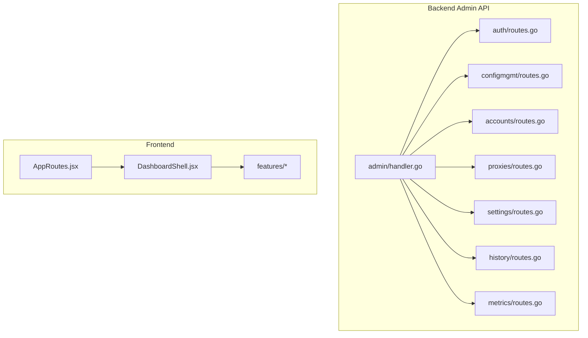
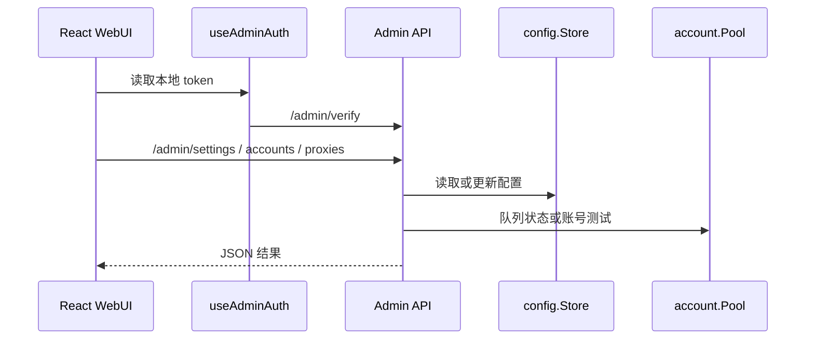

# Admin WebUI System

<cite>
**本文档引用的文件**
- [internal/httpapi/admin/handler.go](file://internal/httpapi/admin/handler.go)
- [internal/httpapi/admin/auth/routes.go](file://internal/httpapi/admin/auth/routes.go)
- [internal/httpapi/admin/configmgmt/routes.go](file://internal/httpapi/admin/configmgmt/routes.go)
- [internal/httpapi/admin/accounts/routes.go](file://internal/httpapi/admin/accounts/routes.go)
- [internal/httpapi/admin/proxies/routes.go](file://internal/httpapi/admin/proxies/routes.go)
- [internal/httpapi/admin/settings/routes.go](file://internal/httpapi/admin/settings/routes.go)
- [internal/httpapi/admin/history/routes.go](file://internal/httpapi/admin/history/routes.go)
- [internal/httpapi/admin/metrics/routes.go](file://internal/httpapi/admin/metrics/routes.go)
- [webui/src/main.jsx](file://webui/src/main.jsx)
- [webui/src/app/AppRoutes.jsx](file://webui/src/app/AppRoutes.jsx)
- [webui/src/layout/DashboardShell.jsx](file://webui/src/layout/DashboardShell.jsx)
- [webui/src/features/settings/SettingsContainer.jsx](file://webui/src/features/settings/SettingsContainer.jsx)
- [webui/src/features/chatHistory/ChatHistoryContainer.jsx](file://webui/src/features/chatHistory/ChatHistoryContainer.jsx)
</cite>

## 目录
1. [简介](#简介)
2. [项目结构](#项目结构)
3. [核心组件](#核心组件)
4. [架构总览](#架构总览)
5. [详细组件分析](#详细组件分析)
6. [依赖分析](#依赖分析)
7. [性能考虑](#性能考虑)
8. [故障排查指南](#故障排查指南)
9. [结论](#结论)

## 简介

Admin WebUI System 由 Go Admin API 与 React 管理台组成。它提供登录校验、配置读写、账号/API key 管理、代理管理、API 测试、聊天历史、运行指标、版本信息和开发采集入口。前端在生产模式挂载到 `/admin`，本地开发模式保留 landing page 与 `/admin/*` 路由。

**章节来源**
- [handler.go:1-69](file://internal/httpapi/admin/handler.go#L1-L69)
- [main.jsx:1-18](file://webui/src/main.jsx#L1-L18)
- [AppRoutes.jsx:11-77](file://webui/src/app/AppRoutes.jsx#L11-L77)

## 项目结构

**图表来源**
- [handler.go:28-57](file://internal/httpapi/admin/handler.go#L28-L57)
- [AppRoutes.jsx:11-77](file://webui/src/app/AppRoutes.jsx#L11-L77)
- [DashboardShell.jsx:18-181](file://webui/src/layout/DashboardShell.jsx#L18-L181)

**章节来源**
- [handler.go:1-69](file://internal/httpapi/admin/handler.go#L1-L69)

## 核心组件

- Admin API root：构造各资源 handler，并把除 login/verify 外的路由放入 `RequireAdmin` 保护组。
- Auth routes：`POST /admin/login` 与 `GET /admin/verify`。
- Config routes：读取、更新、导入、导出配置和 API key 管理。
- Accounts routes：账号 CRUD、队列状态、账号测试、批量测试、删除远端会话。
- Proxies routes：代理 CRUD、代理测试、账号代理绑定。
- Settings routes：运行设置读取、更新和 Admin 密码更新。
- WebUI shell：侧边栏、状态卡片、懒加载功能模块和统一 `authFetch`。

**章节来源**
- [handler.go:28-57](file://internal/httpapi/admin/handler.go#L28-L57)
- [auth/routes.go:13-15](file://internal/httpapi/admin/auth/routes.go#L13-L15)
- [configmgmt/routes.go:9-18](file://internal/httpapi/admin/configmgmt/routes.go#L9-L18)
- [accounts/routes.go:12-21](file://internal/httpapi/admin/accounts/routes.go#L12-L21)
- [proxies/routes.go:9-15](file://internal/httpapi/admin/proxies/routes.go#L9-L15)
- [settings/routes.go:9-12](file://internal/httpapi/admin/settings/routes.go#L9-L12)
- [DashboardShell.jsx:50-181](file://webui/src/layout/DashboardShell.jsx#L50-L181)

## 架构总览

**图表来源**
- [useAdminAuth.js:1-64](file://webui/src/app/useAdminAuth.js#L1-L64)
- [settings/routes.go:9-12](file://internal/httpapi/admin/settings/routes.go#L9-L12)
- [accounts/routes.go:12-21](file://internal/httpapi/admin/accounts/routes.go#L12-L21)

**章节来源**
- [SettingsContainer.jsx:1-105](file://webui/src/features/settings/SettingsContainer.jsx#L1-L105)
- [AccountManagerContainer.jsx:1-181](file://webui/src/features/account/AccountManagerContainer.jsx#L1-L181)

## 详细组件分析

### 管理路由保护

`admin.RegisterRoutes` 先注册公开登录/验证路由，再创建受 `RequireAdmin` 保护的 group。配置、设置、代理、账号、raw samples、dev capture、history、version 和 metrics 都在保护组内。

### 前端路由

`AppRoutes` 负责判断生产/本地 basename、Admin 路由鉴权状态、登录态、DashboardShell 和 Login 的切换。`DashboardShell` 维护 tab 导航，并按需懒加载 overview、accounts、proxies、test、history、import 和 settings。

### 管理功能

账号页面组合 queue cards、API key panel、accounts table 和增删改 modal。设置页面组合 security、runtime、behavior、current input file、compatibility、auto delete、model aliases 和 backup。总览页定时拉取队列、历史与 metrics。

**章节来源**
- [handler.go:28-57](file://internal/httpapi/admin/handler.go#L28-L57)
- [AppRoutes.jsx:11-77](file://webui/src/app/AppRoutes.jsx#L11-L77)
- [DashboardShell.jsx:18-181](file://webui/src/layout/DashboardShell.jsx#L18-L181)
- [AccountManagerContainer.jsx:1-181](file://webui/src/features/account/AccountManagerContainer.jsx#L1-L181)
- [SettingsContainer.jsx:1-105](file://webui/src/features/settings/SettingsContainer.jsx#L1-L105)
- [OverviewContainer.jsx:170-254](file://webui/src/features/overview/OverviewContainer.jsx#L170-L254)

## 依赖分析

Admin WebUI 后端依赖 `config.Store`、`account.Pool`、`deepseek.Client`、OpenAI chat caller 和 chat history store。前端依赖 React、React Router、lucide-react、clsx 和 i18n 文案文件。构建产物由 `internal/webui` 托管。

**章节来源**
- [handler.go:16-26](file://internal/httpapi/admin/handler.go#L16-L26)
- [webui/package.json:1-27](file://webui/package.json#L1-L27)
- [internal/webui/handler.go:20-127](file://internal/webui/handler.go#L20-L127)

## 性能考虑

前端功能模块使用 `React.lazy` 延迟加载，避免首次进入管理台加载所有页面。总览页定时刷新队列、历史和 metrics，需要控制刷新频率和历史条目规模。后端历史列表支持 ETag，运行态聊天历史使用 SQLite summary 分页；完整详情写入前压缩为 gzip `detail_blob`，列表接口不会读取完整大对象。

**章节来源**
- [DashboardShell.jsx:18-181](file://webui/src/layout/DashboardShell.jsx#L18-L181)
- [OverviewContainer.jsx:170-254](file://webui/src/features/overview/OverviewContainer.jsx#L170-L254)
- [history/handler_chat_history.go:1-120](file://internal/httpapi/admin/history/handler_chat_history.go#L1-L120)
- [sqlite_store.go:31-190](file://internal/chathistory/sqlite_store.go#L31-L190)
- [sqlite_detail.go:15-169](file://internal/chathistory/sqlite_detail.go#L15-L169)
- [chathistory/store.go:534-621](file://internal/chathistory/store.go#L534-L621)

## 故障排查指南

- 登录后立刻退出：检查 JWT 过期、`jwt_valid_after_unix`、`admin.jwt_secret` 和本地 token 存储。
- 设置保存不生效：检查配置是否 env-backed 且当前环境禁止写回。
- 页面数据为空：检查对应 Admin API 是否 401、500 或配置为空。
- WebUI 刷新 404：检查 `/admin/*` fallback 是否正确命中静态 `index.html`。

**章节来源**
- [useAdminAuth.js:1-64](file://webui/src/app/useAdminAuth.js#L1-L64)
- [store.go:131-171](file://internal/config/store.go#L131-L171)
- [internal/webui/handler.go:28-127](file://internal/webui/handler.go#L28-L127)

## 结论

Admin WebUI 是运行治理的用户界面，不应绕开 `config.Store`、`auth`、`account.Pool` 或现有 Admin API 直接操作运行状态。新增管理功能时，应先补后端受保护路由，再在前端接入 `authFetch`、i18n 和统一消息反馈。

**章节来源**
- [handler.go:28-57](file://internal/httpapi/admin/handler.go#L28-L57)
- [DashboardShell.jsx:50-181](file://webui/src/layout/DashboardShell.jsx#L50-L181)
