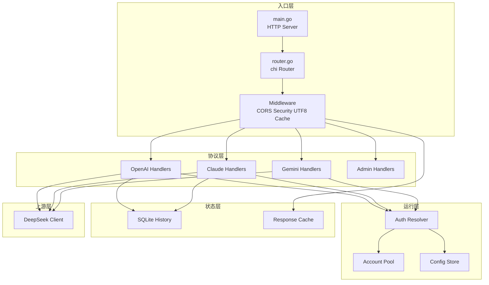
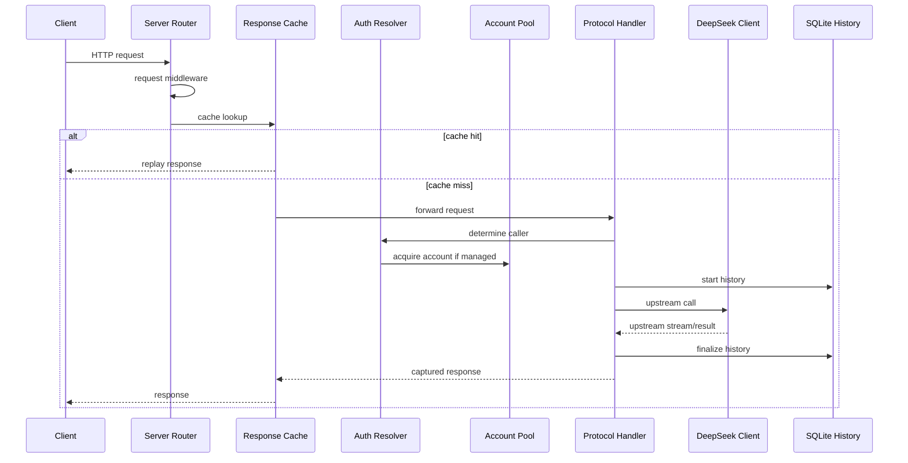

# 架构设计

<cite>
**本文档引用的文件**
- [cmd/DeepSeek_Web_To_API/main.go](file://cmd/DeepSeek_Web_To_API/main.go)
- [internal/server/router.go](file://internal/server/router.go)
- [internal/auth/request.go](file://internal/auth/request.go)
- [internal/account/pool_acquire.go](file://internal/account/pool_acquire.go)
- [internal/responsecache/cache.go](file://internal/responsecache/cache.go)
- [internal/chathistory/sqlite_store.go](file://internal/chathistory/sqlite_store.go)
</cite>

## 目录

1. [简介](#简介)
2. [项目结构](#项目结构)
3. [核心组件](#核心组件)
4. [架构总览](#架构总览)
5. [详细组件分析](#详细组件分析)
6. [性能考虑](#性能考虑)
7. [结论](#结论)

## 简介

系统架构分为入口层、协议适配层、运行控制层、本地状态层和上游访问层。入口层保证请求可控，协议层负责 OpenAI/Claude/Gemini 形态转换，运行层负责账号和鉴权，本地状态层负责缓存和历史，上游层负责 DeepSeek Web 请求。

**章节来源**
- [cmd/DeepSeek_Web_To_API/main.go](file://cmd/DeepSeek_Web_To_API/main.go)
- [internal/server/router.go](file://internal/server/router.go)

## 项目结构

**图表来源**
- [internal/server/router.go](file://internal/server/router.go)
- [internal/httpapi/admin/handler.go](file://internal/httpapi/admin/handler.go)

**章节来源**
- [internal/server/router.go](file://internal/server/router.go)

## 核心组件

- `App`：持有配置、账号池、鉴权解析器、DeepSeek 客户端和 HTTP Router。
- `Auth Resolver`：解析调用方身份，决定托管账号或直通 token。
- `Account Pool`：控制每账号并发、全局并发、等待队列和会话亲和。
- `Response Cache`：作为中间件统一服务多协议缓存。
- `SQLite History`：记录请求摘要和完整详情。
- `Admin Handler`：把管理接口拆分为 auth、accounts、config、settings、proxies、history、metrics 等子模块。

**章节来源**
- [internal/server/router.go](file://internal/server/router.go)
- [internal/auth/request.go](file://internal/auth/request.go)
- [internal/account/pool_core.go](file://internal/account/pool_core.go)

## 架构总览

**图表来源**
- [internal/server/router.go](file://internal/server/router.go)
- [internal/responsecache/cache.go](file://internal/responsecache/cache.go)
- [internal/httpapi/historycapture/capture.go](file://internal/httpapi/historycapture/capture.go)

**章节来源**
- [internal/httpapi/openai/chat/handler_chat.go](file://internal/httpapi/openai/chat/handler_chat.go)
- [internal/httpapi/claude/handler_messages.go](file://internal/httpapi/claude/handler_messages.go)

## 详细组件分析

### 服务启动

启动过程依次执行：环境变量别名、`.env` 读取、配置加载、账号池和上游客户端初始化、PoW 预加载、SQLite 历史记录初始化、响应缓存初始化、路由装配、WebUI 构建检查、管理端安全校验和 HTTP Server 启动。

### 中间件顺序

中间件顺序是请求可观测性和安全边界的一部分：RequestID、RealIP、过滤日志、Recoverer、CORS、安全头、JSON UTF-8 校验、可选 timeout、响应缓存。

### 并发模型

账号池按账号标识维护 in-flight 计数，默认每账号最多 2 个并发。没有指定账号时按轮询队列选择可用账号；指定账号时如果忙碌则等待或失败。会话亲和用于让同一长对话倾向落到同一账号。

**章节来源**
- [cmd/DeepSeek_Web_To_API/main.go](file://cmd/DeepSeek_Web_To_API/main.go)
- [internal/server/router.go](file://internal/server/router.go)
- [internal/account/pool_acquire.go](file://internal/account/pool_acquire.go)

## 性能考虑

- 响应缓存减少重复请求和上游压力，内存层优先，磁盘层持久化短期结果。
- SQLite 使用 WAL 和单连接，适合本地嵌入式写入，避免并发写放大。
- WebUI 构建只在静态文件缺失且允许自动构建时触发。
- 上游流式请求可能持续较久，反代和平台超时应高于业务请求时间。

**章节来源**
- [internal/responsecache/cache.go](file://internal/responsecache/cache.go)
- [internal/chathistory/sqlite_store.go](file://internal/chathistory/sqlite_store.go)
- [internal/webui/build.go](file://internal/webui/build.go)

## 结论

当前架构重点是把多协议兼容入口收敛到同一套运行时能力：账号池、缓存、历史、配置和管理台共享后端状态，减少协议之间的重复实现和配置漂移。

**章节来源**
- [internal/server/router.go](file://internal/server/router.go)
