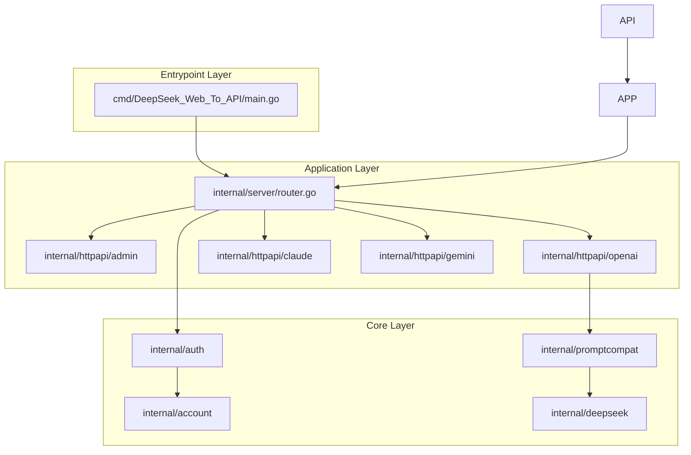
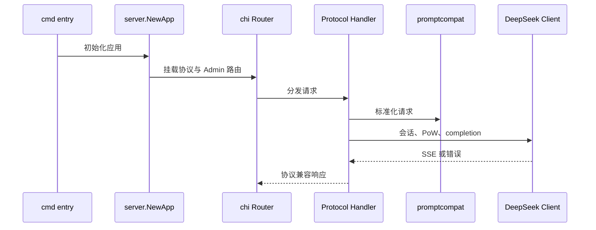

# Architecture Design

<cite>
**本文档引用的文件**
- [cmd/DeepSeek_Web_To_API/main.go](file://cmd/DeepSeek_Web_To_API/main.go)
- [internal/server/router.go](file://internal/server/router.go)
- [internal/httpapi/openai/chat/handler_chat.go](file://internal/httpapi/openai/chat/handler_chat.go)
- [internal/httpapi/openai/responses/responses_handler.go](file://internal/httpapi/openai/responses/responses_handler.go)
- [internal/httpapi/claude/handler_routes.go](file://internal/httpapi/claude/handler_routes.go)
- [internal/httpapi/gemini/handler_routes.go](file://internal/httpapi/gemini/handler_routes.go)
- [internal/promptcompat/standard_request.go](file://internal/promptcompat/standard_request.go)
- [internal/deepseek/client/client_completion.go](file://internal/deepseek/client/client_completion.go)
</cite>

## 目录
1. [简介](#简介)
2. [项目结构](#项目结构)
3. [核心组件](#核心组件)
4. [架构总览](#架构总览)
5. [详细组件分析](#详细组件分析)
6. [依赖分析](#依赖分析)
7. [性能考虑](#性能考虑)
8. [故障排查指南](#故障排查指南)
9. [结论](#结论)

## 简介

本文件描述 DeepSeek_Web_To_API 的运行架构。系统以 `server.NewApp` 为装配中心：加载配置，初始化账号池、鉴权、DeepSeek client、chat history store、各协议 handler 和 WebUI handler，然后将它们挂入 chi router。协议层尽量共享 OpenAI 兼容语义，避免 Claude/Gemini 与 OpenAI 的行为分叉。

**章节来源**
- [router.go:41-105](file://internal/server/router.go#L41-L105)
- [handler_chat.go:21-154](file://internal/httpapi/openai/chat/handler_chat.go#L21-L154)
- [responses_handler.go:51-175](file://internal/httpapi/openai/responses/responses_handler.go#L51-L175)

## 项目结构

**图表来源**
- [main.go:19-89](file://cmd/DeepSeek_Web_To_API/main.go#L19-L89)
- [router.go:41-105](file://internal/server/router.go#L41-L105)

**章节来源**
- [router.go:41-105](file://internal/server/router.go#L41-L105)

## 核心组件

- `server.App`：保存 `Store`、`Pool`、`Resolver`、`DS` 和 `Router`，是运行时依赖容器。
- `auth.Resolver`：解析 bearer、`x-api-key`、`x-goog-api-key`，区分托管 API key 与直传 DeepSeek token。
- `account.Pool`：管理托管账号并发、等待队列、目标账号选择和 session affinity。
- `promptcompat.StandardRequest`：协议兼容层的统一中间结构。
- `deepseek.Client`：封装 DeepSeek 登录、建会话、PoW、completion、上传和会话删除。
- `stream.ConsumeSSE`：统一 SSE 消费循环，处理 keepalive、idle timeout、上下文取消和终结回调。

**章节来源**
- [router.go:22-39](file://internal/server/router.go#L22-L39)
- [request.go:37-139](file://internal/auth/request.go#L37-L139)
- [pool_core.go:17-73](file://internal/account/pool_core.go#L17-L73)
- [standard_request.go:1-89](file://internal/promptcompat/standard_request.go#L1-L89)
- [client_completion.go:15-89](file://internal/deepseek/client/client_completion.go#L15-L89)
- [engine.go:21-146](file://internal/stream/engine.go#L21-L146)

## 架构总览

**图表来源**
- [main.go:19-89](file://cmd/DeepSeek_Web_To_API/main.go#L19-L89)
- [router.go:41-105](file://internal/server/router.go#L41-L105)
- [handler_chat.go:21-154](file://internal/httpapi/openai/chat/handler_chat.go#L21-L154)

**章节来源**
- [router.go:41-105](file://internal/server/router.go#L41-L105)
- [client_auth.go:53-160](file://internal/deepseek/client/client_auth.go#L53-L160)

## 详细组件分析

### 路由树

顶层路由包含 `/healthz`、`/readyz`、`/v1/models`、`/v1/chat/completions`、`/v1/responses`、`/v1/files`、`/v1/embeddings`、Claude、Gemini、`/admin` 和 WebUI fallback。中间件包括 request ID、真实 IP、日志、panic recover、CORS、安全响应头和可选 timeout。

### 协议共享

OpenAI Chat 与 Responses 是最完整的执行路径。Claude 与 Gemini 优先翻译到 OpenAI 请求并复用 `ChatCompletions`，这样模型别名、thinking、工具调用、空回复重试和流式语义能够保持一致。

**章节来源**
- [router.go:77-111](file://internal/server/router.go#L77-L111)
- [handler_messages.go:20-133](file://internal/httpapi/claude/handler_messages.go#L20-L133)
- [handler_generate.go:20-129](file://internal/httpapi/gemini/handler_generate.go#L20-L129)
- [index.js:19-57](file://internal/js/chat-stream/index.js#L19-L57)

## 依赖分析

**章节来源**
- [go.mod:1-24](file://go.mod#L1-L24)
- [webui/package.json:1-27](file://webui/package.json#L1-L27)
- [Dockerfile:1-57](file://Dockerfile#L1-L57)

## 性能考虑

路由层没有引入复杂状态，主要性能压力来自上游流式请求持续时间、账号池等待、tool sieve 缓冲、history 持久化和 WebUI 静态文件托管。当前架构将长耗时上游调用集中在 handler 内，并通过 account release、defer、stream keepalive 和 history progress 节流降低资源占用。

**章节来源**
- [handler_chat.go:75-154](file://internal/httpapi/openai/chat/handler_chat.go#L75-L154)
- [chat_history.go:118-179](file://internal/httpapi/openai/chat/chat_history.go#L118-L179)
- [engine.go:37-146](file://internal/stream/engine.go#L37-L146)

## 故障排查指南

- Claude/Gemini 行为和 OpenAI 不一致：先确认是否走了 `proxyViaOpenAI`，再看 translator 输入和 thinking 策略。

**章节来源**
- [router.go:91-111](file://internal/server/router.go#L91-L111)
- [handler_messages.go:20-133](file://internal/httpapi/claude/handler_messages.go#L20-L133)
- [handler_generate.go:20-129](file://internal/httpapi/gemini/handler_generate.go#L20-L129)
- [index.js:19-57](file://internal/js/chat-stream/index.js#L19-L57)

## 结论

**章节来源**
- [router.go:41-105](file://internal/server/router.go#L41-L105)
- [prompt-compatibility.md](file://docs/prompt-compatibility.md)
