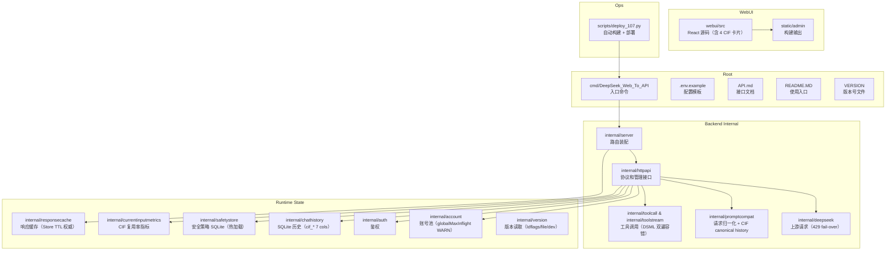
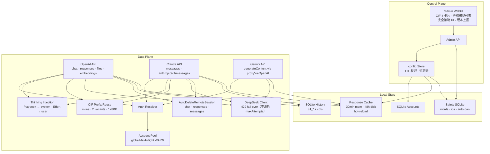

# 项目总览

<cite>
**本文档引用的文件**
- [go.mod](file://go.mod)
- [cmd/DeepSeek_Web_To_API/main.go](file://cmd/DeepSeek_Web_To_API/main.go)
- [internal/server/router.go](file://internal/server/router.go)
- [internal/httpapi/openai/shared/session_cleanup.go](file://internal/httpapi/openai/shared/session_cleanup.go)
- [internal/httpapi/openai/shared/thinking_injection.go](file://internal/httpapi/openai/shared/thinking_injection.go)
- [internal/responsecache/path_policy.go](file://internal/responsecache/path_policy.go)
- [internal/currentinputmetrics/metrics.go](file://internal/currentinputmetrics/metrics.go)
- [internal/config/models.go](file://internal/config/models.go)
- [internal/account/pool_limits.go](file://internal/account/pool_limits.go)
- [internal/deepseek/client/client_completion.go](file://internal/deepseek/client/client_completion.go)
- [internal/safetystore/store.go](file://internal/safetystore/store.go)
- [internal/version/version.go](file://internal/version/version.go)
- [scripts/deploy_107.py](file://scripts/deploy_107.py)
- [webui/package.json](file://webui/package.json)
- [.env.example](file://.env.example)
</cite>

## 目录

1. [简介](#简介)
2. [项目结构](#项目结构)
3. [核心组件](#核心组件)
4. [架构总览](#架构总览)
5. [详细组件分析](#详细组件分析)
6. [结论](#结论)

## 简介

DeepSeek_Web_To_API 是一个单进程自托管网关。它把 DeepSeek Web 能力转成多家 SDK 可识别的协议接口，同时内置管理台、账号池、响应缓存、历史记录和测试工具。

项目当前主要技术栈：

- 后端：Go 1.26，`chi` HTTP 路由。
- 前端：React 18、Vite、Tailwind、lucide-react。
- 本地存储：SQLite（5 个独立库）、文件系统 gzip 缓存。
- 部署：二进制（含 ldflags 版本注入）、Docker Compose、GHCR 镜像、GitHub Release 产物；生产实例通过 `scripts/deploy_107.py` 自动化部署（目标主机由环境变量 `DST_HOST` 提供，不在仓库中硬编码）。

当前版本：**v1.0.13**（生产地址 `https://ds2api.web.oai.red`）。

**章节来源**
- [go.mod](file://go.mod)
- [webui/package.json](file://webui/package.json)
- [VERSION](file://VERSION)

## 项目结构

**图表来源**
- [cmd/DeepSeek_Web_To_API/main.go](file://cmd/DeepSeek_Web_To_API/main.go)
- [internal/server/router.go](file://internal/server/router.go)
- [webui/package.json](file://webui/package.json)
- [scripts/deploy_107.py](file://scripts/deploy_107.py)

**章节来源**
- [internal/server/router.go](file://internal/server/router.go)

## 核心组件

- **协议入口**：OpenAI、Claude、Gemini 三类客户端都由 `internal/server/router.go` 挂载到同一服务。
- **兼容核心**：`internal/promptcompat` 负责把 API 消息和工具调用上下文转成 DeepSeek Web 可理解的纯文本语境；v1.0.7 增加 `BuildOpenAICurrentInputContextTranscript` 专用路径，剥离 OpenClaw 易变 metadata，保证 CIF 前缀字节稳定。
- **上游客户端**：`internal/deepseek/client` 负责登录、会话、文件、补全和 PoW；v1.0.12 在 `client_completion.go` 增加 429 弹性 fail-over — 上游返回 429 时切换账号不消耗 `maxAttempts` 预算。
- **账号池**：`internal/account/pool_limits.go` 实现 `warnLowGlobalMaxInflight`，`globalMaxInflight=1 + accountCount≥2` 时在启动时打印明确的 WARN 及建议值（v1.0.6 修复 Issue #19）。
- **响应缓存**：`internal/responsecache/path_policy.go` 只控制 caller 隔离边界（`SharedAcrossCallers`），TTL 由 `cache.go` 从 Store 读取 — v1.0.7 删除了硬编码 TTL 字段，WebUI 改 TTL 立即热生效；默认 30 min / 48 h。
- **CIF 前缀复用**：`internal/httpapi/openai/history/current_input_prefix.go` 实现 inline-prefix 模式（不依赖文件上传）、多 variant 链（最多 2 条，LRU 提升）、`maxTailChars` 128 KB、mode-aware cache key（inline 模式跨账号复用）。
- **CIF 指标**：`internal/currentinputmetrics/metrics.go` 独立包，记录 `TotalSeen / Applied / Reused / Refreshes / TailCharsAvg / TailCharsP95` 等，供 `/admin/metrics/overview` 暴露并由 WebUI 4 卡片可视化。
- **Thinking-Injection 拆分**：`internal/httpapi/openai/shared/thinking_injection.go` 的 `ApplyThinkingInjection` 在有工具调用时把 `ToolChainPlaybookPrompt` 移到 system 头（经 `promptcompat.PrependPlaybookToSystem`），只把 `ReasoningEffortPrompt` 保留在 user 末尾（v1.0.6 修复 Issue #18）。
- **会话自动删除**：`internal/httpapi/openai/shared/session_cleanup.go` 的 `AutoDeleteRemoteSession` 是统一入口，`/v1/chat/completions`、`/v1/responses`、`/v1/messages` 三条路径均在 defer 中调用，Gemini 经 proxyViaOpenAI 间接生效（v1.0.8 修复 Issue #20）。
- **严格模型白名单**：`internal/config/models.go` 的 `resolveCanonicalModel` 移除启发式 family-prefix fallback；`blockedDeepSeekModels` map 封锁 `deepseek-v4-vision`，alias target 也经此 block 检查（v1.0.10）。
- **安全策略**：`internal/safetystore` 持久化 banned_content / banned_regex / jailbreak patterns / blocked_ips / allowed_ips；`internal/requestguard` 运行时读取，通过 PUT `/admin/settings` 热更新。
- **版本上报**：`internal/version/version.go` 三级 fallback（ldflags → VERSION 文件 → "dev"）；`scripts/deploy_107.py` 自动注入 `-X ... BuildVersion=<ver>` 使 `/admin/version` 正确上报。
- **管理台**：`webui` 提供人机操作面，`internal/httpapi/admin` 提供受保护的管理接口。

**章节来源**
- [internal/httpapi/openai/chat/handler.go](file://internal/httpapi/openai/chat/handler.go)
- [internal/httpapi/claude/handler_routes.go](file://internal/httpapi/claude/handler_routes.go)
- [internal/httpapi/gemini/handler_routes.go](file://internal/httpapi/gemini/handler_routes.go)
- [internal/httpapi/admin/handler.go](file://internal/httpapi/admin/handler.go)

## 架构总览

**图表来源**
- [internal/server/router.go](file://internal/server/router.go)
- [internal/httpapi/admin/handler.go](file://internal/httpapi/admin/handler.go)
- [internal/deepseek/client/client_completion.go](file://internal/deepseek/client/client_completion.go)

**章节来源**
- [internal/config/store.go](file://internal/config/store.go)
- [internal/account/pool_core.go](file://internal/account/pool_core.go)
- [internal/responsecache/cache.go](file://internal/responsecache/cache.go)

## 详细组件分析

### 请求处理面

所有 HTTP 请求进入同一 `chi` 路由树，经过 RequestID、RealIP、访问日志、panic recovery、CORS、安全响应头（含 CSP）、JSON UTF-8 校验、Safety Guard（banned_content / regex / jailbreak / IP 封锁）和响应缓存中间件后再到具体协议处理器。

### 账号与调用方

`auth.Resolver` 根据调用方 token 判断托管账号模式或直通 token 模式。托管账号模式进入 `account.Pool`，支持指定账号、会话亲和、并发槽位和队列等待。`pool_limits.go` 在服务启动时如果检测到 `globalMaxInflight=1 + accountCount≥2`，输出明确 WARN（Issue #19 footgun）。

### 429 弹性 fail-over

`internal/deepseek/client/client_completion.go` 的 `CallCompletion` 在 `resp.StatusCode == 429 && a.UseConfigToken && hasCompletionSwitchCandidate` 时调用 `switchCompletionAccount`，**不递增 attempts 计数**。已尝试账号记录在 `a.TriedAccounts`，池耗尽才走兜底路径。其他状态码（401/502/5xx）保持原有 attempts 计数逻辑。

### CIF 前缀复用

`internal/httpapi/openai/history/current_input_prefix.go` 实现两种模式：
- **file 模式**：上传前缀为文件，file_id 跨 turn 复用（依赖 `RemoteFileUploadEnabled`）。
- **inline 模式**（v1.0.7 默认路径）：前缀直接 inline 到 user 消息体，结构为 `[stable prefix]\n\n--- RECENT CONVERSATION TURNS ---\n\n[tail]\n\n--- INSTRUCTION ---\n[guidance]`。cache key 移除 accountID（改为常量 `"inline"`），跨账号 429 fail-over 后复用同一前缀。

每会话维护最多 `currentInputPrefixMaxVariants=2` 条变体，checkpoint refresh 时 prepend 新前缀（旧前缀继续可用），命中走最长公共前缀算法并提至链头（LRU）。`maxTailChars=128KB`，`targetTailChars=32KB`。

### 响应缓存 Hot-Reload

v1.0.7 删除了 `path_policy.go` 中的 `MemoryTTL` / `DiskTTL` 字段及所有路径的硬编码 TTL 常量（详见 [`internal/responsecache/path_policy.go`](file://internal/responsecache/path_policy.go) 注释）。`pathPolicy` 仅保留 `Path` 与 `SharedAcrossCallers`；实际 TTL 100% 来自 `cache.go` 的 `c.memoryTTL` / `c.diskTTL`（由 Store 读取，WebUI 更改立即生效）。默认值升为 30 min / 48 h。

### 严格模型白名单

`internal/config/models.go` 的 `resolveCanonicalModel` 只接受：① 直接的 supported DeepSeek 模型 ID；② alias map 中有显式映射且映射目标合法的 ID。`blockedDeepSeekModels` map 在 `GetModelConfig` / `GetModelType` / `ResolveModel` 多处前置检查，`deepseek-v4-vision` 即便通过自定义 alias 指向也会被拒。

### 安全策略

`internal/safetystore` 使用两个 SQLite（`safety_words.sqlite` + `safety_ips.sqlite`），分别持久化三类内容规则（content / regex / jailbreak）和两类 IP 规则（blocked / allowed）。`internal/requestguard/guard.go` 运行时读取，通过 `autoBanTracker` 实现滑动窗口自动拉黑（threshold=3 / window=600s，默认开启）。PUT `/admin/settings` 写入 SQLite 后 guard 在下次请求时自动感知，无需重启。

### 会话自动删除

`internal/httpapi/openai/shared/session_cleanup.go` 的 `AutoDeleteRemoteSession` 封装三种模式：`none`（no-op）/ `single`（删指定 sessionID）/ `all`（清账号全部 session）。用 `context.WithoutCancel` 隔离已取消的请求 ctx，10s 超时上限，错误只 warn 不向上传播（fire-and-forget）。chat handler 已改为薄包装此函数，responses 与 claude handler 在 `defer` 中直接调用。

### 版本上报

`internal/version/version.go` 在 `Current()` 中按优先级读取：`BuildVersion`（ldflags 注入）> `VERSION` 文件 > `"dev"`。`scripts/deploy_107.py` 的 `build_linux_binary()` 在 `-ldflags` 中注入 `-X DeepSeek_Web_To_API/internal/version.BuildVersion=<ver>`，确保部署后 `/admin/version` 正确上报。

### 管理台

管理台通过 `/admin` 静态托管。WebUI 新增 4 张 CIF 指标卡片（PREFIX 复用率 / CHECKPOINT 刷新 / TAIL 大小 / CURRENT INPUT 耗时），`HISTORY_SAMPLE_LIMIT=30`（单次刷新 payload ~360 KB）。严格模型白名单生效后，`/v1/models` 不再返回 `deepseek-v4-vision`。

**章节来源**
- [internal/server/router.go](file://internal/server/router.go)
- [internal/auth/request.go](file://internal/auth/request.go)
- [internal/httpapi/openai/history/current_input_prefix.go](file://internal/httpapi/openai/history/current_input_prefix.go)
- [internal/responsecache/path_policy.go](file://internal/responsecache/path_policy.go)
- [internal/config/models.go](file://internal/config/models.go)
- [internal/requestguard/guard.go](file://internal/requestguard/guard.go)
- [internal/httpapi/openai/shared/session_cleanup.go](file://internal/httpapi/openai/shared/session_cleanup.go)
- [internal/version/version.go](file://internal/version/version.go)
- [webui/src/app/AppRoutes.jsx](file://webui/src/app/AppRoutes.jsx)

## 结论

当前项目是一个明确的网关型服务。自 v1.0.6 起，六条关键生产保障相继上线并在 v1.0.12 全部激活：

1. **Thinking-Injection 拆分**（v1.0.6）：消除工具链规则被上游 fast-path 静默丢弃的根因。
2. **响应缓存 hot-reload 修复**（v1.0.7）：Store/WebUI 配置成为 TTL 唯一权威，不再需要重启。
3. **CIF 前缀复用框架**（v1.0.7）：inline-prefix + 多 variant 链 + 128 KB tail，覆盖绝大多数 prod 流量。
4. **全路径会话自动删除**（v1.0.8）：WebUI 删除开关对 chat / responses / claude 全部生效。
5. **严格模型白名单**（v1.0.10）：未知模型 ID 返回 4xx，`deepseek-v4-vision` 全路径封锁。
6. **429 弹性 fail-over**（v1.0.12）：池中有空闲账号时 429 不暴露给客户端。

文档、配置、部署和测试都应围绕"单 Go 服务 + 管理台 + 5 个本地 SQLite + 响应缓存"展开。

**章节来源**
- [README.MD](file://README.MD)
- [CHANGELOG.md](file://CHANGELOG.md)
