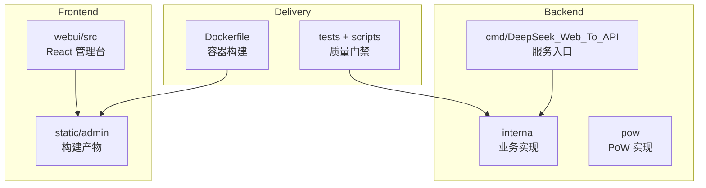
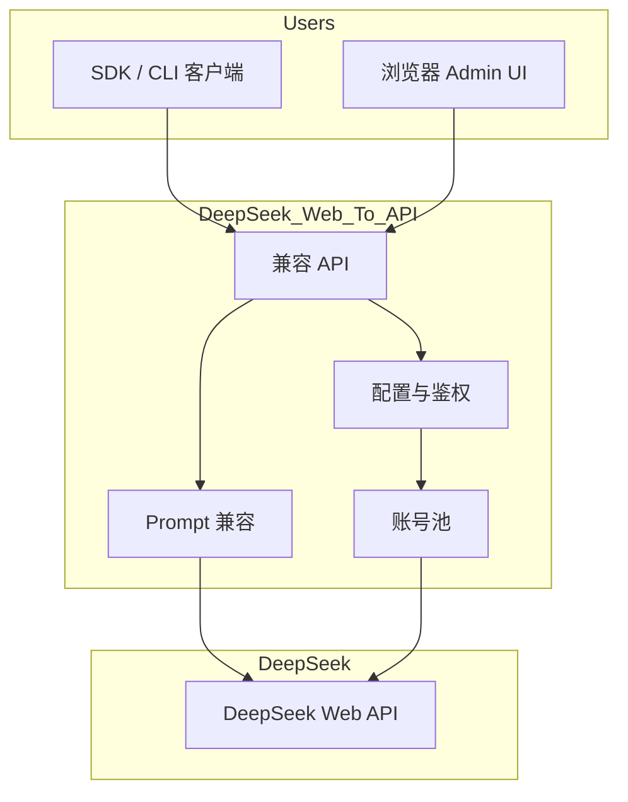

# Project Overview

<cite>
**本文档引用的文件**
- [README.MD](file://README.MD)
- [go.mod](file://go.mod)
- [config.example.json](file://config.example.json)
- [cmd/DeepSeek_Web_To_API/main.go](file://cmd/DeepSeek_Web_To_API/main.go)
- [internal/server/router.go](file://internal/server/router.go)
- [webui/package.json](file://webui/package.json)
- [Dockerfile](file://Dockerfile)
- [docker-compose.yml](file://docker-compose.yml)
</cite>

## 目录
1. [简介](#简介)
2. [项目结构](#项目结构)
3. [核心组件](#核心组件)
4. [架构总览](#架构总览)
5. [详细组件分析](#详细组件分析)
6. [依赖分析](#依赖分析)
7. [性能考虑](#性能考虑)
8. [故障排查指南](#故障排查指南)
9. [结论](#结论)

## 简介

DeepSeek_Web_To_API 是 DeepSeek Web 对话的多协议兼容网关。它面向 OpenAI、Claude、Gemini 客户端提供熟悉的 API 形状，内部用 DeepSeek 网页接口完成会话、PoW、completion、文件上传、continue 和会话删除等操作。项目同时提供 React Admin WebUI，便于管理 API key、账号池、代理、设置、历史记录和运行指标。

**章节来源**
- [go.mod:1-24](file://go.mod#L1-L24)
- [router.go:91-105](file://internal/server/router.go#L91-L105)
- [config.example.json:1-76](file://config.example.json#L1-L76)

## 项目结构

**图表来源**
- [main.go:19-89](file://cmd/DeepSeek_Web_To_API/main.go#L19-L89)
- [webui/package.json:1-27](file://webui/package.json#L1-L27)
- [Dockerfile:1-57](file://Dockerfile#L1-L57)

**章节来源**
- [README.MD](file://README.MD)
- [go.mod:1-24](file://go.mod#L1-L24)

## 核心组件

- 服务入口：`cmd/DeepSeek_Web_To_API/main.go` 负责本地/容器运行。
- HTTP surface：`internal/server/router.go` 挂载健康检查、OpenAI、Claude、Gemini、Admin 与 WebUI。
- 兼容内核：`internal/promptcompat` 把不同协议输入变成 DeepSeek prompt 与 payload。
- 上游访问：`internal/deepseek` 处理登录、PoW、completion、文件和会话生命周期。
- 管理台：`webui/src` 提供账号、代理、API 测试、历史、设置和总览页面。
- 交付：Docker、docker-compose、Zeabur 和测试脚本覆盖不同部署方式。

**章节来源**
- [router.go:41-105](file://internal/server/router.go#L41-L105)
- [request_normalize.go:16-156](file://internal/promptcompat/request_normalize.go#L16-L156)
- [client_auth.go:53-160](file://internal/deepseek/client/client_auth.go#L53-L160)
- [DashboardShell.jsx:50-181](file://webui/src/layout/DashboardShell.jsx#L50-L181)

## 架构总览

**图表来源**
- [router.go:91-105](file://internal/server/router.go#L91-L105)
- [request.go:37-139](file://internal/auth/request.go#L37-L139)
- [pool_core.go:17-73](file://internal/account/pool_core.go#L17-L73)
- [standard_request.go:42-89](file://internal/promptcompat/standard_request.go#L42-L89)

**章节来源**
- [Architecture Design.md](file://docs/Architecture%20Design/Architecture%20Design.md)

## 详细组件分析

### 对外能力

OpenAI surface 覆盖 models、chat completions、responses、files 和 embeddings。Claude surface 覆盖 models、messages、count_tokens。Gemini surface 覆盖 generateContent 与 streamGenerateContent。Admin surface 覆盖认证、配置、账号、代理、历史、指标、版本和开发采集。

### 配置方式

项目支持文件配置和 `DEEPSEEK_WEB_TO_API_CONFIG_JSON` 环境变量。示例配置包含 API key、托管账号、模型别名、兼容选项、Responses store、current input file、thinking injection、embeddings、Admin JWT、运行时并发和自动删除策略。

### 部署方式

Dockerfile 先构建 WebUI，再构建 Go 二进制，最终运行镜像只保留必要文件。docker-compose 使用 `/data/config.json` 持久化配置。

**章节来源**
- [router.go:91-105](file://internal/server/router.go#L91-L105)
- [config.example.json:1-76](file://config.example.json#L1-L76)
- [Dockerfile:1-57](file://Dockerfile#L1-L57)
- [docker-compose.yml:1-20](file://docker-compose.yml#L1-L20)

## 依赖分析

后端依赖 Go 1.26、chi、utls、CLIProxyAPI、uuid、x/net/proxy 等库。前端依赖 React、Vite、React Router、lucide-react 和 Tailwind 工具链。运行时依赖 DeepSeek Web API 可达、Admin 凭证、JWT secret、配置文件或环境变量。

**章节来源**
- [go.mod:1-24](file://go.mod#L1-L24)
- [webui/package.json:1-27](file://webui/package.json#L1-L27)
- [config.example.json:1-76](file://config.example.json#L1-L76)

## 性能考虑

项目的性能主要由账号池并发、上游 DeepSeek 响应、SSE 流持续时间、文件上传大小和 WebUI 构建/静态托管决定。默认单账号并发为 2，可通过配置或环境变量调整；流式路径支持长 idle timeout 和 keepalive。

**章节来源**
- [pool_core.go:17-73](file://internal/account/pool_core.go#L17-L73)
- [engine.go:37-146](file://internal/stream/engine.go#L37-L146)

## 故障排查指南

- 服务启动失败：检查配置 JSON 是否可解析、`admin.key` / `admin.password_hash` 和 `admin.jwt_secret` 是否存在。
- API 认证失败：确认客户端 token 是配置中的 API key，或直接传入 DeepSeek token。
- 没有可用账号：检查托管账号列表、token 刷新、并发限制和代理配置。
- WebUI 访问异常：确认 `static/admin` 已构建，或本地启动时允许自动构建。

**章节来源**
- [main.go:19-45](file://cmd/DeepSeek_Web_To_API/main.go#L19-L45)
- [request.go:37-139](file://internal/auth/request.go#L37-L139)
- [build.go:20-64](file://internal/webui/build.go#L20-L64)

## 结论

DeepSeek_Web_To_API 的项目边界清晰：外层接入多协议客户端，中层做统一兼容和运行治理，内层调用 DeepSeek Web API。理解这一点后，文档阅读和代码修改都应围绕“入口、兼容、执行、运维、管理台、测试”六个方向展开。

**章节来源**
- [docs/README.md](file://docs/README.md)
- [docs/Architecture Design/Architecture Design.md](file://docs/Architecture%20Design/Architecture%20Design.md)
