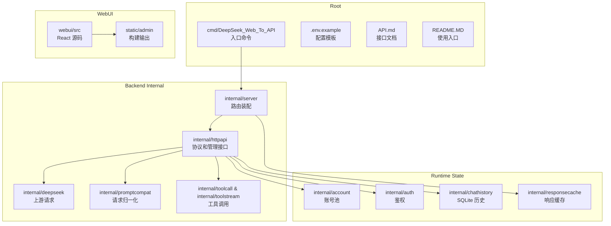
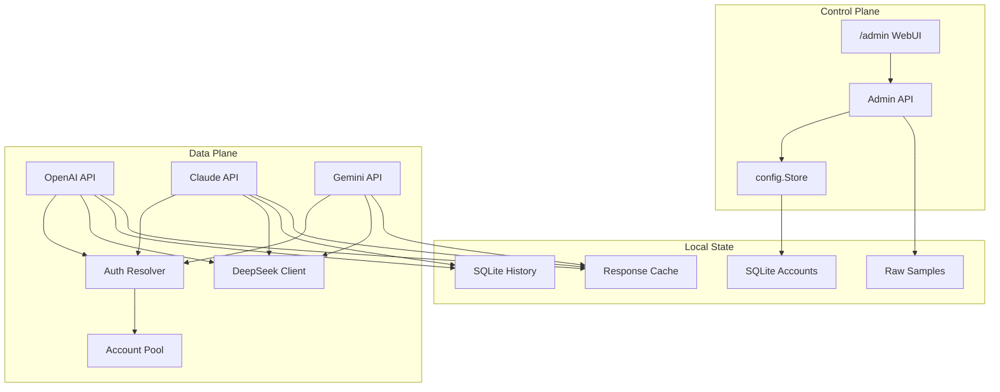

# 项目总览

<cite>
**本文档引用的文件**
- [go.mod](file://go.mod)
- [cmd/DeepSeek_Web_To_API/main.go](file://cmd/DeepSeek_Web_To_API/main.go)
- [internal/server/router.go](file://internal/server/router.go)
- [webui/package.json](file://webui/package.json)
- [.env.example](file://.env.example)
</cite>

## 目录

1. [简介](#简介)
2. [项目结构](#项目结构)
3. [核心组件](#核心组件)
4. [架构总览](#架构总览)
5. [详细组件分析](#详细组件分析)
6. [依赖分析](#依赖分析)
7. [结论](#结论)

## 简介

DeepSeek_Web_To_API 是一个单进程自托管网关。它把 DeepSeek Web 能力转成多家 SDK 可识别的协议接口，同时内置管理台、账号池、响应缓存、历史记录和测试工具。

项目当前主要技术栈：

- 后端：Go 1.26，`chi` HTTP 路由。
- 前端：React 18、Vite、Tailwind、lucide-react。
- 本地存储：SQLite、文件系统 gzip 缓存。
- 部署：二进制、Docker Compose、GHCR 镜像、GitHub Release 产物。

**章节来源**
- [go.mod](file://go.mod)
- [webui/package.json](file://webui/package.json)

## 项目结构

**图表来源**
- [cmd/DeepSeek_Web_To_API/main.go](file://cmd/DeepSeek_Web_To_API/main.go)
- [internal/server/router.go](file://internal/server/router.go)
- [webui/package.json](file://webui/package.json)

**章节来源**
- [internal/server/router.go](file://internal/server/router.go)

## 核心组件

- 协议入口：OpenAI、Claude、Gemini 三类客户端都由 `internal/server/router.go` 挂载到同一服务。
- 兼容核心：`internal/promptcompat` 负责把 API 消息和工具调用上下文转成 DeepSeek Web 可理解的纯文本语境。
- 上游客户端：`internal/deepseek/client` 负责登录、会话、文件、补全和 PoW。
- 管理台：`webui` 提供人机操作面，`internal/httpapi/admin` 提供受保护的管理接口。
- 状态层：账号 SQLite 保存账号池，历史 SQLite 保存对话记录，gzip 磁盘缓存保存协议响应，`.env` 提供初始结构化配置。

**章节来源**
- [internal/httpapi/openai/chat/handler.go](file://internal/httpapi/openai/chat/handler.go)
- [internal/httpapi/claude/handler_routes.go](file://internal/httpapi/claude/handler_routes.go)
- [internal/httpapi/gemini/handler_routes.go](file://internal/httpapi/gemini/handler_routes.go)
- [internal/httpapi/admin/handler.go](file://internal/httpapi/admin/handler.go)

## 架构总览

**图表来源**
- [internal/server/router.go](file://internal/server/router.go)
- [internal/httpapi/admin/handler.go](file://internal/httpapi/admin/handler.go)

**章节来源**
- [internal/config/store.go](file://internal/config/store.go)
- [internal/account/pool_core.go](file://internal/account/pool_core.go)

## 详细组件分析

### 请求处理面

所有 HTTP 请求进入同一 `chi` 路由树，经过 RequestID、RealIP、访问日志、panic recovery、CORS、安全响应头、JSON UTF-8 校验和响应缓存中间件后再到具体协议处理器。

### 账号与调用方

`auth.Resolver` 根据调用方 token 判断托管账号模式或直通 token 模式。托管账号模式进入 `account.Pool`，支持指定账号、会话亲和、并发槽位和队列等待。

### 管理台

管理台通过 `/admin` 静态托管。开发模式下前端保留 Landing Page，生产模式下直接进入管理台登录或仪表盘。

**章节来源**
- [internal/server/router.go](file://internal/server/router.go)
- [internal/auth/request.go](file://internal/auth/request.go)
- [webui/src/app/AppRoutes.jsx](file://webui/src/app/AppRoutes.jsx)

## 依赖分析

- `modernc.org/sqlite`：纯 Go SQLite，避免 CGO 运行依赖。
- `github.com/go-chi/chi/v5`：轻量路由和中间件。
- `github.com/router-for-me/CLIProxyAPI/v6`：代理相关能力。
- `github.com/hupe1980/go-tiktoken`：token 估算。
- React/Vite：管理台构建和本地开发。

**章节来源**
- [go.mod](file://go.mod)
- [webui/package.json](file://webui/package.json)

## 结论

当前项目是一个明确的网关型服务。文档、配置、部署和测试都应围绕“单 Go 服务 + 管理台 + 本地运行态数据”展开。

**章节来源**
- [README.MD](file://README.MD)
