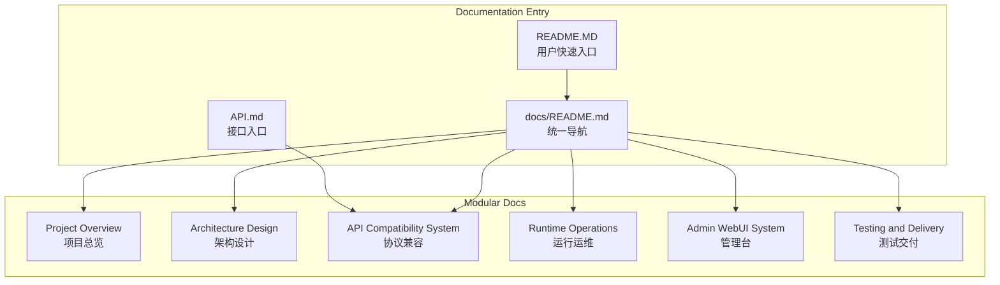
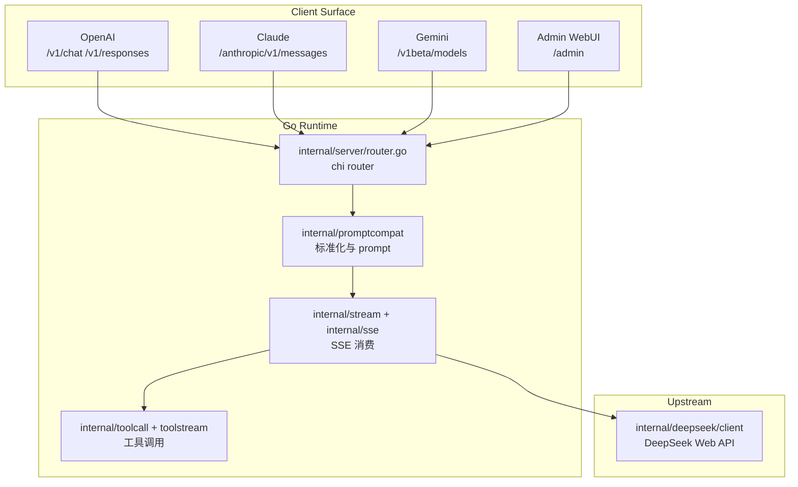

# DeepSeek_Web_To_API 文档导航

<cite>
**本文档引用的文件**
- [README.MD](file://README.MD)
- [internal/server/router.go](file://internal/server/router.go)
- [internal/promptcompat/request_normalize.go](file://internal/promptcompat/request_normalize.go)
- [docs/Project Overview/Project Overview.md](file://docs/Project%20Overview/Project%20Overview.md)
- [docs/Architecture Design/Architecture Design.md](file://docs/Architecture%20Design/Architecture%20Design.md)
- [docs/API Compatibility System/API Compatibility System.md](file://docs/API%20Compatibility%20System/API%20Compatibility%20System.md)
- [docs/Runtime Operations/Runtime Operations.md](file://docs/Runtime%20Operations/Runtime%20Operations.md)
- [docs/Admin WebUI System/Admin WebUI System.md](file://docs/Admin%20WebUI%20System/Admin%20WebUI%20System.md)
- [docs/Testing and Delivery/Testing and Delivery.md](file://docs/Testing%20and%20Delivery/Testing%20and%20Delivery.md)
- [docs/security-audit-2026-05-02.md](file://docs/security-audit-2026-05-02.md)
</cite>

## 目录
1. [简介](#简介)
2. [项目结构](#项目结构)
3. [核心组件](#核心组件)
4. [架构总览](#架构总览)
5. [详细组件分析](#详细组件分析)
6. [结论](#结论)

## 简介

本文档是 DeepSeek_Web_To_API 的统一文档入口。DeepSeek_Web_To_API 是一个以 Go 为主的 DeepSeek Web 对话兼容网关，对外提供 OpenAI Chat Completions、OpenAI Responses、Claude Messages、Gemini GenerateContent、Admin API 与 WebUI；对内把结构化协议请求归一为 DeepSeek 网页对话可消费的 prompt、文件引用和运行时控制位。

重整后的主文档集按全局文档规则拆成模块目录，每个目录包含同名概览文档。旧有专题文档仍保留为历史资料或专项补充，新的阅读入口以本页和下方模块为准。

**章节来源**
- [router.go:41-105](file://internal/server/router.go#L41-L105)
- [request_normalize.go:16-156](file://internal/promptcompat/request_normalize.go#L16-L156)
- [Project Overview.md](file://docs/Project%20Overview/Project%20Overview.md)

## 项目结构

**图表来源**
- [docs/Project Overview/Project Overview.md](file://docs/Project%20Overview/Project%20Overview.md)
- [docs/Architecture Design/Architecture Design.md](file://docs/Architecture%20Design/Architecture%20Design.md)
- [docs/API Compatibility System/API Compatibility System.md](file://docs/API%20Compatibility%20System/API%20Compatibility%20System.md)

**章节来源**
- [docs/Project Overview/Project Overview.md](file://docs/Project%20Overview/Project%20Overview.md)
- [docs/Architecture Design/Architecture Design.md](file://docs/Architecture%20Design/Architecture%20Design.md)

## 核心组件

- `Project Overview`：解释项目定位、部署入口、对外能力和读者路径。
- `Architecture Design`：以源码目录、路由树、协议 surface、运行时依赖为主线描述整体结构。
- `API Compatibility System`：集中说明 OpenAI、Claude、Gemini 到 DeepSeek 网页对话的兼容链路。
- `Runtime Operations`：覆盖配置、鉴权、账号池、代理、上游 DeepSeek client、部署与安全运行边界。
- `Admin WebUI System`：覆盖 Admin API、React 管理台、配置热更新、账号/代理/历史/指标页面。
- `Testing and Delivery`：覆盖 Go、Node、WebUI、脚本门禁、fixture 和发布门禁。
- `security-audit-2026-05-02.md`：记录本轮安全类 Skill 扫描、修复项、误报说明和复跑命令。

**章节来源**
- [server/router.go:41-105](file://internal/server/router.go#L41-L105)
- [webui/src/layout/DashboardShell.jsx:50-181](file://webui/src/layout/DashboardShell.jsx#L50-L181)
- [tests/scripts/run-unit-all.sh:1-8](file://tests/scripts/run-unit-all.sh#L1-L8)

## 架构总览

**图表来源**
- [router.go:41-105](file://internal/server/router.go#L41-L105)
- [request_normalize.go:16-156](file://internal/promptcompat/request_normalize.go#L16-L156)
- [engine.go:21-146](file://internal/stream/engine.go#L21-L146)
- [client_completion.go:15-89](file://internal/deepseek/client/client_completion.go#L15-L89)

**章节来源**
- [Architecture Design.md](file://docs/Architecture%20Design/Architecture%20Design.md)
- [API Compatibility System.md](file://docs/API%20Compatibility%20System/API%20Compatibility%20System.md)

## 详细组件分析

### 推荐阅读顺序

首次接触项目时，从 `Project Overview` 开始，再读 `Architecture Design`。如果正在改协议兼容、tool call、prompt、SSE 或文件引用，优先读 `API Compatibility System` 和 `prompt-compatibility.md`。如果正在部署、排障、改配置或 Admin 管理台，则读 `Runtime Operations` 与 `Admin WebUI System`。

### 旧文档位置

`docs/CONTRIBUTING.md`、`docs/DEPLOY.md`、`docs/TESTING.md`、`docs/security-audit-2026-05-02.md`、`docs/toolcall-semantics.md`、`docs/DeepSeekSSE行为结构说明-2026-04-05.md` 仍保留。新主文档给出架构级入口，旧专题继续承载细节、历史观察、安全审计和对外补充说明。

**章节来源**
- [prompt-compatibility.md](file://docs/prompt-compatibility.md)
- [toolcall-semantics.md](file://docs/toolcall-semantics.md)
- [TESTING.md](file://docs/TESTING.md)

## 结论

DeepSeek_Web_To_API 的文档现在按“总览、架构、协议兼容、运行运维、管理台、测试交付”六个主模块组织。这样的拆分让源码入口、协议行为、运维配置和测试门禁各自有稳定归属，后续修改业务逻辑时应同步更新对应模块，而不是把同一段说明复制到多个文件。

**章节来源**
- [router.go:41-105](file://internal/server/router.go#L41-L105)
- [docs/Architecture Design/Architecture Design.md](file://docs/Architecture%20Design/Architecture%20Design.md)
