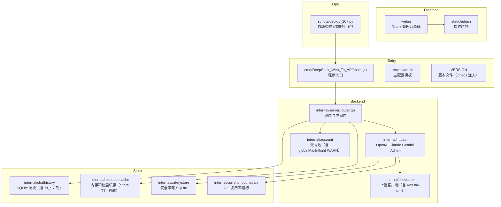
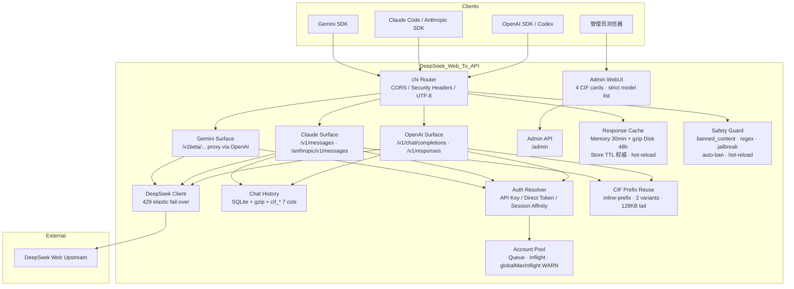

# DeepSeek_Web_To_API 文档导航

<cite>
**本文档引用的文件**
- [README.MD](file://README.MD)
- [API.md](file://API.md)
- [.env.example](file://.env.example)
- [cmd/DeepSeek_Web_To_API/main.go](file://cmd/DeepSeek_Web_To_API/main.go)
- [internal/server/router.go](file://internal/server/router.go)
- [internal/httpapi/openai/shared/session_cleanup.go](file://internal/httpapi/openai/shared/session_cleanup.go)
- [internal/httpapi/openai/shared/thinking_injection.go](file://internal/httpapi/openai/shared/thinking_injection.go)
- [internal/responsecache/path_policy.go](file://internal/responsecache/path_policy.go)
- [internal/currentinputmetrics/metrics.go](file://internal/currentinputmetrics/metrics.go)
- [internal/config/models.go](file://internal/config/models.go)
- [scripts/deploy_107.py](file://scripts/deploy_107.py)
</cite>

## 目录

1. [简介](#简介)
2. [项目结构](#项目结构)
3. [核心组件](#核心组件)
4. [架构总览](#架构总览)
5. [详细组件分析](#详细组件分析)
6. [结论](#结论)

## 简介

本目录是 DeepSeek_Web_To_API 的文档入口，内容以当前 Go 后端、React 管理台、SQLite 历史记录、gzip 响应缓存和多协议兼容实现为准。

**v1.0.6 – v1.0.12 主要新增**：

- **v1.0.6**：Thinking-Injection 提示词拆分（`ReasoningEffortPrompt` user 末尾 + `ToolChainPlaybookPrompt` system 头），消除上游 fast-path 静默丢弃工具链规则的根因；`globalMaxInflight=1` 多账号 footgun WARN；WebUI 单次刷新 payload 600 KB → 360 KB。
- **v1.0.7**：CIF inline-prefix 模式（不依赖文件上传）、多 variant 链（最多 2 条，LRU 提升）、`maxTailChars` 64 KB → 128 KB、mode-aware cache key（inline 跨账号复用）、canonical history（剥离 OpenClaw 易变 metadata）、`internal/currentinputmetrics` 全套包 + WebUI 4 卡片；响应缓存 hot-reload 修复（删除 path_policy 硬编码 TTL，Store/WebUI 配置成为唯一权威，默认 TTL 升为 30 min / 48 h）；chat_history schema +7 `cif_*` 列；DSML 第二遍正则容错（pair-required）。
- **v1.0.8**：`AutoDeleteRemoteSession` 提取为共享 helper，同时挂载 `/v1/responses` 与 `/v1/messages`，WebUI 自动删除开关对全部 4 条 LLM 路径生效（修复 Issue #20）。
- **v1.0.9 / v1.0.11**：纯 gofmt patch，无功能变更。
- **v1.0.10**：`resolveCanonicalModel` 改为严格白名单（移除启发式 family-prefix fallback）；`deepseek-v4-vision` 从 `/v1/models` 及所有内部路径移除并硬性封锁。
- **v1.0.12**：上游 429 弹性 fail-over，切账号不消耗 `maxAttempts` 预算，池中有空闲账号时对客户端透明；其他状态码（401/502/5xx）保持原行为。

推荐阅读顺序：

- 新用户先看 [根目录 README](file://README.MD) 和 [API 文档](file://API.md)。
- 运维部署看 [配置说明](file://docs/configuration.md)、[部署运维](file://docs/deployment.md)、[安全说明](file://docs/security.md)、[存储与缓存](file://docs/storage-cache.md)（含 5 套独立 SQLite、缓存 TTL 默认值及 v1.0.7 hot-reload 修复）。
- 开发者看 [项目总览](file://docs/Project%20Overview/Project%20Overview.md)、[架构设计](file://docs/Architecture%20Design/Architecture%20Design.md)、[API 兼容系统](file://docs/API%20Compatibility%20System/API%20Compatibility%20System.md)。
- 调试客户端（Claude Code、Codex CLI、OpenCode、Cherry Studio、OpenClaw 等）兼容性时先看 [client-compat 总索引](file://docs/client-compat/README.md)，再按客户端定位到对应专题报告（`docs/client-compat/<client>.md`）。
- 协议层细节看 [Prompt 兼容流程](file://docs/prompt-compatibility.md)（含 v1.0.6 thinking-injection 拆分、v1.0.7 CIF inline-prefix）和 [工具调用语义](file://docs/toolcall-semantics.md)（含 v1.0.7 DSML 正则容错、CDATA 管道变体兼容）。
- 缓存设计依据看 [cache-research.md](file://docs/cache-research.md)（路径分桶策略的调研基础）。

**章节来源**
- [README.MD](file://README.MD)
- [CHANGELOG.md](file://CHANGELOG.md)

## 项目结构

**图表来源**
- [cmd/DeepSeek_Web_To_API/main.go](file://cmd/DeepSeek_Web_To_API/main.go)
- [internal/server/router.go](file://internal/server/router.go)
- [webui/package.json](file://webui/package.json)
- [scripts/deploy_107.py](file://scripts/deploy_107.py)

**章节来源**
- [internal/server/router.go](file://internal/server/router.go)
- [internal/chathistory/sqlite_store.go](file://internal/chathistory/sqlite_store.go)
- [internal/responsecache/cache.go](file://internal/responsecache/cache.go)
- [internal/safetystore/store.go](file://internal/safetystore/store.go)

## 核心组件

- `cmd/DeepSeek_Web_To_API/main.go`：加载 `.env`、读取配置、创建服务、构建 WebUI、校验管理端安全配置，并启动 HTTP Server。
- `internal/server/router.go`：统一挂载 OpenAI、Claude、Gemini、Admin、WebUI、健康检查和中间件。
- `internal/config`：负责 `.env`、结构化配置、账号 SQLite、校验、导入导出和运行时访问器；`models.go` 实现严格模型白名单（v1.0.10）。
- `internal/account` 与 `internal/auth`：账号池、API Key 识别、直通 token、会话亲和与并发限制；`pool_limits.go` 含 `globalMaxInflight=1` 多账号 WARN（v1.0.6）。
- `internal/deepseek/client`：上游客户端；`client_completion.go` 含 429 弹性 fail-over（v1.0.12）。
- `internal/responsecache`：协议响应缓存，`path_policy.go` 仅控制 caller 边界，TTL 由 Store 全权配置（v1.0.7 hot-reload 修复）；默认 30 min / 48 h。
- `internal/chathistory`：SQLite 历史记录、旧 JSON 导入、保留数量、详情压缩、指标；schema 含 7 列 `cif_*` 字段（v1.0.7）。
- `internal/currentinputmetrics`：CIF 复用率、checkpoint 刷新、tail 大小、耗时的全局指标包（v1.0.7）。
- `internal/safetystore`：banned_content / banned_regex / jailbreak patterns / blocked_ips / allowed_ips 独立 SQLite 持久化；运行时热更新。
- `internal/httpapi/openai/shared/session_cleanup.go`：`AutoDeleteRemoteSession` 共享 helper，供 chat / responses / claude 三条路径统一调用（v1.0.8）。
- `internal/httpapi/openai/shared/thinking_injection.go`：`ApplyThinkingInjection`，按 hasTools 拆分 playbook/effort 两段（v1.0.6）。
- `internal/version`：版本读取（ldflags 注入 → VERSION 文件 → "dev" 三级 fallback）。
- `scripts/deploy_107.py`：自动编译 linux/amd64、注入 ldflags 版本、SCP 上传、sha256 校验、systemd 重启。
- `webui`：React/Vite 管理台，构建后由 Go 服务静态托管；含 4 张 CIF 指标卡片。

**章节来源**
- [cmd/DeepSeek_Web_To_API/main.go](file://cmd/DeepSeek_Web_To_API/main.go)
- [internal/config/config.go](file://internal/config/config.go)
- [internal/account/pool_core.go](file://internal/account/pool_core.go)
- [internal/auth/request.go](file://internal/auth/request.go)

## 架构总览

**图表来源**
- [internal/server/router.go](file://internal/server/router.go)
- [internal/httpapi/admin/handler.go](file://internal/httpapi/admin/handler.go)
- [internal/deepseek/client/client_completion.go](file://internal/deepseek/client/client_completion.go)

**章节来源**
- [internal/server/router.go](file://internal/server/router.go)
- [internal/httpapi/openai/chat/handler.go](file://internal/httpapi/openai/chat/handler.go)
- [internal/httpapi/claude/handler_routes.go](file://internal/httpapi/claude/handler_routes.go)
- [internal/httpapi/gemini/handler_routes.go](file://internal/httpapi/gemini/handler_routes.go)

## 详细组件分析

### 文档清单

| 文档 | 用途 |
| --- | --- |
| [configuration.md](file://docs/configuration.md) | `.env` 配置入口、5 套 SQLite 路径、缓存 TTL 默认值（v1.0.7 升为 30 min / 48 h）、v1.0.6–v1.0.12 新字段 |
| [deployment.md](file://docs/deployment.md) | 本地、Docker、二进制、反代部署；`scripts/deploy_107.py` 自动化部署说明 |
| [storage-cache.md](file://docs/storage-cache.md) | 5 套独立 SQLite（accounts / chat_history / token_usage / safety_words / safety_ips）+ 响应缓存；hot-reload 保证 |
| [security.md](file://docs/security.md) | 鉴权、请求守卫（安全策略热加载、auto-ban、IP 白名单）、敏感字段保护 |
| [Project Overview](file://docs/Project%20Overview/Project%20Overview.md) | 项目模块总览（含 v1.0.6–v1.0.12 新增模块） |
| [Architecture Design](file://docs/Architecture%20Design/Architecture%20Design.md) | 系统架构与请求链路 |
| [API Compatibility System](file://docs/API%20Compatibility%20System/API%20Compatibility%20System.md) | OpenAI/Claude/Gemini 兼容层；严格模型白名单（v1.0.10）；全路径 AutoDeleteRemoteSession（v1.0.8） |
| [Admin WebUI System](file://docs/Admin%20WebUI%20System/Admin%20WebUI%20System.md) | 管理台与 Admin API；CIF 4 卡片（v1.0.7）；版本正确上报（v1.0.7）；安全策略 UI |
| [Runtime Operations](file://docs/Runtime%20Operations/Runtime%20Operations.md) | 运维指标、日志、故障处理；429 fail-over（v1.0.12）；globalMaxInflight WARN（v1.0.6） |
| [Testing and Delivery](file://docs/Testing%20and%20Delivery/Testing%20and%20Delivery.md) | 测试脚本、CI 和发布产物；`deploy_107.py` 部署自动化 |
| [prompt-compatibility.md](file://docs/prompt-compatibility.md) | API 消息到网页纯文本上下文的兼容流程（v1.0.6 thinking-injection 拆分、v1.0.7 CIF inline-prefix、canonical history） |
| [toolcall-semantics.md](file://docs/toolcall-semantics.md) | 工具调用解析、修复和流式输出语义（v1.0.7 DSML 第二遍正则容错、CDATA 管道变体兼容） |
| [cache-research.md](file://docs/cache-research.md) | 响应缓存命中率调研结论（路径分桶策略的设计依据） |
| [client-compat/](file://docs/client-compat/README.md) | 客户端兼容性专题报告：Codex / OpenCode / OpenClaw / Cherry Studio / Claude Code v2.x |

**章节来源**
- [AGENTS.md](file://AGENTS.md)
- [docs/prompt-compatibility.md](file://docs/prompt-compatibility.md)
- [CHANGELOG.md](file://CHANGELOG.md)

## 结论

文档体系只描述当前项目实际存在的 Go 后端、React 管理台、Docker/GHCR 发布、SQLite 历史记录和多协议兼容实现。

自 v1.0.6 起，项目新增了六条关键生产保障：Thinking-Injection 提示词精准拆分、429 弹性 fail-over、严格模型白名单、全路径会话自动删除、响应缓存 hot-reload 修复以及 CIF 前缀复用框架。v1.0.13 是最新稳定版。

**章节来源**
- [README.MD](file://README.MD)
- [CHANGELOG.md](file://CHANGELOG.md)
