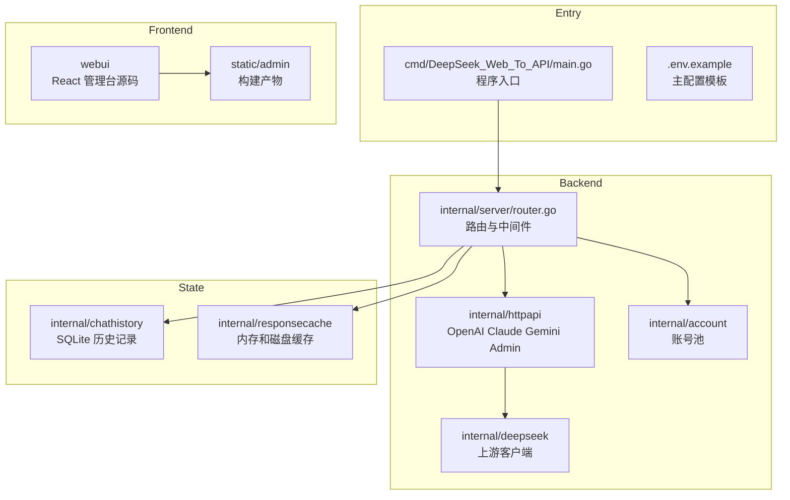
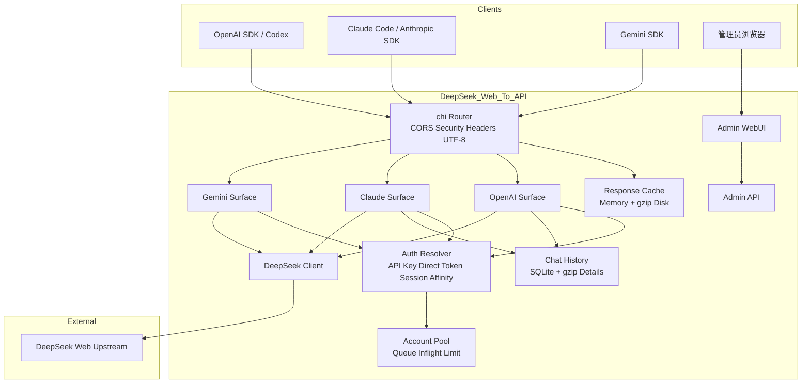

# DeepSeek_Web_To_API 文档导航

<cite>
**本文档引用的文件**
- [README.MD](file://README.MD)
- [API.md](file://API.md)
- [.env.example](file://.env.example)
- [cmd/DeepSeek_Web_To_API/main.go](file://cmd/DeepSeek_Web_To_API/main.go)
- [internal/server/router.go](file://internal/server/router.go)
</cite>

## 目录

1. [简介](#简介)
2. [项目结构](#项目结构)
3. [核心组件](#核心组件)
4. [架构总览](#架构总览)
5. [详细组件分析](#详细组件分析)
6. [结论](#结论)

## 简介

本目录是 DeepSeek_Web_To_API 的当前文档入口，内容以现有 Go 后端、React 管理台、SQLite 历史记录、gzip 响应缓存和多协议兼容实现为准。旧仓库来源、旧部署平台和不再存在的启动文件不再作为文档依据。

推荐阅读顺序：

- 新用户先看 [根目录 README](file://README.MD) 和 [API 文档](file://API.md)。
- 运维部署看 [配置说明](file://docs/configuration.md)、[部署运维](file://docs/deployment.md)、[安全说明](file://docs/security.md)。
- 开发者看 [项目总览](file://docs/Project%20Overview/Project%20Overview.md)、[架构设计](file://docs/Architecture%20Design/Architecture%20Design.md)、[API 兼容系统](file://docs/API%20Compatibility%20System/API%20Compatibility%20System.md)。
- 调试 Claude Code、Codex、OpenAI SDK、Gemini SDK 兼容性时看 [Prompt 兼容流程](file://docs/prompt-compatibility.md) 和 [工具调用语义](file://docs/toolcall-semantics.md)。

**章节来源**
- [README.MD](file://README.MD)
- [API.md](file://API.md)

## 项目结构

**图表来源**
- [cmd/DeepSeek_Web_To_API/main.go](file://cmd/DeepSeek_Web_To_API/main.go)
- [internal/server/router.go](file://internal/server/router.go)
- [webui/package.json](file://webui/package.json)

**章节来源**
- [internal/server/router.go](file://internal/server/router.go)
- [internal/chathistory/sqlite_store.go](file://internal/chathistory/sqlite_store.go)
- [internal/responsecache/cache.go](file://internal/responsecache/cache.go)

## 核心组件

- `cmd/DeepSeek_Web_To_API/main.go`：加载 `.env`、读取配置、创建服务、构建 WebUI、校验管理端安全配置，并启动 HTTP Server。
- `internal/server/router.go`：统一挂载 OpenAI、Claude、Gemini、Admin、WebUI、健康检查和中间件。
- `internal/config`：负责 `.env`、结构化配置、账号 SQLite、校验、导入导出和运行时访问器。
- `internal/account` 与 `internal/auth`：负责账号池、API Key 识别、直通 token、会话亲和与并发限制。
- `internal/responsecache`：负责协议响应缓存，内存层与 gzip 磁盘层共享同一缓存键规则。
- `internal/chathistory`：负责 SQLite 历史记录、旧 JSON 导入、保留数量、详情压缩和指标。
- `webui`：React/Vite 管理台，构建后由 Go 服务静态托管。

**章节来源**
- [cmd/DeepSeek_Web_To_API/main.go](file://cmd/DeepSeek_Web_To_API/main.go)
- [internal/config/config.go](file://internal/config/config.go)
- [internal/account/pool_core.go](file://internal/account/pool_core.go)
- [internal/auth/request.go](file://internal/auth/request.go)

## 架构总览

**图表来源**
- [internal/server/router.go](file://internal/server/router.go)
- [internal/httpapi/admin/handler.go](file://internal/httpapi/admin/handler.go)
- [internal/deepseek/client/client_core.go](file://internal/deepseek/client/client_core.go)

**章节来源**
- [internal/server/router.go](file://internal/server/router.go)
- [internal/httpapi/openai/chat/handler.go](file://internal/httpapi/openai/chat/handler.go)
- [internal/httpapi/claude/handler_routes.go](file://internal/httpapi/claude/handler_routes.go)
- [internal/httpapi/gemini/handler_routes.go](file://internal/httpapi/gemini/handler_routes.go)

## 详细组件分析

### 文档清单

| 文档 | 用途 |
| --- | --- |
| [configuration.md](file://docs/configuration.md) | `.env` 配置入口、账号 SQLite、默认值和安全要求 |
| [deployment.md](file://docs/deployment.md) | 本地、Docker、二进制、反代部署 |
| [storage-cache.md](file://docs/storage-cache.md) | SQLite 历史记录与响应缓存 |
| [security.md](file://docs/security.md) | 鉴权、输入校验、敏感数据与部署边界 |
| [Project Overview](file://docs/Project%20Overview/Project%20Overview.md) | 项目模块总览 |
| [Architecture Design](file://docs/Architecture%20Design/Architecture%20Design.md) | 系统架构与请求链路 |
| [API Compatibility System](file://docs/API%20Compatibility%20System/API%20Compatibility%20System.md) | OpenAI/Claude/Gemini 兼容层 |
| [Admin WebUI System](file://docs/Admin%20WebUI%20System/Admin%20WebUI%20System.md) | 管理台与 Admin API |
| [Runtime Operations](file://docs/Runtime%20Operations/Runtime%20Operations.md) | 运维指标、日志、故障处理 |
| [Testing and Delivery](file://docs/Testing%20and%20Delivery/Testing%20and%20Delivery.md) | 测试脚本、CI 和发布产物 |
| [prompt-compatibility.md](file://docs/prompt-compatibility.md) | API 消息到网页纯文本上下文的兼容流程 |
| [toolcall-semantics.md](file://docs/toolcall-semantics.md) | 工具调用解析、修复和流式输出语义 |

**章节来源**
- [AGENTS.md](file://AGENTS.md)
- [docs/prompt-compatibility.md](file://docs/prompt-compatibility.md)

## 结论

新的文档体系只描述当前项目实际存在的 Go 后端、React 管理台、Docker/GHCR 发布、SQLite 历史记录和多协议兼容实现。旧项目名称、旧仓库归属、旧部署入口和历史贡献者内容不再出现在文档体系内。

管理台文档已覆盖侧边栏版本展示和 GitHub 新版本检测：前端每 30 秒检查一次最新 Release/tag，有新版本时提示用户跳转到发布页。

**章节来源**
- [README.MD](file://README.MD)
- [API.md](file://API.md)
