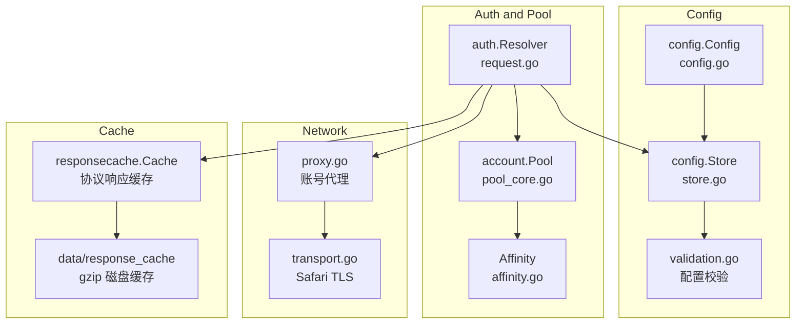
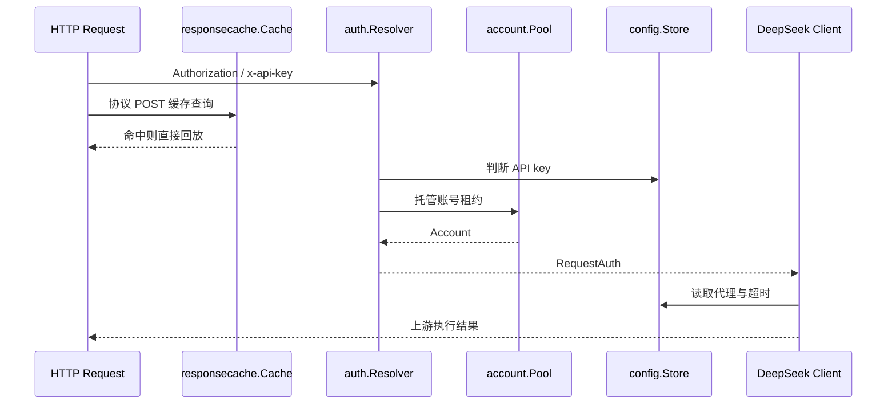

# Runtime Operations

<cite>
**本文档引用的文件**
- [internal/config/config.go](file://internal/config/config.go)
- [internal/config/store.go](file://internal/config/store.go)
- [internal/config/store_load.go](file://internal/config/store_load.go)
- [internal/config/store_accessors.go](file://internal/config/store_accessors.go)
- [internal/config/validation.go](file://internal/config/validation.go)
- [internal/auth/request.go](file://internal/auth/request.go)
- [internal/auth/admin.go](file://internal/auth/admin.go)
- [internal/account/pool_core.go](file://internal/account/pool_core.go)
- [internal/account/pool_acquire.go](file://internal/account/pool_acquire.go)
- [internal/account/affinity.go](file://internal/account/affinity.go)
- [internal/deepseek/client/proxy.go](file://internal/deepseek/client/proxy.go)
- [internal/deepseek/transport/transport.go](file://internal/deepseek/transport/transport.go)
- [internal/responsecache/cache.go](file://internal/responsecache/cache.go)
- [internal/httpapi/openai/responses/cache_replay.go](file://internal/httpapi/openai/responses/cache_replay.go)
- [internal/chathistory/sqlite_detail.go](file://internal/chathistory/sqlite_detail.go)
- [internal/config/paths.go](file://internal/config/paths.go)
- [config.example.json](file://config.example.json)
- [docs/security-audit-2026-05-02.md](file://docs/security-audit-2026-05-02.md)
</cite>

## 目录
1. [简介](#简介)
2. [项目结构](#项目结构)
3. [核心组件](#核心组件)
4. [架构总览](#架构总览)
5. [详细组件分析](#详细组件分析)
6. [依赖分析](#依赖分析)
7. [性能考虑](#性能考虑)
8. [故障排查指南](#故障排查指南)
9. [结论](#结论)

## 简介

**章节来源**
- [config.go:1-189](file://internal/config/config.go#L1-L189)
- [store_load.go:1-116](file://internal/config/store_load.go#L1-L116)
- [admin.go:40-70](file://internal/auth/admin.go#L40-L70)

## 项目结构

**图表来源**
- [config.go:1-189](file://internal/config/config.go#L1-L189)
- [store.go:18-149](file://internal/config/store.go#L18-L149)
- [request.go:37-139](file://internal/auth/request.go#L37-L139)
- [pool_core.go:17-73](file://internal/account/pool_core.go#L17-L73)
- [proxy.go:17-153](file://internal/deepseek/client/proxy.go#L17-L153)
- [cache.go:26-32](file://internal/responsecache/cache.go#L26-L32)
- [paths.go:60-66](file://internal/config/paths.go#L60-L66)

**章节来源**
- [config.example.json:1-76](file://config.example.json#L1-L76)

## 核心组件

- `config.Config`：集中定义 API keys、accounts、proxies、model aliases、admin、runtime、compat、responses、embeddings、auto_delete、current_input_file 和 thinking_injection。
- `config.Store`：提供线程安全快照、索引、更新、保存、导出和 env-backed 判断。
- `auth.Resolver`：支持配置 API key 托管账号模式，也支持直传 DeepSeek token。
- `account.Pool`：按账号并发与全局并发分配账号，支持等待队列和 target account。
- `account.Affinity`：基于 caller、会话身份、system 和首个 user 内容生成亲缘键，让同一会话落到同一账号。
- `proxy.go` 与 `transport.go`：为账号选择 SOCKS 代理，并用 Safari TLS 指纹 transport 调 DeepSeek。
- `responsecache.Cache`：覆盖 OpenAI、Claude/Anthropic、Gemini 协议 POST 响应；内存缓存 5 分钟且最多 3.8GB，gzip 磁盘缓存 4 小时且最多 16GB。

**章节来源**
- [config.go:1-189](file://internal/config/config.go#L1-L189)
- [store.go:18-149](file://internal/config/store.go#L18-L149)
- [request.go:37-139](file://internal/auth/request.go#L37-L139)
- [pool_acquire.go:9-142](file://internal/account/pool_acquire.go#L9-L142)
- [affinity.go:19-160](file://internal/account/affinity.go#L19-L160)
- [proxy.go:17-153](file://internal/deepseek/client/proxy.go#L17-L153)
- [transport.go:24-113](file://internal/deepseek/transport/transport.go#L24-L113)
- [cache.go:41-181](file://internal/responsecache/cache.go#L41-L181)

## 架构总览

**图表来源**
- [cache.go:131-181](file://internal/responsecache/cache.go#L131-L181)
- [request.go:37-139](file://internal/auth/request.go#L37-L139)
- [pool_acquire.go:9-142](file://internal/account/pool_acquire.go#L9-L142)
- [proxy.go:102-153](file://internal/deepseek/client/proxy.go#L102-L153)

**章节来源**
- [request.go:37-139](file://internal/auth/request.go#L37-L139)

## 详细组件分析

### 配置加载

### Admin 安全

Admin 认证要求 `config.json` 中存在 `admin.key` 或 `admin.password_hash`，并要求 `admin.jwt_secret` 用于 JWT 签名；旧部署仍可用 `DEEPSEEK_WEB_TO_API_ADMIN_KEY` / `DEEPSEEK_WEB_TO_API_JWT_SECRET` 作为环境变量覆盖。密码更新会写入 bcrypt hash 并提升 `jwt_valid_after_unix`，强制旧 token 失效。

### 账号与代理

托管账号模式下，请求 token 若命中配置 API key，就从账号池获取账号并确保 DeepSeek token 可用；直传 token 模式不占用账号池。账号可绑定代理，代理支持 SOCKS 类型、认证和连通性测试。

### 协议响应缓存

### 运行数据权限

运行时写回配置、聊天历史 SQLite、响应缓存、raw samples 和 testsuite artifacts 都按敏感数据处理。配置写回、测试日志、抓包样本和缓存文件默认使用 `0600` 文件权限；聊天历史、缓存和测试产物目录默认使用 `0700`。聊天历史详情写入 SQLite 前会 gzip 压缩到 BLOB，旧的未压缩详情会在启动时分批迁移并尝试 `VACUUM` 回收空间。响应缓存路径由规范化 SHA-256 key 派生，并在删除前验证仍位于缓存根目录，避免误删根目录外文件。

**章节来源**
- [store_load.go:10-116](file://internal/config/store_load.go#L10-L116)
- [validation.go:9-153](file://internal/config/validation.go#L9-L153)
- [admin.go:40-288](file://internal/auth/admin.go#L40-L288)
- [request.go:37-251](file://internal/auth/request.go#L37-L251)
- [proxy.go:17-241](file://internal/deepseek/client/proxy.go#L17-L241)
- [cache.go:184-208](file://internal/responsecache/cache.go#L184-L208)
- [cache.go:210-272](file://internal/responsecache/cache.go#L210-L272)
- [cache.go:281-512](file://internal/responsecache/cache.go#L281-L512)
- [cache.go:435-512](file://internal/responsecache/cache.go#L435-L512)
- [cache_replay.go:13-75](file://internal/httpapi/openai/responses/cache_replay.go#L13-L75)
- [sqlite_detail.go](file://internal/chathistory/sqlite_detail.go)
- [security-audit-2026-05-02.md](file://docs/security-audit-2026-05-02.md)

## 依赖分析

**章节来源**
- [paths.go:60-66](file://internal/config/paths.go#L60-L66)
- [config.example.json:1-76](file://config.example.json#L1-L76)
- [docker-compose.yml:1-20](file://docker-compose.yml#L1-L20)

## 性能考虑

运行时吞吐由账号池、全局并发、代理延迟、DeepSeek 响应速度、历史写入和协议响应缓存命中率共同决定。`RuntimeAccountMaxInflight` 默认 2，`RuntimeTokenRefreshIntervalHours` 默认 6；代理 client 按配置缓存，避免每次请求重复构建 transport。聊天历史详情写入会增加一次 gzip 压缩 CPU 成本，但可显著降低长上下文历史的磁盘占用。协议响应缓存命中会绕过上游调用，内存命中最快，磁盘命中需要 gzip 解压和一次文件读取；缓存容量由 3.8GB 内存上限与 16GB 磁盘上限约束。

**章节来源**
- [store_accessors.go:85-160](file://internal/config/store_accessors.go#L85-L160)
- [pool_core.go:17-73](file://internal/account/pool_core.go#L17-L73)
- [proxy.go:102-153](file://internal/deepseek/client/proxy.go#L102-L153)
- [cache.go:210-252](file://internal/responsecache/cache.go#L210-L252)

## 故障排查指南

- `admin credential is missing`：在 `config.json` 设置 `admin.key` 或 `admin.password_hash`。
- `admin.jwt_secret is required`：在 `config.json` 为 Admin JWT 设置强随机 secret。
- `no accounts configured or all accounts are busy`：补充账号、降低并发、增加队列或检查账号 token 刷新失败。
- 代理不可达：使用 Admin 代理测试或检查 host、port、type、username/password 和 DNS 解析。
- 聊天历史库仍很大：确认服务日志是否出现 `SQLite compact after detail compression completed`；如果出现 compact 失败，通常是剩余磁盘空间不足或数据库正忙，新写入仍会压缩，库文件缩小需要下次成功 `VACUUM`。
- 缓存未命中：检查请求体、模型、协议归一路径、`X-DeepSeek-Web-To-API-Target-Account`、`Anthropic-Version`、`Anthropic-Beta`、`Cache-Control` 是否发生变化；命中响应会带 `X-DeepSeek-Web-To-API-Cache`。

**章节来源**
- [admin.go:40-70](file://internal/auth/admin.go#L40-L70)
- [request.go:37-139](file://internal/auth/request.go#L37-L139)
- [proxy.go:155-241](file://internal/deepseek/client/proxy.go#L155-L241)
- [cache.go:184-208](file://internal/responsecache/cache.go#L184-L208)
- [cache.go:544-572](file://internal/responsecache/cache.go#L544-L572)

## 结论

运行治理的核心是“配置集中、凭证外置、账号租约明确、代理可验证、上游请求可回退”。改动运行时参数时，应同步更新 `config.example.json`、部署文档和 Admin WebUI 设置页，避免配置项存在但用户无法发现或无法安全修改。

**章节来源**
- [config.go:1-189](file://internal/config/config.go#L1-L189)
- [Admin WebUI System.md](file://docs/Admin%20WebUI%20System/Admin%20WebUI%20System.md)
