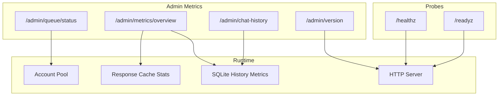
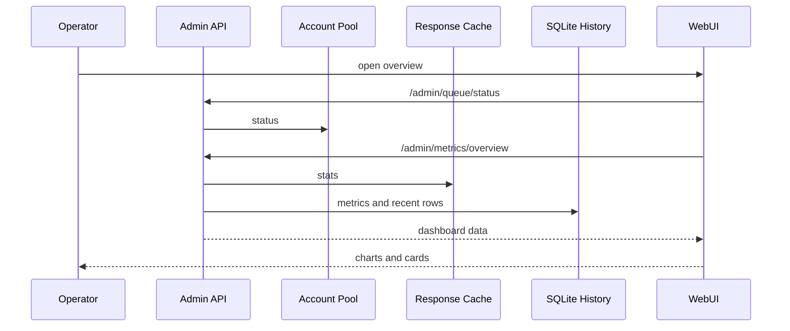

# 运行运维

<cite>
**本文档引用的文件**
- [cmd/DeepSeek_Web_To_API/main.go](file://cmd/DeepSeek_Web_To_API/main.go)
- [internal/server/router.go](file://internal/server/router.go)
- [internal/account/pool_core.go](file://internal/account/pool_core.go)
- [internal/httpapi/admin/metrics/handler.go](file://internal/httpapi/admin/metrics/handler.go)
- [internal/responsecache/cache.go](file://internal/responsecache/cache.go)
</cite>

## 目录

1. [简介](#简介)
2. [项目结构](#项目结构)
3. [核心组件](#核心组件)
4. [架构总览](#架构总览)
5. [详细组件分析](#详细组件分析)
6. [故障排查指南](#故障排查指南)
7. [结论](#结论)

## 简介

运行运维关注服务是否启动、是否可被反代访问、账号池是否拥堵、缓存是否命中、历史记录是否正常写入，以及上游错误是否被正确分类。当前服务内置健康检查、队列状态、总览指标和历史记录查询。

**章节来源**
- [cmd/DeepSeek_Web_To_API/main.go](file://cmd/DeepSeek_Web_To_API/main.go)
- [internal/httpapi/admin/metrics/handler.go](file://internal/httpapi/admin/metrics/handler.go)

## 项目结构

**图表来源**
- [internal/server/router.go](file://internal/server/router.go)
- [internal/httpapi/admin/metrics/routes.go](file://internal/httpapi/admin/metrics/routes.go)

**章节来源**
- [internal/httpapi/admin/accounts/routes.go](file://internal/httpapi/admin/accounts/routes.go)
- [internal/httpapi/admin/history/routes.go](file://internal/httpapi/admin/history/routes.go)

## 核心组件

- 健康检查：`/healthz` 返回 `{"status":"ok"}`，`/readyz` 返回 `{"status":"ready"}`。
- 账号池状态：返回总账号、可用账号、占用槽位、等待队列和推荐并发。
- 总览指标：汇总历史、缓存、磁盘、内存、成本和请求耗时等运行数据。
- 响应缓存指标：包含 lookups、hits、misses、memory_hits、disk_hits、uncacheable 原因和缓存容量。
- 历史记录：用于分析成功率、失败原因、账号和模型分布。

**章节来源**
- [internal/server/router.go](file://internal/server/router.go)
- [internal/account/pool_core.go](file://internal/account/pool_core.go)
- [internal/responsecache/cache.go](file://internal/responsecache/cache.go)

## 架构总览

**图表来源**
- [webui/src/features/overview/OverviewContainer.jsx](file://webui/src/features/overview/OverviewContainer.jsx)
- [internal/httpapi/admin/metrics/handler.go](file://internal/httpapi/admin/metrics/handler.go)

**章节来源**
- [internal/httpapi/admin/metrics/deps.go](file://internal/httpapi/admin/metrics/deps.go)

## 详细组件分析

### 成功率

总览页基于历史记录计算成功率，并排除用户侧或边缘侧的 `401`、`403`、`502`、`504`、`524` 等状态，避免把调用方鉴权、网关超时或边缘失败混进上游成功率。

### 账号负载

账号负载 = 当前占用槽位 / 容量。容量优先使用全局并发上限，其次使用推荐并发，最后回退到账号数和每账号并发上限。

### 缓存命中率

缓存统计由 `responsecache.Cache.Stats()` 暴露，管理台展示命中次数、未命中次数、内存命中、磁盘命中和不可缓存原因。

**章节来源**
- [webui/src/features/overview/OverviewContainer.jsx](file://webui/src/features/overview/OverviewContainer.jsx)
- [internal/responsecache/cache.go](file://internal/responsecache/cache.go)

## 故障排查指南

- 成功率突然下降：先按历史记录状态码、错误详情、账号、模型维度分组，再确认是否为用户侧排除状态或上游错误。
- 缓存命中下降：检查请求体是否每次变化、是否跨调用方、是否被 `Cache-Control` 绕过。
- 账号负载一直 0：确认是否真实有 in-flight 请求；短请求结束后占用槽位会快速释放。
- 等待队列长期增加：增大账号数量、每账号并发或全局并发，或排查账号登录失败。

**章节来源**
- [internal/account/pool_core.go](file://internal/account/pool_core.go)
- [internal/auth/request.go](file://internal/auth/request.go)

## 结论

当前运维入口集中在管理台总览、历史记录和健康探针。排查时应先区分用户侧错误、代理/边缘错误、账号池拥堵和 DeepSeek 上游错误，再决定是否调配置或修代码。

**章节来源**
- [docs/storage-cache.md](file://docs/storage-cache.md)
