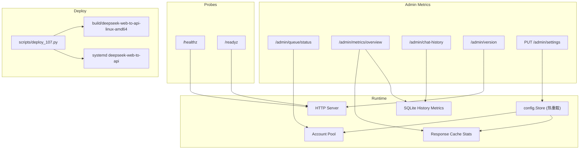
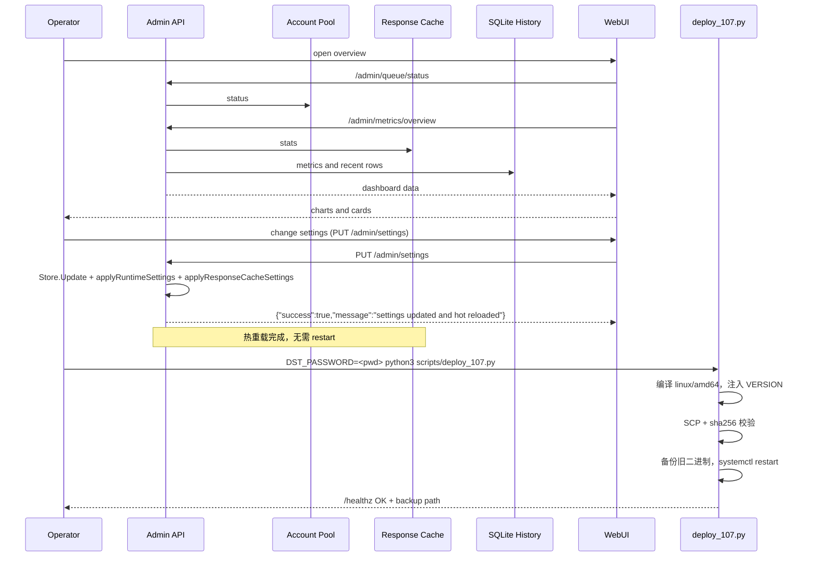

# 运行运维

<cite>
**本文档引用的文件**
- [cmd/DeepSeek_Web_To_API/main.go](file://cmd/DeepSeek_Web_To_API/main.go)
- [internal/server/router.go](file://internal/server/router.go)
- [internal/account/pool_core.go](file://internal/account/pool_core.go)
- [internal/httpapi/admin/metrics/handler.go](file://internal/httpapi/admin/metrics/handler.go)
- [internal/responsecache/cache.go](file://internal/responsecache/cache.go)
- [internal/responsecache/path_policy.go](file://internal/responsecache/path_policy.go)
- [internal/version/version.go](file://internal/version/version.go)
- [internal/deepseek/client/client_completion.go](file://internal/deepseek/client/client_completion.go)
- [internal/httpapi/admin/settings/handler_settings_write.go](file://internal/httpapi/admin/settings/handler_settings_write.go)
- [scripts/deploy_107.py](file://scripts/deploy_107.py)
- [webui/src/layout/DashboardShell.jsx](file://webui/src/layout/DashboardShell.jsx)
</cite>

## 目录

1. [简介](#简介)
2. [项目结构](#项目结构)
3. [核心组件](#核心组件)
4. [架构总览](#架构总览)
5. [详细组件分析](#详细组件分析)
6. [故障排查指南](#故障排查指南)
7. [结论](#结论)

## 简介

运行运维关注服务是否启动、是否可被反代访问、账号池是否拥堵、缓存是否命中、历史记录是否正常写入，以及上游错误是否被正确分类。当前服务内置健康检查、队列状态、总览指标和历史记录查询。

v1.0.7 起，所有管理台 WebUI Settings 变更通过 `PUT /admin/settings` → `Store.Update` → 实时配置快照生效，Pool / ResponseCache / requestguard policyCache / model alias map 均在每次请求时读取最新值，任何设置变更均无需重启服务（热重载全面保障）。

v1.0.11 起，`scripts/deploy_107.py` 提供一键式线上部署脚本，自动编译、校验 sha256、备份旧二进制、重启 systemd 服务并验证健康状态。

**章节来源**
- [cmd/DeepSeek_Web_To_API/main.go](file://cmd/DeepSeek_Web_To_API/main.go)
- [internal/httpapi/admin/metrics/handler.go](file://internal/httpapi/admin/metrics/handler.go)
- [scripts/deploy_107.py](file://scripts/deploy_107.py)

## 项目结构



**图表来源**
- [internal/server/router.go](file://internal/server/router.go)
- [internal/httpapi/admin/metrics/routes.go](file://internal/httpapi/admin/metrics/routes.go)
- [scripts/deploy_107.py](file://scripts/deploy_107.py)

**章节来源**
- [internal/httpapi/admin/accounts/routes.go](file://internal/httpapi/admin/accounts/routes.go)
- [internal/httpapi/admin/history/routes.go](file://internal/httpapi/admin/history/routes.go)

## 核心组件

- 健康检查：`/healthz` 返回 `{"status":"ok"}`，`/readyz` 返回 `{"status":"ready"}`。
- 账号池状态：返回总账号、可用账号、占用槽位、等待队列和推荐并发。
- 总览指标：汇总历史、缓存、磁盘、内存、成本和请求耗时等运行数据。
- 响应缓存指标：包含 lookups、hits、misses、memory_hits、disk_hits、uncacheable 原因和缓存容量。
- 历史记录：用于分析成功率、失败原因、账号和模型分布。
- **版本上报**：`/admin/version` 返回 `{current_version, current_tag, source}`，`source` 优先级为 `build-ldflags`（注入版本）→ `file:VERSION`（文件读取）→ `default`（未注入时报告 `dev`，生产环境不应出现）。
- **热重载**：`PUT /admin/settings` → `Store.Update` → `applyRuntimeSettings` / `applyResponseCacheSettings` 同步推送到所有组件，无需 systemctl restart。
- **429 弹性故障转移**（v1.0.12）：上游返回 429 时，客户端完成接口不消耗 maxAttempts，直接切换到池内下一个空闲账号继续请求；仅当池内所有账号均已尝试或使用直接 token 时才将 429 回传客户端。`/admin/metrics/overview` 的 `history.failed` 计数器仅记录全池耗尽或真实错误，不统计单账号 429 切换事件。
- **一键部署**：`scripts/deploy_107.py` 读取 `VERSION` 文件注入版本字符串，交叉编译 linux/amd64 二进制，SCP 传输后 sha256 校验，备份旧二进制，重启服务，验证 `/healthz`。

**章节来源**
- [internal/server/router.go](file://internal/server/router.go)
- [internal/account/pool_core.go](file://internal/account/pool_core.go)
- [internal/responsecache/cache.go](file://internal/responsecache/cache.go)
- [internal/version/version.go](file://internal/version/version.go)
- [internal/deepseek/client/client_completion.go](file://internal/deepseek/client/client_completion.go)

## 架构总览



**图表来源**
- [webui/src/features/overview/OverviewContainer.jsx](file://webui/src/features/overview/OverviewContainer.jsx)
- [internal/httpapi/admin/metrics/handler.go](file://internal/httpapi/admin/metrics/handler.go)
- [internal/httpapi/admin/settings/handler_settings_write.go](file://internal/httpapi/admin/settings/handler_settings_write.go)
- [scripts/deploy_107.py](file://scripts/deploy_107.py)

**章节来源**
- [internal/httpapi/admin/metrics/deps.go](file://internal/httpapi/admin/metrics/deps.go)

## 详细组件分析

### 成功率

总览页基于历史记录计算成功率，并排除用户侧或边缘侧的 `401`、`403`、`502`、`504`、`524` 等状态，避免把调用方鉴权、网关超时或边缘失败混进上游成功率。

v1.0.12 起，单账号 429 切换成功不进入失败计数，`history.failed` 仅计入全池耗尽的 429 或其他真实错误；账号池有空闲容量时整体成功率将显著提升。

### 账号负载

账号负载 = 当前占用槽位 / 容量。容量优先使用全局并发上限，其次使用推荐并发，最后回退到账号数和每账号并发上限。

### 缓存命中率与热重载

缓存统计由 `responsecache.Cache.Stats()` 暴露，管理台展示命中次数、未命中次数、内存命中、磁盘命中和不可缓存原因。

**重要**：v1.0.7 修复了路径级别硬编码 TTL 覆盖 Store 配置的 bug（`internal/responsecache/path_policy.go` 中已移除路径级 TTL 覆盖）。现在 WebUI 中修改 `cache.response.memory_ttl_seconds` / `disk_ttl_seconds` 后，`PUT /admin/settings` 立即调用 `applyResponseCacheSettings`，变更直接反映到 `/admin/metrics/overview.cache` 和实际缓存行为，不再出现"改了配置但实际 TTL 不变"的问题。

### 版本检查

管理台侧边栏先调用 `/admin/version` 显示当前版本，再由浏览器直接访问 GitHub API，每 30 秒检查一次最新 Release；若没有 Release，则回退到最新 tag。只有远端语义化版本大于当前版本时才提示用户，提示链接指向 GitHub Releases。该轮询发生在浏览器侧，不经过后端代理，也不会影响服务健康探针或业务 API。

`/admin/version` 返回：

```json
{
  "current_version": "1.0.12",
  "current_tag": "v1.0.12",
  "source": "build-ldflags"
}
```

`source` 字段含义：

| source | 含义 |
|---|---|
| `build-ldflags` | 编译时通过 `-X … .BuildVersion=<VERSION>` 注入（推荐，生产环境应为此值） |
| `file:VERSION` | 构建时未注入，运行时从磁盘 `VERSION` 文件读取 |
| `default` | 两者均未提供，报告 `dev`（不应在生产出现） |

使用 `scripts/deploy_107.py` 或 `scripts/build-release-archives.sh` 构建的二进制始终注入 `build-ldflags`。

### 一键部署脚本（scripts/deploy_107.py）

`scripts/deploy_107.py` 是面向生产服务器的自动化部署工具（目标主机由环境变量 `DST_HOST` 提供，不在仓库中硬编码），流程如下：

1. 读取仓库根目录 `VERSION` 文件获取版本字符串。
2. 使用与 `scripts/build-release-archives.sh` 一致的编译参数交叉编译 linux/amd64 二进制：

```bash
GOOS=linux GOARCH=amd64 CGO_ENABLED=0 go build \
  -buildvcs=false -trimpath \
  -ldflags="-s -w -X DeepSeek_Web_To_API/internal/version.BuildVersion=<VERSION>" \
  -o build/deepseek-web-to-api-linux-amd64 ./cmd/DeepSeek_Web_To_API
```

3. 通过 SCP（paramiko）传输到远端 `/opt/deepseek-web-to-api/deepseek-web-to-api.new`。
4. 远端 sha256 校验，确保传输完整性。
5. 停服务 → 备份当前二进制到 `/opt/deepseek-web-to-api/deepseek-web-to-api.bak.<unix-ts>` → 替换 → 启动服务。
6. 验证 `systemctl is-active` 和 `http://127.0.0.1:5001/healthz`。

**使用命令**：

```bash
DST_PASSWORD=<root-pwd> python3 scripts/deploy_107.py
```

**跳过编译（使用已有二进制）**：

```bash
SKIP_BUILD=1 DST_PASSWORD=<root-pwd> python3 scripts/deploy_107.py
```

`SKIP_BUILD=1` 时脚本复用 `build/deepseek-web-to-api-linux-amd64`，若该文件不存在则直接退出。

**依赖**：`paramiko`（`pip install paramiko`）。

**章节来源**
- [webui/src/features/overview/OverviewContainer.jsx](file://webui/src/features/overview/OverviewContainer.jsx)
- [internal/responsecache/cache.go](file://internal/responsecache/cache.go)
- [internal/responsecache/path_policy.go](file://internal/responsecache/path_policy.go)
- [internal/version/version.go](file://internal/version/version.go)
- [webui/src/layout/DashboardShell.jsx](file://webui/src/layout/DashboardShell.jsx)
- [scripts/deploy_107.py](file://scripts/deploy_107.py)

## 故障排查指南

- 成功率突然下降：先按历史记录状态码、错误详情、账号、模型维度分组，再确认是否为用户侧排除状态或上游错误。v1.0.12 起单账号 429 切换已静默处理，若成功率仍低则检查所有账号是否均已达到速率上限。
- 缓存命中下降：检查请求体是否每次变化、是否跨调用方、是否被 `Cache-Control` 绕过。确认 WebUI 中 TTL 设置已保存（`PUT /admin/settings` 返回 `success:true`）。
- 账号负载一直 0：确认是否真实有 in-flight 请求；短请求结束后占用槽位会快速释放。
- 等待队列长期增加：增大账号数量、每账号并发或全局并发，或排查账号登录失败。
- 版本提醒不出现：先确认 `/admin/version` 返回非 `dev` 版本（`source` 为 `build-ldflags`），再检查浏览器网络面板中 GitHub API 请求是否被防火墙、CORS 或限流拦截。若 `/admin/version` 的 `source` 为 `default`（`dev`），说明部署时未注入版本，重新使用 `scripts/deploy_107.py` 或带 `-X` ldflags 的构建命令部署。
- 部署后服务未启动：查看 `systemctl status deepseek-web-to-api` 和 `journalctl -u deepseek-web-to-api -n 50`。如需回滚，执行 `mv /opt/deepseek-web-to-api/deepseek-web-to-api.bak.<ts> /opt/deepseek-web-to-api/deepseek-web-to-api && systemctl restart deepseek-web-to-api`。
- `scripts/deploy_107.py` sha256 不匹配：可能是 SCP 传输截断，脚本会自动删除 `.new` 文件并报错；检查网络或磁盘空间后重试。

**章节来源**
- [internal/account/pool_core.go](file://internal/account/pool_core.go)
- [internal/auth/request.go](file://internal/auth/request.go)
- [scripts/deploy_107.py](file://scripts/deploy_107.py)

## 结论

当前运维入口集中在管理台总览、历史记录和健康探针。v1.0.7 实现了全面热重载，所有 WebUI Settings 变更即时生效无需重启。v1.0.11 起 `scripts/deploy_107.py` 提供标准化一键部署，通过 `-X` ldflags 确保 `/admin/version` 报告正确版本（`source: build-ldflags`）。v1.0.12 的 429 弹性故障转移使账号池有冗余时成功率显著提升，失败计数更准确反映真实错误。排查时应先区分用户侧错误、代理/边缘错误、账号池拥堵和 DeepSeek 上游错误，再决定是否调配置或修代码。

**章节来源**
- [docs/storage-cache.md](file://docs/storage-cache.md)
- [scripts/deploy_107.py](file://scripts/deploy_107.py)
