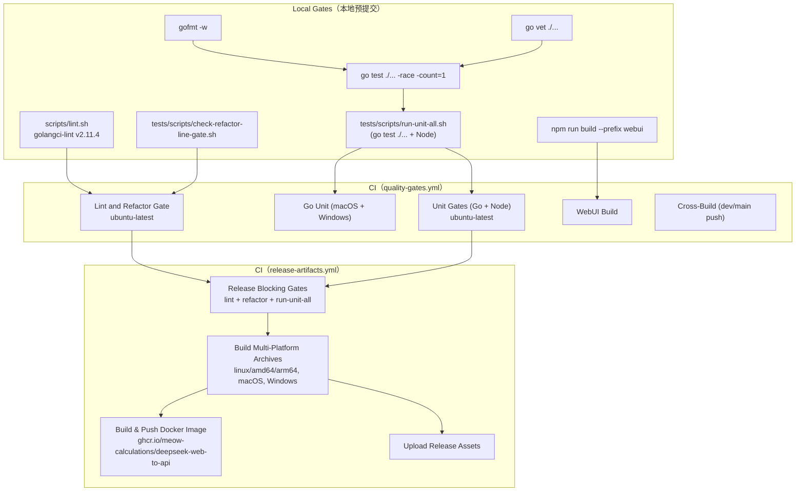
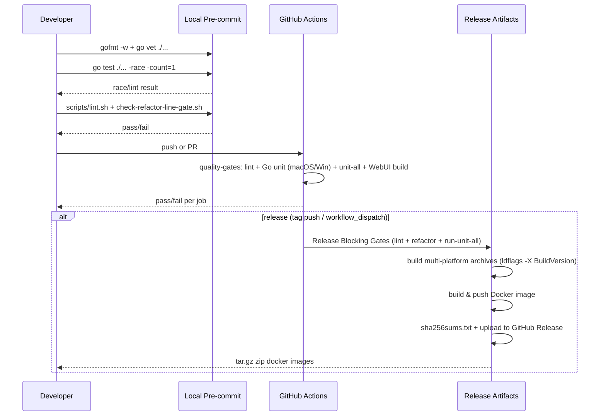

# 测试与交付

<cite>
**本文档引用的文件**
- [AGENTS.md](file://AGENTS.md)
- [.github/workflows/quality-gates.yml](file://.github/workflows/quality-gates.yml)
- [.github/workflows/release-artifacts.yml](file://.github/workflows/release-artifacts.yml)
- [scripts/lint.sh](file://scripts/lint.sh)
- [tests/scripts/run-unit-all.sh](file://tests/scripts/run-unit-all.sh)
- [tests/scripts/run-unit-go.sh](file://tests/scripts/run-unit-go.sh)
- [tests/scripts/check-refactor-line-gate.sh](file://tests/scripts/check-refactor-line-gate.sh)
- [webui/package.json](file://webui/package.json)
</cite>

## 目录

1. [简介](#简介)
2. [项目结构](#项目结构)
3. [核心组件](#核心组件)
4. [架构总览](#架构总览)
5. [详细组件分析](#详细组件分析)
6. [故障排查指南](#故障排查指南)
7. [结论](#结论)

## 简介

本项目的交付门禁由仓库 `AGENTS.md` 和 GitHub Actions 共同定义。代码修改应运行 lint、重构行数门禁、Go/Node 单测和 WebUI 构建。

**v1.0.7 起规范化测试命令**：`go test ./... -race -count=1` 是 Go 测试的规范化本地预发布命令（`-race` 检测并发安全，`-count=1` 禁用测试缓存保证每次全量运行）。CI 的 `release-artifacts.yml` 在产出发布二进制前执行 golangci-lint v2.11.4 + gofmt + 完整测试套件 + 依赖 CVE 扫描。

**本地预提交建议**：`gofmt -w` 清理格式 + `go vet ./...` 静态检查 + `go test ./... -race -count=1` 竞态检测。多个 v1.0.x 版本的 lint 补丁正是因为跳过本地 gofmt 引入的，遵守此流程可避免后续 style-only 补丁提交。

**章节来源**
- [AGENTS.md](file://AGENTS.md)
- [.github/workflows/quality-gates.yml](file://.github/workflows/quality-gates.yml)
- [.github/workflows/release-artifacts.yml](file://.github/workflows/release-artifacts.yml)

## 项目结构



**图表来源**
- [.github/workflows/quality-gates.yml](file://.github/workflows/quality-gates.yml)
- [.github/workflows/release-artifacts.yml](file://.github/workflows/release-artifacts.yml)
- [tests/scripts/run-unit-all.sh](file://tests/scripts/run-unit-all.sh)

**章节来源**
- [tests/scripts/run-unit-go.sh](file://tests/scripts/run-unit-go.sh)
- [tests/scripts/run-unit-node.sh](file://tests/scripts/run-unit-node.sh)

## 核心组件

- `scripts/lint.sh`：运行 golangci-lint v2.11.4 格式化检查和静态分析，必要时自动 bootstrap 指定版本。golangci-lint v2 将 `fmt` 和 `run` 分离为独立子命令，脚本同时执行两者。
- `check-refactor-line-gate.sh`：限制重构行数漂移。
- `run-unit-all.sh`：串行运行 `tests/scripts/run-unit-go.sh`（`go test ./...`）和 `tests/scripts/run-unit-node.sh`。
- `run-unit-go.sh`：执行 `go test ./...`（支持传参，本地可追加 `-race -count=1`）。
- `npm run build --prefix webui`：验证管理台可生产构建。
- `quality-gates.yml`：在 push/PR 上运行 lint（ubuntu）、Go 单测（macOS + Windows 双平台）、完整单测套件（ubuntu）、WebUI build，以及 dev/main push 时的跨平台构建。Go 版本：`1.26.x`；Node 版本：`24`；golangci-lint 版本：`v2.11.4`。
- `release-artifacts.yml`：推送版本 tag、发布 GitHub Release 或手动触发时，先执行"Release Blocking Gates"（lint + refactor + run-unit-all），再构建压缩包、Docker 镜像和 checksum。构建时通过 `BUILD_VERSION` 环境变量注入版本字符串（与 `scripts/deploy_107.py` 使用相同的 `-X` ldflags 机制）。

**章节来源**
- [scripts/lint.sh](file://scripts/lint.sh)
- [.github/workflows/quality-gates.yml](file://.github/workflows/quality-gates.yml)
- [.github/workflows/release-artifacts.yml](file://.github/workflows/release-artifacts.yml)

## 架构总览



**图表来源**
- [.github/workflows/quality-gates.yml](file://.github/workflows/quality-gates.yml)
- [.github/workflows/release-artifacts.yml](file://.github/workflows/release-artifacts.yml)

**章节来源**
- [scripts/build-release-archives.sh](file://scripts/build-release-archives.sh)

## 详细组件分析

### 规范化测试命令（v1.0.7 起）

**本地预发布（pre-release gate，必须全部通过）**：

```bash
# 1. 格式修复
gofmt -w ./...

# 2. 静态检查
go vet ./...

# 3. 竞态检测（规范化 Go 测试命令）
go test ./... -race -count=1
```

`-race` 标志启用 Go 内置的并发竞态检测器；`-count=1` 禁用测试结果缓存，保证每次全量运行而非读取缓存结果。

> **背景**：多个 v1.0.x 版本（v1.0.4/v1.0.5）出现仅格式问题的 style 补丁提交，根因是本地跳过了 gofmt。遵守此三步流程可在推送前发现格式差异。

**本地门禁脚本（推荐在提交前完整运行）**：

```bash
./scripts/lint.sh                              # golangci-lint v2.11.4 fmt + run
./tests/scripts/check-refactor-line-gate.sh    # 重构行数门禁
./tests/scripts/run-unit-all.sh                # go test ./... + Node 测试
npm run build --prefix webui                   # WebUI 生产构建验证
```

如需在本地测试时也加入 race 检测，可直接调用：

```bash
go test ./... -race -count=1
```

（`run-unit-go.sh` 底层执行 `go test ./... "$@"`，可通过参数透传 `-race -count=1`。）

### CI 发布流水线（release-artifacts.yml）

发布流水线在产出任何二进制前强制执行"Release Blocking Gates"：

```
scripts/lint.sh
tests/scripts/check-refactor-line-gate.sh
tests/scripts/run-unit-all.sh
```

所有门禁通过后，构建多平台压缩包并通过 `BUILD_VERSION` 注入版本字符串（确保发布二进制的 `/admin/version` 报告 `source: build-ldflags`）。随后构建 GHCR Docker 镜像（linux/amd64 + linux/arm64）、生成 `sha256sums.txt`，并上传到 GitHub Release。

CI 使用的版本组合：Go `1.26.x`、Node `24`、golangci-lint `v2.11.4`。多平台 Go 构建设置 `RELEASE_BUILD_JOBS=1`（串行），避免 `modernc.org/sqlite` 等较重依赖在 GitHub hosted runner 上并发编译导致内存压力。

### 文档专用检查

```bash
git diff --check
rg -n -i "<旧项目关键词>|<旧仓库地址>|<旧维护者标识>" README.MD README.en.md API.md API.en.md docs
```

### 发布产物

Release 构建会生成 Linux、macOS、Windows 多架构压缩包，构建 GHCR 镜像，并生成 `sha256sums.txt`。

触发方式：

```bash
git tag v1.0.12
git push meow v1.0.12
```

也可以在 GitHub Actions 页面手动运行 `Release Artifacts`。手动运行时填写 `release_tag` 会使用指定 tag；不填写则读取仓库根目录 `VERSION`。

产物位置：

- GitHub Releases：多平台 `.tar.gz` / `.zip`、Docker image tar.gz、`sha256sums.txt`。
- GitHub Packages：`ghcr.io/meow-calculations/deepseek-web-to-api`。

### 管理台版本提醒

管理台的新版本提醒依赖 GitHub Release 或 tag。发布新版本时应确保 GitHub 侧存在对应 `vX.Y.Z` release 或 tag，否则线上管理台无法检测到更高版本。只改前端轮询逻辑时不需要提升 `VERSION`；发布正式版本时才同步更新 `VERSION`、`webui/package.json` 和 release tag。

**章节来源**
- [tests/scripts/check-refactor-line-gate.sh](file://tests/scripts/check-refactor-line-gate.sh)
- [.github/workflows/release-artifacts.yml](file://.github/workflows/release-artifacts.yml)
- [scripts/build-release-archives.sh](file://scripts/build-release-archives.sh)
- [webui/src/layout/DashboardShell.jsx](file://webui/src/layout/DashboardShell.jsx)
- [tests/scripts/run-unit-go.sh](file://tests/scripts/run-unit-go.sh)

## 故障排查指南

- lint 下载失败：检查网络或手动设置 `GOLANGCI_LINT_BIN`；`scripts/lint.sh` 会自动 bootstrap v2.11.4 到 `.tmp/` 目录。
- Node 测试失败：先运行 `npm ci --prefix webui`，再执行 Node 测试脚本。
- WebUI 构建失败：检查 Node 版本是否满足 CI 的 Node 24。
- 跨平台构建失败：确认 Go 版本为 1.26.x，且没有 CGO 依赖（`CGO_ENABLED=0`）。
- race 测试失败：说明代码存在数据竞争，必须修复后再提交；不可通过去掉 `-race` 来规避。
- release-artifacts.yml 构建成功但 `/admin/version` 报 `dev`：检查 `BUILD_VERSION` 环境变量是否在构建步骤中正确传入；手动触发时未填 `release_tag` 且 `VERSION` 文件为空会导致此问题。

**章节来源**
- [.github/workflows/quality-gates.yml](file://.github/workflows/quality-gates.yml)
- [.github/workflows/release-artifacts.yml](file://.github/workflows/release-artifacts.yml)
- [Dockerfile](file://Dockerfile)

## 结论

测试与交付的目标是保证多协议兼容层、管理台和发布产物同时可用。v1.0.7 起规范化了 Go 测试命令：`go test ./... -race -count=1` 是本地预发布的必要门禁，配合 `gofmt -w` 和 `go vet ./...` 可在提交前发现格式问题和并发竞态。CI 的 `release-artifacts.yml` 在产出任何二进制前强制执行完整门禁套件，并通过 `-X` ldflags 保证发布产物的版本一致性。只改文档时可以不运行完整 Go/Node 门禁，但必须保证文档没有旧项目残留和 Markdown 空白错误。

**章节来源**
- [AGENTS.md](file://AGENTS.md)
- [.github/workflows/release-artifacts.yml](file://.github/workflows/release-artifacts.yml)
