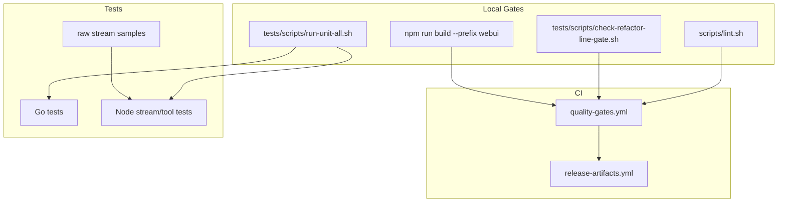
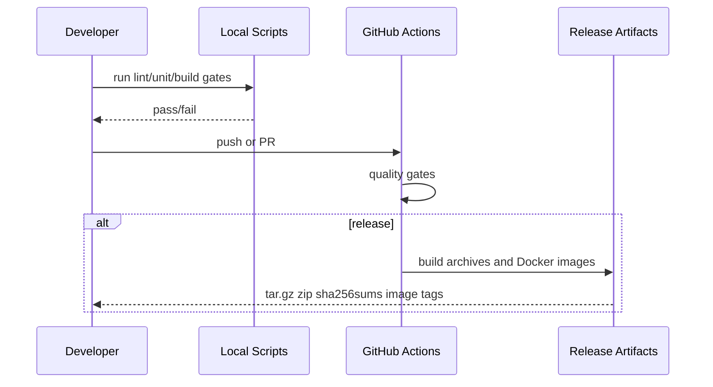

# 测试与交付

<cite>
**本文档引用的文件**
- [AGENTS.md](file://AGENTS.md)
- [.github/workflows/quality-gates.yml](file://.github/workflows/quality-gates.yml)
- [scripts/lint.sh](file://scripts/lint.sh)
- [tests/scripts/run-unit-all.sh](file://tests/scripts/run-unit-all.sh)
- [tests/scripts/check-refactor-line-gate.sh](file://tests/scripts/check-refactor-line-gate.sh)
- [webui/package.json](file://webui/package.json)
</cite>

## 目录

1. [简介](#简介)
2. [项目结构](#项目结构)
3. [核心组件](#核心组件)
4. [架构总览](#架构总览)
5. [详细组件分析](#详细组件分析)
6. [故障排查指南](#故障排查指南)
7. [结论](#结论)

## 简介

本项目的交付门禁由仓库 `AGENTS.md` 和 GitHub Actions 共同定义。代码修改应运行 lint、重构行数门禁、Go/Node 单测和 WebUI 构建。文档修改至少需要 Markdown diff 检查和旧项目残留扫描。

**章节来源**
- [AGENTS.md](file://AGENTS.md)
- [.github/workflows/quality-gates.yml](file://.github/workflows/quality-gates.yml)

## 项目结构



**图表来源**
- [.github/workflows/quality-gates.yml](file://.github/workflows/quality-gates.yml)
- [tests/scripts/run-unit-all.sh](file://tests/scripts/run-unit-all.sh)

**章节来源**
- [tests/scripts/run-unit-go.sh](file://tests/scripts/run-unit-go.sh)
- [tests/scripts/run-unit-node.sh](file://tests/scripts/run-unit-node.sh)

## 核心组件

- `scripts/lint.sh`：运行 golangci-lint 格式化检查和静态分析，必要时自动 bootstrap 指定版本。
- `check-refactor-line-gate.sh`：限制重构行数漂移。
- `run-unit-all.sh`：串行运行 Go 单元测试和 Node 测试。
- `npm run build --prefix webui`：验证管理台可生产构建。
- `quality-gates.yml`：在 push/PR 上运行 lint、单测、WebUI build 和跨平台构建。
- `release-artifacts.yml`：推送版本 tag、发布 GitHub Release 或手动触发时，构建压缩包、Docker 镜像和 checksum。
- CI 内的多平台 Go 构建默认串行执行，避免 `modernc.org/sqlite` 等较重依赖在 GitHub hosted runner 上并发编译导致内存压力和 `xargs` 123 汇总失败。

**章节来源**
- [scripts/lint.sh](file://scripts/lint.sh)
- [.github/workflows/release-artifacts.yml](file://.github/workflows/release-artifacts.yml)

## 架构总览



**图表来源**
- [.github/workflows/quality-gates.yml](file://.github/workflows/quality-gates.yml)
- [.github/workflows/release-artifacts.yml](file://.github/workflows/release-artifacts.yml)

**章节来源**
- [scripts/build-release-archives.sh](file://scripts/build-release-archives.sh)

## 详细组件分析

### 推荐本地命令

```bash
./scripts/lint.sh
./tests/scripts/check-refactor-line-gate.sh
./tests/scripts/run-unit-all.sh
npm run build --prefix webui
```

### 文档专用检查

```bash
git diff --check
rg -n -i "<旧项目关键词>|<旧仓库地址>|<旧维护者标识>" README.MD README.en.md API.md API.en.md docs
```

### 发布产物

Release 构建会生成 Linux、macOS、Windows 多架构压缩包，构建 GHCR 镜像，并生成 `sha256sums.txt`。

触发方式：

```bash
git tag v1.0.2
git push meow v1.0.2
```

也可以在 GitHub Actions 页面手动运行 `Release Artifacts`。手动运行时填写 `release_tag` 会使用指定 tag；不填写则读取仓库根目录 `VERSION`。

产物位置：

- GitHub Releases：多平台 `.tar.gz` / `.zip`、Docker image tar.gz、`sha256sums.txt`。
- GitHub Packages：`ghcr.io/meow-calculations/deepseek-web-to-api`。

### 管理台版本提醒

管理台的新版本提醒依赖 GitHub Release 或 tag。发布新版本时应确保 GitHub 侧存在对应 `vX.Y.Z` release 或 tag，否则线上管理台无法检测到更高版本。只改前端轮询逻辑时不需要提升 `VERSION`；发布正式版本时才同步更新 `VERSION`、`webui/package.json` 和 release tag。

**章节来源**
- [tests/scripts/check-refactor-line-gate.sh](file://tests/scripts/check-refactor-line-gate.sh)
- [scripts/build-release-archives.sh](file://scripts/build-release-archives.sh)
- [webui/src/layout/DashboardShell.jsx](file://webui/src/layout/DashboardShell.jsx)

## 故障排查指南

- lint 下载失败：检查网络或手动设置 `GOLANGCI_LINT_BIN`。
- Node 测试失败：先运行 `npm ci --prefix webui`，再执行 Node 测试脚本。
- WebUI 构建失败：检查 Node 版本是否满足 CI 的 Node 24。
- 跨平台构建失败：确认 Go 版本为 1.26.x，且没有 CGO 依赖。

**章节来源**
- [.github/workflows/quality-gates.yml](file://.github/workflows/quality-gates.yml)
- [Dockerfile](file://Dockerfile)

## 结论

测试与交付的目标是保证多协议兼容层、管理台和发布产物同时可用。只改文档时可以不运行完整 Go/Node 门禁，但必须保证文档没有旧项目残留和 Markdown 空白错误。

**章节来源**
- [AGENTS.md](file://AGENTS.md)
