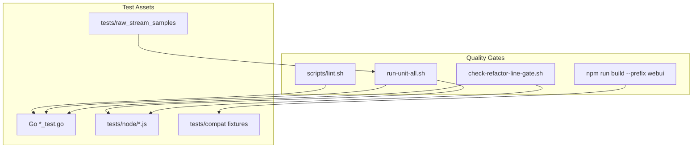
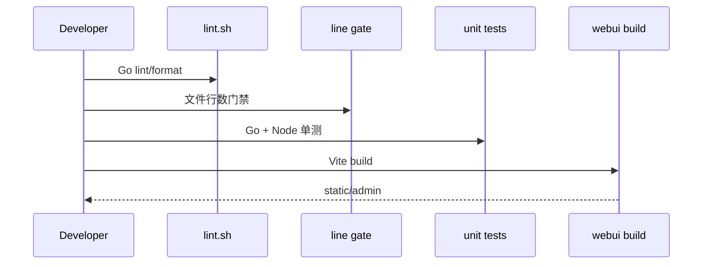

# Testing and Delivery

<cite>
**本文档引用的文件**
- [scripts/lint.sh](file://scripts/lint.sh)
- [tests/scripts/run-unit-all.sh](file://tests/scripts/run-unit-all.sh)
- [tests/scripts/run-unit-go.sh](file://tests/scripts/run-unit-go.sh)
- [tests/scripts/run-unit-node.sh](file://tests/scripts/run-unit-node.sh)
- [tests/scripts/check-refactor-line-gate.sh](file://tests/scripts/check-refactor-line-gate.sh)
- [tests/scripts/check-node-split-syntax.sh](file://tests/scripts/check-node-split-syntax.sh)
- [webui/package.json](file://webui/package.json)
- [plans/refactor-line-gate-targets.txt](file://plans/refactor-line-gate-targets.txt)
- [Dockerfile](file://Dockerfile)
</cite>

## 目录
1. [简介](#简介)
2. [项目结构](#项目结构)
3. [核心组件](#核心组件)
4. [架构总览](#架构总览)
5. [详细组件分析](#详细组件分析)
6. [依赖分析](#依赖分析)
7. [性能考虑](#性能考虑)
8. [故障排查指南](#故障排查指南)
9. [结论](#结论)

## 简介

Testing and Delivery 记录 DeepSeek_Web_To_API 的本地质量门禁和发布相关脚本。项目的 PR Gate 要求运行 `./scripts/lint.sh`、`./tests/scripts/check-refactor-line-gate.sh`、`./tests/scripts/run-unit-all.sh` 和 `npm run build --prefix webui`。这组检查覆盖 Go lint/format、文件行数门禁、Go/Node 单测和 WebUI 构建。

**章节来源**
- [AGENTS.md](file://AGENTS.md)
- [scripts/lint.sh:1-127](file://scripts/lint.sh#L1-L127)
- [run-unit-all.sh:1-8](file://tests/scripts/run-unit-all.sh#L1-L8)
- [webui/package.json:1-27](file://webui/package.json#L1-L27)

## 项目结构

**图表来源**
- [scripts/lint.sh:1-127](file://scripts/lint.sh#L1-L127)
- [run-unit-all.sh:1-8](file://tests/scripts/run-unit-all.sh#L1-L8)
- [check-refactor-line-gate.sh:1-87](file://tests/scripts/check-refactor-line-gate.sh#L1-L87)

**章节来源**
- [TESTING.md](file://docs/TESTING.md)

## 核心组件

- `scripts/lint.sh`：运行 `golangci-lint fmt --diff` 和 `golangci-lint run`，必要时 bootstrap 指定版本。
- `run-unit-all.sh`：串行执行 Go 与 Node 单元测试脚本。
- `check-refactor-line-gate.sh`：按 `plans/refactor-line-gate-targets.txt` 检查生产源码行数上限，前端和入口文件有不同阈值。
- 兼容 fixture：`tests/compat` 和 `tests/raw_stream_samples` 保存上游 SSE 与期望输出。
- WebUI build：通过 Vite 构建 `static/admin`。

**章节来源**
- [scripts/lint.sh:1-127](file://scripts/lint.sh#L1-L127)
- [run-unit-all.sh:1-8](file://tests/scripts/run-unit-all.sh#L1-L8)
- [check-refactor-line-gate.sh:1-87](file://tests/scripts/check-refactor-line-gate.sh#L1-L87)
- [webui/package.json:1-27](file://webui/package.json#L1-L27)

## 架构总览

**图表来源**
- [scripts/lint.sh:1-127](file://scripts/lint.sh#L1-L127)
- [check-refactor-line-gate.sh:1-87](file://tests/scripts/check-refactor-line-gate.sh#L1-L87)
- [run-unit-all.sh:1-8](file://tests/scripts/run-unit-all.sh#L1-L8)
- [webui/package.json:1-27](file://webui/package.json#L1-L27)

**章节来源**
- [AGENTS.md](file://AGENTS.md)

## 详细组件分析

### Lint 门禁

`scripts/lint.sh` 使用项目 `.golangci.yml`，并把 Go cache 与 golangci-lint cache 放到 `.tmp`。如果系统默认 `golangci-lint` 版本不兼容，脚本会下载固定版本到 `.tmp` 后重跑。

### 行数门禁

`check-refactor-line-gate.sh` 从 `plans/refactor-line-gate-targets.txt` 读取目标文件，跳过测试文件，对普通文件、前端文件和入口文件应用不同最大行数。该门禁鼓励拆分大文件，避免新增复杂度集中在单点。

### 单元测试与构建

`run-unit-all.sh` 只负责串联 Go 与 Node 测试，具体命令在子脚本中维护。WebUI 构建走 `npm run build --prefix webui`，Docker build 也先在 Node stage 构建前端，再复制到最终镜像。

**章节来源**
- [scripts/lint.sh:1-127](file://scripts/lint.sh#L1-L127)
- [check-refactor-line-gate.sh:1-87](file://tests/scripts/check-refactor-line-gate.sh#L1-L87)
- [run-unit-all.sh:1-8](file://tests/scripts/run-unit-all.sh#L1-L8)
- [Dockerfile:1-57](file://Dockerfile#L1-L57)

## 依赖分析

测试依赖 Go 1.26、Node/npm、golangci-lint、Vite、项目 fixture 和 shell 环境。Windows 下如果直接运行 `.sh`，需要 Git Bash、MSYS、WSL 或等价 shell。

**章节来源**
- [go.mod:1-24](file://go.mod#L1-L24)
- [webui/package.json:1-27](file://webui/package.json#L1-L27)
- [scripts/lint.sh:1-127](file://scripts/lint.sh#L1-L127)

## 性能考虑

完整门禁会触发 lint、Go 测试、Node 测试和 WebUI 构建。`lint.sh` 会缓存下载的 golangci-lint 和 Go build cache；WebUI 构建依赖 `node_modules` 与 npm cache。大规模 fixture 测试应保持输入样本稳定，避免把外部网络行为放进单元门禁。

**章节来源**
- [scripts/lint.sh:8-18](file://scripts/lint.sh#L8-L18)
- [tests/scripts/run-unit-all.sh:1-8](file://tests/scripts/run-unit-all.sh#L1-L8)
- [webui/package.json:1-27](file://webui/package.json#L1-L27)

## 故障排查指南

- lint 下载失败：检查网络、GitHub release 可达性，或预先设置 `GOLANGCI_LINT_BIN`。
- 行数门禁失败：拆分目标文件，或只在确有必要时更新 targets 与阈值策略。
- WebUI build 失败：检查 `webui/package-lock.json`、Node 版本和 Vite 构建输出。

**章节来源**
- [scripts/lint.sh:20-127](file://scripts/lint.sh#L20-L127)
- [check-refactor-line-gate.sh:1-87](file://tests/scripts/check-refactor-line-gate.sh#L1-L87)
- [webui/package.json:1-27](file://webui/package.json#L1-L27)

## 结论

DeepSeek_Web_To_API 的交付门禁是代码质量、结构复杂度、协议回归和前端构建的组合检查。文档或代码变更完成后，应按影响面运行对应子集；打开或更新 PR 前应运行完整 PR Gate。

**章节来源**
- [AGENTS.md](file://AGENTS.md)
- [tests/scripts/run-unit-all.sh:1-8](file://tests/scripts/run-unit-all.sh#L1-L8)
