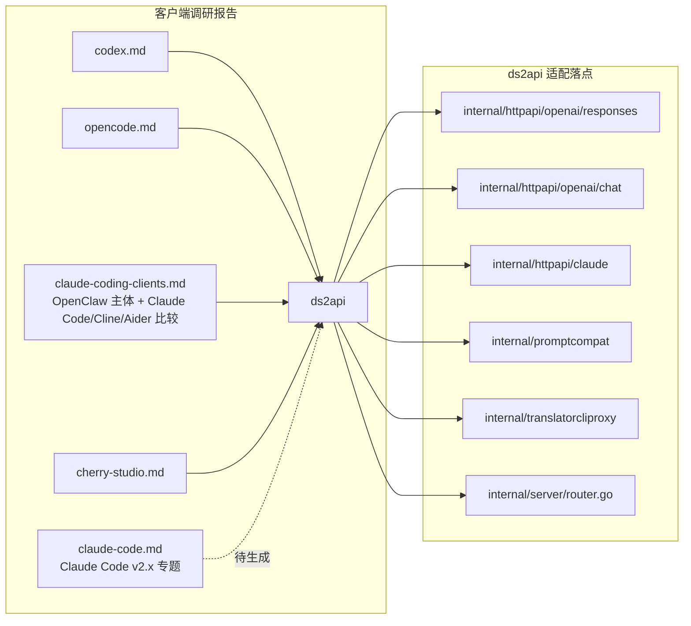

# 客户端兼容性调研

<cite>
**本文档引用的文件**
- [internal/httpapi/openai/responses/handler.go](file://internal/httpapi/openai/responses/handler.go)
- [internal/httpapi/openai/chat/handler.go](file://internal/httpapi/openai/chat/handler.go)
- [internal/httpapi/claude/standard_request.go](file://internal/httpapi/claude/standard_request.go)
- [internal/httpapi/claude/handler_routes.go](file://internal/httpapi/claude/handler_routes.go)
- [internal/promptcompat/responses_input_items.go](file://internal/promptcompat/responses_input_items.go)
- [internal/server/router.go](file://internal/server/router.go)
- [CHANGELOG.md](file://CHANGELOG.md)
</cite>

## 目录

1. [简介](#简介)
2. [项目结构](#项目结构)
3. [核心组件](#核心组件)
4. [客户端报告索引](#客户端报告索引)
5. [P0/P1/P2 适配项](#p0p1p2-适配项)
6. [更新流程](#更新流程)

## 简介

本目录收录的是「下游客户端 → ds2api」适配方向的工程调研报告。每份报告聚焦一个具体客户端（CLI 或桌面 App），覆盖 8 个维度：API 接口面、工具调用格式、流式事件、HTTP 头、模型名约定、推理字段、上下文管理、已知不兼容点；末尾附「ds2api 适配 checklist」。

报告以 Sonnet 4.6 子代理的方式生成，每份独立、可单独阅读，互相不重复。本 README 用于汇总索引、共性分类与状态跟踪。

**章节来源**
- [CHANGELOG.md](file://CHANGELOG.md)
- 4 份子报告（见下文）

## 项目结构

**图表来源**
- [docs/client-compat/codex.md](file://docs/client-compat/codex.md)
- [docs/client-compat/opencode.md](file://docs/client-compat/opencode.md)
- [docs/client-compat/claude-coding-clients.md](file://docs/client-compat/claude-coding-clients.md)
- [docs/client-compat/cherry-studio.md](file://docs/client-compat/cherry-studio.md)

## 核心组件

每份报告统一采用如下骨架：

| 节 | 内容 |
|---|---|
| API 接口面 | 客户端使用的端点、HTTP 方法、版本头 |
| 工具调用格式 | OpenAI `tools[]` / Anthropic `tool_use` / Responses 顶层 / MCP 等 |
| 流式行为 | SSE 帧格式、事件序列、`[DONE]` 终止信号 |
| HTTP 头 | `User-Agent`、Authorization、`anthropic-beta`、`OpenAI-Beta` 等 |
| 模型名约定 | 默认值、是否硬编码、可否覆盖 |
| 推理字段 | `reasoning` / `reasoning_effort` / `thinking.budget_tokens` 等 |
| 上下文管理 | `previous_response_id` / `context_management` / 客户端本地拼接 |
| 已知代理不兼容 | LiteLLM / OpenRouter / ds2api 用户报告的具体失败模式 |

末尾「ds2api 适配 checklist」按 P0/P1/P2 标注每项的状态（已实现 / 待实现 / 需确认）。

## 客户端报告索引

| 报告 | 客户端 | 主协议 | 行数 | 状态 |
|---|---|---|---|---|
| [codex.md](file://docs/client-compat/codex.md) | OpenAI 官方 Codex CLI（github.com/openai/codex） | **仅** Responses API（`/v1/responses`） | 482 | v1.0.12 P0 落地 |
| [opencode.md](file://docs/client-compat/opencode.md) | OpenCode（github.com/sst/opencode）—— 终端编码 Agent | OpenAI 兼容 + Anthropic 双路径（Vercel AI SDK） | 367 | v1.0.12 P0 落地 |
| [claude-coding-clients.md](file://docs/client-compat/claude-coding-clients.md) | OpenClaw（github.com/openclaw/openclaw）主体；Claude Code / Cline / Aider 差异点 | Anthropic Messages API | 290 | v1.0.12 P0 落地 |
| [cherry-studio.md](file://docs/client-compat/cherry-studio.md) | Cherry Studio（CherryHQ/cherry-studio）—— Electron 桌面多模型客户端 | OpenAI 兼容（`type=openai` 默认） | 379 | v1.0.12 P0 落地 |
| claude-code.md（待补） | Claude Code v2.x（github.com/anthropics/claude-code，Anthropic 官方 CLI）专题 | Anthropic Messages API | — | 调研中 |

**章节来源**
- [docs/client-compat/codex.md](file://docs/client-compat/codex.md)
- [docs/client-compat/opencode.md](file://docs/client-compat/opencode.md)
- [docs/client-compat/claude-coding-clients.md](file://docs/client-compat/claude-coding-clients.md)
- [docs/client-compat/cherry-studio.md](file://docs/client-compat/cherry-studio.md)

## P0/P1/P2 适配项

汇总 4 份报告的 checklist，按 ds2api 当前实现状态分类：

### 已实现（v1.0.4 ~ v1.0.12）

| 改动 | 来源报告 | 落地版本 | 关键文件 |
|---|---|---|---|
| `mcp_servers` 字段展开为虚拟工具描述 | claude-coding-clients / opencode | v1.0.5 | `internal/httpapi/claude/standard_request.go` |
| `/v1/responses/compact` 返回 501（非 404） | codex | v1.0.12 | `internal/server/router.go` |
| Codex `compaction` / `reasoning` input item 静默跳过 | codex | v1.0.12 | `internal/promptcompat/responses_input_items.go` |
| `/api/messages` + `/api/messages/count_tokens` 路由别名 | opencode / claude-coding-clients | v1.0.12 | `internal/httpapi/claude/handler_routes.go` |
| `/chat/completions` 无 `/v1` 前缀别名 | cherry-studio (#13192) | 历史版本 | `internal/server/router.go` |
| 工具调用完整后立即 finalize（避免上游漏发 `[DONE]` 引发流断） | opencode (AI SDK 6.x) | v1.0.7 | `internal/httpapi/openai/chat/chat_stream_runtime.go` |
| DeepSeek 特殊 token 渗漏清理（全角斜杠、未闭合 DSML、trailing pipe） | claude-coding-clients | v1.0.7 | `internal/httpapi/openai/shared/leaked_output_sanitize.go` |
| 响应缓存 TTL 调长（memory 5m→30m，disk 4h→24h） | cherry-studio | v1.0.12 | 配置层 |
| `stream_options.include_usage` 容忍 | cherry-studio (#11652) | 天然兼容（Go json.Unmarshal 忽略未知字段） | — |
| `betas` / `service_tier` / `reasoningSummary` 等未知顶层字段静默忽略 | 多家 | 天然兼容 | — |

### 待实现（P1）

| 改动 | 来源 | 涉及文件 |
|---|---|---|
| `tool_choice: {type: "any"}` / `{type: "tool", name: X}` 强制工具调用注入 system prompt hint | Claude Code（待 agent 报告确认） | `internal/httpapi/claude/standard_request.go` |
| `anthropic-beta` 头白名单过滤 | claude-coding-clients (LiteLLM `drop_params` 模式) | `internal/httpapi/claude/handler_messages.go` |
| Cherry Studio Extended Thinking + MCP 的 assistant 消息 thinking 块 reorder | cherry-studio (#11404) | `internal/httpapi/claude/handler_utils.go` |
| 多轮历史中 assistant 内嵌 base64 图片 Markdown 截断（防 413） | cherry-studio (#12602) | `internal/promptcompat/message_normalize.go` |

### 待实现（P2）

| 改动 | 来源 | 涉及文件 |
|---|---|---|
| OpenAI 流式 text-part-id 在多轮工具调用第二轮的一致性 | opencode (BerriAI/litellm #26529) | `internal/httpapi/openai/chat/chat_stream_runtime.go` |
| 基于 User-Agent 的客户端识别（`claude-cli/2.x.x`、`codex/0.x.x`、`opencode/x.y.z`） | 多家 | 中间件层（新增） |
| `/v1beta` 前缀双兼容（Cherry Studio 自定义 Gemini 端点） | cherry-studio (#11541) | `internal/httpapi/gemini/handler_routes.go` |
| `previous_response_id` 重建完整 input 历史时，包含已存储的 reasoning / tool_call output items | codex | `internal/httpapi/openai/responses/response_store.go` |

**章节来源**
- 各 client-compat 子文档的 ds2api adaptation checklist

## 更新流程

调研一份新客户端：

1. 派一个 Sonnet 4.6 子代理，prompt 见 `internal/skills/explore-client.md`（如有）或参考前 4 次的 prompt 范式：「8 个维度 + 末尾 ds2api adaptation checklist + 引用 GitHub issue 编号」。
2. 输出文件路径：`docs/client-compat/<client>.md`，Chinese 正文，English code/JSON。
3. 主代理验证 issue 编号 / 字段名等具体声明（避免幻觉），把 P0 项落代码。
4. 在 CHANGELOG 「客户端兼容」段记录该版本所做的适配项。
5. 回到本 README 的「客户端报告索引」追加一行，并在「P0/P1/P2 适配项」对应表格里记录状态。

**章节来源**
- [CHANGELOG.md](file://CHANGELOG.md)
