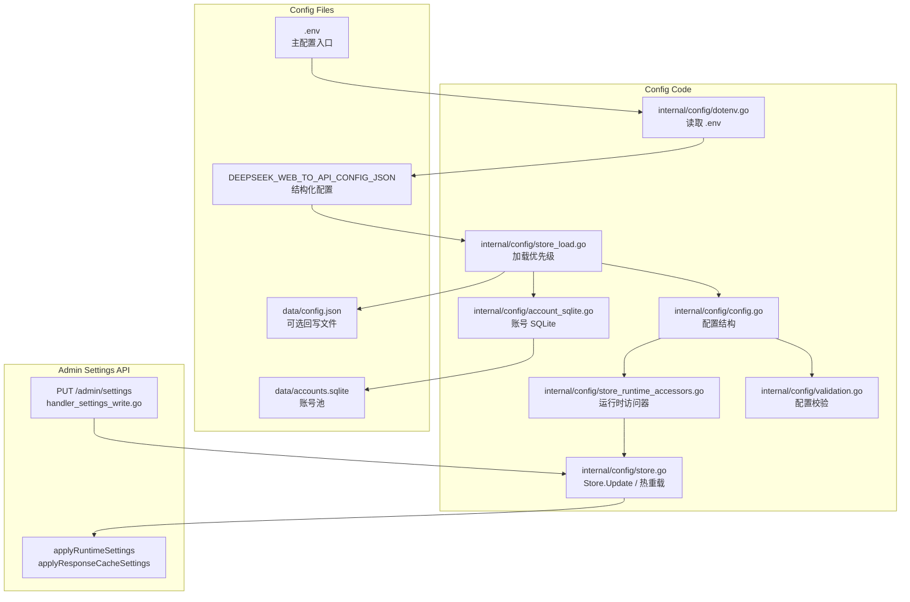
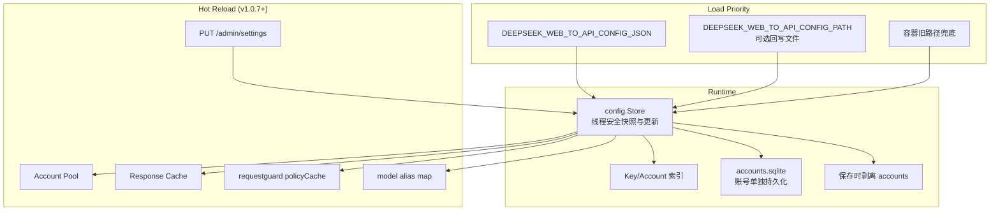

# 配置说明

<cite>
**本文档引用的文件**
- [config.example.json](file://config.example.json)
- [.env.example](file://.env.example)
- [internal/config/config.go](file://internal/config/config.go)
- [internal/config/account.go](file://internal/config/account.go)
- [internal/config/account_sqlite.go](file://internal/config/account_sqlite.go)
- [internal/config/dotenv.go](file://internal/config/dotenv.go)
- [internal/config/store_load.go](file://internal/config/store_load.go)
- [internal/config/store.go](file://internal/config/store.go)
- [internal/config/store_runtime_accessors.go](file://internal/config/store_runtime_accessors.go)
- [internal/config/validation.go](file://internal/config/validation.go)
- [internal/httpapi/admin/settings/handler_settings_write.go](file://internal/httpapi/admin/settings/handler_settings_write.go)
</cite>

## 目录

1. [简介](#简介)
2. [项目结构](#项目结构)
3. [核心组件](#核心组件)
4. [架构总览](#架构总览)
5. [详细组件分析](#详细组件分析)
6. [故障排查指南](#故障排查指南)
7. [结论](#结论)

## 简介

DeepSeek_Web_To_API 当前以 `.env` 作为推荐的单一部署入口：`DEEPSEEK_WEB_TO_API_CONFIG_JSON` 承载结构化运行配置，`DEEPSEEK_WEB_TO_API_ENV_WRITEBACK=true` 时会把初始配置回写到 `DEEPSEEK_WEB_TO_API_CONFIG_PATH`，便于管理台后续热更新。账号池不再要求维护 JSON，管理台批量导入的 `账号:密码` 会写入独立 `accounts.sqlite`。

**热重载（v1.0.7 起全面保障）**：所有 WebUI Settings 变更通过 `PUT /admin/settings` → `Store.Update` → `applyRuntimeSettings` / `applyResponseCacheSettings` 同步到所有组件（Pool、ResponseCache、requestguard policyCache、model alias map），任何配置变更均无需重启服务。配置更新后管理台返回 `{"success":true,"message":"settings updated and hot reloaded"}`。

**章节来源**
- [config.example.json](file://config.example.json)
- [.env.example](file://.env.example)

## 项目结构



**图表来源**
- [.env.example](file://.env.example)
- [internal/config/dotenv.go](file://internal/config/dotenv.go)
- [internal/config/store_load.go](file://internal/config/store_load.go)
- [internal/httpapi/admin/settings/handler_settings_write.go](file://internal/httpapi/admin/settings/handler_settings_write.go)

**章节来源**
- [internal/config/config.go](file://internal/config/config.go)
- [internal/config/store_load.go](file://internal/config/store_load.go)

## 核心组件

- `Config`：包含 API Key、账号、代理、模型别名（`model_aliases`）、Admin、Server、Storage、Cache、Safety、Runtime、Compat、AutoDelete、CurrentInputFile、ThinkingInjection、Responses、Embeddings 等字段。
- `LoadDotEnv`：启动时读取工作目录 `.env`，不覆盖外部已经注入的环境变量。
- `LoadStoreWithError`：读取 `.env` / 环境变量 / 回写文件，归一化凭据、校验配置并建立索引。
- `Store.Update`：线程安全的配置变更接口，WebUI Settings 所有变更经此写入并触发热重载。
- `ConfigPath`：`DEEPSEEK_WEB_TO_API_ENV_WRITEBACK=true` 时作为管理台热更新的持久化文件。
- `DEEPSEEK_WEB_TO_API_CONFIG_JSON`：允许写入原始 JSON、带引号 JSON、`base64:<value>` 或纯 Base64 JSON。
- `accountSQLiteStore`：将账号池迁入 `accounts.sqlite`，保存配置时不再把 `accounts` 写回 JSON。
- `ValidateConfig`：校验代理、Admin、Server、Cache、Runtime、Responses、Embeddings 等配置范围。

**章节来源**
- [internal/config/config.go](file://internal/config/config.go)
- [internal/config/account_sqlite.go](file://internal/config/account_sqlite.go)
- [internal/config/dotenv.go](file://internal/config/dotenv.go)
- [internal/config/store_load.go](file://internal/config/store_load.go)
- [internal/config/store.go](file://internal/config/store.go)
- [internal/config/validation.go](file://internal/config/validation.go)

## 架构总览



**图表来源**
- [internal/config/store.go](file://internal/config/store.go)
- [internal/config/store_load.go](file://internal/config/store_load.go)
- [internal/httpapi/admin/settings/handler_settings_write.go](file://internal/httpapi/admin/settings/handler_settings_write.go)

**章节来源**
- [internal/config/store.go](file://internal/config/store.go)
- [internal/config/codec.go](file://internal/config/codec.go)

## 详细组件分析

### 必填配置

| 配置 | 说明 |
| --- | --- |
| `keys` / `api_keys` | 客户端使用的 API Key，命中后进入托管账号模式 |
| `admin.key` 或 `admin.password_hash` | 管理端登录凭据 |
| `admin.jwt_secret` | 管理端 JWT 签名密钥 |
| `storage.accounts_sqlite_path` / `DEEPSEEK_WEB_TO_API_ACCOUNTS_SQLITE_PATH` | 账号池 SQLite 文件路径 |

### WebUI Settings 热重载（通用）

所有通过 WebUI 控制台"Settings"页面修改的配置项均通过 `PUT /admin/settings` 统一提交，后端 `Store.Update` 写入后立即推送到各组件——无需重启服务。支持热重载的配置域：

| 域 | 涵盖字段 | 生效组件 |
| --- | --- | --- |
| `safety.*` | `banned_content[]`、`banned_regex[]`、`jailbreak.{enabled,patterns[]}`、`auto_ban.{enabled,threshold,window_seconds}`、`blocked_ips[]`、`allowed_ips[]`、`blocked_conversation_ids[]` | requestguard policyCache、safety SQLite 镜像写入 |
| `cache.response.*` | `memory_ttl_seconds`、`disk_ttl_seconds`、`memory_max_bytes`、`disk_max_bytes`、`max_body_bytes`、`semantic_key`、`dir` | ResponseCache（`ApplyOptions`） |
| `runtime.*` | `account_max_inflight`、`account_max_queue`、`global_max_inflight`、`token_refresh_interval_hours` | Account Pool（`ApplyRuntimeLimits`） |
| `current_input_file.*` | `enabled`、`min_chars` | 请求预处理 |
| `thinking_injection.*` | `enabled`、`prompt` | 请求预处理 |
| `auto_delete.*` | `mode`、`sessions` | 历史自动清理 |
| `model_aliases` | operator 自定义 model 映射（map[string]string） | model alias map（每请求读取最新快照） |
| `blocked_ips` / `allowed_ips` / `blocked_conversation_ids` | IP/会话维度访问控制 | requestguard policyCache |

> **v1.0.10 变更**：客户端传入的 model id 不在 `DefaultModelAliases` 或 `model_aliases` 中时返回 4xx，不再进行试探性 fallback。

### 运行建议

- 反代部署时将 `server.bind_addr` 设置为 `127.0.0.1`，由 Caddy/Nginx 暴露公网端口；Docker Compose 会通过环境变量覆盖为 `0.0.0.0`。
- 容器部署时保留容器内 `server.port=5001`，只通过 Compose 的宿主机端口映射调整外部端口。
- 账号不再需要写入 JSON；在管理台"批量导入"中粘贴 `账号:密码` 文本即可写入 `accounts.sqlite`。
- 若旧 JSON 中仍有 `accounts`，账号 SQLite 为空时会自动迁移，随后保存配置时会剥离 `accounts` 字段；兼容旧导入格式中把邮箱误写到 `mobile` 字段的账号，加载和导入时会自动归一到 `email`。
- 账号 token 不写回结构化配置文件；运行态 token 保存在账号 SQLite 中。
- 代理只支持 `socks5` 与 `socks5h`，账号的 `proxy_id` 必须引用已存在代理。

### 缓存配置（完整热重载）

| 配置 | 默认 | 备注 |
| --- | --- | --- |
| `cache.response.memory_ttl_seconds` | **`1800`**（v1.0.12 起，原 300） | 30 分钟内重发的相同请求命中；WebUI 修改后实时生效 |
| `cache.response.memory_max_bytes` | `3800000000` | 内存层 3.8 GB 上限 |
| `cache.response.disk_ttl_seconds` | **`86400`**（v1.0.12 起，原 14400） | 24 小时磁盘 fallback；WebUI 修改后实时生效 |
| `cache.response.disk_max_bytes` | `16000000000` | 磁盘层 16 GB 上限 |
| `cache.response.max_body_bytes` | `67108864` | 单条响应 64 MB 上限，超过不入缓存 |
| `cache.response.semantic_key` | `true` | 启用语义化键（忽略 `cache_control`/`metadata`/`seed`/会话级 ID 等传输字段） |

> **v1.0.7 修复说明**：之前路径级别存在硬编码 TTL 覆盖 Store 配置的 bug，导致 WebUI 修改 TTL 后 `/admin/metrics/overview.cache` 数值更新但实际缓存行为不变。v1.0.7 已移除路径级 TTL 覆盖（`internal/responsecache/path_policy.go`），现在 Store 配置是唯一 TTL 权威来源，修改即时反映到实际缓存行为。

### 安全配置（全量热重载）

所有 `safety.*` 字段通过 `PUT /admin/settings` 热重载。修改后，requestguard 在下一个请求时读取最新策略快照，同时写入镜像 SQLite（`safety_words.sqlite` / `safety_ips.sqlite`）。

| 配置 | 默认 | 说明 |
| --- | --- | --- |
| `safety.banned_content[]` | `[]` | 精确内容黑名单（字符串列表） |
| `safety.banned_regex[]` | `[]` | 正则黑名单 |
| `safety.jailbreak.enabled` | `false` | 是否启用越狱检测 |
| `safety.jailbreak.patterns[]` | `[]` | 越狱检测模式列表 |
| `safety.auto_ban.enabled` | `true`（当 `safety.enabled=true`） | 是否开启重复违规自动拉黑 |
| `safety.auto_ban.threshold` | `3` | 滑动窗口内累计触发次数阈值 |
| `safety.auto_ban.window_seconds` | `600` | 滑动窗口时长（秒，默认 10 分钟） |
| `safety.blocked_ips[]` | `[]` | IP 黑名单；命中直接拦截，不进入内容扫描 |
| `safety.allowed_ips[]` | `[]` | IP 白名单；命中触发违规仍被拦截但不自动拉黑 |
| `safety.blocked_conversation_ids[]` | `[]` | 会话 ID 黑名单 |

### 模型别名（model_aliases，v1.0.10 严格化）

`model_aliases` 是 operator 自定义的 `map[string]string`，将客户端传入的 model id 映射到内部模型标识。通过 WebUI Settings 修改后立即热重载到 model alias map。

**v1.0.10 起**：客户端传入的 model id 不在 `DefaultModelAliases` 或 `model_aliases` 中时返回 4xx，不再进行试探性 heuristic fallback。

### 存储路径（v1.0.5 / v1.0.11 新增）

| 配置 | 默认 | 引入版本 |
| --- | --- | --- |
| `storage.accounts_sqlite_path` | `data/accounts.sqlite` | 早期 |
| `storage.chat_history_sqlite_path` | `data/chat_history.sqlite` | 早期 |
| `storage.chat_history_path` | `data/chat_history.json` | 早期（旧 JSON 导入源） |
| `storage.token_usage_sqlite_path` | `data/token_usage.sqlite` | **v1.0.5** |
| `storage.safety_words_sqlite_path` | `data/safety_words.sqlite` | **v1.0.11** |
| `storage.safety_ips_sqlite_path` | `data/safety_ips.sqlite` | **v1.0.11** |
| `storage.raw_stream_sample_root` | `tests/raw_stream_samples` | 早期 |

每个存储独立，可单独备份/轮转/清空。

### 服务器开关（v1.0.6 / v1.0.9 新增）

| 配置 | 默认 | 引入版本 | 备注 |
| --- | --- | --- | --- |
| `server.http_total_timeout_seconds` | `7200` | **v1.0.6** | 替代之前硬编码 120s；Pro 模型长流式必备 |
| `server.remote_file_upload_enabled` | `false` | **v1.0.9** | 关掉时附件 inline 文本注入；打开时回退到调用上游 `upload_file`（受账号速率限制） |

### `.env` CONFIG_JSON 形态（v1.0.11 起统一）

`DEEPSEEK_WEB_TO_API_CONFIG_JSON` 推荐使用**单引号包裹的明文紧凑 JSON**：

```bash
DEEPSEEK_WEB_TO_API_CONFIG_JSON='{"api_keys":[...],"admin":{...},"server":{...},...}'
DEEPSEEK_WEB_TO_API_ENV_WRITEBACK=true
DEEPSEEK_WEB_TO_API_CONFIG_PATH=data/config.json
```

也支持 `base64:<value>` 兼容形式（管理台导出的 base64 字符串可直接粘贴）。`config.example.json` 是 `.env.example` 中 CONFIG_JSON 的展开版，二者字段集合**逐字段等价**（自动校验脚本：`python3 -c "import json,re;..."`）。

**章节来源**
- [config.example.json](file://config.example.json)
- [internal/config/store_runtime_accessors.go](file://internal/config/store_runtime_accessors.go)
- [internal/config/validation.go](file://internal/config/validation.go)
- [internal/httpapi/admin/settings/handler_settings_write.go](file://internal/httpapi/admin/settings/handler_settings_write.go)

## 故障排查指南

- 启动失败并提示 `admin credential is missing`：配置 `admin.key` 或 `admin.password_hash`。
- 启动失败并提示 `admin.jwt_secret is required`：配置足够随机的 `admin.jwt_secret`。
- Docker 容器内无法保存配置：确认挂载了 `./data:/app/data`，并设置 `DEEPSEEK_WEB_TO_API_CONFIG_PATH=/app/data/config.json`。
- 批量导入账号失败：优先使用一行一个 `账号:密码`；邮箱账号包含 `@`，手机号账号会归一化为带国家码格式。旧 JSON 里的 `mobile:"user@example.com"` 会被兼容成邮箱账号。
- 代理配置报错：检查 `type` 是否为 `socks5` 或 `socks5h`，端口是否在 `1-65535`。
- WebUI Settings 修改无效（缓存 TTL 未生效）：确认 `PUT /admin/settings` 返回 `{"success":true}`。若仍无效，检查 `/admin/metrics/overview.cache` 中 TTL 字段是否已更新；v1.0.7 之前存在路径级硬编码 TTL bug，升级到 v1.0.7+ 即可修复。
- model id 返回 4xx（v1.0.10+）：客户端传入的 model id 未在 `DefaultModelAliases` 或 `model_aliases` 中。通过 WebUI Settings 添加对应别名，或让客户端使用标准模型 id。

**章节来源**
- [internal/auth/admin.go](file://internal/auth/admin.go)
- [internal/config/validation.go](file://internal/config/validation.go)
- [internal/httpapi/admin/settings/handler_settings_write.go](file://internal/httpapi/admin/settings/handler_settings_write.go)

## 结论

项目配置已经收敛到 `.env` 入口：结构化配置通过 `DEEPSEEK_WEB_TO_API_CONFIG_JSON` 注入，管理台热更新可回写到 `data/config.json`，账号池则单独落到 `data/accounts.sqlite`。这样部署者只需要维护 `.env` 与 `data/`，开发者不再需要同步两份配置文件。

v1.0.7 起热重载覆盖所有 WebUI 可配置项（safety、cache、runtime、model_aliases、current_input_file、thinking_injection、auto_delete 等），任何变更通过 `PUT /admin/settings` 即时生效，无需重启服务。

**章节来源**
- [config.example.json](file://config.example.json)
- [.env.example](file://.env.example)
- [internal/httpapi/admin/settings/handler_settings_write.go](file://internal/httpapi/admin/settings/handler_settings_write.go)
