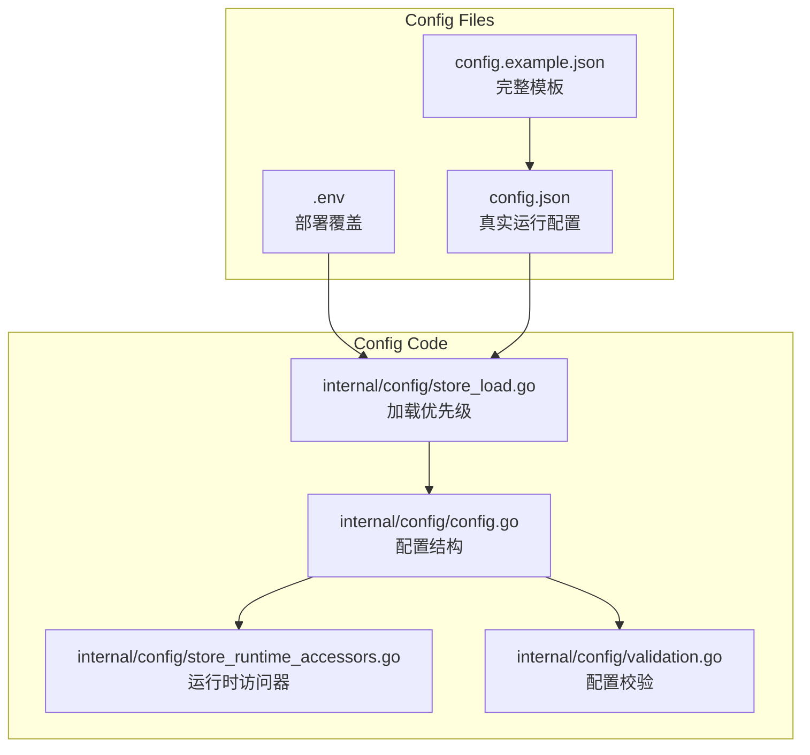
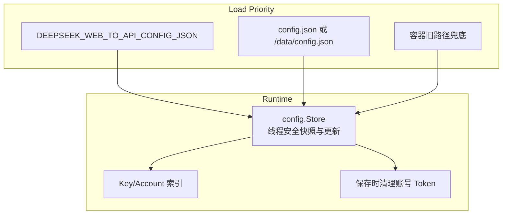

# 配置说明

<cite>
**本文档引用的文件**
- [config.example.json](file://config.example.json)
- [.env.example](file://.env.example)
- [internal/config/config.go](file://internal/config/config.go)
- [internal/config/store_load.go](file://internal/config/store_load.go)
- [internal/config/store_runtime_accessors.go](file://internal/config/store_runtime_accessors.go)
- [internal/config/validation.go](file://internal/config/validation.go)
</cite>

## 目录

1. [简介](#简介)
2. [项目结构](#项目结构)
3. [核心组件](#核心组件)
4. [架构总览](#架构总览)
5. [详细组件分析](#详细组件分析)
6. [故障排查指南](#故障排查指南)
7. [结论](#结论)

## 简介

DeepSeek_Web_To_API 当前以 `config.json` 作为唯一业务配置文件。`.env` 仅用于部署层覆盖，例如 Docker 宿主机端口、配置路径、平台注入配置 JSON、运行时超时等。管理台读取与保存的也是同一份结构化配置，避免多配置文件漂移。

**章节来源**
- [config.example.json](file://config.example.json)
- [.env.example](file://.env.example)

## 项目结构

**图表来源**
- [config.example.json](file://config.example.json)
- [.env.example](file://.env.example)
- [internal/config/store_load.go](file://internal/config/store_load.go)

**章节来源**
- [internal/config/config.go](file://internal/config/config.go)
- [internal/config/store_load.go](file://internal/config/store_load.go)

## 核心组件

- `Config`：包含 API Key、账号、代理、模型别名、Admin、Server、Storage、Cache、Runtime、Compat 等字段。
- `LoadStoreWithError`：读取配置、归一化凭据、校验配置并建立索引。
- `ConfigPath`：默认读取 `config.json`；容器内有 `/data` 时默认使用 `/data/config.json`。
- `DEEPSEEK_WEB_TO_API_CONFIG_JSON`：允许平台注入原始 JSON 或 Base64 JSON。
- `ValidateConfig`：校验代理、Admin、Server、Cache、Runtime、Responses、Embeddings 等配置范围。

**章节来源**
- [internal/config/config.go](file://internal/config/config.go)
- [internal/config/store_load.go](file://internal/config/store_load.go)
- [internal/config/validation.go](file://internal/config/validation.go)

## 架构总览

**图表来源**
- [internal/config/store.go](file://internal/config/store.go)
- [internal/config/store_load.go](file://internal/config/store_load.go)

**章节来源**
- [internal/config/store.go](file://internal/config/store.go)
- [internal/config/codec.go](file://internal/config/codec.go)

## 详细组件分析

### 必填配置

| 配置 | 说明 |
| --- | --- |
| `keys` / `api_keys` | 客户端使用的 API Key，命中后进入托管账号模式 |
| `accounts` | DeepSeek Web 账号，支持 `email` 或 `mobile` |
| `admin.key` 或 `admin.password_hash` | 管理端登录凭据 |
| `admin.jwt_secret` | 管理端 JWT 签名密钥 |

### 运行建议

- 反代部署时将 `server.bind_addr` 设置为 `127.0.0.1`，由 Caddy/Nginx 暴露公网端口。
- 容器部署时保留容器内 `server.port=5001`，只通过 Compose 的宿主机端口映射调整外部端口。
- 账号 token 不写回配置文件；保存配置时会清空账号运行时 token，避免泄漏。
- 代理只支持 `socks5` 与 `socks5h`，账号的 `proxy_id` 必须引用已存在代理。

### 缓存默认值

| 配置 | 默认/示例 |
| --- | --- |
| `cache.response.memory_ttl_seconds` | `300` |
| `cache.response.memory_max_bytes` | `3800000000` |
| `cache.response.disk_ttl_seconds` | `14400` |
| `cache.response.disk_max_bytes` | `16000000000` |
| `cache.response.max_body_bytes` | `67108864` |

**章节来源**
- [config.example.json](file://config.example.json)
- [internal/config/store_runtime_accessors.go](file://internal/config/store_runtime_accessors.go)
- [internal/config/validation.go](file://internal/config/validation.go)

## 故障排查指南

- 启动失败并提示 `admin credential is missing`：配置 `admin.key` 或 `admin.password_hash`。
- 启动失败并提示 `admin.jwt_secret is required`：配置足够随机的 `admin.jwt_secret`。
- Docker 容器内无法保存配置：确认挂载了 `/data/config.json`，并设置 `DEEPSEEK_WEB_TO_API_CONFIG_PATH=/data/config.json`。
- 代理配置报错：检查 `type` 是否为 `socks5` 或 `socks5h`，端口是否在 `1-65535`。

**章节来源**
- [internal/auth/admin.go](file://internal/auth/admin.go)
- [internal/config/validation.go](file://internal/config/validation.go)

## 结论

项目配置已经收敛为单个 `config.json`。真实部署值不应写入示例文件，`.env` 也不应承载长期业务状态；它只负责部署平台必须提前注入的覆盖项。

**章节来源**
- [config.example.json](file://config.example.json)
- [.env.example](file://.env.example)
