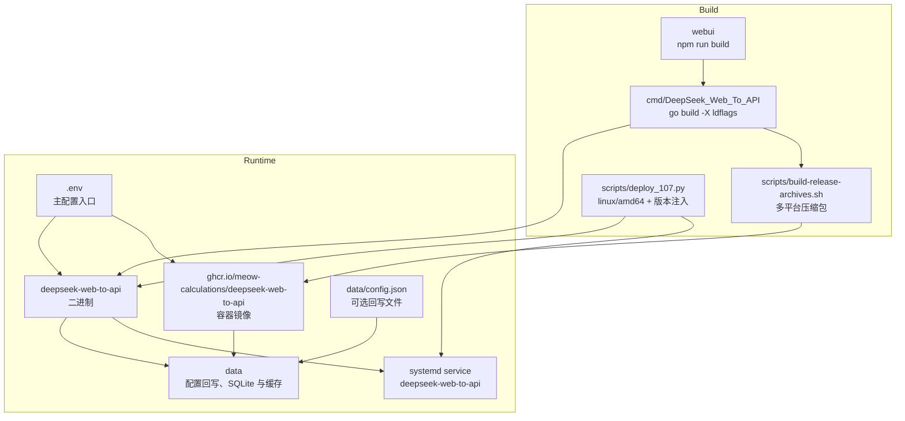
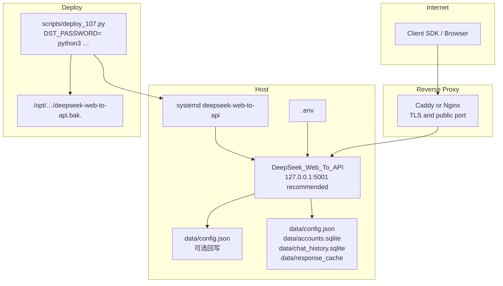

# 部署运维

<cite>
**本文档引用的文件**
- [Dockerfile](file://Dockerfile)
- [docker-compose.yml](file://docker-compose.yml)
- [.env.example](file://.env.example)
- [scripts/build-release-archives.sh](file://scripts/build-release-archives.sh)
- [scripts/deploy_107.py](file://scripts/deploy_107.py)
- [.github/workflows/release-artifacts.yml](file://.github/workflows/release-artifacts.yml)
- [cmd/DeepSeek_Web_To_API/main.go](file://cmd/DeepSeek_Web_To_API/main.go)
- [internal/version/version.go](file://internal/version/version.go)
- [.cnb.yml](file://.cnb.yml)
</cite>

## 目录

1. [简介](#简介)
2. [项目结构](#项目结构)
3. [核心组件](#核心组件)
4. [架构总览](#架构总览)
5. [详细组件分析](#详细组件分析)
6. [故障排查指南](#故障排查指南)
7. [结论](#结论)

## 简介

DeepSeek_Web_To_API 支持源码运行、二进制运行、Docker Compose 和 GitHub Release/GHCR 镜像发布。生产部署推荐使用二进制或 Docker，并放在 Caddy/Nginx 等反代后面。

v1.0.11 起提供 `scripts/deploy_107.py` 一键部署脚本，自动注入版本字符串（`-X` ldflags）、sha256 校验、备份和 systemd 服务管理，确保生产服务的 `/admin/version` 始终报告正确版本而非 `dev`。

> **v1.0.3 ~ v1.0.12 部署侧变更**
>
> - **v1.0.3 CNB CI 增加 PR Docker 构建检查**：`.cnb.yml` 的 `pull_request:` 阶段新增"Docker build (PR check)"步骤，合并请求提交时自动执行 `docker build --no-cache` 验证镜像可构建。Cherry-picked 自 CNB PR #12（已以"已采纳"语义关闭，无需合并冲突解析）。
> - **v1.0.3 重复违规自动拉黑 + 安全 WebUI 修复**：新增 `autoBanTracker`，滑动窗口内超阈值的 IP 自动写入 `safety_ips.blocked_ips`；WebUI 安全策略控制台同步修复（之前列表全空）。详见 [安全说明](file://docs/security.md)。
> - **v1.0.6 Pro 模型 120s 超时已修**：`cmd/DeepSeek_Web_To_API/main.go` 的 `http.Server.{ReadTimeout,WriteTimeout}` 改用 `Store.HTTPTotalTimeout()`（默认 7200s）。CF 套餐自身 100s 限制由 CF 控制，本服务无法绕过；流式调用首字节秒级返回不会触发 CF 524，非流式 + 长推理建议改流式或升级 CF Business+。
> - **v1.0.7 热重载全面修复**：所有 WebUI Settings 变更通过 `PUT /admin/settings` → `Store.Update` 即时生效；缓存 TTL 路径级硬编码 bug 已移除，WebUI 修改后立即反映到实际行为。无需 systemctl restart。
> - **v1.0.8 WebUI 刷新 401 已修**：管理台 JWT 从 `sessionStorage` 改存 `localStorage`（避免 Firefox 硬刷新或部分浏览器恢复标签页清空 token），同时保留 sessionStorage → localStorage 自动迁移以平滑升级旧用户。
> - **v1.0.9 文件上传速率限制已根除**：`server.remote_file_upload_enabled = false`（默认），inline file 与 history transcript 都内联到对话上下文，不再调上游 `upload_file`。生产抽样显示之前 2 小时 4116 次 `upload_file failed` → 升级后 0 次。如有账号配额冗余想恢复上传，设置 `DEEPSEEK_WEB_TO_API_REMOTE_FILE_UPLOAD_ENABLED=true`。
> - **v1.0.11 5 套独立 SQLite 布局**：`data/{accounts,chat_history,token_usage,safety_words,safety_ips}.sqlite` 各自独立，可单独备份/轮转。
> - **v1.0.11 一键部署脚本**：`scripts/deploy_107.py` 自动编译注入版本，确保 `/admin/version` 报告 `source: build-ldflags`。
> - **v1.0.12 缓存 TTL 调长**：内存 5 min → 30 min，磁盘 4 h → 24 h。客户端兼容增强：`/api/messages` 路由别名、`/v1/responses/compact` 501 stub、Codex `compaction` input 容忍。
> - **v1.0.12 429 弹性故障转移**：上游单账号 429 静默切换到下一空闲账号，`/admin/metrics/overview` 失败率更准确。

**章节来源**
- [Dockerfile](file://Dockerfile)
- [docker-compose.yml](file://docker-compose.yml)

## 项目结构



**图表来源**
- [scripts/build-release-archives.sh](file://scripts/build-release-archives.sh)
- [Dockerfile](file://Dockerfile)
- [docker-compose.yml](file://docker-compose.yml)
- [scripts/deploy_107.py](file://scripts/deploy_107.py)

**章节来源**
- [scripts/release-targets.sh](file://scripts/release-targets.sh)
- [.github/workflows/release-artifacts.yml](file://.github/workflows/release-artifacts.yml)

## 核心组件

- Docker 镜像：多阶段构建，前端用 Node 构建，后端用 Go 1.26 构建，运行层使用 Debian slim 非 root 用户。
- Compose 模板：镜像来源为 `ghcr.io/meow-calculations/deepseek-web-to-api:latest`，`.env` 注入初始结构化配置，`./data` 保存回写配置、账号 SQLite、历史记录与缓存。
- Release 脚本：构建 Linux、macOS、Windows 多架构压缩包，并复制 `config.example.json`、`.env.example`、README 与静态管理台。
- HTTP Server：默认端口 `5001`，包含读写超时、请求头超时、空闲超时和优雅退出。
- CNB CI（v1.0.3 新增 PR 阶段）：`.cnb.yml` 配置主分支 push 时构建并推送镜像；PR 阶段运行 `docker build --no-cache` 验证可构建性，不推送。
- **一键部署脚本**（v1.0.11 新增）：`scripts/deploy_107.py` 读取 `VERSION` 文件、编译 linux/amd64 二进制并注入版本字符串、SCP 传输、sha256 校验、备份旧二进制、重启 systemd 服务、验证 `/healthz`，确保 `/admin/version` 报告 `source: build-ldflags`。
- **systemd 服务**：服务名 `deepseek-web-to-api`，二进制位置 `/opt/deepseek-web-to-api/deepseek-web-to-api`，每次部署前旧二进制备份为 `/opt/deepseek-web-to-api/deepseek-web-to-api.bak.<unix-ts>`。

**章节来源**
- [Dockerfile](file://Dockerfile)
- [docker-compose.yml](file://docker-compose.yml)
- [cmd/DeepSeek_Web_To_API/main.go](file://cmd/DeepSeek_Web_To_API/main.go)
- [scripts/deploy_107.py](file://scripts/deploy_107.py)

## 架构总览



**图表来源**
- [cmd/DeepSeek_Web_To_API/main.go](file://cmd/DeepSeek_Web_To_API/main.go)
- [config.example.json](file://config.example.json)
- [scripts/deploy_107.py](file://scripts/deploy_107.py)

**章节来源**
- [config.example.json](file://config.example.json)
- [.env.example](file://.env.example)

## 详细组件分析

### 一键部署（推荐，v1.0.11 起）

`scripts/deploy_107.py` 是面向生产服务器的标准化部署工具，目标主机由环境变量 `DST_HOST` 提供（不在仓库中硬编码）。**依赖**：`pip install paramiko`。

**标准部署**（编译并注入版本）：

```bash
DST_PASSWORD=<root-pwd> python3 scripts/deploy_107.py
```

脚本会：

1. 读取仓库根目录 `VERSION` 文件获取版本字符串（如 `1.0.12`）。
2. 交叉编译 linux/amd64 二进制，编译参数与 `scripts/build-release-archives.sh` 完全一致：

```bash
GOOS=linux GOARCH=amd64 CGO_ENABLED=0 go build \
  -buildvcs=false -trimpath \
  -ldflags="-s -w -X DeepSeek_Web_To_API/internal/version.BuildVersion=<VERSION>" \
  -o build/deepseek-web-to-api-linux-amd64 ./cmd/DeepSeek_Web_To_API
```

3. 通过 SCP 传输到 `/opt/deepseek-web-to-api/deepseek-web-to-api.new`。
4. 远端执行 `sha256sum` 验证完整性，与本地哈希比对。
5. 停止服务 → 备份当前二进制为 `/opt/deepseek-web-to-api/deepseek-web-to-api.bak.<unix-ts>` → 替换 → 启动服务。
6. 验证 `systemctl is-active deepseek-web-to-api` 和 `http://127.0.0.1:5001/healthz`。

**跳过编译**（使用已有 `build/deepseek-web-to-api-linux-amd64`）：

```bash
SKIP_BUILD=1 DST_PASSWORD=<root-pwd> python3 scripts/deploy_107.py
```

`SKIP_BUILD=1` 适用于刚刚本地构建过、无需重复编译的场景；若二进制文件不存在，脚本立即退出报错。

**版本验证**：部署完成后可通过管理台 `/admin/version` 或直接访问 API 确认版本：

```bash
curl -s http://127.0.0.1:5001/admin/version
# 期望: {"current_version":"1.0.12","current_tag":"v1.0.12","source":"build-ldflags"}
```

若 `source` 为 `default`（版本显示 `dev`），表明二进制未注入版本，重新使用 `scripts/deploy_107.py` 完整部署即可修复。

**回滚**：

```bash
mv /opt/deepseek-web-to-api/deepseek-web-to-api.bak.<ts> \
   /opt/deepseek-web-to-api/deepseek-web-to-api
systemctl restart deepseek-web-to-api
```

### Docker Compose

```bash
cp .env.example .env
docker compose up -d
```

关键点：

- 容器内端口保持 `5001`。
- 宿主机端口通过 `.env` 的 `DEEPSEEK_WEB_TO_API_HOST_PORT` 控制。
- 初始结构化配置写在 `.env` 的 `DEEPSEEK_WEB_TO_API_CONFIG_JSON`。
- 持久化目录挂载为 `./data:/app/data`，保存 `config.json` 回写文件、`accounts.sqlite`、历史记录和缓存。

### 二进制手动部署

```bash
npm ci --prefix webui
npm run build --prefix webui
go build -trimpath \
  -ldflags="-s -w -X DeepSeek_Web_To_API/internal/version.BuildVersion=$(cat VERSION)" \
  -o deepseek-web-to-api ./cmd/DeepSeek_Web_To_API
```

> 注意：手动部署时务必加 `-X DeepSeek_Web_To_API/internal/version.BuildVersion=<VERSION>` ldflags，否则 `/admin/version` 将报告 `source: default`（版本为 `dev`）。生产环境应使用 `scripts/deploy_107.py` 或 `scripts/build-release-archives.sh` 保证版本注入。

生产目录建议包含：

- `deepseek-web-to-api`
- `.env`
- `static/admin`
- `data/`

### CNB CI 流水线（v1.0.3 新增 PR 检查）

`.cnb.yml` 定义两条流水线：

| 触发事件 | 阶段 | 操作 |
|---|---|---|
| `main` 分支 push | Docker build | `docker build -t …:latest .` |
| `main` 分支 push | Docker push | 推送到 CNB 内部 registry |
| Pull Request | Docker build (PR check) | `docker build --no-cache -t …:pr-check .`（不推送） |

PR 阶段使用 `--no-cache` 确保每次都是全量构建，避免层缓存掩盖依赖变更。PR #12 的 `pull_request:` 段落已经 cherry-pick 进主分支（`7620954`），PR 以"已采纳"语义在 CNB 上关闭。

**章节来源**
- [.cnb.yml:1-16](file://.cnb.yml#L1-L16)

### systemd 服务期望

| 项目 | 值 |
|---|---|
| 服务名 | `deepseek-web-to-api` |
| 二进制路径 | `/opt/deepseek-web-to-api/deepseek-web-to-api` |
| 工作目录 | `/opt/deepseek-web-to-api/` |
| 健康端口 | `5001`（`http://127.0.0.1:5001/healthz`） |
| 备份文件 | `/opt/deepseek-web-to-api/deepseek-web-to-api.bak.<unix-ts>` |

每次 `scripts/deploy_107.py` 部署均在停服前自动备份当前运行二进制，支持一步回滚。

### 反代建议

如果外部已经由 Caddy/Nginx 提供 HTTPS 与公网监听，`.env` 内的结构化配置建议：

```json
{
  "server": {
    "bind_addr": "127.0.0.1",
    "port": "5001"
  }
}
```

这样应用只监听本机，公网入口由反代负责。

**章节来源**
- [docker-compose.yml](file://docker-compose.yml)
- [.env.example](file://.env.example)
- [cmd/DeepSeek_Web_To_API/main.go](file://cmd/DeepSeek_Web_To_API/main.go)
- [scripts/deploy_107.py](file://scripts/deploy_107.py)

## 故障排查指南

- `/admin` 空白或 404：确认 `static/admin/index.html` 存在，或启用 `server.auto_build_webui` 并安装 Node/npm。
- 容器启动后读取不到配置：确认 `.env` 存在、`DEEPSEEK_WEB_TO_API_CONFIG_JSON` 非空，并挂载 `./data:/app/data`。
- 管理台改动重启后丢失：确认 `DEEPSEEK_WEB_TO_API_ENV_WRITEBACK=true` 且 `DEEPSEEK_WEB_TO_API_CONFIG_PATH=/app/data/config.json` 可写。
- 反代后访问失败：确认应用绑定地址、反代 upstream、CORS 头与超时配置。
- 长流式请求中断：检查反代读写超时是否低于业务请求时间。
- `/admin/version` 显示 `dev`（`source: default`）：部署时未注入版本字符串。使用 `scripts/deploy_107.py` 重新部署，或手动构建时添加 `-X DeepSeek_Web_To_API/internal/version.BuildVersion=<VERSION>` ldflags。
- 部署后服务未启动：查看 `systemctl status deepseek-web-to-api` 和 `journalctl -u deepseek-web-to-api -n 50`。使用备份文件回滚：`mv /opt/deepseek-web-to-api/deepseek-web-to-api.bak.<ts> /opt/deepseek-web-to-api/deepseek-web-to-api && systemctl restart deepseek-web-to-api`。
- `scripts/deploy_107.py` 失败（sha256 不匹配）：SCP 可能传输截断，脚本自动清理 `.new` 文件。检查网络或目标磁盘空间后重试。
- `scripts/deploy_107.py` 失败（`DST_PASSWORD` 未设置）：脚本启动时检查此环境变量，未设置直接退出。

**章节来源**
- [internal/webui/build.go](file://internal/webui/build.go)
- [cmd/DeepSeek_Web_To_API/main.go](file://cmd/DeepSeek_Web_To_API/main.go)
- [scripts/deploy_107.py](file://scripts/deploy_107.py)

## 结论

当前部署模型是标准自托管服务：一个 Go 进程、一个 React 静态管理台、一份 `.env` 入口配置和本地 `data/` 目录。生产环境应通过反代暴露公网，并避免让应用直接监听公网端口。v1.0.11 起 `scripts/deploy_107.py` 是推荐的生产部署方式，通过 `-X` ldflags 版本注入保证 `/admin/version` 始终报告准确版本；每次部署自动备份旧二进制，支持一步回滚。

**章节来源**
- [Dockerfile](file://Dockerfile)
- [docker-compose.yml](file://docker-compose.yml)
- [scripts/deploy_107.py](file://scripts/deploy_107.py)
