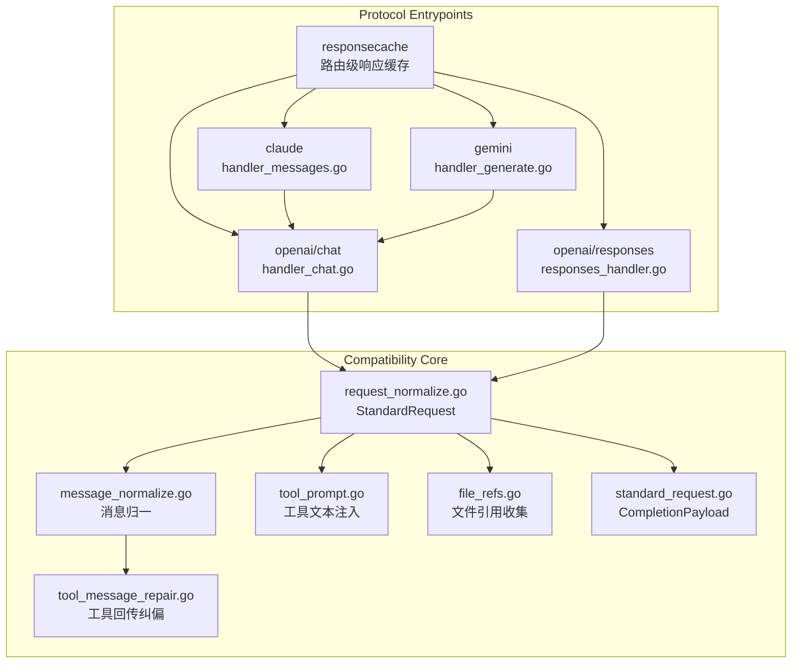
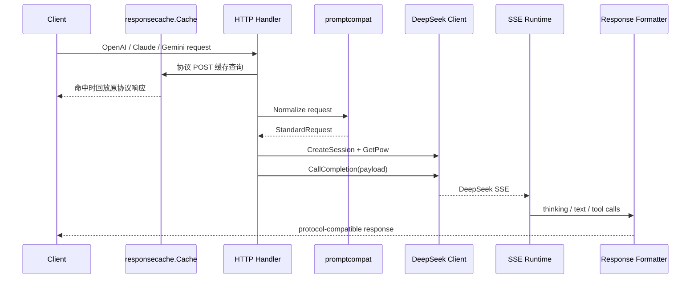

# API 到网页对话纯文本兼容主链路

<cite>
**本文档引用的文件**
- [internal/promptcompat/request_normalize.go](file://internal/promptcompat/request_normalize.go)
- [internal/promptcompat/standard_request.go](file://internal/promptcompat/standard_request.go)
- [internal/promptcompat/prompt_build.go](file://internal/promptcompat/prompt_build.go)
- [internal/promptcompat/message_normalize.go](file://internal/promptcompat/message_normalize.go)
- [internal/promptcompat/tool_message_repair.go](file://internal/promptcompat/tool_message_repair.go)
- [internal/promptcompat/responses_input_normalize.go](file://internal/promptcompat/responses_input_normalize.go)
- [internal/promptcompat/tool_prompt.go](file://internal/promptcompat/tool_prompt.go)
- [internal/promptcompat/file_refs.go](file://internal/promptcompat/file_refs.go)
- [internal/promptcompat/thinking_injection.go](file://internal/promptcompat/thinking_injection.go)
- [internal/config/paths.go](file://internal/config/paths.go)
- [internal/responsecache/cache.go](file://internal/responsecache/cache.go)
- [internal/httpapi/openai/responses/cache_replay.go](file://internal/httpapi/openai/responses/cache_replay.go)
- [internal/server/router.go](file://internal/server/router.go)
- [internal/httpapi/openai/chat/handler_chat.go](file://internal/httpapi/openai/chat/handler_chat.go)
- [internal/httpapi/openai/responses/responses_handler.go](file://internal/httpapi/openai/responses/responses_handler.go)
- [internal/httpapi/openai/shared/upstream_error.go](file://internal/httpapi/openai/shared/upstream_error.go)
- [internal/httpapi/openai/shared/leaked_output_sanitize.go](file://internal/httpapi/openai/shared/leaked_output_sanitize.go)
- [internal/httpapi/claude/standard_request.go](file://internal/httpapi/claude/standard_request.go)
- [internal/httpapi/claude/handler_utils.go](file://internal/httpapi/claude/handler_utils.go)
- [internal/httpapi/claude/stream_runtime_core.go](file://internal/httpapi/claude/stream_runtime_core.go)
- [internal/httpapi/claude/stream_runtime_finalize.go](file://internal/httpapi/claude/stream_runtime_finalize.go)
- [internal/format/claude/render.go](file://internal/format/claude/render.go)
- [internal/sse/consumer.go](file://internal/sse/consumer.go)
- [internal/toolcall/tool_prompt.go](file://internal/toolcall/tool_prompt.go)
- [internal/toolstream/tool_sieve_core.go](file://internal/toolstream/tool_sieve_core.go)
</cite>

## 目录
1. [简介](#简介)
2. [项目结构](#项目结构)
3. [核心组件](#核心组件)
4. [架构总览](#架构总览)
5. [详细组件分析](#详细组件分析)
6. [依赖分析](#依赖分析)
7. [性能考虑](#性能考虑)
8. [故障排查指南](#故障排查指南)
9. [结论](#结论)

## 简介

本文件是 DeepSeek_Web_To_API “结构化 API 请求到 DeepSeek 网页对话纯文本上下文”链路的维护入口。凡是修改协议响应缓存、消息标准化、tool prompt 注入、prompt 可见工具历史、文件引用、current input file、history capture、completion payload、SSE 解析或空回复补偿重试，都必须同步更新本文档。

核心结论：下游 DeepSeek Web completion 不接收 OpenAI、Claude 或 Gemini 的原生会话结构；DeepSeek_Web_To_API 会先在路由层尝试协议响应缓存命中，未命中时把这些输入转换成 `StandardRequest`，再输出 `prompt`、`ref_file_ids`、`thinking_enabled`、`search_enabled` 和少量 passthrough 参数。

**章节来源**
- [cache.go:131-181](file://internal/responsecache/cache.go#L131-L181)
- [request_normalize.go:16-156](file://internal/promptcompat/request_normalize.go#L16-L156)
- [standard_request.go:1-89](file://internal/promptcompat/standard_request.go#L1-L89)

## 项目结构

**图表来源**
- [router.go:72-87](file://internal/server/router.go#L72-L87)
- [cache.go:184-208](file://internal/responsecache/cache.go#L184-L208)
- [handler_chat.go:21-154](file://internal/httpapi/openai/chat/handler_chat.go#L21-L154)
- [responses_handler.go:51-175](file://internal/httpapi/openai/responses/responses_handler.go#L51-L175)
- [request_normalize.go:16-156](file://internal/promptcompat/request_normalize.go#L16-L156)
- [standard_request.go:42-89](file://internal/promptcompat/standard_request.go#L42-L89)

**章节来源**
- [prompt_build.go:1-25](file://internal/promptcompat/prompt_build.go#L1-L25)
- [file_refs.go:1-94](file://internal/promptcompat/file_refs.go#L1-L94)

## 核心组件

- `NormalizeOpenAIChatRequest`：要求 `model` 和 `messages`，解析模型别名、thinking/search 默认值、`tool_choice`、tools、stream、文件引用和 passthrough 参数。
- `responsecache.Cache`：在进入协议 handler 前按调用方和请求摘要查找缓存；内存层 5 分钟且最多 3.8GB，gzip 磁盘层 4 小时且最多 16GB，覆盖 OpenAI、Claude/Anthropic、Gemini 协议 POST 请求，并向 Admin metrics 暴露总查询命中率、可缓存命中/未命中率、不可缓存未命中原因和写入次数。总览页默认展示可缓存口径，避免上游错误或客户端取消把缓存判断拉低。
- `NormalizeOpenAIResponsesRequest`：支持 Responses 的 `input`、`messages` 和 `instructions`，并复用 OpenAI prompt builder。
- `StandardRequest.CompletionPayload`：把标准请求落成 DeepSeek completion payload，设置 `chat_session_id`、`model_type`、`parent_message_id`、`prompt`、`ref_file_ids`、thinking/search 控制位。
- `CompletionErrorDetail`：把 DeepSeek completion 的取消、超时、网络错误和上游 HTTP 状态拆成可观测的协议错误；客户端取消记为 `499/client_cancelled` 并把聊天历史标记为 `stopped`，不再折叠成“上游 5xx”。
- `NormalizeOpenAIMessagesForPrompt`：将 system/developer/user/assistant/tool/function 归一为 prompt 可见消息，其中 assistant reasoning 和历史 tool calls 会被转为文本块。
- `normalizeClaudeRequest` / `normalizeClaudeMessages`：将 Claude / Claude Code 的顶层 `system` 字符串或 text block 数组并入 prompt，忽略 `betas`、`context_management`、`cache_control`、`cache_edits` 等传输型缓存字段；`thinking` 历史会转为 prompt 可见标签，`tool_reference` 会转成安全文本占位，空 `tool_result` 会补充“无输出”占位，避免模型在工具结果尾部误判轮次边界。
- `repairOpenAIToolMessages`：在进入 prompt 之前修复客户端工具链回传偏差，包括 tool 结果缺少或错填 `tool_call_id`、把 tool result 错放进 `user` 消息、Anthropic 风格 `tool_use/tool_result` 混入 OpenAI 消息、以及 `arguments` 为对象而非字符串的情况；无法可靠推断时保留内容而不拒绝请求，避免会话中断。
- `CleanVisibleOutput` / `LeakedToolResultStreamFilter`：统一移除 DeepSeek/Claude 内部边界 token 泄漏。非流式清洗完整或悬空的 `<｜tool_result｜>...<｜end▁f▁of▁tool_result｜>` 块；Claude native stream 额外用状态机处理跨 SSE 分片的 `tool_result` 泄漏，避免工具结果边界和内部输出作为正文展示。
- `injectToolPrompt`：把当前请求声明的工具 schema 注入 system prompt，并按照 `tool_choice` 过滤或强制工具。
- `claudeStreamRuntime` / `format/claude.BuildMessageResponse`：Claude native stream 在请求带 tools 时仍必须实时发送普通正文 `text_delta`；只有识别为 DSML/XML 工具调用的片段会被 `toolstream` 缓冲并在收尾阶段还原成 Claude `tool_use` block。流式和非流式工具输出都会按请求工具 schema 归一参数类型，并使用纳秒级 `toolu_...` ID，降低 Claude Code 多轮快速工具调用时的 ID 碰撞风险。
- `CollectOpenAIRefFileIDs`：从顶层字段、attachments、messages、input、content 等容器中收集文件 ID，但避免把普通字符串内容误判成文件。

**章节来源**
- [cache.go:41-181](file://internal/responsecache/cache.go#L41-L181)
- [cache.go:210-272](file://internal/responsecache/cache.go#L210-L272)
- [request_normalize.go:16-156](file://internal/promptcompat/request_normalize.go#L16-L156)
- [standard_request.go:42-89](file://internal/promptcompat/standard_request.go#L42-L89)
- [upstream_error.go:1-137](file://internal/httpapi/openai/shared/upstream_error.go#L1-L137)
- [leaked_output_sanitize.go:1-221](file://internal/httpapi/openai/shared/leaked_output_sanitize.go#L1-L221)
- [standard_request.go:18-68](file://internal/httpapi/claude/standard_request.go#L18-L68)
- [handler_utils.go:12-306](file://internal/httpapi/claude/handler_utils.go#L12-L306)
- [message_normalize.go:1-162](file://internal/promptcompat/message_normalize.go#L1-L162)
- [tool_message_repair.go:1-376](file://internal/promptcompat/tool_message_repair.go#L1-L376)
- [tool_prompt.go:1-66](file://internal/promptcompat/tool_prompt.go#L1-L66)
- [file_refs.go:1-94](file://internal/promptcompat/file_refs.go#L1-L94)

## 架构总览

**图表来源**
- [router.go:72-87](file://internal/server/router.go#L72-L87)
- [cache.go:131-181](file://internal/responsecache/cache.go#L131-L181)
- [handler_chat.go:21-154](file://internal/httpapi/openai/chat/handler_chat.go#L21-L154)
- [client_auth.go:53-160](file://internal/deepseek/client/client_auth.go#L53-L160)
- [client_completion.go:15-89](file://internal/deepseek/client/client_completion.go#L15-L89)
- [consumer.go:21-119](file://internal/sse/consumer.go#L21-L119)

**章节来源**
- [handler_chat.go:21-320](file://internal/httpapi/openai/chat/handler_chat.go#L21-L320)
- [responses_handler.go:51-300](file://internal/httpapi/openai/responses/responses_handler.go#L51-L300)

## 详细组件分析

### 消息与 prompt

OpenAI Chat 与 Responses 先归一为消息序列。进入 prompt 前会先执行工具链纠偏：缺失或错填的 `tool_call_id` 会按最近未匹配的 assistant `tool_calls` 回填，误放在 `user.content` 中的 `tool_result/function_call_output` 会拆成 `tool` 消息，Anthropic 风格 `tool_use/tool_result` 会转成 OpenAI 兼容形状。随后 `developer` 会并入 `system`；assistant 的 `reasoning_content` 会进入 `[reasoning_content]` 标签块；历史 `tool_calls` 会通过 `prompt.FormatToolCallsForPrompt` 进入 prompt 可见文本；tool/function 结果会作为 `tool` role 文本保留。Claude / Claude Code 路径会额外把顶层 `system` text block 数组归一为系统文本，过滤 cache/beta/context-management 传输字段，并将 `tool_reference`、空工具结果、历史 `thinking` 转成 DeepSeek prompt 可理解的安全文本。最终 prompt 由 `prompt.MessagesPrepareWithThinking` 生成 DeepSeek 风格角色标记。

### 协议响应缓存

缓存层位于 `chi` 路由中间件中，比协议 handler 更早执行。它会接收小于缓存上限的协议 POST 请求；有明确 `Content-Length` 且超过上限时直接跳过，未知长度或 chunked 请求会通过“最多读取上限 +1 字节”判断是否可缓存，超限时会把已读前缀和剩余 body 拼回下游，避免吞掉请求体。缓存 key 按调用方、方法、协议归一路径、规范化查询、影响输出的请求头和请求体摘要生成，OpenAI root alias、双 `/v1` alias 与 Claude/Anthropic alias 会映射到同一语义路径；JSON 请求体会先规范字段顺序和空白，忽略 `metadata`、`user`、`service_tier` 等不影响输出的顶层字段，并递归忽略 Claude / Claude Code 的 `cache_control`、`cache_reference`、`context_management`、`cache_edits`、`betas` 等传输型缓存字段，但保留真实 JSON `null`，避免把语义空值和字段缺失合并。命中时直接回放完整响应，未命中才进入后续标准化、DeepSeek 调用和格式化链路。内存层最多占用 3.8GB，磁盘层最多占用 16GB，超限后按过期时间或文件时间淘汰旧缓存。请求带 `Cache-Control: no-cache` / `no-store` 或 `X-DeepSeek-Web-To-API-Cache-Control: bypass` 时会跳过该层；响应为非 2xx、空 body、超上限、`Cache-Control: no-store` 或包含 `Set-Cookie` 时会计入不可缓存未命中原因而不写入缓存。Admin 总览页同时展示总命中率、可缓存命中率和不可缓存未命中比例，用于区分“请求本身不可缓存”和“可复用请求没有命中”。Responses 命中时会从 JSON 或 SSE `response.completed` 中恢复 response 对象并回填本地 store，避免缓存回放后 `GET /v1/responses/{response_id}` 查不到对象。

### Responses 宽输入

Responses 支持 `input` 字符串、数组和对象。数组输入会按 item 类型转成消息，并把无法识别但可字符串化的片段合并为 user fallback；`instructions` 会被 prepend 成 system 消息。

### Tool 调用

工具声明不会原样下发到 DeepSeek，而是被注入 system prompt。提示词优先要求 DSML 外壳：`<|DSML|tool_calls>`、`<|DSML|invoke>`、`<|DSML|parameter>`；解析层同时兼容旧 XML 外壳，并在 Go 与 Node 流式路径中用 sieve 捕获完整工具块，防止未完成工具 XML 泄漏给客户端。输出清洗层会处理上游误吐的 DeepSeek/Claude 特殊 token，尤其是 `<｜tool_result｜>`、`<｜tool_result/>`、`<｜end▁f▁of▁tool_result｜>` 这类畸形工具结果边界；Claude native stream 不能因为请求声明了 tools 就整段缓冲普通正文，正文片段需要边解析边输出，只有真实工具块进入收尾阶段转为 `tool_use`，内部 tool result 泄漏则跨分片抑制。

### 文件引用与 current input file

`ref_file_ids` 汇集显式文件 ID、attachments 和嵌套容器文件引用。OpenAI Chat / Responses 在获取账号后会先预处理 inline file，再应用 current input file，避免大文件或当前输入文件在 prompt 组装阶段丢失。

### thinking 与空回复补偿

模型默认 thinking/search 来自 `config.GetModelConfig`，请求体可覆盖 thinking；`-nothinking` 模型强制关闭 thinking。OpenAI Chat / Responses 会应用 `thinking_injection`，并在可见正文为空、未发现工具调用且非内容过滤时触发一次内部空回复补偿重试。流式链路会在终结阶段补发最终工具调用，不把 thinking fallback 作为普通正文泄漏。补偿重试如果需要切换账号，会重新创建 DeepSeek 会话并获取新 PoW，避免复用旧账号的 `chat_session_id`。

**章节来源**
- [cache.go:131-181](file://internal/responsecache/cache.go#L131-L181)
- [cache.go:184-208](file://internal/responsecache/cache.go#L184-L208)
- [cache.go:244-334](file://internal/responsecache/cache.go#L244-L334)
- [cache.go:798-819](file://internal/responsecache/cache.go#L798-L819)
- [cache.go:907-923](file://internal/responsecache/cache.go#L907-L923)
- [cache.go:1040-1076](file://internal/responsecache/cache.go#L1040-L1076)
- [cache_replay.go:13-75](file://internal/httpapi/openai/responses/cache_replay.go#L13-L75)
- [message_normalize.go:1-162](file://internal/promptcompat/message_normalize.go#L1-L162)
- [standard_request.go:18-68](file://internal/httpapi/claude/standard_request.go#L18-L68)
- [handler_utils.go:12-306](file://internal/httpapi/claude/handler_utils.go#L12-L306)
- [tool_message_repair.go:1-376](file://internal/promptcompat/tool_message_repair.go#L1-L376)
- [responses_input_normalize.go:1-94](file://internal/promptcompat/responses_input_normalize.go#L1-L94)
- [tool_prompt.go:1-66](file://internal/promptcompat/tool_prompt.go#L1-L66)
- [tool_prompt.go:1-249](file://internal/toolcall/tool_prompt.go#L1-L249)
- [tool_sieve_core.go:9-220](file://internal/toolstream/tool_sieve_core.go#L9-L220)
- [leaked_output_sanitize.go:1-221](file://internal/httpapi/openai/shared/leaked_output_sanitize.go#L1-L221)
- [stream_runtime_core.go:139-205](file://internal/httpapi/claude/stream_runtime_core.go#L139-L205)
- [stream_runtime_finalize.go:41-119](file://internal/httpapi/claude/stream_runtime_finalize.go#L41-L119)
- [file_refs.go:1-94](file://internal/promptcompat/file_refs.go#L1-L94)
- [thinking_injection.go:1-73](file://internal/promptcompat/thinking_injection.go#L1-L73)
- [client_completion.go:17-181](file://internal/deepseek/client/client_completion.go#L17-L181)

## 依赖分析

兼容链路依赖 `internal/config` 的模型别名、模型能力表和缓存目录解析，依赖 `internal/auth` 与 `internal/account` 获取调用方身份和账号租约，依赖 `internal/responsecache` 做路由级响应缓存，依赖 `internal/deepseek/client` 完成上游会话与 PoW，依赖 `internal/sse` 与 `internal/stream` 做 DeepSeek SSE 拆解，依赖 `internal/format` 输出 OpenAI/Responses/Claude/Gemini 兼容响应。

**章节来源**
- [paths.go:64-66](file://internal/config/paths.go#L64-L66)
- [cache.go:210-272](file://internal/responsecache/cache.go#L210-L272)
- [models.go:1-210](file://internal/config/models.go#L1-L210)
- [request.go:37-139](file://internal/auth/request.go#L37-L139)
- [client_auth.go:53-160](file://internal/deepseek/client/client_auth.go#L53-L160)
- [consumer.go:21-119](file://internal/sse/consumer.go#L21-L119)

## 性能考虑

主要性能敏感点有四处：协议响应缓存命中率、请求标准化会复制/遍历消息与工具 schema、流式输出需要在 tool sieve 中缓冲潜在工具块、current input file 和 inline file 会引入文件上传与上下文拆分。代码当前通过 5 分钟且最多 3.8GB 的内存缓存、4 小时且最多 16GB 的 gzip 磁盘缓存、请求大小限制、SSE keepalive/idle timeout、tool block 增量检测、账号亲缘绑定与最多 3 次空回复跨账号重试控制风险。缓存排障时优先看“可缓存命中率”：它用命中次数除以命中加成功写入次数，不把上游错误、客户端取消、空响应、`no-store` 或 `Set-Cookie` 响应混入可复用请求口径；“总命中率”保留原始查找口径，用于观察整体流量中有多少请求被缓存直接承接。

**章节来源**
- [cache.go:210-272](file://internal/responsecache/cache.go#L210-L272)
- [cache.go:281-512](file://internal/responsecache/cache.go#L281-L512)
- [handler_chat.go:21-154](file://internal/httpapi/openai/chat/handler_chat.go#L21-L154)
- [engine.go:37-146](file://internal/stream/engine.go#L37-L146)
- [tool_sieve_core.go:9-220](file://internal/toolstream/tool_sieve_core.go#L9-L220)
- [affinity.go:19-160](file://internal/account/affinity.go#L19-L160)

## 故障排查指南

- `request must include 'model' and 'messages'`：OpenAI Chat 缺少必要字段。
- 缓存未命中：先区分 Admin 总览页里的“可缓存命中率”和“不可缓存未命中”。如果不可缓存未命中高，检查上游非 2xx、空响应、超大响应、`no-store` 或 `Set-Cookie`；如果可缓存命中率低，再检查请求体完整上下文、模型、协议版本请求头、`X-DeepSeek-Web-To-API-Target-Account`、`Cache-Control` 和 `X-DeepSeek-Web-To-API-Cache-Control` 是否变化。OpenAI root/双 `/v1` 与 Claude/Anthropic alias 会先归一，Claude `cache_control` / `cache_edits` 等传输字段不会影响 key，命中响应会带 `X-DeepSeek-Web-To-API-Cache`。
- `request must include 'input' or 'messages'`：Responses 宽输入未能归一为消息。
- `tool_choice_violation`：`required` 或 forced tool 策略开启，但最终未解析出允许的工具调用。
- 工具调用后模型重复请求同一个工具：先检查客户端回传是否把工具结果作为 `role:user`、是否漏传或错传 `tool_call_id`、是否把 Claude `tool_result` 直接塞进 OpenAI `content`。兼容层会尽量纠偏，但多工具并发且完全缺少 ID/名称时仍可能需要客户端补足上下文。
- `upstream_empty_output`：上游返回可见正文为空；先检查内容过滤、thinking-only 输出、工具块是否完整、空回复跨账号重试是否触发并耗尽。
- `client_cancelled` / `context_cancelled`：客户端或反代提前断开；聊天历史应显示 `stopped` 与 499，不应计入上游 5xx。
- `upstream_http_status`：DeepSeek completion 返回了非 200；历史错误会保留真实 HTTP 状态与响应摘要，用于区分 429、5xx、风控页和网关错误。
- Claude Code 带 tools 时没有流式文字：检查 `claudeStreamRuntime` 是否仍通过 `toolstream.ProcessChunk` 实时释放普通正文，并确认 `bufferToolContent` 没有把所有正文延迟到 `finalize` 后才发。
- Claude Code 系统提示词失效或模型像“忘了规则”：检查请求的顶层 `system` 是否为 text block 数组，并确认 `normalizeClaudeRequest` 已把数组文本并入 `Standard.Messages` 与 `FinalPrompt`，不要让 `cache_control`、`context_management` 等传输字段进入正文。
- Claude Code MCP / ToolSearch 后模型重复要加载工具：检查 `tool_result.content` 中的 `tool_reference` 是否被转成 prompt-safe 占位，并确认下一轮请求的 `tools` 已包含 Claude Code 发现后的真实工具 schema。
- Claude Code 非流式工具参数类型不对：检查 `format/claude.BuildMessageResponse` 是否收到 `ToolsRaw` 并调用 schema 归一，尤其是 schema 声明为 string 但模型输出 object/number 的字段。
- Claude Code 正文出现 `<｜tool_result｜>` / `<｜end▁f▁of▁tool_result｜>` / `deleted` 等工具结果边界泄漏：检查 `LeakedToolResultStreamFilter` 是否在 `claudeStreamRuntime.emitTextDelta` 前运行，并确认共享 `CleanVisibleOutput` 覆盖非流式输出。

**章节来源**
- [cache.go:184-208](file://internal/responsecache/cache.go#L184-L208)
- [cache.go:669-681](file://internal/responsecache/cache.go#L669-L681)
- [request_normalize.go:16-156](file://internal/promptcompat/request_normalize.go#L16-L156)
- [tool_message_repair.go:1-376](file://internal/promptcompat/tool_message_repair.go#L1-L376)
- [responses_handler.go:176-247](file://internal/httpapi/openai/responses/responses_handler.go#L176-L247)
- [upstream_error.go:1-137](file://internal/httpapi/openai/shared/upstream_error.go#L1-L137)
- [standard_request.go:18-68](file://internal/httpapi/claude/standard_request.go#L18-L68)
- [handler_utils.go:12-306](file://internal/httpapi/claude/handler_utils.go#L12-L306)
- [render.go:12-55](file://internal/format/claude/render.go#L12-L55)
- [stream_runtime_core.go:139-205](file://internal/httpapi/claude/stream_runtime_core.go#L139-L205)

## 结论

DeepSeek_Web_To_API 的兼容主链路以 `StandardRequest` 为中心：所有协议先变成同一套 prompt、文件引用、thinking/search 和工具策略，再由 DeepSeek completion 执行，并在 SSE/非流式收尾阶段还原为客户端期望的协议形状。后续改动应优先确认是否影响 `request_normalize`、`prompt_build`、`tool_prompt`、`file_refs` 或 SSE runtime。

**章节来源**
- [standard_request.go:1-89](file://internal/promptcompat/standard_request.go#L1-L89)
- [API Compatibility System.md](file://docs/API%20Compatibility%20System/API%20Compatibility%20System.md)
