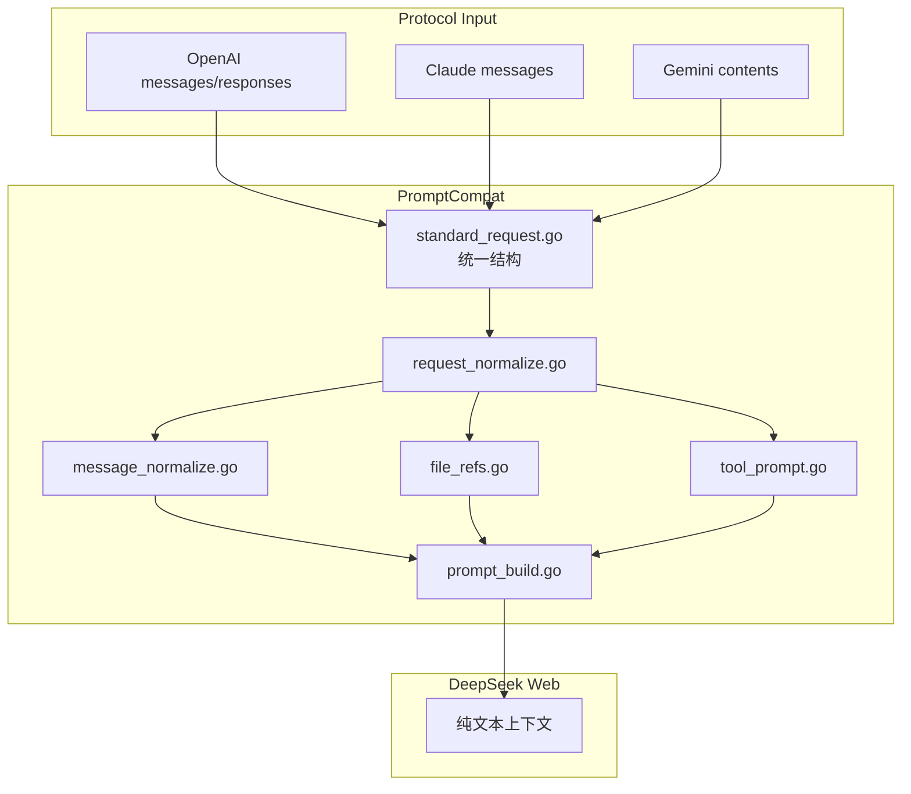
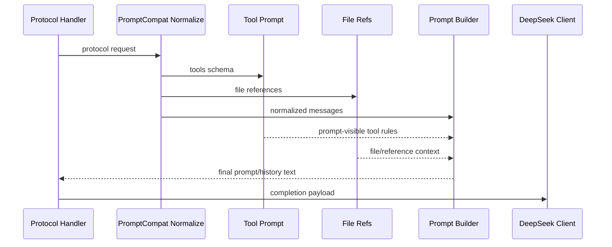

# Prompt 兼容流程

<cite>
**本文档引用的文件**
- [internal/promptcompat/standard_request.go](file://internal/promptcompat/standard_request.go)
- [internal/promptcompat/request_normalize.go](file://internal/promptcompat/request_normalize.go)
- [internal/promptcompat/message_normalize.go](file://internal/promptcompat/message_normalize.go)
- [internal/promptcompat/prompt_build.go](file://internal/promptcompat/prompt_build.go)
- [internal/promptcompat/tool_prompt.go](file://internal/promptcompat/tool_prompt.go)
- [internal/promptcompat/file_refs.go](file://internal/promptcompat/file_refs.go)
</cite>

## 目录

1. [简介](#简介)
2. [项目结构](#项目结构)
3. [核心组件](#核心组件)
4. [架构总览](#架构总览)
5. [详细组件分析](#详细组件分析)
6. [故障排查指南](#故障排查指南)
7. [结论](#结论)

## 简介

本文是仓库内 “API 请求 -> DeepSeek Web 纯文本上下文” 的权威文档。OpenAI、Claude、Gemini 的请求形态不同，但进入 DeepSeek Web 前都需要归一化为统一的标准请求，再构造出系统指令、历史消息、工具说明、文件引用和当前用户输入。

**章节来源**
- [AGENTS.md](file://AGENTS.md)
- [internal/promptcompat/standard_request.go](file://internal/promptcompat/standard_request.go)

## 项目结构

**图表来源**
- [internal/promptcompat/standard_request.go](file://internal/promptcompat/standard_request.go)
- [internal/promptcompat/request_normalize.go](file://internal/promptcompat/request_normalize.go)
- [internal/promptcompat/prompt_build.go](file://internal/promptcompat/prompt_build.go)

**章节来源**
- [internal/httpapi/openai/chat/handler_chat.go](file://internal/httpapi/openai/chat/handler_chat.go)
- [internal/httpapi/claude/convert.go](file://internal/httpapi/claude/convert.go)
- [internal/httpapi/gemini/convert_request.go](file://internal/httpapi/gemini/convert_request.go)

## 核心组件

- `StandardRequest`：协议无关的标准请求对象。
- 消息归一化：把 system、developer、user、assistant、tool 等角色转换为统一消息序列。
- 工具提示注入：把工具定义转换为模型可见的调用格式说明。
- 文件引用处理：把上传文件、当前输入文件和引用片段转成可见上下文。
- 历史转写：把之前的对话和工具结果压成纯文本历史。
- Thinking 注入：可按配置插入额外提示，默认启用但提示内容可为空。

**章节来源**
- [internal/promptcompat/standard_request.go](file://internal/promptcompat/standard_request.go)
- [internal/promptcompat/tool_prompt.go](file://internal/promptcompat/tool_prompt.go)
- [internal/promptcompat/history_transcript.go](file://internal/promptcompat/history_transcript.go)

## 架构总览

**图表来源**
- [internal/promptcompat/prompt_build.go](file://internal/promptcompat/prompt_build.go)
- [internal/promptcompat/file_refs.go](file://internal/promptcompat/file_refs.go)
- [internal/promptcompat/tool_prompt.go](file://internal/promptcompat/tool_prompt.go)

**章节来源**
- [internal/httpapi/openai/shared/thinking_injection.go](file://internal/httpapi/openai/shared/thinking_injection.go)

## 详细组件分析

### OpenAI Chat 与 Responses

OpenAI Chat 使用 `messages`；Responses 可能使用 `input` 字符串、数组或更复杂的 item 结构。兼容层会先转换成标准请求，保留工具、文件和上下文语义，再进入统一 prompt 构建。

### Claude Messages

Claude Messages 的 `system`、`messages`、`tools` 和 `tool_result` 需要转换成同一套标准消息。Claude Code 这类客户端依赖稳定流式输出和工具结果不断会话，因此工具历史必须被转写进 prompt-visible 上下文。

### Gemini Contents

Gemini 的 `contents.parts` 会被转换为文本、文件和工具上下文。`x-goog-api-key` 或 query key 只影响鉴权，不影响 prompt 构建。

**章节来源**
- [internal/httpapi/openai/responses/responses_handler.go](file://internal/httpapi/openai/responses/responses_handler.go)
- [internal/httpapi/claude/standard_request.go](file://internal/httpapi/claude/standard_request.go)
- [internal/httpapi/gemini/convert_messages.go](file://internal/httpapi/gemini/convert_messages.go)

## 故障排查指南

- 模型忘记工具调用结果：检查 tool/result 消息是否进入标准消息序列。
- Claude Code 会话中断：检查流式消息是否被过早 finalize，工具结果是否被识别为独立内容。
- 文件内容没有进入上下文：检查 `/v1/files` 上传结果和 `current_input_file` 配置。
- 输出出现引用噪声：检查 `compat.strip_reference_markers`。

**章节来源**
- [internal/promptcompat/tool_message_repair.go](file://internal/promptcompat/tool_message_repair.go)
- [internal/httpapi/openai/history/current_input_file.go](file://internal/httpapi/openai/history/current_input_file.go)
- [internal/textclean/reference_markers.go](file://internal/textclean/reference_markers.go)

## 结论

PromptCompat 的设计目标是让多协议客户端共享同一套 DeepSeek Web 上下文构造规则。后续凡是修改消息归一化、工具提示、工具历史、文件引用或 completion payload，都必须同步更新本文档。

**章节来源**
- [AGENTS.md](file://AGENTS.md)
