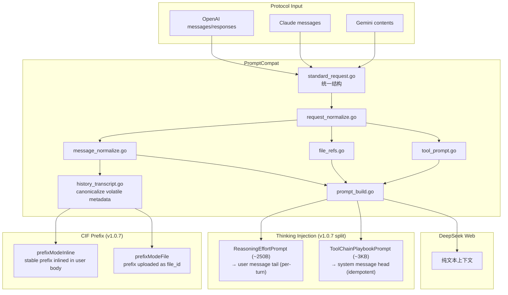
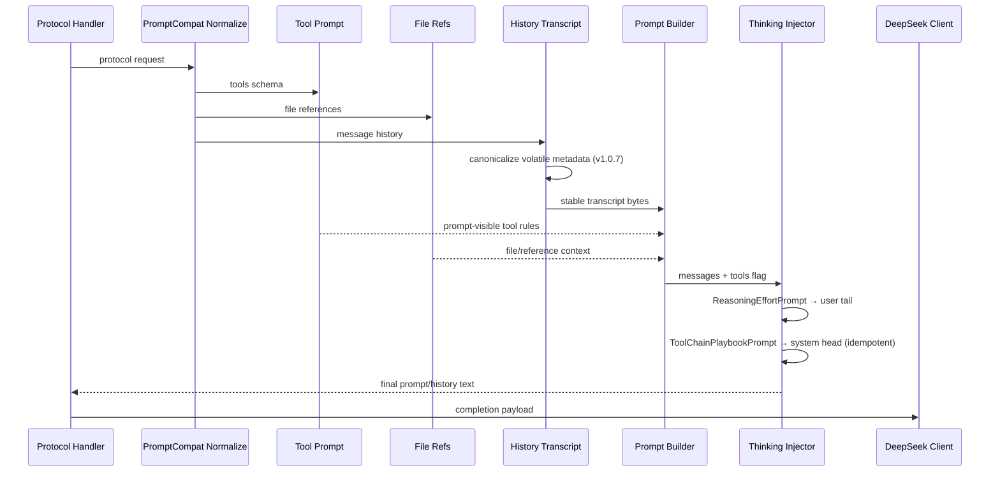

# Prompt 兼容流程

<cite>
**本文档引用的文件**
- [internal/promptcompat/standard_request.go](file://internal/promptcompat/standard_request.go)
- [internal/promptcompat/request_normalize.go](file://internal/promptcompat/request_normalize.go)
- [internal/promptcompat/message_normalize.go](file://internal/promptcompat/message_normalize.go)
- [internal/promptcompat/prompt_build.go](file://internal/promptcompat/prompt_build.go)
- [internal/promptcompat/tool_prompt.go](file://internal/promptcompat/tool_prompt.go)
- [internal/promptcompat/file_refs.go](file://internal/promptcompat/file_refs.go)
- [internal/promptcompat/thinking_injection.go](file://internal/promptcompat/thinking_injection.go)
- [internal/promptcompat/history_transcript.go](file://internal/promptcompat/history_transcript.go)
- [internal/httpapi/openai/history/current_input_prefix.go](file://internal/httpapi/openai/history/current_input_prefix.go)
- [internal/httpapi/openai/shared/thinking_injection.go](file://internal/httpapi/openai/shared/thinking_injection.go)
</cite>

## 目录

1. [简介](#简介)
2. [项目结构](#项目结构)
3. [核心组件](#核心组件)
4. [架构总览](#架构总览)
5. [详细组件分析](#详细组件分析)
6. [故障排查指南](#故障排查指南)
7. [结论](#结论)

## 简介

本文是仓库内 "API 请求 → DeepSeek Web 纯文本上下文" 的权威文档。OpenAI、Claude、Gemini 的请求形态不同，但进入 DeepSeek Web 前都需要归一化为统一的标准请求，再构造出系统指令、历史消息、工具说明、文件引用和当前用户输入。

> **v1.0.5 ~ v1.0.7 关键变更（按版本顺序）**
>
> - **v1.0.5**：Anthropic `mcp_servers` 字段不再被静默丢弃。`expandMCPServersAsTools` 把 `tool_configuration.allowed_tools` 与 `mcp_servers[].tools[]` 展开为 `<server>.<tool>` 命名的虚拟工具描述，注入到 `tools[]`。
> - **v1.0.5**：违禁屏蔽 `collectText` 取消顶层白名单限制，递归扫描所有 map 字段；`/admin /webui /healthz /readyz /static/ /assets/` 路径豁免内容扫描。
> - **v1.0.7 Thinking-Injection 拆分**：`DefaultThinkingInjectionPrompt` 按注入位置一分为二：`ReasoningEffortPrompt`（约 250 字节，per-turn，追加到最新 user message 尾部）和 `ToolChainPlaybookPrompt`（约 3 KB，稳定 playbook，幂等前置到 system message 头部）。详见下方"v1.0.7 Thinking-Injection 拆分"节。
> - **v1.0.7 CIF 内联前缀模式**：新增 `prefixModeInline`，无需上传文件，无 file_id，前缀字节直接内联到 user message 正文。详见下方"v1.0.7 CIF 内联前缀"节。
> - **v1.0.7 规范历史转写**：`BuildOpenAICurrentInputContextTranscript` 剥离 OpenClaw 的"untrusted metadata" JSON fences（message_id / timestamp / timestamp_ms），使前缀字节在各轮次间保持字节稳定。详见下方"v1.0.7 规范历史转写"节。
> - **v1.0.9**：附件改内联模式——`current_input_file.go` 的 `ApplyCurrentInputFile` 不再调上游 `upload_file`（避免账号速率限制），把 transcript 直接拼到 user 消息内容里；开关由 `server.remote_file_upload_enabled` / env `DEEPSEEK_WEB_TO_API_REMOTE_FILE_UPLOAD_ENABLED` 控制（默认 `false`）。
> - **v1.0.12**：Codex Responses API 的 `compaction` / `reasoning` input item 在 `responses_input_items.go` 静默跳过（返回 `nil`，不会被误当作 user content 进入 prompt）。
> - **v1.0.3**：`DefaultThinkingInjectionPrompt` 显著扩写，新增工具链纪律、工具链模式和 MCP 调用规范（详见 v1.0.3 增量节）。

**章节来源**
- [AGENTS.md](file://AGENTS.md)
- [internal/promptcompat/standard_request.go](file://internal/promptcompat/standard_request.go)

## 项目结构



**图表来源**
- [internal/promptcompat/standard_request.go](file://internal/promptcompat/standard_request.go)
- [internal/promptcompat/request_normalize.go](file://internal/promptcompat/request_normalize.go)
- [internal/promptcompat/prompt_build.go](file://internal/promptcompat/prompt_build.go)
- [internal/promptcompat/thinking_injection.go](file://internal/promptcompat/thinking_injection.go)
- [internal/httpapi/openai/history/current_input_prefix.go](file://internal/httpapi/openai/history/current_input_prefix.go)

**章节来源**
- [internal/httpapi/openai/chat/handler_chat.go](file://internal/httpapi/openai/chat/handler_chat.go)
- [internal/httpapi/claude/convert.go](file://internal/httpapi/claude/convert.go)
- [internal/httpapi/gemini/convert_request.go](file://internal/httpapi/gemini/convert_request.go)

## 核心组件

- `StandardRequest`：协议无关的标准请求对象。
- 消息归一化：把 system、developer、user、assistant、tool 等角色转换为统一消息序列。
- 工具提示注入：把工具定义转换为模型可见的调用格式说明。
- 文件引用处理：把上传文件、当前输入文件和引用片段转成可见上下文。
- 历史转写（`BuildOpenAICurrentInputContextTranscript`）：把之前的对话和工具结果压成纯文本历史；**v1.0.7 起剥离 OpenClaw volatile metadata（message_id / timestamp / timestamp_ms），确保前缀字节在各轮次间字节稳定**。
- **Thinking 注入（v1.0.7 拆分）**：
  - `ReasoningEffortPrompt`（~250 字节）：per-turn，通过 `AppendThinkingInjectionPromptToLatestUser` 追加到最新 user message 尾部。功能：对抗上游 fast-path 跳过 thinking 的倾向，提醒模型不要跳过推理。
  - `ToolChainPlaybookPrompt`（~3 KB）：跨 turn 稳定，通过 `PrependPlaybookToSystem` 幂等前置到 system message 头部（与 DSML format RULES 并排）。功能：工具链纪律 + 5 种工作流模式 + MCP 调用规范 + 停止判据。
- CIF 前缀复用（`current_input_prefix.go`）：对长对话建立稳定前缀边界，减少每轮重复传输整个历史；分 inline 和 file 两种模式（见详细分析）。

**章节来源**
- [internal/promptcompat/standard_request.go](file://internal/promptcompat/standard_request.go)
- [internal/promptcompat/tool_prompt.go](file://internal/promptcompat/tool_prompt.go)
- [internal/promptcompat/thinking_injection.go](file://internal/promptcompat/thinking_injection.go)
- [internal/promptcompat/history_transcript.go](file://internal/promptcompat/history_transcript.go)

## 架构总览



**图表来源**
- [internal/promptcompat/prompt_build.go](file://internal/promptcompat/prompt_build.go)
- [internal/promptcompat/file_refs.go](file://internal/promptcompat/file_refs.go)
- [internal/promptcompat/tool_prompt.go](file://internal/promptcompat/tool_prompt.go)
- [internal/httpapi/openai/shared/thinking_injection.go](file://internal/httpapi/openai/shared/thinking_injection.go)

**章节来源**
- [internal/httpapi/openai/shared/thinking_injection.go](file://internal/httpapi/openai/shared/thinking_injection.go)

## 详细组件分析

### v1.0.7 Thinking-Injection 拆分

#### 拆分原因

旧版本（v1.0.6 及更早）将整个 ~3 KB 的 `DefaultThinkingInjectionPrompt` 写入**最新 user message 尾部**，导致两个问题：

1. **重复**：工具链 playbook 已经在 system message 中通过 `BuildToolCallInstructions` 注入了 DSML format 规则，每次请求会携带两份近似规则集，user prompt 被下推约 3 KB。
2. **Fast-path 丢失**：当上游 DeepSeek 走 no-thinking fast path（`thinking_enabled=true` 但返回空 `reasoning_content`）时，写入 user message 尾部的 playbook 被"读"但未"推理"，工作流模式（READ-BEFORE-EDIT 等）被静默跳过，模型直接输出 prose 而非 tool_use 块。

#### 拆分后结构

```
ReasoningEffortPrompt（~250 字节）
→ 追加到最新 user message 尾部（per-turn）
→ 目标：对抗 fast-path，提醒模型进行推理
→ 内容：Reasoning Effort: Absolute maximum + 一句行动指令

ToolChainPlaybookPrompt（~3 KB）
→ 幂等前置到 system message 头部
→ 目标：工具链规则在 fast-path 下仍然生效（system message 不受 reasoning bypass 影响）
→ 内容：工具链纪律 4 条 + 工作流模式 A-E + MCP 调用规范 + 停止判据
```

#### 实现接口

```go
// internal/promptcompat/thinking_injection.go

// ReasoningEffortPrompt 约 250 字节，per-turn
ReasoningEffortPrompt = ThinkingInjectionMarker + "\n" + ...

// ToolChainPlaybookPrompt 约 3 KB，稳定跨 turn
ToolChainPlaybookPrompt = "Tool-Chain Discipline ...\nTool-Chain Patterns ...\nMCP Tool Invocation ...\nStopping Criteria ..."

// internal/httpapi/openai/shared/thinking_injection.go 调用顺序：
next, sysChanged := promptcompat.PrependPlaybookToSystem(messages, promptcompat.ToolChainPlaybookPrompt)
next, userChanged := promptcompat.AppendThinkingInjectionPromptToLatestUser(messages, promptcompat.ReasoningEffortPrompt)
```

`PrependPlaybookToSystem` 幂等：检测 system message 中是否已含 playbook 字符串，若含则不插入，防止每请求重复追加。

### v1.0.7 规范历史转写（Canonical History）

#### 问题根因

OpenClaw（及部分 Claude Code 客户端）在 user message 正文中注入 "untrusted metadata" JSON fence，格式如：

```
Conversation info (untrusted metadata):
```json
{
  "message_id": "msg_abc123",
  "timestamp": "2025-05-07 22:48:01",
  "timestamp_ms": 1746624481000
}
```
```

`message_id`、`timestamp`、`timestamp_ms` 每轮不同，导致历史转写的字节在每次请求时都发生变化——任何以前缀字节为缓存键的机制（无论是 ds2api 的 CIF 前缀还是上游的 prompt-prefix KV Cache）都会在每轮看到不同的字节，永远无法命中。

#### 修复实现

`internal/promptcompat/history_transcript.go`：

- `BuildOpenAICurrentInputContextTranscript`：调用 `buildOpenAIHistoryTranscript(..., canonicalizeVolatileMetadata=true)`。
- `canonicalizeVolatileTranscriptText`：通过正则 `volatileMetadataBlockRE` 匹配 "untrusted metadata" JSON fences（含 `Conversation info` 和 `Sender` 两种变体）。
- `canonicalizeMetadataJSON`：从匹配的 JSON 对象中删除 `message_id`、`timestamp`、`timestamp_ms` 键，保留其余字段，然后以紧凑无空白格式重新序列化，确保每轮同一会话的相同消息内容输出字节完全一致。

效果：同一会话中第 N 轮和第 N+1 轮的历史 transcript（前 N-1 条消息部分）字节完全一致，前缀缓存得以命中。

### v1.0.7 CIF 内联前缀模式（prefixModeInline）

#### 两种模式对比

| 维度 | `prefixModeFile`（旧模式）| `prefixModeInline`（v1.0.7 新增）|
|---|---|---|
| 前缀传递方式 | 上传为文件，凭 file_id 引用 | 字节直接内联到 user message 正文 |
| 依赖 RemoteFileUpload | 是（需 enabled=true）| 否（默认 disabled 时也可用）|
| 账号绑定 | file_id 是 per-account，key 含 accountID | 前缀字节账号无关，key 不含 accountID |
| 规避的风险 | 无 | 跳过 `upload_file` 接口，规避上游账号级速率限制 |
| 默认状态 | 需 `remote_file_upload_enabled=true` 才生效 | v1.0.7 起默认路径 |

#### 内联前缀正文结构（verbatim）

```
[stable prefix bytes — verbatim BuildOpenAICurrentInputContextTranscript 输出，截至某条 transcript 边界]

--- RECENT CONVERSATION TURNS ---

[recent tail bytes — target 32 KB，max 128 KB]

--- INSTRUCTION ---
Everything above the "RECENT CONVERSATION TURNS" marker is stable prior context — treat it as background and do not re-deliberate it. The section below that marker contains the most recent turns including the latest user request. Respond to that latest user request directly.
```

**关键约束**：正文的**第一个字节**必须是稳定前缀的第一个字节，不能有任何前置文本头——否则上游 prompt-prefix KV Cache 的字节前缀匹配每轮都会失败（位置 0 的字节每轮不同）。结构分隔符（`--- RECENT CONVERSATION TURNS ---`）严格插在稳定前缀**之后**，保证前导字节的稳定性。

#### 多变体链（Variants）

每个 session 最多保留 **2 个前缀变体**（`currentInputPrefixMaxVariants = 2`），以 MRU（最近使用）顺序排列：

- 命中时：选择能覆盖当前 fullText 且 tail 不超过 128 KB 的**最长**匹配前缀（最大化被 KV Cache 复用的字节数）；命中的变体提升到队列头部（LRU promote）。
- 刷新时（前缀不再是 fullText 的前缀）：计算新的分割点，将新前缀 prepend 到变体列表，旧前缀降格到第二位（供 agent 对话 summarize+prune 场景回退复用）。

#### 分割点计算

`splitCurrentInputPrefixTail` 支持两种模式：

- **标准模式**（transcript ≥ 32 KB）：从末尾数 32 KB 处开始找最近的 `\n=== ` role block 边界，确保 tail 为约 32 KB 对齐的完整角色块序列。
- **软锚模式**（transcript < 32 KB）：切在最后一个 `\n=== ` 边界之前，prefix = 所有更早内容，tail = 最后一个角色块。短对话第一轮即建立可复用锚点，第二轮起命中前缀。

#### 缓存 key 模式差异

```go
// prefixModeFile: key 含 accountID（file_id per-account，跨 account 重用不安全）
// prefixModeInline: key 不含 accountID（prefix bytes account-agnostic，
//   避免 429 重试链强制换 account 导致每个 account 各自一份 prefix state）
func currentInputPrefixKeyForMode(a *auth.RequestAuth, stdReq, modelType, mode) string
```

### v1.0.3 增量：Thinking-Injection 扩写

`thinking_injection.go` 的 `DefaultThinkingInjectionPrompt`（第 7 行）在原有"最大化推理"基础上追加了三个完整模块：

**工具链纪律（4 条规则）**：① CALL（仅在需要未知信息或外部操作时调用）；② PARALLEL vs SEQUENTIAL（无依赖放同一 `<|DSML|tool_calls>` 块并发）；③ AFTER A RESULT（读结果后链式继续或给最终答案，同参数同工具失败两次后禁止第三次）；④ STOP（请求满足即停止）。

**工具链模式 A-E**：READ-BEFORE-EDIT、SEARCH→NARROW→INSPECT、BASH+DIAGNOSIS、PARALLEL RESEARCH、CONDITIONAL FOLLOW-UP，每种均附完整 DSML 示例。

**MCP 调用规范**：`<server>.<tool>` 点号命名空间调用；参数名来自 `input_schema`；不能臆造未声明 server 名；可与常规工具在同一块并行调用。

**章节来源**
- [internal/promptcompat/thinking_injection.go](file://internal/promptcompat/thinking_injection.go)
- [internal/httpapi/openai/shared/thinking_injection.go](file://internal/httpapi/openai/shared/thinking_injection.go)
- [internal/httpapi/openai/history/current_input_prefix.go](file://internal/httpapi/openai/history/current_input_prefix.go)
- [internal/promptcompat/history_transcript.go](file://internal/promptcompat/history_transcript.go)

## 故障排查指南

- 模型忘记工具调用结果：检查 tool/result 消息是否进入标准消息序列。
- Claude Code 会话中断：检查流式消息是否被过早 finalize，工具结果是否被识别为独立内容。
- 文件内容没有进入上下文：检查 `/v1/files` 上传结果和 `current_input_file` 配置。
- 输出出现引用噪声：检查 `compat.strip_reference_markers`。
- 模型不调用工具链 / 工具调用顺序混乱：确认 `thinking_injection.enabled=true`；v1.0.7 前的旧版本缺少 READ-BEFORE-EDIT 约束顺序明示，升级后会显著改善；v1.0.7 起 ToolChainPlaybookPrompt 在 system message 中，fast-path 场景也能生效。
- MCP 工具不路由到正确服务器：检查调用名是否带 `<server>.` 前缀；未带前缀的工具名不会被路由到 MCP。
- CIF 前缀每轮刷新而非复用：检查 `BuildOpenAICurrentInputContextTranscript` 是否覆盖了 OpenClaw volatile metadata 剥离；若客户端注入 `message_id` / `timestamp` 但使用的是旧版本 ds2api（v1.0.7 前），前缀字节每轮变化，升级后修复。
- `ReasoningEffortPrompt` 被重复注入多次：检查 `AppendThinkingInjectionPromptToLatestUser` 的幂等检测是否生效（依赖 `ThinkingInjectionMarker` 字符串检测）；若 user message 内容不是 string 类型而是 content block 数组，确认 `NormalizeOpenAIContentForPrompt` 能正确合并文本。
- `ToolChainPlaybookPrompt` 每请求都被插入：检查 `PrependPlaybookToSystem` 的幂等检测；函数通过 `strings.Contains(existing, playbook)` 检测已有 playbook，若 playbook 内容版本不一致（旧版 playbook 和新版 playbook 字符串不同）会造成重复插入，升级时需确认历史 system message 不含旧版 playbook 残留。

**章节来源**
- [internal/promptcompat/tool_message_repair.go](file://internal/promptcompat/tool_message_repair.go)
- [internal/httpapi/openai/history/current_input_file.go](file://internal/httpapi/openai/history/current_input_file.go)
- [internal/textclean/reference_markers.go](file://internal/textclean/reference_markers.go)

## 结论

PromptCompat 的设计目标是让多协议客户端共享同一套 DeepSeek Web 上下文构造规则。v1.0.7 在两个维度完成了关键升级：（1）Thinking-Injection 拆分，将稳定 playbook 移入 system message，消除 fast-path 下 playbook 被跳过的问题；（2）canonical history + CIF inline prefix 模式联合确保对话历史前缀在各轮次之间字节稳定，使 CIF 前缀复用率从依赖 file_id 上传的偶发命中提升为在 RemoteFileUpload 默认关闭时也能持续命中。后续凡是修改消息归一化、工具提示、工具历史、文件引用或 completion payload，都必须同步更新本文档。

**章节来源**
- [AGENTS.md](file://AGENTS.md)
