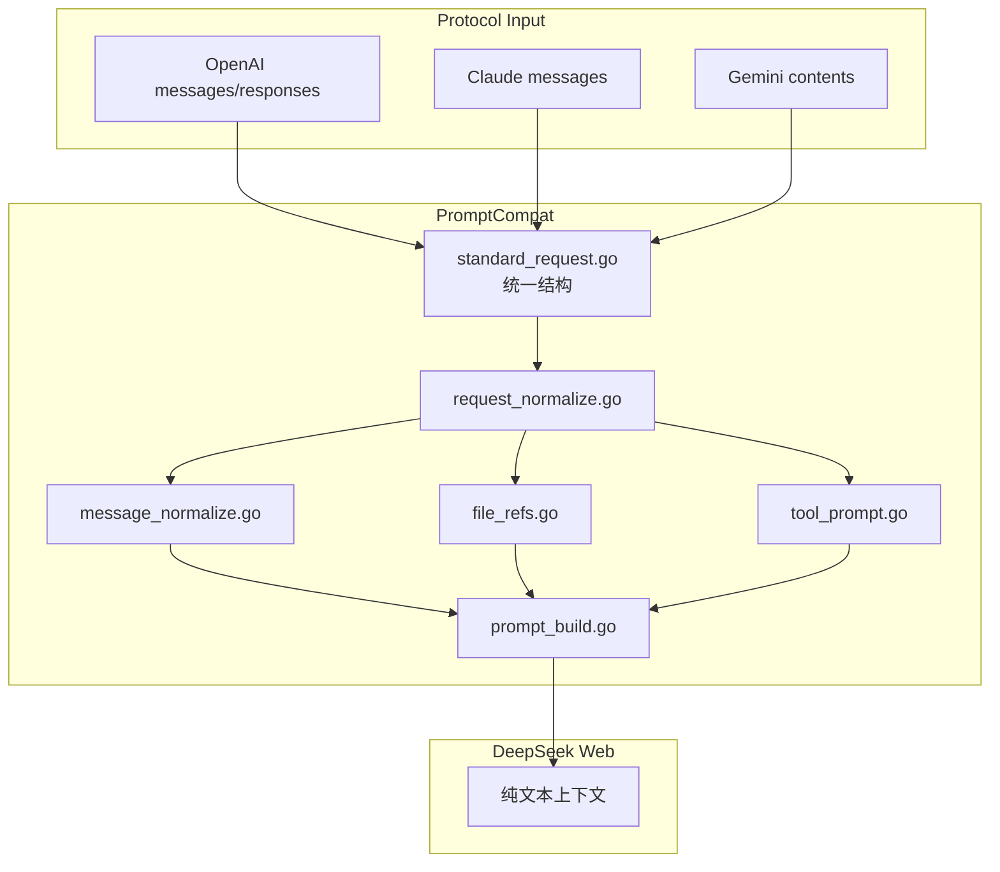
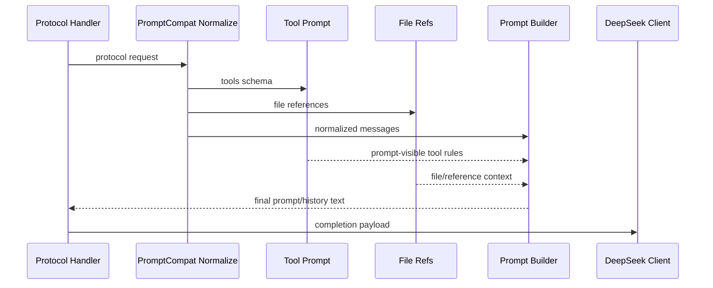

# Prompt 兼容流程

<cite>
**本文档引用的文件**
- [internal/promptcompat/standard_request.go](file://internal/promptcompat/standard_request.go)
- [internal/promptcompat/request_normalize.go](file://internal/promptcompat/request_normalize.go)
- [internal/promptcompat/message_normalize.go](file://internal/promptcompat/message_normalize.go)
- [internal/promptcompat/prompt_build.go](file://internal/promptcompat/prompt_build.go)
- [internal/promptcompat/tool_prompt.go](file://internal/promptcompat/tool_prompt.go)
- [internal/promptcompat/file_refs.go](file://internal/promptcompat/file_refs.go)
- [internal/promptcompat/thinking_injection.go](file://internal/promptcompat/thinking_injection.go)
</cite>

## 目录

1. [简介](#简介)
2. [项目结构](#项目结构)
3. [核心组件](#核心组件)
4. [架构总览](#架构总览)
5. [详细组件分析](#详细组件分析)
6. [故障排查指南](#故障排查指南)
7. [结论](#结论)

## 简介

本文是仓库内 “API 请求 → DeepSeek Web 纯文本上下文” 的权威文档。OpenAI、Claude、Gemini 的请求形态不同，但进入 DeepSeek Web 前都需要归一化为统一的标准请求，再构造出系统指令、历史消息、工具说明、文件引用和当前用户输入。

> **v1.0.5 ~ v1.0.12 关键变更（按版本顺序）**
>
> - **v1.0.5**：Anthropic `mcp_servers` 字段不再被静默丢弃。`expandMCPServersAsTools` 把 `tool_configuration.allowed_tools` 与 `mcp_servers[].tools[]` 展开为 `<server>.<tool>` 命名的虚拟工具描述，注入到 `tools[]`，让模型在 system prompt 中可见。
> - **v1.0.5**：违禁屏蔽 `collectText` 取消顶层白名单限制，递归扫描所有 map 字段（覆盖 `tool_result` / `functionResponse` 等容器字段）；`/admin /webui /healthz /readyz /static/ /assets/` 路径豁免内容扫描。
> - **v1.0.7**：DeepSeek 私有 token 渗漏清理增强（全角斜杠 `／`、未闭合 DSML 残片、`<|end_of_..|...>` trailing pipe），覆盖 OpenAI/Claude/Gemini 四条产物路径。
> - **v1.0.9**：附件**改内联模式**——`current_input_file.go` 的 `ApplyCurrentInputFile` 不再调上游 `upload_file`（避免账号速率限制），而是把 transcript 直接拼到 user 消息内容里；`file_inline_upload.go` 的 `tryUploadBlock` 同理用 `inlineFileTextReplacement` 把文本类 mime 直接展开、二进制类用占位符。开关由 `server.remote_file_upload_enabled` / env `DEEPSEEK_WEB_TO_API_REMOTE_FILE_UPLOAD_ENABLED` 控制（默认 `false`）。
> - **v1.0.12**：Codex Responses API 的 `compaction` / `reasoning` input item 在 `responses_input_items.go` 静默跳过（返回 `nil`，不会被误当作 user content 进入 prompt）。
> - **v1.0.3**：`DefaultThinkingInjectionPrompt` 显著扩写，新增工具链纪律、工具链模式和 MCP 调用规范。详见下方"v1.0.3 增量"节。

**章节来源**
- [AGENTS.md](file://AGENTS.md)
- [internal/promptcompat/standard_request.go](file://internal/promptcompat/standard_request.go)

## 项目结构

**图表来源**
- [internal/promptcompat/standard_request.go](file://internal/promptcompat/standard_request.go)
- [internal/promptcompat/request_normalize.go](file://internal/promptcompat/request_normalize.go)
- [internal/promptcompat/prompt_build.go](file://internal/promptcompat/prompt_build.go)

**章节来源**
- [internal/httpapi/openai/chat/handler_chat.go](file://internal/httpapi/openai/chat/handler_chat.go)
- [internal/httpapi/claude/convert.go](file://internal/httpapi/claude/convert.go)
- [internal/httpapi/gemini/convert_request.go](file://internal/httpapi/gemini/convert_request.go)

## 核心组件

- `StandardRequest`：协议无关的标准请求对象。
- 消息归一化：把 system、developer、user、assistant、tool 等角色转换为统一消息序列。
- 工具提示注入：把工具定义转换为模型可见的调用格式说明。
- 文件引用处理：把上传文件、当前输入文件和引用片段转成可见上下文。
- 历史转写：把之前的对话和工具结果压成纯文本历史。
- Thinking 注入（`thinking_injection.go`）：可按配置插入额外提示，默认启用；**v1.0.3 起 `DefaultThinkingInjectionPrompt` 大幅扩写**，包含工具链纪律（6 条）、工具链模式 A-E（5 个完整 DSML 示例）和 MCP 调用规范（点号命名空间、参数 input_schema 约束、禁止臆造 server 名、停止判据）。

**章节来源**
- [internal/promptcompat/standard_request.go](file://internal/promptcompat/standard_request.go)
- [internal/promptcompat/tool_prompt.go](file://internal/promptcompat/tool_prompt.go)
- [internal/promptcompat/thinking_injection.go](file://internal/promptcompat/thinking_injection.go)
- [internal/promptcompat/history_transcript.go](file://internal/promptcompat/history_transcript.go)

## 架构总览

**图表来源**
- [internal/promptcompat/prompt_build.go](file://internal/promptcompat/prompt_build.go)
- [internal/promptcompat/file_refs.go](file://internal/promptcompat/file_refs.go)
- [internal/promptcompat/tool_prompt.go](file://internal/promptcompat/tool_prompt.go)

**章节来源**
- [internal/httpapi/openai/shared/thinking_injection.go](file://internal/httpapi/openai/shared/thinking_injection.go)

## 详细组件分析

### OpenAI Chat 与 Responses

OpenAI Chat 使用 `messages`；Responses 可能使用 `input` 字符串、数组或更复杂的 item 结构。兼容层会先转换成标准请求，保留工具、文件和上下文语义，再进入统一 prompt 构建。

### Claude Messages

Claude Messages 的 `system`、`messages`、`tools` 和 `tool_result` 需要转换成同一套标准消息。Claude Code 这类客户端依赖稳定流式输出和工具结果不断会话，因此工具历史必须被转写进 prompt-visible 上下文。

### Gemini Contents

Gemini 的 `contents.parts` 会被转换为文本、文件和工具上下文。`x-goog-api-key` 或 query key 只影响鉴权，不影响 prompt 构建。

**章节来源**
- [internal/httpapi/openai/responses/responses_handler.go](file://internal/httpapi/openai/responses/responses_handler.go)
- [internal/httpapi/claude/standard_request.go](file://internal/httpapi/claude/standard_request.go)
- [internal/httpapi/gemini/convert_messages.go](file://internal/httpapi/gemini/convert_messages.go)

## v1.0.3 增量：Thinking-Injection 扩写

### 扩写内容概览

`thinking_injection.go` 的 `DefaultThinkingInjectionPrompt`（第 7 行）在原有"最大化推理"基础上追加了三个完整模块：

#### 1. 工具链纪律（6 条规则）

| 编号 | 规则关键词 | 要义 |
|---|---|---|
| 1 | CALL | 只在需要未知信息或外部操作时才调用工具 |
| 2 | FORMAT | 严格规范 wrapper，**`<![CDATA[` 必须用方括号**，混用管道是无效写法（详见 CDATA 管道变体兼容一节） |
| 3 | PARALLEL vs SEQUENTIAL | 无依赖的调用放同一个 `<\|DSML\|tool_calls>` 块并发；有依赖的必须等上一个结果再发 |
| 4 | AFTER A RESULT | 读结果后二选一：链式继续或给出最终答案；同参数同工具失败两次后禁止第三次 |
| 5 | STOP | 请求满足即停止，不追加 filler 工具调用 |
| 6 | FAILURE MODES TO AVOID | 禁止把工具 XML 包在 markdown fence 里；禁止臆造工具名或参数名 |

#### 2. 工具链模式 A-E（含完整 DSML 示例）

- **A. READ-BEFORE-EDIT**：文件修改必须先 Read，再把 Read 返回的精确字节作为 `old_string` 传给 Edit。
- **B. SEARCH → NARROW → INSPECT**：并行 Glob + Grep → 筛选 ≤5 个文件 → 并行 Read → 给出最终答案；不循环。
- **C. BASH COMMAND + RESULT DIAGNOSIS**：exit≠0 时必须读 stderr 诊断根因；相同参数禁止直接重试。
- **D. PARALLEL RESEARCH**：WebSearch / WebFetch / Grep / Read 无依赖时放同一块并发；禁止重复读取同 URL / 同文件。
- **E. CONDITIONAL FOLLOW-UP**：B 的 input 依赖 A 的 output 时，B 必须在单独 turn 发出。

#### 3. MCP 调用规范

- MCP 工具以 `<server>.<tool>` 点号命名空间调用；单词 `<tool>` 不路由到 MCP。
- 参数名来自该服务器 `input_schema` 声明；不能臆造未声明的 server 名。
- MCP 结果同普通工具结果；可与常规工具在同一 `<\|DSML\|tool_calls>` 块并行（输入互不依赖时）。

#### 4. 终止判据

退出工具链的优先条件：请求已满足 / 同子问题连续 3 次无进展 / 同参数同工具失败 2 次 / 下一个工具的结果可从当前上下文预测。

**章节来源**
- [internal/promptcompat/thinking_injection.go:7-65](file://internal/promptcompat/thinking_injection.go#L7-L65)

## 故障排查指南

- 模型忘记工具调用结果：检查 tool/result 消息是否进入标准消息序列。
- Claude Code 会话中断：检查流式消息是否被过早 finalize，工具结果是否被识别为独立内容。
- 文件内容没有进入上下文：检查 `/v1/files` 上传结果和 `current_input_file` 配置。
- 输出出现引用噪声：检查 `compat.strip_reference_markers`。
- 模型不调用工具链 / 工具调用顺序混乱：确认 `thinking_injection.enabled=true`；v1.0.3 前的旧版本缺少 READ-BEFORE-EDIT 约束顺序明示，升级后会显著改善。
- MCP 工具不路由到正确服务器：检查调用名是否带 `<server>.` 前缀；未带前缀的工具名不会被路由到 MCP。

**章节来源**
- [internal/promptcompat/tool_message_repair.go](file://internal/promptcompat/tool_message_repair.go)
- [internal/httpapi/openai/history/current_input_file.go](file://internal/httpapi/openai/history/current_input_file.go)
- [internal/textclean/reference_markers.go](file://internal/textclean/reference_markers.go)

## 结论

PromptCompat 的设计目标是让多协议客户端共享同一套 DeepSeek Web 上下文构造规则。后续凡是修改消息归一化、工具提示、工具历史、文件引用或 completion payload，都必须同步更新本文档。

**章节来源**
- [AGENTS.md](file://AGENTS.md)
