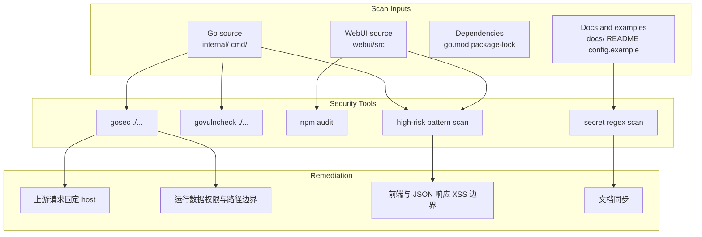
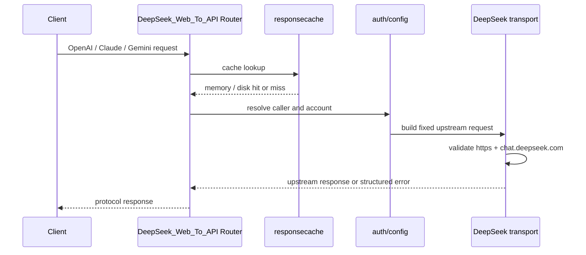

# 安全审计报告 2026-05-02

<cite>
**本文档引用的文件**
- [internal/deepseek/transport/transport.go](file://internal/deepseek/transport/transport.go)
- [internal/deepseek/client/client_http_helpers.go](file://internal/deepseek/client/client_http_helpers.go)
- [internal/responsecache/cache.go](file://internal/responsecache/cache.go)
- [internal/chathistory/store.go](file://internal/chathistory/store.go)
- [internal/chathistory/sqlite_store.go](file://internal/chathistory/sqlite_store.go)
- [internal/chathistory/sqlite_detail.go](file://internal/chathistory/sqlite_detail.go)
- [internal/httpapi/admin/metrics/handler.go](file://internal/httpapi/admin/metrics/handler.go)
- [internal/httpapi/claude/handler_messages.go](file://internal/httpapi/claude/handler_messages.go)
- [internal/config/store_load.go](file://internal/config/store_load.go)
- [internal/config/store_env_writeback.go](file://internal/config/store_env_writeback.go)
- [internal/httpapi/openai/files/handler_files.go](file://internal/httpapi/openai/files/handler_files.go)
- [internal/httpapi/gemini/handler_generate.go](file://internal/httpapi/gemini/handler_generate.go)
- [internal/httpapi/admin/history/handler_chat_history.go](file://internal/httpapi/admin/history/handler_chat_history.go)
- [webui/src/components/LandingPage.jsx](file://webui/src/components/LandingPage.jsx)
- [docs/TESTING.md](file://docs/TESTING.md)
</cite>

## 目录
1. [简介](#简介)
2. [项目结构](#项目结构)
3. [核心组件](#核心组件)
4. [架构总览](#架构总览)
5. [详细组件分析](#详细组件分析)
6. [结论](#结论)

## 简介

本报告记录 2026-05-02 对 DeepSeek_Web_To_API 执行的安全类 Skill 扫描、分析和修复结果。审计范围覆盖 OWASP 常见风险、Go SAST、Go 依赖漏洞、前端依赖漏洞、敏感信息扫描、运行时文件权限、上游请求边界、缓存路径边界和前端 XSS 风险。

本轮没有发现真实密钥泄露；敏感信息扫描命中均为测试假 token 或脚本变量名。`govulncheck` 未发现可达漏洞，`npm audit --registry=https://registry.npmjs.org --audit-level=high` 返回 0 个漏洞，`gosec ./...` 在修复后清零通过。

**章节来源**
- [transport.go](file://internal/deepseek/transport/transport.go)
- [cache.go](file://internal/responsecache/cache.go)
- [LandingPage.jsx](file://webui/src/components/LandingPage.jsx)

## 项目结构

**图表来源**
- [internal/deepseek/transport/transport.go](file://internal/deepseek/transport/transport.go)
- [internal/responsecache/cache.go](file://internal/responsecache/cache.go)
- [webui/src/components/LandingPage.jsx](file://webui/src/components/LandingPage.jsx)

**章节来源**
- [docs/TESTING.md](file://docs/TESTING.md)

## 核心组件

- `internal/deepseek/transport` 与 `internal/deepseek/client`：`Do` 调用前校验请求必须是 `https://chat.deepseek.com`，非流式 JSON 响应解压后读取限制为 16MB，降低 SSRF 误用面与上游异常响应内存放大风险。
- `internal/responsecache`：缓存文件路径由 SHA-256 key 派生，并在打开/删除前校验仍位于缓存根目录；删除时跳过 symlink。
- `internal/chathistory`：运行态默认使用 SQLite；详情写入 gzip `detail_blob` 并清空原始 `detail_json`，读取 gzip 详情时限制解压后大小，旧文件后端仍在读取详情前校验历史 ID，运行态目录权限收紧为 `0700`。
- `internal/httpapi/claude` 与 `internal/httpapi/gemini`：经 OpenAI 兼容通道代理请求时先套 `http.MaxBytesReader`，避免大请求体在协议转换前被无界读入内存。
- `internal/httpapi/admin/metrics`：修复 gosec 报出的 `uint -> int64` 溢出转换，超出 `int64` 上限的统计值会被拒绝为 0。
- `internal/config`：运行时写回的配置文件权限收紧为 `0600`，目录权限收紧为 `0700`。
- `internal/testsuite` 与 `internal/rawsample`：端到端测试产物和抓包样本可能包含请求/响应敏感数据，目录与文件权限收紧为 `0700/0600`。
- `webui/src/components/LandingPage.jsx`：移除 `dangerouslySetInnerHTML`，外链补充 `rel="noreferrer"`。

**章节来源**
- [transport.go](file://internal/deepseek/transport/transport.go)
- [client_http_helpers.go](file://internal/deepseek/client/client_http_helpers.go)
- [cache.go](file://internal/responsecache/cache.go)
- [store.go](file://internal/chathistory/store.go)
- [sqlite_store.go](file://internal/chathistory/sqlite_store.go)
- [sqlite_detail.go](file://internal/chathistory/sqlite_detail.go)
- [handler.go](file://internal/httpapi/admin/metrics/handler.go)
- [handler_messages.go](file://internal/httpapi/claude/handler_messages.go)
- [handler_generate.go](file://internal/httpapi/gemini/handler_generate.go)
- [store_env_writeback.go](file://internal/config/store_env_writeback.go)
- [LandingPage.jsx](file://webui/src/components/LandingPage.jsx)

## 架构总览

**图表来源**
- [internal/server/router.go](file://internal/server/router.go)
- [internal/responsecache/cache.go](file://internal/responsecache/cache.go)
- [internal/auth/request.go](file://internal/auth/request.go)
- [internal/deepseek/transport/transport.go](file://internal/deepseek/transport/transport.go)

**章节来源**
- [docs/Runtime Operations/Runtime Operations.md](file://docs/Runtime%20Operations/Runtime%20Operations.md)

## 详细组件分析

### 扫描命令与结果

| 类别 | 命令 | 结果 |
| --- | --- | --- |
| Go SAST | `gosec ./...` | 修复后通过，0 findings |
| Go 可达漏洞 | `govulncheck ./...` | No vulnerabilities found |
| 前端依赖漏洞 | `npm audit --prefix webui --audit-level=high --registry=https://registry.npmjs.org` | found 0 vulnerabilities |
| 敏感信息 | `rg` 正则扫描 token/password/private key/API key | 本轮未命中真实凭据；历史误报均为测试假 token 或脚本变量名 |
| 高危模式 | `rg` 扫描 `dangerouslySetInnerHTML`、`.innerHTML`、`eval`、SQL 拼接、动态 exec | 已移除前端危险 HTML 注入；剩余 JS `.exec` 为正则 API |
| 数据库注入 | `rg` 扫描 `Exec/Query/QueryRow` 与 SQL 拼接 | SQLite 路径均使用固定 SQL 与占位符参数，未发现用户输入拼接 SQL |
| 内存放大 | `rg` 扫描 `io.ReadAll`、`gzip.NewReader`、请求体读取与响应体读取 | 已补齐 gzip 详情、Claude/Gemini 代理请求体、DeepSeek JSON 响应体上限 |

### 已修复项

1. 上游请求边界：DeepSeek 自定义 transport 增加固定 host 与 HTTPS 校验，避免未来误把用户可控 URL 传入底层 client。
2. 缓存路径边界：响应缓存读写路径必须来自规范化 SHA-256 key，并在删除前做根目录校验与 symlink 跳过。
3. 运行数据权限：配置写回、聊天历史、响应缓存、raw sample、testsuite artifact 默认按敏感数据处理，使用 `0700` 目录与 `0600` 文件权限。
4. 上传边界：OpenAI 文件上传在 multipart 解析前继续使用 `http.MaxBytesReader` 限制完整请求体。
5. XSS 边界：Gemini 非流式转换结果先验证 JSON，再以 `application/json` 与 `X-Content-Type-Options: nosniff` 输出；WebUI landing page 移除 `dangerouslySetInnerHTML`。
6. 日志注入边界：聊天历史分页参数日志去除控制字符并限制长度。
7. 数据库注入边界：聊天历史 SQLite 读写继续使用固定 SQL 与 `?` 占位符，未发现用户输入拼接 SQL；新增扫描结论写入本报告。
8. 内存放大边界：SQLite gzip 详情解压后限制为 256MB，DeepSeek 非流式 JSON 响应解压后限制为 16MB。
9. 请求体边界：Claude/Gemini 兼容代理进入 OpenAI 通道前增加请求体大小限制，超限返回 413。
10. 数值溢出边界：Admin metrics 对无符号统计值执行安全转换，避免 `uint` 超出 `int64` 后回绕。

### 保留并说明的误报

- `StableProxyID` 继续使用 SHA-1 生成旧版兼容的非安全 ID。该值不是密码、签名、token 或访问控制材料，改为 SHA-256 会改变已有隐式代理 ID，因此以注释说明并保留兼容行为。
- testsuite 的 preflight 子进程命令来自固定字面量列表，不接受用户输入；保留执行但加注释说明。
- 配置文件读取路径来自部署者本地配置，不是远程请求输入；保留本地可配置路径，同时用文件权限收紧写回结果。

**章节来源**
- [config.go](file://internal/config/config.go)
- [runner_env.go](file://internal/testsuite/runner_env.go)
- [handler_files.go](file://internal/httpapi/openai/files/handler_files.go)
- [handler_generate.go](file://internal/httpapi/gemini/handler_generate.go)
- [handler_chat_history.go](file://internal/httpapi/admin/history/handler_chat_history.go)
- [client_http_helpers.go](file://internal/deepseek/client/client_http_helpers.go)
- [handler.go](file://internal/httpapi/admin/metrics/handler.go)

## 结论

本轮安全审计已完成扫描、分析、修复与文档同步。当前安全门禁建议在发布前至少执行：`gosec ./...`、`govulncheck ./...`、`npm audit --prefix webui --audit-level=high --registry=https://registry.npmjs.org`、敏感信息扫描、`go test ./...`、`go test ./... -race -count=1` 与 WebUI 构建。

后续如果新增外部 URL、文件读写、配置写回、Admin API、WebUI HTML 注入或持久化缓存逻辑，应优先复跑本报告中的安全扫描命令，并同步更新 `docs/TESTING.md` 与相关模块文档。

**章节来源**
- [docs/TESTING.md](file://docs/TESTING.md)
- [docs/DEPLOY.md](file://docs/DEPLOY.md)
