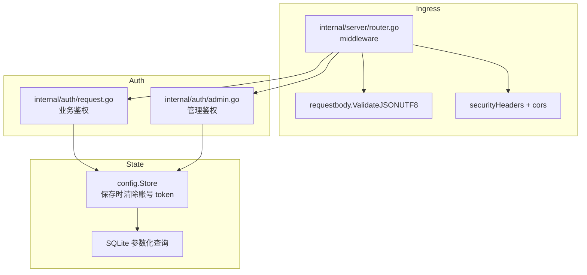
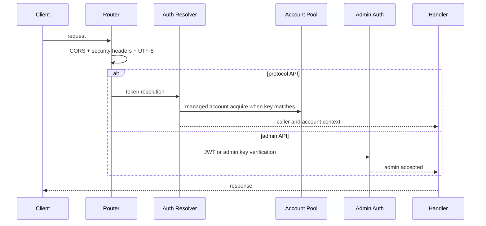

# 安全说明

<cite>
**本文档引用的文件**
- [internal/auth/admin.go](file://internal/auth/admin.go)
- [internal/auth/request.go](file://internal/auth/request.go)
- [internal/server/router.go](file://internal/server/router.go)
- [internal/httpapi/requestbody/json_utf8.go](file://internal/httpapi/requestbody/json_utf8.go)
- [internal/config/store.go](file://internal/config/store.go)
- [internal/chathistory/sqlite_write.go](file://internal/chathistory/sqlite_write.go)
</cite>

## 目录

1. [简介](#简介)
2. [项目结构](#项目结构)
3. [核心组件](#核心组件)
4. [架构总览](#架构总览)
5. [详细组件分析](#详细组件分析)
6. [故障排查指南](#故障排查指南)
7. [结论](#结论)

## 简介

本文记录当前安全边界：业务 API 使用 API Key 或直通 token，管理台使用 Admin Key 或 JWT，运行时拒绝缺失管理凭据和 JWT secret 的启动配置。请求入口包含 CORS、安全响应头、panic 恢复和 JSON UTF-8 校验。

**章节来源**
- [internal/auth/admin.go](file://internal/auth/admin.go)
- [internal/server/router.go](file://internal/server/router.go)

## 项目结构

**图表来源**
- [internal/server/router.go](file://internal/server/router.go)
- [internal/auth/request.go](file://internal/auth/request.go)
- [internal/auth/admin.go](file://internal/auth/admin.go)

**章节来源**
- [internal/httpapi/requestbody/json_utf8.go](file://internal/httpapi/requestbody/json_utf8.go)

## 核心组件

- 管理端启动校验：缺少 `admin.key`/`admin.password_hash` 或 `admin.jwt_secret` 时拒绝启动。
- Admin JWT：HS256 签名，包含 `iat`、`exp` 和 `role=admin`，支持 `jwt_valid_after_unix` 使旧 token 失效。
- 业务鉴权：配置 API Key 进入托管账号池，未知 token 进入直通模式。
- CORS：允许主流 SDK 请求头，屏蔽内部专用头。
- 安全响应头：`nosniff`、`DENY`、`no-referrer`、权限策略和同源资源策略。
- SQLite 写入：使用参数化查询，不使用字符串拼接 SQL。

**章节来源**
- [internal/auth/admin.go](file://internal/auth/admin.go)
- [internal/auth/request.go](file://internal/auth/request.go)
- [internal/server/router.go](file://internal/server/router.go)
- [internal/chathistory/sqlite_write.go](file://internal/chathistory/sqlite_write.go)

## 架构总览

**图表来源**
- [internal/server/router.go](file://internal/server/router.go)
- [internal/auth/request.go](file://internal/auth/request.go)
- [internal/auth/admin.go](file://internal/auth/admin.go)

**章节来源**
- [internal/httpapi/admin/auth/routes.go](file://internal/httpapi/admin/auth/routes.go)

## 详细组件分析

### 管理端凭据

生产环境必须设置强随机 `admin.jwt_secret`，并优先使用 `admin.password_hash` 或强随机 `admin.key`。环境变量覆盖仅用于部署平台注入，不建议长期作为主要配置来源。

### 业务 API Key

调用方 token 命中配置 key 时，服务会使用托管账号池访问 DeepSeek。调用方 token 未命中时，会作为 DeepSeek token 直通，不占用本地托管账号。

### 数据落盘

配置保存时会清理账号运行时 token。历史记录写入 SQLite，并对详情进行 gzip 压缩；但历史内容本身可能包含用户输入，因此部署时应保护 `data/` 目录权限和备份介质。

**章节来源**
- [internal/config/store.go](file://internal/config/store.go)
- [internal/chathistory/sqlite_detail.go](file://internal/chathistory/sqlite_detail.go)

## 故障排查指南

- 管理台登录失败：确认 `Authorization` 使用 `Bearer`，或先调用 `/admin/login` 获取 JWT。
- 业务接口返回 401：检查是否传入 API Key 或 DeepSeek token。
- 账号池耗尽：检查 `runtime.account_max_inflight`、`runtime.account_max_queue` 和账号测试状态。
- 浏览器预检失败：确认自定义请求头没有使用被屏蔽的内部专用头。

**章节来源**
- [internal/auth/request.go](file://internal/auth/request.go)
- [internal/server/router.go](file://internal/server/router.go)

## 结论

当前安全模型的重点是最小化公开入口、强制管理端凭据、校验入站 JSON、隔离调用方缓存与账号池状态。生产部署时应把应用放在反代后方，并限制 `.env`、回写配置文件与 `data/` 的系统权限。

**章节来源**
- [SECURITY.md](file://SECURITY.md)
