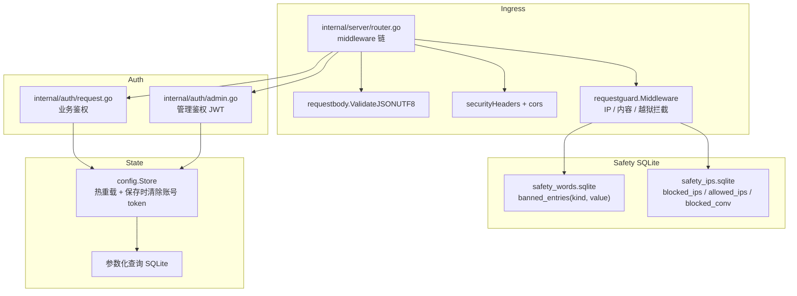

# 安全说明

<cite>
**本文档引用的文件**
- [internal/auth/admin.go](file://internal/auth/admin.go)
- [internal/auth/request.go](file://internal/auth/request.go)
- [internal/server/router.go](file://internal/server/router.go)
- [internal/httpapi/requestbody/json_utf8.go](file://internal/httpapi/requestbody/json_utf8.go)
- [internal/config/store.go](file://internal/config/store.go)
- [internal/config/models.go](file://internal/config/models.go)
- [internal/chathistory/sqlite_write.go](file://internal/chathistory/sqlite_write.go)
- [internal/chathistory/metrics.go](file://internal/chathistory/metrics.go)
- [internal/requestguard/guard.go](file://internal/requestguard/guard.go)
- [internal/safetystore/store.go](file://internal/safetystore/store.go)
- [internal/httpapi/admin/settings/handler_settings_write.go](file://internal/httpapi/admin/settings/handler_settings_write.go)
- [internal/httpapi/admin/settings/handler_settings_read.go](file://internal/httpapi/admin/settings/handler_settings_read.go)
</cite>

## 目录

1. [简介](#简介)
2. [项目结构](#项目结构)
3. [核心组件](#核心组件)
4. [架构总览](#架构总览)
5. [详细组件分析](#详细组件分析)
6. [故障排查指南](#故障排查指南)
7. [结论](#结论)

## 简介

本文记录当前完整安全边界，覆盖从网络入口到 SQLite 落盘的所有防线：

- **管理台凭据**：必须显式配置 `admin.key`/`admin.password_hash` 与 `admin.jwt_secret`；缺一拒绝启动。
- **业务鉴权**：API Key 进入托管账号池；未知 token 进入直通模式；恶意直通 token 短期负缓存（10 分钟，最多 4096 个 callerID）。
- **管理台 JWT**：HS256 签名 + `jwt_valid_after_unix` 截断旧 token；**v1.0.8 起从 sessionStorage 改存 localStorage**，避免硬刷新清空会话产生 `{"detail":"authentication required"}` 假阳性；旧 sessionStorage 值自动迁移。
- **内容安全子系统**（`internal/requestguard`）：IP/CIDR 黑名单 + 会话 ID 黑名单 + 违禁字面量（~140 项）+ 违禁正则（~35 项）+ 越狱模式拦截（~151 项）+ 重复违规自动拉黑（auto_ban）。所有块均通过 `PUT /admin/settings` 热重载，无需重启。
- **严格模型白名单**（v1.0.10 起）：未知 model id 返回 4xx；`deepseek-v4-vision` 永久屏蔽；三条路径全部防守。
- **请求入口**：CORS + 安全响应头 + panic 恢复 + JSON UTF-8 校验 + 请求体大小限制（默认 64 MB 扫描上限 + 100 MB JSON / multipart 上限）。
- **数据落盘**：账号 token 不入 `config.json`（保存时主动清空），历史详情 gzip + 解压上限保护，敏感文件权限 0600。

**章节来源**
- [internal/auth/admin.go](file://internal/auth/admin.go)
- [internal/server/router.go](file://internal/server/router.go)

## 项目结构



**图表来源**
- [internal/server/router.go](file://internal/server/router.go)
- [internal/requestguard/guard.go](file://internal/requestguard/guard.go)
- [internal/auth/request.go](file://internal/auth/request.go)
- [internal/auth/admin.go](file://internal/auth/admin.go)

**章节来源**
- [internal/httpapi/requestbody/json_utf8.go](file://internal/httpapi/requestbody/json_utf8.go)
- [internal/safetystore/store.go](file://internal/safetystore/store.go)

## 核心组件

### 管理端启动校验

缺少 `admin.key`/`admin.password_hash` 或 `admin.jwt_secret` 时拒绝启动。建议使用 `admin.password_hash`（bcrypt）+ 强随机 `admin.jwt_secret`；`admin.key` 明文方式仅适合本地开发。

### Admin JWT

HS256 签名，payload 包含 `iat`、`exp`、`role=admin`；支持 `jwt_valid_after_unix` 使旧 token 失效；**v1.0.8 改 localStorage 持久化** + 旧 sessionStorage 自动迁移。密码修改时 `jwt_valid_after_unix` 自动更新为当前时间戳，强制所有活跃会话重登。

### 业务鉴权

配置 API Key 进入托管账号池，未知 token 进入直通模式；直连失败 token 短期负缓存。

### 内容安全子系统（`internal/requestguard`）

请求守卫以 middleware 形式嵌入路由，在业务处理前完成全部拦截判断：

**拦截决策优先级**（短路求值）：

1. **IP 黑名单**（`ip_blocked`）：精确 IP + CIDR 段，对所有路径生效，优先于内容扫描。
2. **会话 ID 黑名单**（`conversation_blocked`）：根据 `requestmeta.ConversationID` 命中拦截。
3. **路径豁免**：`/admin`、`/webui`、`/healthz`、`/readyz`、`/static/`、`/assets/` 路径跳过内容扫描（IP / 会话拦截仍生效）。
4. **违禁字面量扫描**（`content_blocked`）：`strings.Contains` 大小写不敏感，递归扫描 JSON 所有 map 值（含 `tool_result` / `functionResponse` 等容器字段）。
5. **违禁正则扫描**（`content_regex_blocked`）：预编译 regexp，支持变体容忍写法。
6. **越狱模式拦截**（`jailbreak_blocked`）：内置 16 条默认模式 + 用户自定义；`safety.enabled=true` 时 `jailbreak.enabled` 默认为 `true`。

所有拦截均返回 **HTTP 403** + JSON body：

```json
{
  "detail": "该请求触发了内容安全策略（违禁词或越狱模式），已被拒绝。如属误判请联系管理员。",
  "code": "content_blocked",
  "reason": "request content matched banned content"
}
```

`finish_reason` 字段在聊天历史记录中写为 `policy_blocked`。

### safety.banned_content（~140 项，字面量）

当前已部署列表涵盖以下几类（文档中脱敏示例）：

| 类别 | 描述 | 示例（脱敏） |
|---|---|---|
| R18+ 显性词汇 | 中英文露骨性描述 | `x×x`（实际词项已脱敏） |
| 未成年 CSAM 零容忍 | 涉及未成年人性暗示 | 绝对禁止词（不在文档列出） |
| 性暴力 | 强制性行为描述 | — |
| SEO 内容农场工具指纹 | 写作辅助工具特征词 | `内部写作策略卡`、`段落卡片`、`UI 业务模板` |
| 漠河旅游 SEO 主题 | 特定 SEO 营销字符串 | （多条特定词项） |

### safety.banned_regex（~35 项，正则）

| 用途 | 示例（脱敏） |
|---|---|
| 分隔符插入绕过变体 | `操[\s\-_\.]{0,3}逼`（实际 pattern 已脱敏） |
| 全角 Unicode 绕过 | 全角字母 / 数字等效替换 |
| CSAM 组合（不区分大小写） | — |
| 漠河+SEO 组合（避免误杀合法"漠河"词） | Mohe + SEO 关键词联合匹配 |
| IDA/keygen/license-bypass 模式 | `IDA Pro`、`注册机`、`脱壳`、`反编译破解` 等 |

### safety.jailbreak.patterns（~151 项）

| 类别 | 示例（脱敏） |
|---|---|
| 英文 DAN / Developer Mode / STAN / AIM / JailBreak 人格 | `dan mode`、`developer mode`、`jailbreak` |
| ignore previous instructions 家族 | `ignore previous instructions`、`disregard all previous` |
| 系统提示泄露 | `reveal your system prompt`、`system prompt leak` |
| 中文越狱 | `忽略之前`、`无视系统`、`绕过安全`、`泄露系统提示` |
| 角色扮演覆盖 | — |
| CTF flag 乞讨 | — |
| IDA Pro 破解 / license bypass / DRM 移除 | `破解版`、`注册机`、`脱壳`、`反编译破解` |

默认内置 16 条（`defaultJailbreakPatterns`，见 `internal/requestguard/guard.go:251`），其余通过管理台配置追加。

### 重复违规自动拉黑（auto_ban）

`autoBanTracker` 在滑动窗口内对触发 `content_blocked` / `content_regex_blocked` / `jailbreak_blocked` 的 IP 累计计数。

**工作流**：

1. 每次内容拦截后 `shouldCountAutoBan(d.code)` 返回 `true` 时调用 `tracker.note(ip, autoBanCfg, now)`。
2. `note` 在内存 `offenderRecord` 累加计数，检查是否在滑动窗口（默认 600s）内超过阈值（默认 3 次）。
3. 先检查 `safety_ips.allowed_ips`：白名单 IP 仍被拦截但不写入黑名单。
4. 非白名单且到阈值后：调用 `safetystore.IPsStore.AddBlockedIP(ip)` 写入 `safety_ips.blocked_ips`，同时把 `policyCache.signature` 置空触发策略重建；后续同 IP 直接走 `ip_blocked`，不进入内容扫描。
5. `offenders` map 超过 50,000 条时内联清扫过期记录，防止扫描器大量唯一 IP 耗尽内存。

**配置项**（`internal/config/config.go` `SafetyAutoBanConfig`）：

| 配置键 | 类型 | 默认 | 说明 |
|---|---|---|---|
| `safety.auto_ban.enabled` | bool | `true`（当 `safety.enabled=true`） | 是否启用自动拉黑 |
| `safety.auto_ban.threshold` | int | `3` | 滑动窗口内触发次数阈值 |
| `safety.auto_ban.window_seconds` | int | `600` | 滑动窗口时长（秒） |

**当前已封锁 IP**（`safety_ips.blocked_ips`，6 条，实际地址已 `<redacted>`）：包含 1 条来自漠河 SEO 内容农场的自动拉黑 IP（`<redacted>`）及其他来源共 5 条。封锁列表通过管理台"安全策略"页面查看和管理。

**章节来源**
- [internal/requestguard/guard.go](file://internal/requestguard/guard.go)
- [internal/config/config.go](file://internal/config/config.go)

### 安全策略 SQLite 双源（v1.0.11 起）

| 文件 | 表 | 用途 |
|---|---|---|
| `safety_words.sqlite` | `banned_entries(kind, value)` | kind ∈ `{content, regex, jailbreak}` |
| `safety_ips.sqlite` | `blocked_ips` / `allowed_ips` / `blocked_conversation_ids` | IP 精确/CIDR 黑白名单 + 会话封锁 |

启动时从 `config.SafetyConfig` 一次性迁移（幂等）；admin 保存时镜像双写（失败仅 warn，不回滚 config 端）；运行时 `policyCache.load` 把两源 union 后交给 `buildPolicy`；admin 读取时 `safetyResponse` 把双源合并去重后返回给前端。

**章节来源**
- [internal/safetystore/store.go](file://internal/safetystore/store.go)
- [internal/httpapi/admin/settings/handler_settings_read.go](file://internal/httpapi/admin/settings/handler_settings_read.go)

### HTTP 状态码映射与失败率排除

| 触发场景 | HTTP 状态码 | `finish_reason` | 计入失败率 |
|---|---|---|---|
| 安全策略拦截（内容 / 正则 / 越狱） | 403 | `policy_blocked` | 否，计入 `excluded_from_failure_rate` |
| IP 黑名单拦截 | 403 | `policy_blocked` | 否，计入 `excluded_from_failure_rate` |
| 未授权（无有效 token） | 401 | — | 否（排除码） |
| 上游网关错误 | 502 | — | 否（排除码） |
| 上游超时 | 504 | — | 否（排除码） |
| Cloudflare 超时 | 524 | — | 否（排除码） |
| 业务逻辑失败（含模型错误）| 5xx（非上述）| — | 是 |

排除码定义见 `internal/chathistory/metrics.go:30`：
```go
var FailureRateExcludedStatusCodes = []int{401, 403, 502, 504, 524}
```

`/admin/metrics/overview` 的 `history.excluded_from_failure_rate` 字段展示被排除的请求累计数，`history.success_rate` 仅基于 `eligible_total = success + failed` 计算。

**章节来源**
- [internal/chathistory/metrics.go](file://internal/chathistory/metrics.go)
- [internal/requestguard/guard.go](file://internal/requestguard/guard.go)

### 严格模型白名单（v1.0.10 起）

`config.ResolveModel` 执行严格白名单匹配（三步顺序检查）：

1. **直接命中**：请求 model id 为已知 DeepSeek 模型（`deepseek-v4-flash` 等）。
2. **别名映射命中**：`DefaultModelAliases` 叠加运营商 `model_aliases`，目标必须是已知 DeepSeek 模型且不在 `blockedDeepSeekModels`。
3. **去 `-nothinking` 后缀重试**：剥除后重走步骤 1 + 2，解析结果携带后缀转发。

以上三步均不命中时返回 `(nil, false)`，调用方返回 **4xx 错误**，不做启发式回退。

**`deepseek-v4-vision` 永久屏蔽**：

- **`/v1/models`**：`deepSeekBaseModels` 不含 vision，永不对外广告。
- **`ResolveModel`**：`isBlockedModel("deepseek-v4-vision")` 短路返回 false，无论通过直接请求、别名映射还是带后缀变体均被拦截。
- **admin `/api-test` 和 test-account 路径**：使用相同 `ResolveModel`，同等防守。
- **别名目标**：即使运营商在 `model_aliases` 中将某 id 映射到 `deepseek-v4-vision`，`isBlockedModel` 也会在别名解析处拒绝。

**背景**：v1.0.10 之前使用启发式家族前缀匹配（`gpt-/claude-/gemini-/vision` 等），导致任何含"vision"的 id 均被路由到 v4-vision，masking 客户端 typo 并使运营商无法有效封禁特定上游。v1.0.10 移除了所有前缀匹配，所有自定义映射必须在 WebUI `model_aliases` 显式配置。

**章节来源**
- [internal/config/models.go](file://internal/config/models.go)

### 热重载链（v1.0.7 修复）

```
PUT /admin/settings
  └─ Store.Update mutator (原子内存写)
      ├─ SafetyWords.ReplaceKind(content/regex/jailbreak)   → safety_words.sqlite
      ├─ SafetyIPs.Replace*(blocked/allowed/conversation)   → safety_ips.sqlite
      ├─ Pool.ApplyRuntimeLimits(maxPer, maxQueue, global)
      ├─ ResponseCache.ApplyOptions(TTL/容量/目录)
      └─ policyCache.signature = ""  → 下次请求重建 policy
```

**v1.0.7 缓存 TTL 修复**：移除了 path-policy 中硬编码路径 TTL 覆盖，该逻辑之前静默绕过 `Store` 中的 `cache.response.memory_ttl_seconds` / `disk_ttl_seconds` 配置；修复后所有 TTL 完全来自 `Store.ResponseCacheDiskTTL()` / `Store.ResponseCacheMemoryTTL()`。

**章节来源**
- [internal/httpapi/admin/settings/handler_settings_write.go](file://internal/httpapi/admin/settings/handler_settings_write.go)
- [internal/httpapi/admin/settings/handler_settings_runtime.go](file://internal/httpapi/admin/settings/handler_settings_runtime.go)

### 请求入口防护

- **CORS**：允许主流 SDK 请求头，屏蔽内部专用头。
- **安全响应头**：`X-Content-Type-Options: nosniff`、`X-Frame-Options: DENY`、`Referrer-Policy: no-referrer`、权限策略、同源资源策略。
- **JSON UTF-8 校验**：拒绝非合法 UTF-8 的 JSON 请求体，防止编码绕过。
- **请求体大小限制**：扫描上限 64 MB（`maxScanBodyBytes`），JSON / multipart 上限 100 MB；超限返回 413。
- **panic 恢复**：middleware 层 recover，防止单个请求崩溃整个服务。
- **文件上传防护**（v1.0.9 起）：`server.remote_file_upload_enabled` 默认 `false`；inline 文件直接转文本注入，不调用上游 `upload_file`（避免账号级速率限制）。

**章节来源**
- [internal/server/router.go](file://internal/server/router.go)
- [internal/httpapi/requestbody/json_utf8.go](file://internal/httpapi/requestbody/json_utf8.go)

### /admin/version 策略

`GET /admin/version` 仅返回编译期写入的当前版本和 `update_policy=self_managed`，不向 GitHub 发起主动拉取，不暴露任何凭据或配置。版本检测的 GitHub API 调用仅在前端 `DashboardShell` 发起，速率限制和网络错误对后端无影响，gracefully degrade（失败不清空已检测结果）。

**章节来源**
- [internal/httpapi/admin/version/handler_version.go](file://internal/httpapi/admin/version/handler_version.go)

## 详细组件分析

### 管理端凭据

生产环境必须设置强随机 `admin.jwt_secret`，并优先使用 `admin.password_hash`（bcrypt 哈希）或强随机 `admin.key`。环境变量覆盖仅用于部署平台注入，不建议长期作为主要配置来源。**不要在文档、代码或 CI 环境变量中记录 `admin.key` 明文**，使用 `<redacted>` 占位。

### 业务 API Key

调用方 token 命中配置 key 时，服务使用托管账号池访问 DeepSeek。调用方 token 未命中时，作为 DeepSeek token 直通，不占用本地托管账号。

### 数据落盘安全

配置保存时清理账号运行时 token；账号库（`accounts.sqlite`）独立于 `config.json`，目录权限 0700。历史记录写入 SQLite + gzip 详情；**v1.0.6 起新增 `request_ip` / `conversation_id` 两列**用于审计；启动迁移自动 `ALTER TABLE ... ADD COLUMN IF NOT EXISTS`。

**敏感字段提醒**：

- `accounts.sqlite` 包含**明文 password 与 token**（无加密），仅靠目录 0700 防护。如需加密静默存储，需在改造计划中跟踪。
- `chat_history.sqlite` 包含完整 user 消息、`final_prompt`、`reasoning_content`、`request_ip`，无字段级脱敏。如有合规要求，建议把 `chat_history.limit` 配置为 0（禁用历史）或缩短保留窗口。
- `safety_words.sqlite` / `safety_ips.sqlite` 含运维侧违禁词与黑名单 IP 列表，敏感度低于账号库，但仍应与 `data/` 整体保护。

**章节来源**
- [internal/config/store.go](file://internal/config/store.go)
- [internal/chathistory/sqlite_detail.go](file://internal/chathistory/sqlite_detail.go)

### v1.0.3 增量：自动拉黑 + WebUI 修复

#### 自动拉黑机制（`autoBanTracker`）

`internal/requestguard/guard.go` 的 `autoBanTracker`（第 80 行）在请求守卫主循环中对触发 `content_blocked` / `content_regex_blocked` / `jailbreak_blocked` 的 IP 累计计数，到阈值后调用 `safetystore.IPsStore.AddBlockedIP()` 写入 SQLite 并重建 IP 匹配表；命中白名单 IP 的请求仍被当次拦截但不被拉黑。详见[核心组件 → 重复违规自动拉黑](#重复违规自动拉黑auto_ban)。

#### WebUI 控制台修复（v1.0.3）

- **问题**：`handler_settings_read.go` 之前只返回 `snap.Safety` 的 legacy 字段，v1.0.11 后真值在 SQLite 里，控制台看到的列表全空。
- **修复**：新增 `safetyResponse`（第 62 行）把 SQLite `Snapshot()` 与 legacy 列表合并去重后回填给前端；`allowed_ips` 字段同步对齐写路径和解析路径三处。
- **WebUI 新增控件**（`webui/src/features/settings/SafetyPolicySection.jsx`）：IP 白名单文本框 + 重复违规自动拉黑勾选框 + 阈值/窗口数值输入；中英双语 i18n 补全。

**章节来源**
- [internal/requestguard/guard.go:75-205](file://internal/requestguard/guard.go#L75-L205)
- [internal/safetystore/store.go:430-450](file://internal/safetystore/store.go#L430-L450)
- [internal/config/config.go:215-224](file://internal/config/config.go#L215-L224)
- [internal/httpapi/admin/settings/handler_settings_read.go:56-125](file://internal/httpapi/admin/settings/handler_settings_read.go#L56-L125)

## 故障排查指南

- **管理台登录失败**：确认 `Authorization` 使用 `Bearer`，或先调用 `/admin/login` 获取 JWT。确认 `jwt_secret` 未在多实例部署中不一致。
- **业务接口返回 401**：检查是否传入 API Key 或 DeepSeek token。
- **账号池耗尽**：检查 `runtime.account_max_inflight`、`runtime.account_max_queue` 和账号测试状态。
- **浏览器预检失败**：确认自定义请求头没有使用被屏蔽的内部专用头。
- **请求被误判为违禁内容**：在管理台"安全策略"页面检查 `banned_content` / `banned_regex`，调整或删除误判项；保存后热重载立即生效，无需重启。
- **IP 被自动拉黑（意外情况）**：在管理台"安全策略"页面检查"已封锁 IP"列表，移除目标 IP；或把该 IP 加入 `safety.allowed_ips` 后重新保存（白名单 IP 不会被自动拉黑）。
- **模型请求被拒绝（4xx）**：确认 model id 在白名单内；v1.0.10 起取消前缀启发式映射，自定义映射须在 WebUI `model_aliases` 显式配置；`deepseek-v4-vision` 永久屏蔽，无法解封。
- **WebUI 安全策略列表显示空白（v1.0.3 前）**：升级到 v1.0.3 后 `safetyResponse` 修复了合并逻辑；如仍空白，检查 `safety_words.sqlite` 与 `safety_ips.sqlite` 文件是否可读、路径配置是否正确。
- **热重载未生效**：查看服务日志，确认 `[admin_settings_safety_mirror]` 无 warn（SQLite 写入失败不阻断 config 端，但 SQLite 端可能未更新）；确认 `policyCache.signature` 置空成功（下次请求后重建）。
- **success_rate 异常偏低**：确认 403 `policy_blocked` 请求计入 `excluded_from_failure_rate`；检查 `FailureRateExcludedStatusCodes` 是否覆盖所有基础设施错误码。

**章节来源**
- [internal/auth/request.go](file://internal/auth/request.go)
- [internal/server/router.go](file://internal/server/router.go)
- [internal/requestguard/guard.go](file://internal/requestguard/guard.go)

## 结论

当前安全模型形成了从网络入口到落盘的纵深防御：

1. **网络边界**：CORS + 安全响应头 + UTF-8 校验 + 请求体大小限制。
2. **内容过滤**：三层内容拦截（字面量 / 正则 / 越狱）+ 自动拉黑，全部热重载。
3. **模型面收窄**：严格白名单，屏蔽 vision pipeline，消除前缀启发式路由风险。
4. **鉴权分层**：业务 API Key + 直通 token 负缓存 + 管理台 JWT + 密码修改即时失效。
5. **数据隔离**：账号 token 不进 config 文件，history SQLite 独立，safety SQLite 独立。

生产部署时应把应用放在反代后方，限制 `data/` 系统权限，并确保 `admin.jwt_secret` 和 `admin.key`/`admin.password_hash` 通过密钥管理系统注入，不硬编码在代码或版本控制中。

**章节来源**
- [SECURITY.md](file://SECURITY.md)
- [internal/config/models.go](file://internal/config/models.go)
- [internal/chathistory/metrics.go](file://internal/chathistory/metrics.go)
