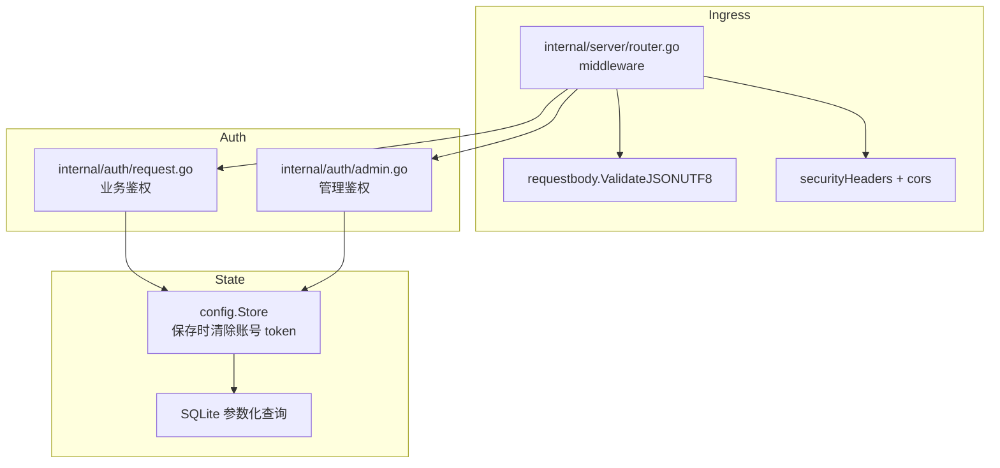
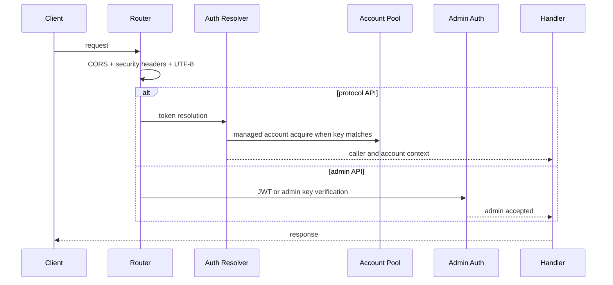

# 安全说明

<cite>
**本文档引用的文件**
- [internal/auth/admin.go](file://internal/auth/admin.go)
- [internal/auth/request.go](file://internal/auth/request.go)
- [internal/server/router.go](file://internal/server/router.go)
- [internal/httpapi/requestbody/json_utf8.go](file://internal/httpapi/requestbody/json_utf8.go)
- [internal/config/store.go](file://internal/config/store.go)
- [internal/chathistory/sqlite_write.go](file://internal/chathistory/sqlite_write.go)
- [internal/requestguard/guard.go](file://internal/requestguard/guard.go)
- [internal/safetystore/store.go](file://internal/safetystore/store.go)
</cite>

## 目录

1. [简介](#简介)
2. [项目结构](#项目结构)
3. [核心组件](#核心组件)
4. [架构总览](#架构总览)
5. [详细组件分析](#详细组件分析)
6. [故障排查指南](#故障排查指南)
7. [结论](#结论)

## 简介

本文记录当前安全边界：

- **管理台凭据**：必须显式配置 `admin.key`/`admin.password_hash` 与 `admin.jwt_secret`；缺一拒绝启动。
- **业务鉴权**：API Key 进入托管账号池；未知 token 进入直通模式；恶意直通 token 短期负缓存（10 分钟，最多 4096 个 callerID）。
- **管理台 JWT**：HS256 签名 + `jwt_valid_after_unix` 截断旧 token；**v1.0.8 起从 sessionStorage 改存 localStorage**，避免硬刷新清空会话产生 `{"detail":"authentication required"}` 假阳性。
- **请求安全策略**（`internal/requestguard`）：IP/CIDR 黑名单 + 会话 ID 黑名单 + 违禁字面量 + 违禁正则 + 越狱模式拦截。**v1.0.11 起违禁列表与 IP 黑白名单从 `config.SafetyConfig` 拆分到独立 SQLite**（`safety_words.sqlite` + `safety_ips.sqlite`），admin 写入时双源镜像。**v1.0.3 起新增自动拉黑与 WebUI 修复**，详见下方"v1.0.3 增量"节。
- **请求入口**：CORS + 安全响应头 + panic 恢复 + JSON UTF-8 校验 + 请求体大小限制（默认 64 MB 扫描上限 + 100 MB JSON / multipart 上限）。
- **数据落盘**：账号 token 不入 `config.json`（保存时主动清空），历史详情 gzip + 解压上限保护，敏感文件权限 0600。

**章节来源**
- [internal/auth/admin.go](file://internal/auth/admin.go)
- [internal/server/router.go](file://internal/server/router.go)

## 项目结构

**图表来源**
- [internal/server/router.go](file://internal/server/router.go)
- [internal/auth/request.go](file://internal/auth/request.go)
- [internal/auth/admin.go](file://internal/auth/admin.go)

**章节来源**
- [internal/httpapi/requestbody/json_utf8.go](file://internal/httpapi/requestbody/json_utf8.go)

## 核心组件

- 管理端启动校验：缺少 `admin.key`/`admin.password_hash` 或 `admin.jwt_secret` 时拒绝启动。
- Admin JWT：HS256 签名，包含 `iat`、`exp` 和 `role=admin`；支持 `jwt_valid_after_unix` 使旧 token 失效；**v1.0.8 改 localStorage 持久化** + 旧 sessionStorage 自动迁移。
- 业务鉴权：配置 API Key 进入托管账号池，未知 token 进入直通模式；直连失败 token 短期负缓存。
- 请求守卫（`internal/requestguard`）：
  - **IP 黑名单**：精确 IP + CIDR 段，对所有路径生效。
  - **会话 ID 黑名单**：根据 `requestmeta.ConversationID` 命中拦截。
  - **内容扫描**：违禁字面量（`strings.Contains` 大小写不敏感）、违禁正则、越狱模式（默认 18 条 + 用户自定义）。
  - **递归扫描**（v1.0.5 起）：所有 map 字段值（不仅顶层白名单键），覆盖 `tool_result` / `functionResponse` 等容器字段。
  - **路径豁免**（v1.0.5 起）：`/admin /webui /healthz /readyz /static/ /assets/` 跳过内容扫描（IP / 会话拦截仍生效），避免管理员配置含违禁词时被自身策略锁死。
  - **越狱默认开**（v1.0.5 起）：`safety.enabled=true` 而 `jailbreak.enabled` 未显式设置时，越狱检测默认启用。
  - **重复违规自动拉黑**（v1.0.3 起）：`autoBanTracker` 在滑动窗口内累计计数 `content_blocked` / `content_regex_blocked` / `jailbreak_blocked`，到阈值后调用 `safetystore.IPsStore.AddBlockedIP()` 写入 SQLite 并重建 IP 匹配表；命中白名单 IP 的请求仍被当次拦截但不被拉黑。配置项见下方配置表。
- 安全策略列表（v1.0.11 起独立 SQLite）：
  - `safety_words.sqlite` 表 `banned_entries(kind, value)`，kind ∈ `{content, regex, jailbreak}`。
  - `safety_ips.sqlite` 表 `blocked_ips` / `allowed_ips`（白名单）/ `blocked_conversation_ids`。**v1.0.3 起 `allowed_ips` 白名单字段在配置层（`config.SafetyConfig.AllowedIPs`）、写路径（`ReplaceAllowedIPs`）、解析路径（`stringSliceFrom(raw["allowed_ips"])`）三处对齐**；之前 WebUI 控制台显示全空，现已通过 `safetyResponse` 合并 SQLite Snapshot 与 legacy 列表后返回给前端。
  - 启动时从 `config.SafetyConfig` 一次性迁移；admin 保存时镜像双写；运行时 `policyCache.load` 把两源 union 后交给 `buildPolicy`。
- CORS：允许主流 SDK 请求头，屏蔽内部专用头。
- 安全响应头：`nosniff`、`DENY`、`no-referrer`、权限策略和同源资源策略。
- 文件上传防护（v1.0.9 起）：默认 `server.remote_file_upload_enabled = false`，inline 文件直接转文本注入，不调用上游 `upload_file`（避免账号级速率限制）；`/v1/files` 端点保留供主动上传场景。
- SQLite 写入：参数化查询，不使用字符串拼接 SQL。

**章节来源**
- [internal/auth/admin.go](file://internal/auth/admin.go)
- [internal/auth/request.go](file://internal/auth/request.go)
- [internal/server/router.go](file://internal/server/router.go)
- [internal/chathistory/sqlite_write.go](file://internal/chathistory/sqlite_write.go)

## 架构总览

**图表来源**
- [internal/server/router.go](file://internal/server/router.go)
- [internal/auth/request.go](file://internal/auth/request.go)
- [internal/auth/admin.go](file://internal/auth/admin.go)

**章节来源**
- [internal/httpapi/admin/auth/routes.go](file://internal/httpapi/admin/auth/routes.go)

## 详细组件分析

### 管理端凭据

生产环境必须设置强随机 `admin.jwt_secret`，并优先使用 `admin.password_hash` 或强随机 `admin.key`。环境变量覆盖仅用于部署平台注入，不建议长期作为主要配置来源。

### 业务 API Key

调用方 token 命中配置 key 时，服务会使用托管账号池访问 DeepSeek。调用方 token 未命中时，会作为 DeepSeek token 直通，不占用本地托管账号。

### 数据落盘

配置保存时清理账号运行时 token；账号库（`accounts.sqlite`）独立于 `config.json`，目录权限 0700。历史记录写入 SQLite + gzip 详情；**v1.0.6 起新增 `request_ip` / `conversation_id` 两列**用于审计；启动迁移自动 `ALTER TABLE ... ADD COLUMN IF NOT EXISTS`。

历史内容本身可能包含用户输入；部署时应保护 `data/` 目录权限和备份介质。**敏感字段提醒**：

- `accounts.sqlite` 包含**明文 password 与 token**（无加密），仅靠目录 0700 防护。如需加密静默存储，需在 [improvement plan](#) 跟踪改造（参见 1.0.x 安全审计报告）。
- `chat_history.sqlite` 包含完整 user 消息、`final_prompt`、`reasoning_content`、`request_ip`，无字段级脱敏。如有合规要求，建议把 `chat_history.limit` 配置为 0（禁用历史）或缩短保留窗口。
- `safety_words.sqlite` / `safety_ips.sqlite` 含运维侧违禁词与黑名单 IP 列表，敏感度低于账号库，但仍应同 `data/` 整体保护。

**章节来源**
- [internal/config/store.go](file://internal/config/store.go)
- [internal/chathistory/sqlite_detail.go](file://internal/chathistory/sqlite_detail.go)

## v1.0.3 增量：自动拉黑 + WebUI 修复

### 自动拉黑机制（`autoBanTracker`）

`internal/requestguard/guard.go` 新增 `autoBanTracker`（第 80 行），在请求守卫主循环中对触发 `content_blocked` / `content_regex_blocked` / `jailbreak_blocked` 的 IP 累计计数。

**工作流**：

1. 每次内容拦截后，`shouldCountAutoBan(d.code)` 返回 `true` 时调用 `tracker.note(ip, autoBanCfg, now)`。
2. `note` 在内存 `offenderRecord` 累加计数，并检查是否超过滑动窗口（默认 10 分钟）内的阈值（默认 3 次）。
3. 到阈值前先调用 `isAllowlistedLocked(ip)` 查 `safety_ips.allowed_ips`：白名单 IP 仍被拦截但不写入黑名单。
4. 非白名单且到阈值后调用 `safetystore.IPsStore.AddBlockedIP(ip)` 写入 `safety_ips.blocked_ips`，同时把 `policyCache.signature` 置空触发下次请求重建策略，新到同 IP 直接走 `ip_blocked` 终止，不再进入内容扫描。

**配置项**（`internal/config/config.go` `SafetyAutoBanConfig`，第 220 行）：

| 配置键 | 类型 | 默认 | 说明 |
|---|---|---|---|
| `safety.auto_ban.enabled` | bool | `true`（当 `safety.enabled=true`） | 是否启用自动拉黑 |
| `safety.auto_ban.threshold` | int | `3` | 滑动窗口内触发次数阈值 |
| `safety.auto_ban.window_seconds` | int | `600` | 滑动窗口时长（秒） |

### WebUI 控制台修复（v1.0.3）

- **问题**：`handler_settings_read.go` 之前只返回 `snap.Safety` 的 legacy 字段，v1.0.11 后真值在 SQLite 里，控制台看到的列表全空。
- **修复**：新增 `safetyResponse`（第 62 行）把 SQLite `Snapshot()` 与 legacy 列表合并去重后回填给前端；`allowed_ips` 字段同步对齐写路径和解析路径三处。
- **WebUI 新增控件**（`webui/src/features/settings/SafetyPolicySection.jsx`）：IP 白名单文本框 + 重复违规自动拉黑勾选框 + 阈值/窗口数值输入；中英双语 i18n 补全。

**章节来源**
- [internal/requestguard/guard.go:75-205](file://internal/requestguard/guard.go#L75-L205)
- [internal/safetystore/store.go:430-450](file://internal/safetystore/store.go#L430-L450)
- [internal/config/config.go:215-224](file://internal/config/config.go#L215-L224)
- [internal/httpapi/admin/settings/handler_settings_read.go:56-115](file://internal/httpapi/admin/settings/handler_settings_read.go#L56-L115)

## 故障排查指南

- 管理台登录失败：确认 `Authorization` 使用 `Bearer`，或先调用 `/admin/login` 获取 JWT。
- 业务接口返回 401：检查是否传入 API Key 或 DeepSeek token。
- 账号池耗尽：检查 `runtime.account_max_inflight`、`runtime.account_max_queue` 和账号测试状态。
- 浏览器预检失败：确认自定义请求头没有使用被屏蔽的内部专用头。
- IP 被自动拉黑（意外情况）：在管理台"安全策略"页面检查"已封锁 IP"列表，移除目标 IP；或把该 IP 加入白名单（`safety.allowed_ips`）后重新保存，白名单 IP 不会被自动拉黑。
- WebUI 安全策略列表显示空白（v1.0.3 前）：升级到 v1.0.3 后 `safetyResponse` 修复了合并逻辑；如仍空白，检查 `safety_words.sqlite` 与 `safety_ips.sqlite` 文件是否可读。

**章节来源**
- [internal/auth/request.go](file://internal/auth/request.go)
- [internal/server/router.go](file://internal/server/router.go)

## 结论

当前安全模型的重点是最小化公开入口、强制管理端凭据、校验入站 JSON、隔离调用方缓存与账号池状态。生产部署时应把应用放在反代后方，并限制 `.env`、回写配置文件与 `data/` 的系统权限。

**章节来源**
- [SECURITY.md](file://SECURITY.md)
