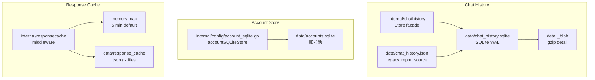
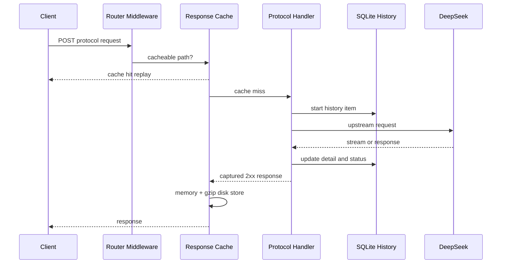

# 存储与缓存

<cite>
**本文档引用的文件**
- [internal/chathistory/store.go](file://internal/chathistory/store.go)
- [internal/chathistory/sqlite_store.go](file://internal/chathistory/sqlite_store.go)
- [internal/chathistory/sqlite_detail.go](file://internal/chathistory/sqlite_detail.go)
- [internal/config/account_sqlite.go](file://internal/config/account_sqlite.go)
- [internal/responsecache/cache.go](file://internal/responsecache/cache.go)
- [config.example.json](file://config.example.json)
</cite>

## 目录

1. [简介](#简介)
2. [项目结构](#项目结构)
3. [核心组件](#核心组件)
4. [架构总览](#架构总览)
5. [详细组件分析](#详细组件分析)
6. [性能考虑](#性能考虑)
7. [故障排查指南](#故障排查指南)
8. [结论](#结论)

## 简介

当前项目有三类本地状态：账号 SQLite、SQLite 对话历史和协议响应缓存。账号池由 `data/accounts.sqlite` 单独保存，避免继续把大量账号写入 JSON；对话历史默认上限为 2 万条，达到 2 万条时会批量清理旧记录，仅保留最近 500 条详情，同时把已清理记录的累计指标写入 meta，避免总览页总请求数被物理保留上限截断。响应缓存用于减少相同协议请求重复打到上游，默认内存 5 分钟、磁盘 4 小时，并对磁盘内容启用 gzip。

**章节来源**
- [internal/chathistory/store.go](file://internal/chathistory/store.go)
- [internal/responsecache/cache.go](file://internal/responsecache/cache.go)

## 项目结构

**图表来源**
- [internal/chathistory/sqlite_store.go](file://internal/chathistory/sqlite_store.go)
- [internal/chathistory/sqlite_detail.go](file://internal/chathistory/sqlite_detail.go)
- [internal/responsecache/cache.go](file://internal/responsecache/cache.go)

**章节来源**
- [config.example.json](file://config.example.json)

## 核心组件

- `chat_history` 表：存储摘要字段、状态、模型、账号、耗时、状态码、usage、详情版本。
- `detail_blob`：保存 gzip 压缩后的完整详情，`detail_json` 只用于旧数据迁移。
- `chat_history_meta`：保存保留上限、版本、修订号，以及被批量清理记录的累计请求、成功率和 token 统计。
- `accounts` 表：保存账号标识、邮箱、手机号、密码、运行态 token 和代理绑定；旧配置中的 `accounts` 会在账号库为空时自动迁移。
- `responsecache.Cache`：在路由中间件层读取请求体、计算缓存键、命中回放、未命中捕获响应并写入缓存。
- 磁盘缓存文件：以 `.json.gz` 保存，包含状态码、响应头、响应体、创建时间和过期时间。

**章节来源**
- [internal/chathistory/sqlite_store.go](file://internal/chathistory/sqlite_store.go)
- [internal/responsecache/cache.go](file://internal/responsecache/cache.go)

## 架构总览

**图表来源**
- [internal/server/router.go](file://internal/server/router.go)
- [internal/responsecache/cache.go](file://internal/responsecache/cache.go)
- [internal/chathistory/sqlite_write.go](file://internal/chathistory/sqlite_write.go)

**章节来源**
- [internal/server/router.go](file://internal/server/router.go)
- [internal/httpapi/historycapture/capture.go](file://internal/httpapi/historycapture/capture.go)

## 详细组件分析

### SQLite 历史记录

默认路径为 `data/chat_history.sqlite`。启动时会：

- 创建目录和 SQLite 连接。
- 设置 WAL、`synchronous=NORMAL`、`busy_timeout=5000`。
- 建表和索引。
- 从旧 `data/chat_history.json` 首次导入。
- 将上次未完成请求标记为停止。
- 压缩旧的未压缩详情，并执行 checkpoint/VACUUM。

历史保留上限由数据库 meta 保存，默认和最大值都是 `20000`。当 `limit=20000` 且记录数达到阈值时，系统会把较旧的 `19500` 条记录滚入累计指标并删除详情，只保留最近 `500` 条可展开记录；总览页的总请求数、成功率和总 token 会继续使用“已清理累计 + 当前保留记录”的口径。

### 账号 SQLite

默认路径为 `data/accounts.sqlite`，也可以通过 `storage.accounts_sqlite_path` 或 `DEEPSEEK_WEB_TO_API_ACCOUNTS_SQLITE_PATH` 覆盖。启动时会创建账号表和邮箱/手机号唯一索引；如果旧配置文件或 `.env` 的结构化 JSON 中仍带 `accounts`，且账号库为空，会自动导入一次。管理台新增、编辑、批量导入账号时，内存快照和 SQLite 会一起更新；保存结构化配置时会剥离 `accounts` 字段。

### 响应缓存

默认缓存路径为 `data/response_cache`。缓存覆盖：

- OpenAI Chat Completions、Responses、Embeddings。
- Claude Messages、CountTokens。
- Gemini GenerateContent、StreamGenerateContent。

缓存键包含调用方、规范化路径、查询参数、影响输出的请求头和规范化 JSON 请求体。部分缓存控制字段会从 JSON key 中忽略，以提高相同内容请求的命中率。

**章节来源**
- [internal/chathistory/sqlite_store.go](file://internal/chathistory/sqlite_store.go)
- [internal/chathistory/sqlite_import.go](file://internal/chathistory/sqlite_import.go)
- [internal/responsecache/cache.go](file://internal/responsecache/cache.go)

## 性能考虑

- SQLite 单连接配合 WAL，适合本地嵌入式记录和管理台读取。
- 账号 SQLite 使用独立文件，和聊天历史分离，账号批量导入不会撑大 `config.json` 或 `.env`。
- 历史详情使用 `gzip.BestCompression`，节省磁盘空间，读取详情时按需解压。
- 响应缓存的内存层有总字节数上限，磁盘层会按过期和容量删除旧文件。
- 大响应超过 `cache.response.max_body_bytes` 时不会进入缓存。

**章节来源**
- [internal/chathistory/sqlite_detail.go](file://internal/chathistory/sqlite_detail.go)
- [internal/responsecache/cache.go](file://internal/responsecache/cache.go)

## 故障排查指南

- 历史列表数量不是 2 万：这是长保留模式的预期行为，达到 2 万后会自动压缩为最近 500 条；如需确认累计量，请看总览页或 `chat_history_meta` 中的清理累计指标。若提前清理，检查管理台保留策略或 `chat_history_meta.limit` 是否被改成 10、20、50 或关闭。
- SQLite 文件过大：确认当前版本已启动过，旧未压缩详情会在启动时分批压缩并 VACUUM。
- 账号导入后 JSON 里看不到账号：这是预期行为，账号已经进入 `data/accounts.sqlite`；管理台账号列表和批量导出会从内存快照读取。
- 缓存命中率低：检查请求体中是否存在每次变化的字段、是否显式 `no-cache`、是否跨 API Key/调用方、是否路径或模型 alias 不一致。
- 磁盘缓存未生效：确认 `cache.response.dir` 可写，且响应为 2xx、响应体未超过上限。

**章节来源**
- [internal/chathistory/store.go](file://internal/chathistory/store.go)
- [internal/responsecache/cache.go](file://internal/responsecache/cache.go)

## 结论

账号 SQLite、历史 SQLite 和 gzip 响应缓存是当前版本的核心运行态能力：账号库让批量账号脱离 JSON，历史库服务管理台与问题回溯，缓存降低重复请求成本。三者都使用本地文件系统，部署时应持久化 `data/` 或至少持久化配置指定的账号、历史与缓存路径。

**章节来源**
- [config.example.json](file://config.example.json)
