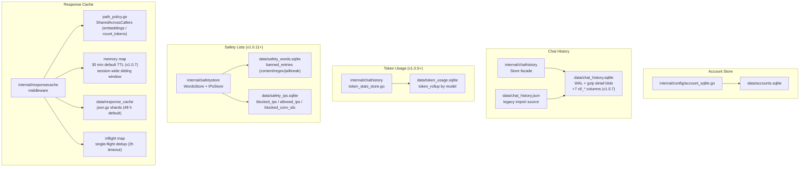
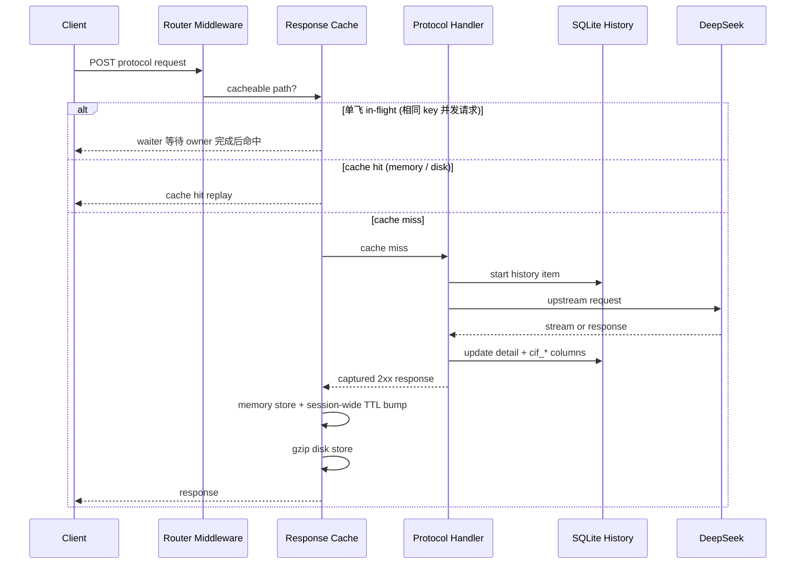

# 存储与缓存

<cite>
**本文档引用的文件**
- [internal/chathistory/store.go](file://internal/chathistory/store.go)
- [internal/chathistory/sqlite_store.go](file://internal/chathistory/sqlite_store.go)
- [internal/chathistory/sqlite_detail.go](file://internal/chathistory/sqlite_detail.go)
- [internal/chathistory/sqlite_rw.go](file://internal/chathistory/sqlite_rw.go)
- [internal/chathistory/sqlite_write.go](file://internal/chathistory/sqlite_write.go)
- [internal/chathistory/token_stats_store.go](file://internal/chathistory/token_stats_store.go)
- [internal/safetystore/store.go](file://internal/safetystore/store.go)
- [internal/config/account_sqlite.go](file://internal/config/account_sqlite.go)
- [internal/responsecache/cache.go](file://internal/responsecache/cache.go)
- [internal/responsecache/path_policy.go](file://internal/responsecache/path_policy.go)
- [internal/currentinputmetrics/metrics.go](file://internal/currentinputmetrics/metrics.go)
- [config.example.json](file://config.example.json)
- [docs/cache-research.md](file://docs/cache-research.md)
</cite>

## 目录

1. [简介](#简介)
2. [项目结构](#项目结构)
3. [核心组件](#核心组件)
4. [架构总览](#架构总览)
5. [详细组件分析](#详细组件分析)
6. [性能考虑](#性能考虑)
7. [故障排查指南](#故障排查指南)
8. [结论](#结论)

## 简介

当前项目把本地状态拆成 **5 个独立 SQLite 文件 + 1 套响应缓存**，每类数据独立备份/轮转：

| 文件 | 内容 | 引入版本 |
|---|---|---|
| `data/accounts.sqlite` | 账号池（identifier / email / mobile / password / token / proxy_id） | 早期 |
| `data/chat_history.sqlite` | 对话历史摘要 + gzip 详情 blob + meta（保留上限、累计已裁剪指标）；**v1.0.7 起新增 7 个 cif_* 列** | 早期 |
| `data/token_usage.sqlite` | 按模型分组的 Token 用量累计（`token_rollup` 表） | v1.0.5 |
| `data/safety_words.sqlite` | 违禁字面量、违禁正则、越狱模式（`banned_entries` 表，kind 三态） | v1.0.11 |
| `data/safety_ips.sqlite` | 黑名单 IP / CIDR、白名单 IP（预留）、黑名单会话 ID（三张表） | v1.0.11 |

对话历史默认上限为 2 万条，达到阈值时批量清理旧记录，仅保留最近 500 条详情；已清理记录的累计指标（请求数、成功率、token 用量）写入 `chat_history_meta` 与 `token_usage.sqlite.token_rollup`，避免总览页被物理保留上限截断。响应缓存用于减少相同协议请求重复打到上游：**v1.0.7 起内存默认 30 分钟、磁盘 48 小时**（TTL 固化进代码常量，操作员通过 WebUI 修改后真正生效——v1.0.7 热重载 bug 修复）。

**章节来源**
- [internal/chathistory/store.go](file://internal/chathistory/store.go)
- [internal/responsecache/cache.go](file://internal/responsecache/cache.go)

## 项目结构

**图表来源**
- [internal/chathistory/sqlite_store.go](file://internal/chathistory/sqlite_store.go)
- [internal/chathistory/sqlite_detail.go](file://internal/chathistory/sqlite_detail.go)
- [internal/responsecache/cache.go](file://internal/responsecache/cache.go)
- [internal/responsecache/path_policy.go](file://internal/responsecache/path_policy.go)

**章节来源**
- [config.example.json](file://config.example.json)

## 核心组件

- `chat_history` 表：摘要字段、状态、模型、账号、耗时、状态码、usage、详情版本；**v1.0.6 起新增 `request_ip` 与 `conversation_id` 列**；**v1.0.7 起新增 7 个 `cif_*` 列**（见下方详细组件分析）。
- `detail_blob`：保存 gzip 压缩后的完整详情，`detail_json` 只用于旧数据迁移。
- `chat_history_meta`：保留上限、版本、修订号、被批量清理记录的累计请求/成功率指标。v1.0.5 起 token 累计已迁移至独立 `token_usage.sqlite`，`chat_history_meta` 中的 `pruned_token_total_*` 仅作为 fallback。
- `token_rollup` 表（`token_usage.sqlite`）：按模型聚合的 input/output/cache_hit/cache_miss/total token；启动时一次性从旧 `chat_history_meta` 迁移（幂等，靠 `migrated_from_chat_history` 标记）。
- `banned_entries` 表（`safety_words.sqlite`）：`(kind, value)` 联合主键，kind ∈ `{content, regex, jailbreak}`；启动时一次性从 `config.SafetyConfig` 迁移。
- `blocked_ips` / `allowed_ips` / `blocked_conversation_ids` 表（`safety_ips.sqlite`）：IP/CIDR 黑名单、白名单（预留）、会话 ID 黑名单。
- `accounts` 表：保存账号标识、邮箱、手机号、密码、运行态 token 和代理绑定；旧配置中的 `accounts` 会在账号库为空时自动迁移。
- `responsecache.Cache`：在路由中间件层读取请求体、计算缓存键、命中回放、未命中捕获响应并写入缓存；单飞 dedup + 会话级滑动窗口 TTL。
- `pathPolicy`：仅持有 `Path` + `SharedAcrossCallers` 两字段；TTL 100% 由 Store 配置决定（v1.0.7 热重载 bug 修复）。
- 磁盘缓存文件：以 `.json.gz` 保存，包含状态码、响应头、响应体、创建时间和过期时间。
- `currentinputmetrics`（v1.0.7 新增包）：记录 CIF 前缀复用率、刷新次数、Tail 字节分布、耗时分位数（见下方详细组件分析）。

**章节来源**
- [internal/chathistory/sqlite_store.go](file://internal/chathistory/sqlite_store.go)
- [internal/responsecache/cache.go](file://internal/responsecache/cache.go)
- [internal/responsecache/path_policy.go](file://internal/responsecache/path_policy.go)

## 架构总览

**图表来源**
- [internal/server/router.go](file://internal/server/router.go)
- [internal/responsecache/cache.go](file://internal/responsecache/cache.go)
- [internal/chathistory/sqlite_write.go](file://internal/chathistory/sqlite_write.go)

**章节来源**
- [internal/server/router.go](file://internal/server/router.go)
- [internal/httpapi/historycapture/capture.go](file://internal/httpapi/historycapture/capture.go)

## 详细组件分析

### SQLite 历史记录

默认路径为 `data/chat_history.sqlite`。启动时会：

- 创建目录和 SQLite 连接。
- 设置 WAL、`synchronous=NORMAL`、`busy_timeout=5000`。
- 建表和索引。
- 从旧 `data/chat_history.json` 首次导入。
- 将上次未完成请求标记为停止。
- 压缩旧的未压缩详情，并执行 checkpoint/VACUUM。

历史保留上限由数据库 meta 保存，默认和最大值都是 `20000`。当记录数达到阈值时，系统会把较旧的记录滚入累计指标并删除详情，只保留最近 `500` 条可展开记录；总览页的总请求数、成功率和总 token 继续使用"已清理累计 + 当前保留记录"的口径。

#### v1.0.7 新增：chat_history 表 +7 cif_* 列

每行历史记录新增以下列，对应该请求的 CIF（Current Input File）前缀复用状态：

| 列名 | 类型 | 含义 |
|---|---|---|
| `cif_applied` | INTEGER (0/1) | CIF 是否对此请求生效（改写了 user message） |
| `cif_prefix_hash` | TEXT | 本次使用的前缀文本 SHA-256 哈希（32-char hex）|
| `cif_prefix_reused` | INTEGER (0/1) | 前缀是否复用了上一次 checkpoint 的版本（未刷新）|
| `cif_prefix_chars` | INTEGER | 前缀字节数 |
| `cif_tail_chars` | INTEGER | 尾部（recent tail）字节数 |
| `cif_tail_entries` | INTEGER | 尾部包含的 transcript 角色块数量 |
| `cif_checkpoint_refresh` | INTEGER (0/1) | 此请求触发了新的 checkpoint（前缀边界重算）|

这些列通过 `ALTER TABLE ... ADD COLUMN` 幂等迁移，旧行默认值为 0 / 空字符串。

### 账号 SQLite

默认路径为 `data/accounts.sqlite`。启动时会创建账号表和邮箱/手机号唯一索引；旧配置文件中的 `accounts` 如账号库为空，会自动导入一次。

### Token 用量独立 SQLite（v1.0.5+）

默认路径为 `data/token_usage.sqlite`。运行时数据流：剪枝时同步把被裁剪行的 token 总和双写到 `token_rollup` 独立库。`Store.TokenUsageStats(window)` 读取时优先从独立库取累计值，旧 `chat_history_meta` keys 作为 fallback。

### 安全策略列表独立 SQLite（v1.0.11+）

违禁字词与 IP 黑白名单从 `config.SafetyConfig` 拆分到 `safety_words.sqlite` + `safety_ips.sqlite`。`internal/safetystore` 包封装两套 store；`requestguard.policyCache.load` 把 SQLite 内容 union 进 `config.SafetyConfig` 列表；admin 保存设置时镜像写两个 SQLite store，失败仅日志告警，不阻塞 admin 请求。

### 响应缓存

默认路径 `data/response_cache`。覆盖范围：OpenAI Chat Completions、Responses、Embeddings；Claude Messages、CountTokens；Gemini GenerateContent、StreamGenerateContent。

**v1.0.7 热重载修复（关键）**：`pathPolicy` 结构体不再持有 `MemoryTTL` / `DiskTTL` 字段，只保留 `Path` + `SharedAcrossCallers`。TTL 完全由 `Cache.memoryTTL` / `Cache.diskTTL`（Store 配置）决定。新默认值固化：

| 层 | 默认 TTL | 常量名 |
|---|---|---|
| 内存层 | **30 分钟** | `defaultMemoryTTL` |
| 磁盘层 | **48 小时** | `defaultDiskTTL` |

操作员通过 WebUI 修改 TTL 后，修改现在**真正生效**（v1.0.6 及更早因 pathPolicy 硬编码导致调整静默无效的 bug 已消除）。

**单飞 in-flight dedup**：streaming 请求（`requestBodyStreamEnabled()` 返回 true）**在单飞之前直接短路**，不进入 inflight map。非 streaming 的相同 cache key 并发请求：第一个到达为 owner，正常走上游；后续请求作为 waiter 阻塞在 `done` channel，超时 2 小时（对齐上游最长慢思考时间），owner 完成后唤醒 waiter 从缓存读取；owner panic 也通过 defer close 唤醒所有 waiter。

**会话级滑动窗口 TTL**：`memoryEntry` 含 `sessionKey`（`sha256(owner) + body fingerprint`）。命中任一条目时，`bumpMemoryExpiryLocked` 给**该会话所有兄弟条目**续租；store 时同步刷新现存兄弟。`/v1/embeddings` 和 `/v1/messages/count_tokens`（SharedAcrossCallers 路径）不参与会话链接，`sessionKey` 为空。

### v1.0.7 新增：currentinputmetrics 包

`internal/currentinputmetrics/metrics.go` 提供进程级别的 CIF 指标聚合：

| 指标字段 | 含义 |
|---|---|
| `TotalSeen` | 经过 CIF apply 步骤的 chat completion 请求总数 |
| `Applied` | CIF 实际改写了请求的子集数 |
| `TriggerRate` | Applied / TotalSeen × 100（CIF 生效率）|
| `Reused` | 前缀复用次数（未触发 checkpoint 刷新）|
| `Refreshes` | checkpoint 刷新次数（前缀边界重算）|
| `FallbackFullUploads` | 回退到全量上传的次数（file 模式下 tail=0）|
| `ReuseRate` | Reused / Applied × 100（复用率）|
| `ActiveStates` | 当前活跃的 CIF 前缀状态数 |
| `TailCharsAvg` / `TailCharsP95` | 尾部字节数均值 / P95 分位 |
| `PrefixCharsAvg` | 前缀字节数均值 |
| `CurrentInputFileMsAvg` | CIF apply 耗时均值（ms）|
| `CurrentInputFileMsReusedAvg` | 复用命中时的耗时均值 |
| `CurrentInputFileMsRefreshAvg` | checkpoint 刷新时的耗时均值 |

WebUI 对应 4 张卡片：**PREFIX 复用率 / CHECKPOINT 刷新 / TAIL 大小 / CURRENT INPUT 耗时**。

**章节来源**
- [internal/chathistory/sqlite_store.go](file://internal/chathistory/sqlite_store.go)
- [internal/chathistory/sqlite_rw.go](file://internal/chathistory/sqlite_rw.go)
- [internal/chathistory/sqlite_write.go](file://internal/chathistory/sqlite_write.go)
- [internal/chathistory/sqlite_import.go](file://internal/chathistory/sqlite_import.go)
- [internal/responsecache/cache.go](file://internal/responsecache/cache.go)
- [internal/responsecache/path_policy.go](file://internal/responsecache/path_policy.go)
- [internal/currentinputmetrics/metrics.go](file://internal/currentinputmetrics/metrics.go)

## 性能考虑

- 5 个 SQLite 单连接配合 WAL，全部本地嵌入式，互不干扰，可独立备份/轮转。热备份策略：`wal_checkpoint(TRUNCATE) + cp`（比 `.backup` 快，最多丢失最后一次写入）。
- 账号 SQLite 与聊天历史分离，批量导入账号不会撑大 `config.json` 或 `.env`。
- 历史详情使用 `gzip.BestCompression`，节省磁盘，按需解压；解压上限保护避免压缩炸弹。
- Token 用量独立库每行只存 6 个 INTEGER + 1 个 TEXT（model），每分钟剪枝事件成本可忽略。
- 安全策略列表独立库的写入路径仅 admin 保存触发；读路径加内存策略缓存（`policyCache.signature`），日常 lookup 不走 SQLite。
- 响应缓存内存层有总字节数上限（默认 3.8 GB），磁盘层按过期和容量删除（默认 16 GB）；大响应超过 `cache.response.max_body_bytes` 不入缓存。
- LLM agent 工作流的全请求体哈希命中率物理上限约 9.6%；v1.0.7 TTL 拉长（30 min / 48 h）将有效命中率推向此上限。
- **v1.0.7 热重载修复**：pathPolicy 不再硬编码 TTL，操作员 WebUI 调整立即生效；新默认值固化进代码常量，无需配置即可享受优化后的 TTL。
- **v1.0.3 embeddings 跨 caller 共享**：N 个 API key 发送相同 embeddings 请求时，仅第一次走上游，后续直接命中共享条目。
- **单飞 dedup**：streaming 请求直接短路跳过，非 streaming 相同 key 并发请求只发一次上游，2h timeout 覆盖上游慢思考。
- **会话级粘性**：单会话内任意 turn 的缓存命中均会续租全会话所有条目的 lease，长对话早期 turn 不会提前失效。

**章节来源**
- [internal/chathistory/sqlite_detail.go](file://internal/chathistory/sqlite_detail.go)
- [internal/responsecache/cache.go](file://internal/responsecache/cache.go)

## 故障排查指南

- 历史列表数量不是 2 万：这是长保留模式的预期行为，达到 2 万后会自动压缩为最近 500 条；如需确认累计量，请看总览页或 `chat_history_meta` 中的清理累计指标。
- SQLite 文件过大：确认当前版本已启动过，旧未压缩详情会在启动时分批压缩并 VACUUM。
- 账号导入后 JSON 里看不到账号：这是预期行为，账号已经进入 `data/accounts.sqlite`；管理台账号列表和批量导出会从内存快照读取。
- 缓存命中率低：检查请求体中是否存在每次变化的字段、是否显式 `no-cache`、是否路径或模型 alias 不一致。对于 LLM completions，跨 API Key 是预期隔离行为（per-caller）；对于 embeddings / count_tokens，v1.0.3 起跨 caller 共享，相同 body 应命中。
- TTL 调整不生效（WebUI 改了但实际没变）：若版本低于 v1.0.7，pathPolicy 存在 TTL 硬编码 bug；升级到 v1.0.7 后 Store TTL 成为绝对权威，WebUI 调整真正生效。
- 磁盘缓存未生效：确认 `cache.response.dir` 可写，且响应为 2xx、响应体未超过上限。
- `inflight_hits` 长期为 0：这是正常情况（无并发相同请求）；当客户端有重试逻辑时，`inflight_hits >= 1` 说明 dedup 生效。streaming 请求不参与单飞。
- 会话粘性未触发（`session_hits=0`）：检查是否使用了 SharedAcrossCallers 路径（embeddings / count_tokens）——这两条路径不参与会话链接；正常 LLM completion 路径的会话命中会反映在 `session_hits`。
- cif_* 列全是 0：检查 CIF 功能是否启用（`remote_file_upload_enabled` 和 inline prefix 路径是否都被 disabled）；或检查请求是否达到最小 tail 长度阈值。

**章节来源**
- [internal/chathistory/store.go](file://internal/chathistory/store.go)
- [internal/responsecache/cache.go](file://internal/responsecache/cache.go)

## 结论

账号 SQLite、历史 SQLite（含 v1.0.7 新增 7 个 cif_* 列）和 gzip 响应缓存是当前版本的核心运行态能力：账号库让批量账号脱离 JSON，历史库服务管理台与问题回溯，缓存降低重复请求成本。v1.0.7 修复了 pathPolicy TTL 硬编码导致热重载不生效的 bug，并将默认 TTL（30 min 内存 / 48 h 磁盘）固化进代码常量，令 operator 配置调整真正落地。三者都使用本地文件系统，部署时应持久化 `data/` 或至少持久化配置指定的账号、历史与缓存路径。

**章节来源**
- [config.example.json](file://config.example.json)
