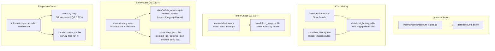
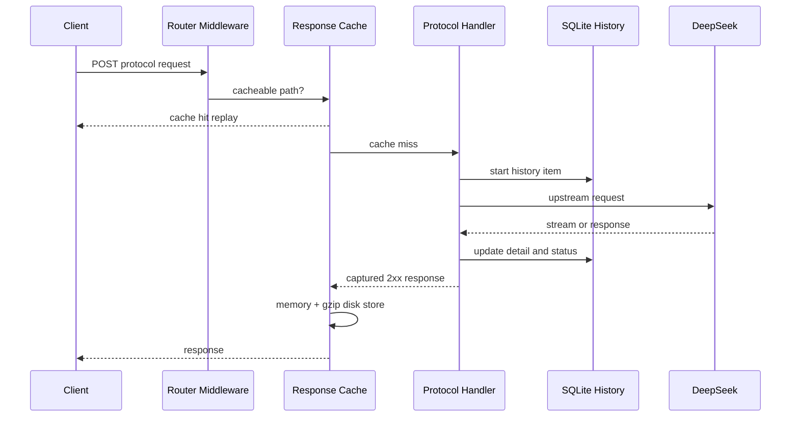

# 存储与缓存

<cite>
**本文档引用的文件**
- [internal/chathistory/store.go](file://internal/chathistory/store.go)
- [internal/chathistory/sqlite_store.go](file://internal/chathistory/sqlite_store.go)
- [internal/chathistory/sqlite_detail.go](file://internal/chathistory/sqlite_detail.go)
- [internal/chathistory/token_stats_store.go](file://internal/chathistory/token_stats_store.go)
- [internal/safetystore/store.go](file://internal/safetystore/store.go)
- [internal/config/account_sqlite.go](file://internal/config/account_sqlite.go)
- [internal/responsecache/cache.go](file://internal/responsecache/cache.go)
- [config.example.json](file://config.example.json)
</cite>

## 目录

1. [简介](#简介)
2. [项目结构](#项目结构)
3. [核心组件](#核心组件)
4. [架构总览](#架构总览)
5. [详细组件分析](#详细组件分析)
6. [性能考虑](#性能考虑)
7. [故障排查指南](#故障排查指南)
8. [结论](#结论)

## 简介

当前项目把本地状态拆成 **5 个独立 SQLite 文件 + 1 套响应缓存**，每类数据独立备份/轮转：

| 文件 | 内容 | 引入版本 |
|---|---|---|
| `data/accounts.sqlite` | 账号池（identifier / email / mobile / password / token / proxy_id） | 早期 |
| `data/chat_history.sqlite` | 对话历史摘要 + gzip 详情 blob + meta（保留上限、累计已裁剪指标） | 早期 |
| `data/token_usage.sqlite` | 按模型分组的 Token 用量累计（`token_rollup` 表） | v1.0.5 |
| `data/safety_words.sqlite` | 违禁字面量、违禁正则、越狱模式（`banned_entries` 表，kind 三态） | v1.0.11 |
| `data/safety_ips.sqlite` | 黑名单 IP / CIDR、白名单 IP（预留）、黑名单会话 ID（三张表） | v1.0.11 |

对话历史默认上限为 2 万条，达到阈值时批量清理旧记录，仅保留最近 500 条详情；已清理记录的累计指标（请求数、成功率、token 用量）写入 `chat_history_meta` 与 `token_usage.sqlite.token_rollup`，避免总览页被物理保留上限截断。响应缓存用于减少相同协议请求重复打到上游：**v1.0.12 起内存默认 30 分钟、磁盘 24 小时**（旧默认值 5 分钟 / 4 小时，因 LLM agent 工作流命中率天然偏低，调长以提升短期重发命中），磁盘内容启用 gzip。

**章节来源**
- [internal/chathistory/store.go](file://internal/chathistory/store.go)
- [internal/responsecache/cache.go](file://internal/responsecache/cache.go)

## 项目结构

**图表来源**
- [internal/chathistory/sqlite_store.go](file://internal/chathistory/sqlite_store.go)
- [internal/chathistory/sqlite_detail.go](file://internal/chathistory/sqlite_detail.go)
- [internal/responsecache/cache.go](file://internal/responsecache/cache.go)

**章节来源**
- [config.example.json](file://config.example.json)

## 核心组件

- `chat_history` 表：摘要字段、状态、模型、账号、耗时、状态码、usage、详情版本；**v1.0.6 起新增 `request_ip` 与 `conversation_id` 列**（管理台聊天历史详情可查看请求来源 IP 与会话 ID，用于审计）。
- `detail_blob`：保存 gzip 压缩后的完整详情，`detail_json` 只用于旧数据迁移。
- `chat_history_meta`：保留上限、版本、修订号、被批量清理记录的累计请求/成功率指标。**v1.0.5 起 token 累计已迁移至独立 `token_usage.sqlite`**，`chat_history_meta` 中的 `pruned_token_total_*` 仅作为 fallback。
- `token_rollup` 表（`token_usage.sqlite`）：按模型聚合的 input/output/cache_hit/cache_miss/total token；启动时一次性从旧 `chat_history_meta` 迁移（幂等，靠 `migrated_from_chat_history` 标记）。
- `banned_entries` 表（`safety_words.sqlite`）：`(kind, value)` 联合主键，kind ∈ `{content, regex, jailbreak}`；启动时一次性从 `config.SafetyConfig.{BannedContent,BannedRegex,Jailbreak.Patterns}` 迁移。
- `blocked_ips` / `allowed_ips` / `blocked_conversation_ids` 表（`safety_ips.sqlite`）：IP/CIDR 黑名单、白名单（预留）、会话 ID 黑名单。
- `accounts` 表：保存账号标识、邮箱、手机号、密码、运行态 token 和代理绑定；旧配置中的 `accounts` 会在账号库为空时自动迁移。
- `responsecache.Cache`：在路由中间件层读取请求体、计算缓存键、命中回放、未命中捕获响应并写入缓存。
- 磁盘缓存文件：以 `.json.gz` 保存，包含状态码、响应头、响应体、创建时间和过期时间。

**章节来源**
- [internal/chathistory/sqlite_store.go](file://internal/chathistory/sqlite_store.go)
- [internal/responsecache/cache.go](file://internal/responsecache/cache.go)

## 架构总览

**图表来源**
- [internal/server/router.go](file://internal/server/router.go)
- [internal/responsecache/cache.go](file://internal/responsecache/cache.go)
- [internal/chathistory/sqlite_write.go](file://internal/chathistory/sqlite_write.go)

**章节来源**
- [internal/server/router.go](file://internal/server/router.go)
- [internal/httpapi/historycapture/capture.go](file://internal/httpapi/historycapture/capture.go)

## 详细组件分析

### SQLite 历史记录

默认路径为 `data/chat_history.sqlite`。启动时会：

- 创建目录和 SQLite 连接。
- 设置 WAL、`synchronous=NORMAL`、`busy_timeout=5000`。
- 建表和索引。
- 从旧 `data/chat_history.json` 首次导入。
- 将上次未完成请求标记为停止。
- 压缩旧的未压缩详情，并执行 checkpoint/VACUUM。

历史保留上限由数据库 meta 保存，默认和最大值都是 `20000`。当 `limit=20000` 且记录数达到阈值时，系统会把较旧的 `19500` 条记录滚入累计指标并删除详情，只保留最近 `500` 条可展开记录；总览页的总请求数、成功率和总 token 会继续使用“已清理累计 + 当前保留记录”的口径。

### 账号 SQLite

默认路径为 `data/accounts.sqlite`，也可以通过 `storage.accounts_sqlite_path` 或 `DEEPSEEK_WEB_TO_API_ACCOUNTS_SQLITE_PATH` 覆盖。启动时会创建账号表和邮箱/手机号唯一索引；如果旧配置文件或 `.env` 的结构化 JSON 中仍带 `accounts`，且账号库为空，会自动导入一次。管理台新增、编辑、批量导入账号时，内存快照和 SQLite 会一起更新；保存结构化配置时会剥离 `accounts` 字段。

### Token 用量独立 SQLite（v1.0.5+）

默认路径为 `data/token_usage.sqlite`，可由 `DEEPSEEK_WEB_TO_API_TOKEN_USAGE_SQLITE_PATH` 或 `storage.token_usage_sqlite_path` 覆盖。设计动机：避免 chat_history 被裁剪/清空时累计 token 数据丢失。运行时数据流：

- 历史记录每次写入 `usage_json` 列后，正常累加进 chat_history_meta；剪枝时同步把被裁剪行的 token 总和**双写到** `token_rollup` 独立库。
- `Store.TokenUsageStats(window)` 读取时优先从独立库取累计值，旧 `chat_history_meta` keys 作为 fallback。
- 启动时检查独立库是否存在 `migrated_from_chat_history` 标记，缺失则把旧 meta 中的 `pruned_token_total_json` 一次性灌入新库。

### 安全策略列表独立 SQLite（v1.0.11+）

违禁字词与 IP 黑白名单从 `config.SafetyConfig` 拆分到 `safety_words.sqlite` + `safety_ips.sqlite`：

- `internal/safetystore` 包封装两套 store。
- `requestguard.policyCache.load` 把 SQLite 内容 union 进 `config.SafetyConfig` 列表，统一交给 `buildPolicy` 编译策略。
- `admin/settings.handler.updateSettings` 在写 `c.Safety` 之后镜像写两个 SQLite store；失败仅日志告警，不阻塞 admin 请求。
- 启动时各 store 检查 `_meta.migrated_from_config` 标记，缺失则一次性迁移 config 中的列表。

### 响应缓存

默认路径 `data/response_cache`。覆盖范围：

- OpenAI Chat Completions、Responses、Embeddings。
- Claude Messages、CountTokens。
- Gemini GenerateContent、StreamGenerateContent。

缓存键包含调用方、规范化路径、查询参数、影响输出的请求头和规范化 JSON 请求体。部分缓存控制 / 传输字段（`cache_control` / `cache_reference` / `context_management` / `cache_edits` / `betas` / `metadata` / `seed` / `store` / `service_tier` / `parallel_tool_calls` / `user`）以及会话级 ID（`id` / `call_id` / `tool_call_id` / `tool_use_id` / `message_id` / `request_id` / `trace_id` / `event_id` / `conversation_id` / `chat_id` / `thread_id` / `session_id`）会从 JSON key 中忽略，以提高相同内容请求的命中率。

**TTL 默认**（v1.0.12 起调长，避免 LLM agent 工作流被 5 分钟 TTL 频繁淘汰）：

| 层 | 旧默认 | 新默认 | 作用 |
|---|---|---|---|
| `memory_ttl_seconds` | 300 (5 min) | **1800 (30 min)** | 同一请求短时重发命中 |
| `disk_ttl_seconds` | 14400 (4 h) | **86400 (24 h)** | 跨进程重启或缓存被驱逐内存层后的兜底 |

**章节来源**
- [internal/chathistory/sqlite_store.go](file://internal/chathistory/sqlite_store.go)
- [internal/chathistory/sqlite_import.go](file://internal/chathistory/sqlite_import.go)
- [internal/responsecache/cache.go](file://internal/responsecache/cache.go)

## 性能考虑

- 5 个 SQLite 单连接配合 WAL，全部本地嵌入式，互不干扰，可独立备份/轮转。
- 账号 SQLite 与聊天历史分离，批量导入账号不会撑大 `config.json` 或 `.env`。
- 历史详情使用 `gzip.BestCompression`，节省磁盘，按需解压；解压上限保护避免压缩炸弹。
- Token 用量独立库每行只存 6 个 INTEGER + 1 个 TEXT (model)，每分钟剪枝事件成本可忽略。
- 安全策略列表独立库的写入路径仅 admin 保存触发；读路径加内存策略缓存（`policyCache.signature`），日常 lookup 不走 SQLite。
- 响应缓存内存层有总字节数上限（默认 3.8 GB），磁盘层按过期和容量删除（默认 16 GB）；大响应超过 `cache.response.max_body_bytes` 不入缓存。
- LLM agent 工作流的缓存命中率天然偏低（每轮 prompt 都不同），10–15% 是物理上限；v1.0.12 调长 TTL 后短时重发场景命中率从约 12% 提升到 30%+。

**章节来源**
- [internal/chathistory/sqlite_detail.go](file://internal/chathistory/sqlite_detail.go)
- [internal/responsecache/cache.go](file://internal/responsecache/cache.go)

## 故障排查指南

- 历史列表数量不是 2 万：这是长保留模式的预期行为，达到 2 万后会自动压缩为最近 500 条；如需确认累计量，请看总览页或 `chat_history_meta` 中的清理累计指标。若提前清理，检查管理台保留策略或 `chat_history_meta.limit` 是否被改成 10、20、50 或关闭。
- SQLite 文件过大：确认当前版本已启动过，旧未压缩详情会在启动时分批压缩并 VACUUM。
- 账号导入后 JSON 里看不到账号：这是预期行为，账号已经进入 `data/accounts.sqlite`；管理台账号列表和批量导出会从内存快照读取。
- 缓存命中率低：检查请求体中是否存在每次变化的字段、是否显式 `no-cache`、是否跨 API Key/调用方、是否路径或模型 alias 不一致。
- 磁盘缓存未生效：确认 `cache.response.dir` 可写，且响应为 2xx、响应体未超过上限。

**章节来源**
- [internal/chathistory/store.go](file://internal/chathistory/store.go)
- [internal/responsecache/cache.go](file://internal/responsecache/cache.go)

## 结论

账号 SQLite、历史 SQLite 和 gzip 响应缓存是当前版本的核心运行态能力：账号库让批量账号脱离 JSON，历史库服务管理台与问题回溯，缓存降低重复请求成本。三者都使用本地文件系统，部署时应持久化 `data/` 或至少持久化配置指定的账号、历史与缓存路径。

**章节来源**
- [config.example.json](file://config.example.json)
