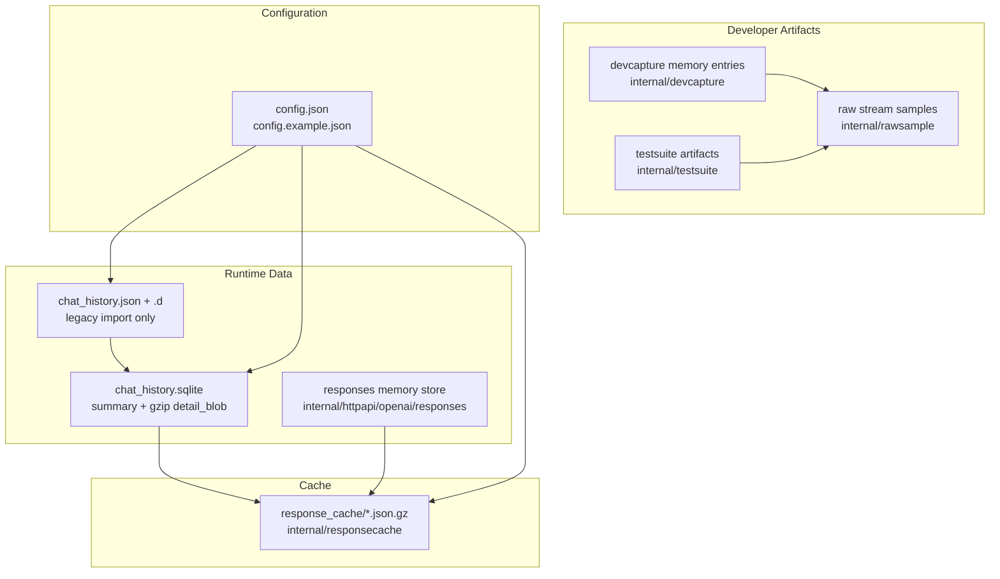
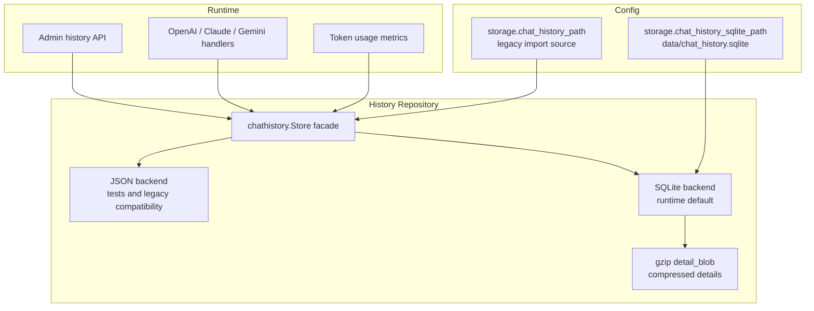

# JSON 到 SQLite 存储迁移分析

<cite>
**本文引用的源文件**
- [internal/chathistory/store.go](file://internal/chathistory/store.go)
- [internal/chathistory/sqlite_store.go](file://internal/chathistory/sqlite_store.go)
- [internal/chathistory/sqlite_detail.go](file://internal/chathistory/sqlite_detail.go)
- [internal/chathistory/metrics.go](file://internal/chathistory/metrics.go)
- [internal/httpapi/openai/responses/response_store.go](file://internal/httpapi/openai/responses/response_store.go)
- [internal/responsecache/cache.go](file://internal/responsecache/cache.go)
- [internal/devcapture/store.go](file://internal/devcapture/store.go)
- [internal/rawsample/rawsample.go](file://internal/rawsample/rawsample.go)
- [internal/testsuite/runner_http.go](file://internal/testsuite/runner_http.go)
- [internal/testsuite/runner_summary.go](file://internal/testsuite/runner_summary.go)
- [config.example.json](file://config.example.json)
</cite>

## 目录

1. [简介](#简介)
2. [项目结构](#项目结构)
3. [核心组件](#核心组件)
4. [架构总览](#架构总览)
5. [详细组件分析](#详细组件分析)
6. [依赖分析](#依赖分析)
7. [性能考虑](#性能考虑)
8. [故障排查指南](#故障排查指南)
9. [结论](#结论)

## 简介

本文评估当前仓库中哪些 JSON 或类 JSON 文件适合迁移到 SQLite。判断维度包括数据增长速度、是否需要分页查询、是否需要按调用方或模型过滤、写入频率、跨重启保留价值、是否适合人类编辑，以及迁移后对维护复杂度的影响。

总体结论：聊天历史已经完成运行态 SQLite 迁移，旧 `chat_history.json` 与 `chat_history.json.d/` 仅作为首次导入兼容来源；聊天历史详情在 SQLite 内使用 gzip BLOB 存储，避免 20,000 条完整上下文以未压缩 JSON 持续放大库文件；`responsecache` 可先保留 gzip 文件正文，只把索引/元数据迁移为 SQLite；OpenAI Responses 的短期 `responseStore` 可作为后续可选持久化项；`config.json`、raw samples、测试制品和协议 fixture 不建议迁移。

**章节来源**
- [store.go:38-145](file://internal/chathistory/store.go#L38-L145)
- [response_store.go:16-89](file://internal/httpapi/openai/responses/response_store.go#L16-L89)
- [cache.go:78-85](file://internal/responsecache/cache.go#L78-L85)
- [config.example.json:1-92](file://config.example.json#L1-L92)

## 项目结构

当前持久化数据主要分布在运行数据、缓存、开发抓包、回放样本和测试制品几类位置。它们的读写模式差异很大，不适合一次性全部改为 SQLite。



**图表来源**
- [store.go:168-190](file://internal/chathistory/store.go#L168-L190)
- [sqlite_store.go:31-190](file://internal/chathistory/sqlite_store.go#L31-L190)
- [sqlite_detail.go:15-169](file://internal/chathistory/sqlite_detail.go#L15-L169)
- [response_store.go:16-24](file://internal/httpapi/openai/responses/response_store.go#L16-L24)
- [cache.go:78-85](file://internal/responsecache/cache.go#L78-L85)
- [rawsample.go:62-132](file://internal/rawsample/rawsample.go#L62-L132)
- [runner_http.go:149-207](file://internal/testsuite/runner_http.go#L149-L207)

**章节来源**
- [store.go:168-190](file://internal/chathistory/store.go#L168-L190)
- [sqlite_store.go:31-190](file://internal/chathistory/sqlite_store.go#L31-L190)
- [rawsample.go:62-132](file://internal/rawsample/rawsample.go#L62-L132)
- [runner_summary.go:12-43](file://internal/testsuite/runner_summary.go#L12-L43)

## 核心组件

| 数据区域 | 当前形态 | SQLite 建议 | 原因 |
| --- | --- | --- | --- |
| 聊天历史 | SQLite `chat_history` summary + gzip `detail_blob`；旧 `chat_history.json` 仅用于空库导入 | 已迁移 | 有分页、详情读取、删除、指标聚合和大量写入，SQLite 避免 JSON 索引随记录量膨胀 |
| Responses store | 进程内 map + TTL | 可选迁移 | 当前 TTL 短且内存实现简单；若要跨重启查询 `/v1/responses/{id}`，可迁移 |
| 协议响应缓存 | gzip 压缩 JSON 文件 | 元数据可迁移，正文可保留 gzip 文件 | 缓存体可能很大，SQLite 管索引更合适，正文直接进 BLOB 会放大库体积和 vacuum 成本 |
| devcapture | 进程内 ring buffer | 低优先级可选 | 调试价值高但默认容量小，迁移只适合需要长期审计的部署 |
| raw samples | 目录 + `meta.json` + SSE 文件 | 不建议迁移 | 样本需要 Git diff、人工查看、回放脚本直接读文件 |
| testsuite 制品 | 每次运行目录内 JSON/文本文件 | 不建议迁移 | 制品是一次性诊断包，文件结构更利于归档和外发 |
| 运行配置 | `config.json` | 不建议迁移 | 配置刚合并为单一人类可编辑文件，SQLite 会降低可维护性和可审计性 |

**章节来源**
- [store.go:189-443](file://internal/chathistory/store.go#L189-L443)
- [metrics.go:12-73](file://internal/chathistory/metrics.go#L12-L73)
- [response_store.go:43-89](file://internal/httpapi/openai/responses/response_store.go#L43-L89)
- [cache.go:338-520](file://internal/responsecache/cache.go#L338-L520)
- [devcapture/store.go:75-87](file://internal/devcapture/store.go#L75-L87)

## 架构总览

已采用渐进式迁移：`chathistory.Store` 保持原有调用 API，服务运行态默认使用 SQLite 后端；首次启动时如果 SQLite 为空，会从旧 `chat_history.json` 与 `.d/` 详情目录导入，旧 JSON 文件保留为核对来源。历史保留上限已收敛为 20,000 条，详情字段写入前会 gzip 压缩到 `detail_blob`，旧库中残留的未压缩 `detail_json` 会在启动时按小批量迁移并清空原文列，随后尝试 `VACUUM` 回收 SQLite 文件空间。



**图表来源**
- [store.go:189-443](file://internal/chathistory/store.go#L189-L443)
- [metrics.go:31-73](file://internal/chathistory/metrics.go#L31-L73)
- [config.example.json:63-82](file://config.example.json#L63-L82)

**章节来源**
- [store.go:189-443](file://internal/chathistory/store.go#L189-L443)
- [store.go:455-710](file://internal/chathistory/store.go#L455-L710)

## 详细组件分析

### 聊天历史：最适合 SQLite

旧文件后端曾由 `chathistory.Store` 维护索引、详情缓存、dirty/deleted 集合，并在 `Start`、`Update`、`Delete`、`Clear`、`SetLimit` 后写回文件。当前运行态默认走 SQLite 后端：summary 列支持分页与过滤，详情由 gzip `detail_blob` 存储，旧 JSON 后端保留给测试与兼容导入。

当前第一阶段表结构：

```sql
CREATE TABLE chat_history (
  id TEXT PRIMARY KEY,
  revision INTEGER NOT NULL,
  created_at INTEGER NOT NULL,
  updated_at INTEGER NOT NULL,
  completed_at INTEGER,
  status TEXT NOT NULL,
  caller_id TEXT,
  account_id TEXT,
  model TEXT,
  stream INTEGER NOT NULL,
  user_input TEXT,
  preview TEXT,
  status_code INTEGER,
  elapsed_ms INTEGER,
  finish_reason TEXT,
  detail_revision INTEGER NOT NULL,
  usage_json TEXT,
  detail_json TEXT NOT NULL DEFAULT '',
  detail_encoding TEXT NOT NULL DEFAULT '',
  detail_blob BLOB NOT NULL DEFAULT X''
);

CREATE INDEX idx_chat_history_updated_at ON chat_history(updated_at DESC, created_at DESC);
CREATE INDEX idx_chat_history_status ON chat_history(status);
CREATE INDEX idx_chat_history_account_id ON chat_history(account_id);
CREATE INDEX idx_chat_history_caller_id ON chat_history(caller_id);
CREATE INDEX idx_chat_history_model ON chat_history(model);
```

迁移收益包括：运行态不再重写大索引、列表分页不再复制大数组、删除不再扫描所有 JSON 文件、指标可以直接从 SQLite summary 列聚合。当前实现保留 `detail_json` 作为旧库兼容读与迁移来源，新写入统一清空原始 JSON 列并把完整详情写入 gzip 压缩后的 `detail_blob`；后续再把 usage、messages、content 拆表也可以。

**章节来源**
- [store.go:168-190](file://internal/chathistory/store.go#L168-L190)
- [sqlite_store.go:31-190](file://internal/chathistory/sqlite_store.go#L31-L190)
- [sqlite_detail.go:15-169](file://internal/chathistory/sqlite_detail.go#L15-L169)
- [metrics.go:31-73](file://internal/chathistory/metrics.go#L31-L73)

### Responses store：按跨重启需求决定

OpenAI Responses 的 `responseStore` 当前是内存 map，按 owner + response id 隔离，写入和读取都会克隆 map，并用 TTL 清理过期项。它适合短期内存态；如果业务希望缓存回放后、服务重启后仍能 `GET /v1/responses/{response_id}`，可以迁移为 SQLite TTL 表。

建议表结构：

```sql
CREATE TABLE responses_store (
  owner TEXT NOT NULL,
  response_id TEXT NOT NULL,
  expires_at INTEGER NOT NULL,
  value_json TEXT NOT NULL,
  PRIMARY KEY (owner, response_id)
);

CREATE INDEX idx_responses_store_expires_at ON responses_store(expires_at);
```

该项不建议抢在聊天历史之前做，因为当前默认 TTL 只有 15 分钟，收益主要来自跨重启一致性，而不是性能。

**章节来源**
- [response_store.go:16-89](file://internal/httpapi/openai/responses/response_store.go#L16-L89)

### 协议响应缓存：SQLite 做索引，gzip 文件保留正文

`responsecache` 当前磁盘记录是 `.json.gz`，记录中同时包含 header、status、body 和过期时间；淘汰时通过遍历目录统计文件大小，并按文件修改时间删除旧文件。迁移到 SQLite 后，最有价值的是把 key、expires_at、size、path、status、header_json 作为索引管理，正文继续使用 gzip 文件保存。

不建议第一阶段把完整 body 放入 SQLite BLOB：协议响应体最大可到 64MB，频繁写入和删除会让数据库文件膨胀，`VACUUM` 成本也会影响在线服务。更稳妥的方案是 `response_cache_index` 表加文件正文。

建议表结构：

```sql
CREATE TABLE response_cache_index (
  cache_key TEXT PRIMARY KEY,
  created_at INTEGER NOT NULL,
  expires_at INTEGER NOT NULL,
  size_bytes INTEGER NOT NULL,
  status INTEGER NOT NULL,
  header_json TEXT NOT NULL,
  body_path TEXT NOT NULL
);

CREATE INDEX idx_response_cache_expires_at ON response_cache_index(expires_at);
CREATE INDEX idx_response_cache_created_at ON response_cache_index(created_at);
```

**章节来源**
- [cache.go:78-85](file://internal/responsecache/cache.go#L78-L85)
- [cache.go:338-520](file://internal/responsecache/cache.go#L338-L520)

### devcapture：低优先级可选


**章节来源**
- [devcapture/store.go:24-87](file://internal/devcapture/store.go#L24-L87)
- [devcapture/store.go:124-232](file://internal/devcapture/store.go#L124-L232)

### raw samples 与 testsuite 制品：保留文件

raw samples 保存 `meta.json` 和 `upstream.stream.sse`，目标是回放、人工检查和纳入测试资产；testsuite 每个 case 输出 request、response、assertions、meta、stream raw 和 summary。它们天生是文件制品，适合归档、打包、Git diff 和外发排查，不适合进入 SQLite。

**章节来源**
- [rawsample.go:62-132](file://internal/rawsample/rawsample.go#L62-L132)
- [runner_http.go:149-207](file://internal/testsuite/runner_http.go#L149-L207)
- [runner_summary.go:12-43](file://internal/testsuite/runner_summary.go#L12-L43)

### config.json：不要迁移

本次配置治理已经把运行配置集中到 `config.json`，这是开发者和部署者直接编辑、审查、复制、导入导出的单一配置源。把它迁移到 SQLite 会带来反效果：无法直观看 diff，编辑门槛变高，部署平台注入 JSON/Base64 的路径也会变复杂。配置应继续保留 JSON，SQLite 只承担运行态数据。

**章节来源**
- [config.example.json:1-92](file://config.example.json#L1-L92)

## 依赖分析


迁移层面建议新增 repository 接口，而不是让 handler 直接依赖 SQLite。第一阶段可以让 `chathistory.Store` 变成接口适配器：`json` 后端沿用当前文件实现，`sqlite` 后端实现相同方法；Admin API 和协议 handler 只依赖接口。

**章节来源**
- [store.go:135-145](file://internal/chathistory/store.go#L135-L145)
- [config.example.json:63-82](file://config.example.json#L63-L82)

## 性能考虑

SQLite 最能解决的问题是“列表、分页、过滤、聚合和局部更新”。聊天历史一旦达到数万条，JSON 索引重写和启动加载会明显拖慢；SQLite 可以用 `updated_at`、`caller_id`、`model`、`status` 索引把热点查询压到毫秒级，并减少启动时内存占用。详情压缩迁移按小批量执行，避免为了压缩旧库而把全部 `detail_json` 一次性读入内存。

缓存正文不应急着放入 SQLite。当前响应缓存已经启用 gzip，正文落文件的顺序读写效率很好；SQLite 更适合管理元数据和淘汰顺序。对于大体积响应，把文件路径和元数据入库、正文继续落盘，能兼顾查询速度和磁盘空间回收。

**章节来源**
- [metrics.go:31-73](file://internal/chathistory/metrics.go#L31-L73)
- [cache.go:470-520](file://internal/responsecache/cache.go#L470-L520)

## 故障排查指南

- 迁移后历史为空：先检查旧 `chat_history.json` 是否存在，并确认 `storage.chat_history_sqlite_path` 指向的新库是否为空；SQLite 仅在空库时自动导入旧 JSON。
- SQLite 被锁：确保单进程写入，写路径集中在 repository 层，并启用短事务；不要在 handler 中持有长事务。
- 数据库文件变大：聊天历史详情会压缩到 `detail_blob`，启动时会迁移旧的未压缩 `detail_json` 并尝试 `VACUUM`；如果磁盘可用空间不足或 SQLite 正忙，日志会出现 compact 失败，库文件可能要等下次成功 `VACUUM` 后才明显变小。
- 回退到旧二进制前需注意：新版本会清空已压缩行的 `detail_json`，旧二进制无法读取 `detail_blob`；如需回退，应先保留升级前的数据库备份或继续使用支持压缩详情的新版本。

**章节来源**
- [store.go:455-710](file://internal/chathistory/store.go#L455-L710)
- [cache.go:338-520](file://internal/responsecache/cache.go#L338-L520)

## 结论

当前已经完成第一阶段：聊天历史运行态迁移到 SQLite，并保留 JSON 后端与旧文件自动导入路径；SQLite 详情已改为 gzip BLOB 写入，降低 20,000 条长上下文历史对磁盘的占用。后续建议第二阶段把响应缓存的元数据索引迁移到 SQLite，正文继续 gzip 文件；第三阶段再根据实际需求决定是否持久化 Responses store 和 devcapture。

不建议迁移 `config.json`、raw samples、协议 fixture 和 testsuite 制品。它们的核心价值是可读、可复制、可 diff、可归档，SQLite 会增加维护成本而不是降低维护成本。

**章节来源**
- [store.go:189-443](file://internal/chathistory/store.go#L189-L443)
- [response_store.go:16-89](file://internal/httpapi/openai/responses/response_store.go#L16-L89)
- [cache.go:338-520](file://internal/responsecache/cache.go#L338-L520)
- [rawsample.go:62-132](file://internal/rawsample/rawsample.go#L62-L132)
- [config.example.json:1-92](file://config.example.json#L1-L92)
