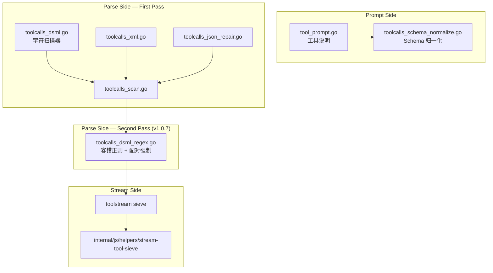
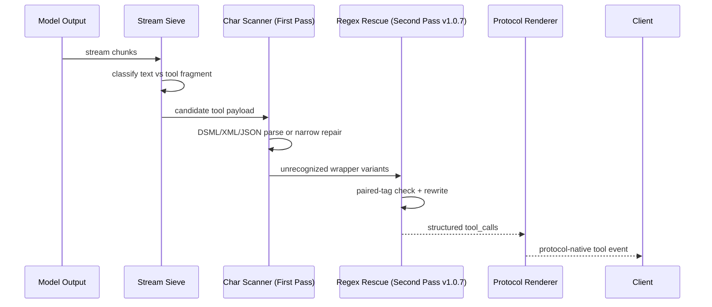

# 工具调用语义

<cite>
**本文档引用的文件**
- [internal/toolcall/toolcalls_parse.go](file://internal/toolcall/toolcalls_parse.go)
- [internal/toolcall/toolcalls_dsml.go](file://internal/toolcall/toolcalls_dsml.go)
- [internal/toolcall/toolcalls_dsml_regex.go](file://internal/toolcall/toolcalls_dsml_regex.go)
- [internal/toolcall/toolcalls_xml.go](file://internal/toolcall/toolcalls_xml.go)
- [internal/toolcall/toolcalls_markup.go](file://internal/toolcall/toolcalls_markup.go)
- [internal/toolcall/toolcalls_parse_markup.go](file://internal/toolcall/toolcalls_parse_markup.go)
- [internal/toolcall/toolcalls_scan.go](file://internal/toolcall/toolcalls_scan.go)
- [internal/toolstream/tool_sieve_core.go](file://internal/toolstream/tool_sieve_core.go)
- [internal/js/helpers/stream-tool-sieve/index.js](file://internal/js/helpers/stream-tool-sieve/index.js)
- [internal/js/helpers/stream-tool-sieve/parse_payload.js](file://internal/js/helpers/stream-tool-sieve/parse_payload.js)
- [tests/compat/fixtures/toolcalls/canonical_tool_call.json](file://tests/compat/fixtures/toolcalls/canonical_tool_call.json)
</cite>

## 目录

1. [简介](#简介)
2. [项目结构](#项目结构)
3. [核心组件](#核心组件)
4. [架构总览](#架构总览)
5. [详细组件分析](#详细组件分析)
6. [故障排查指南](#故障排查指南)
7. [结论](#结论)

## 简介

工具调用语义的目标是兼容用户客户端的多种工具请求和模型输出形态，同时尽量避免把工具标签泄漏到普通文本。当前实现支持 DSML、XML、JSON 片段和流式筛分，Go 与 Node 侧保持语义对齐。

> **v1.0.5 ~ v1.0.7 关键变更**
>
> - **v1.0.7 DSML regex 救援（二次扫描）**：在字符逐字符扫描器之后新增容错正则二次扫描（`toolcalls_dsml_regex.go`）。覆盖扫描器未识别的 wrapper 变体：`<DSML.tool_calls>`、`<|DSML : tool_calls|>`、`<dsml::tool_calls>`、`<【DSML】tool_calls>` 及全角竖线、连字符/下划线分隔符形态。配对强制要求：**只有 opener 和对应 closer 同时存在时才改写**，孤立标签原样保留，不伪造工具调用内容。详见下方"v1.0.7 DSML regex 救援"节。
> - **v1.0.7 流式提前 finalize**：`internal/httpapi/openai/chat/chat_stream_runtime.go` 的 `onParsed` 在 `evt.ToolCalls` 完整封闭并 `sendDelta` 后立即返回 `Stop: true, StopReason: HandlerRequested`，触发 `finalize()` 走标准 `finish_reason="tool_calls"` + `[DONE]` 路径。修复了上游 DeepSeek 偶发不发 `[DONE]` 时客户端读到工具块但拿不到 finish 帧的概率断流。
> - **v1.0.7 token 渗漏清理增强**：`internal/httpapi/openai/shared/leaked_output_sanitize.go` 三个新模式，覆盖全角斜杠 `／`、未闭合 DSML 残片、`<|end_of_tool_result|tool_use_error: ...` trailing pipe 等形态。
> - **v1.0.5 MCP 适配**：`expandMCPServersAsTools` 把 Anthropic `mcp_servers[]` 字段中的 `tool_configuration.allowed_tools` 展平为 `<server>.<tool>` 命名虚拟工具。
> - **v1.0.3 CDATA 管道变体兼容**（Claude Code v2.1.128 子代理名乱码修复）：详见下方"v1.0.3 增量"节。

**章节来源**
- [internal/toolcall/toolcalls_parse.go](file://internal/toolcall/toolcalls_parse.go)
- [internal/toolstream/tool_sieve_core.go](file://internal/toolstream/tool_sieve_core.go)

## 项目结构



**图表来源**
- [internal/toolcall/tool_prompt.go](file://internal/toolcall/tool_prompt.go)
- [internal/toolcall/toolcalls_dsml.go](file://internal/toolcall/toolcalls_dsml.go)
- [internal/toolcall/toolcalls_dsml_regex.go](file://internal/toolcall/toolcalls_dsml_regex.go)
- [internal/toolstream/tool_sieve_core.go](file://internal/toolstream/tool_sieve_core.go)

**章节来源**
- [internal/js/helpers/stream-tool-sieve/index.js](file://internal/js/helpers/stream-tool-sieve/index.js)

## 核心组件

- **Tool Prompt**：将工具定义转成模型可见的调用格式约束。
- **Schema Normalize**：修正工具 schema 中的常见客户端兼容问题。
- **DSML Parser（第一扫描）**：字符逐字符扫描器，解析 `<|DSML|tool_calls>` 及已登记的变体（ASCII/全角竖线、零宽字符、`▁` 分隔符、折行闭合标签、Chinese 名称等）。
- **DSML Regex Rescue（第二扫描，v1.0.7 新增）**：容错正则二次扫描，覆盖第一扫描器未识别的新变体。三个安全守卫：① `containsDSMLSignal` 早出（无管道/dsml 信号直接跳过），② `pairDSMLRegexMatches` 深度感知配对（只批准 opener+closer 成对的标签），③ ignored-XML-section 跳过（CDATA/注释内容不匹配）。
- **XML Parser**：兼容旧式 `<tool_calls><invoke><parameter>` 结构；`skipXMLIgnoredSection` 识别并跳过 CDATA 节（含管道变体）与 XML 注释。
- **CDATA 兼容层（v1.0.3 新增）**：`extractStandaloneCDATA` 在 Go 与 Node 两端同时识别规范 CDATA `<![CDATA[…]]>`、ASCII 管道变体 `<![CDATA|…]]>`（含可选尾部管道）和全角管道变体 `<![CDATA｜…]]>`，剥离 wrapper 后返回内容值。
- **JSON Repair**：处理常见 JSON 片段和参数字面量。
- **Stream Sieve**：流式阶段识别工具调用片段，避免泄漏到普通文本。

**章节来源**
- [internal/toolcall/tool_prompt.go](file://internal/toolcall/tool_prompt.go)
- [internal/toolcall/toolcalls_schema_normalize.go](file://internal/toolcall/toolcalls_schema_normalize.go)
- [internal/toolcall/toolcalls_markup.go](file://internal/toolcall/toolcalls_markup.go)
- [internal/toolcall/toolcalls_dsml_regex.go](file://internal/toolcall/toolcalls_dsml_regex.go)
- [internal/toolstream/tool_sieve_xml.go](file://internal/toolstream/tool_sieve_xml.go)

## 架构总览



**图表来源**
- [internal/toolstream/tool_sieve_core.go](file://internal/toolstream/tool_sieve_core.go)
- [internal/toolcall/toolcalls_parse.go](file://internal/toolcall/toolcalls_parse.go)
- [internal/toolcall/toolcalls_dsml_regex.go](file://internal/toolcall/toolcalls_dsml_regex.go)
- [internal/format/openai/render_stream_events.go](file://internal/format/openai/render_stream_events.go)

**章节来源**
- [internal/httpapi/openai/responses/responses_stream_runtime_toolcalls.go](file://internal/httpapi/openai/responses/responses_stream_runtime_toolcalls.go)
- [internal/httpapi/claude/tool_call_state.go](file://internal/httpapi/claude/tool_call_state.go)

## 详细组件分析

### 推荐输出格式

推荐模型输出 DSML 外壳：

```xml
<|DSML|tool_calls>
  <|DSML|invoke name="tool_name">
    <|DSML|parameter name="arg">value</|DSML|parameter>
  </|DSML|invoke>
</|DSML|tool_calls>
```

兼容层也接受旧式 XML、常见 DSML wrapper typo、全角竖线、零宽字符/`▁` 分隔符、折行闭合标签、参数 JSON 字面量、可恢复的 CDATA 漏闭合，以及 v1.0.3 新增的 CDATA 管道变体和 v1.0.7 新增的 regex rescue 变体。

### v1.0.7 DSML regex 救援：第二次扫描

#### 设计动机

字符扫描器维护了一份已登记变体的精确匹配表。模型不断产出新的 wrapper 形态（`<DSML.tool_calls>`、`<|DSML : tool_calls|>`、`<dsml::tool_calls>`、`<【DSML】tool_calls>` 等），每种都需要一次专项修补 + 回归测试。v1.0.7 在扫描器之后增加容错正则二次扫描，使新变体自动被覆盖，不再依赖逐个登记。

#### 名称规范化

正则捕获的原始标签名通过 `canonicalToolMarkupName()` 映射到规范名：

| 接受的名称变体 | 规范化结果 |
|---|---|
| `tool_calls` / `tool-calls` / `tool_call` / `tool-call` | `tool_calls` |
| `invoke` | `invoke` |
| `parameter` | `parameter` |
| `工具调用` / `调用` | `tool_calls` / `invoke` |
| `参数` | `parameter` |

连字符（`-`）和下划线（`_`）在标签名部分等价；全角竖线（`｜`）与 ASCII 竖线（`|`）在分隔符位置等价。

#### 三个安全守卫

1. **`containsDSMLSignal` 早出**：文本中无 `|`、`｜` 字符也无 `dsml` 字面（大小写不敏感），直接返回原文，不进入正则。覆盖绝大多数非工具调用的普通文本，避免不必要的正则开销。

2. **`pairDSMLRegexMatches` 深度感知配对**：
   ```
   收集所有 opener + closer 匹配（按源码位置排序）
   按 canonical name 维护独立栈（支持同名嵌套）
   opener 入栈；closer 弹出对应 opener → 两者都批准
   无对应 opener 的孤立 closer → 不批准，原样保留
   ```
   **批准集合（approved）中不在的标签不被改写。** 孤立 opener 或孤立 closer 绝不会被重写成有效工具调用标签，防止把任意用户可见文本伪造成工具调用。

3. **ignored-XML-section 跳过**：正则只在 CDATA 节、XML 注释等已忽略区域之**外**的文本段上运行（`collectDSMLRegexMatchesOutsideIgnored` / `skipXMLIgnoredSection`），避免将 CDATA 内容误作标签。

#### 属性保留与清洗

从 opener 中提取的属性段（名称之后、`>` 之前）经 `sanitizeDSMLAttrCapture` 清洗：去除前导/尾随的管道字符、全角管道字符和空白，保留 `name="..."` 等真实属性，确保重写结果为 `<invoke name="X">` 而非 `<invoke| name="X">`。

#### 代码位置

- `toolcalls_dsml_regex.go`：全部正则、常量、`rewriteDSMLToolMarkupOutsideIgnoredRegex`、三个守卫、`pairDSMLRegexMatches`、`spliceDSMLRegexRewrites`。
- `toolcalls_scan.go`：第一扫描器，`rewriteDSMLToolMarkupOutsideIgnoredRegex` 在其之后被调用。

### v1.0.3 增量：CDATA 管道变体兼容

DeepSeek 模型在产出 DSML 工具调用时，会把外层 `<|DSML|...|>` 的管道惯例渗入 CDATA opener，产出以下近似 CDATA：

| 变体 | 示例 |
|---|---|
| ASCII 单管道 | `<![CDATA|general-purpose]]>` |
| ASCII 双管道 | `<![CDATA|general-purpose|]]>` |
| 全角管道 | `<![CDATA｜general-purpose]]>` |

原解析器严格要求 `[`，导致变体未被剥离，`subagent_type` 等字符串参数把 wrapper 字面值带回 Claude Code，UI 显示 `<![CDATA|general-purpose]]>` 而非 `general-purpose`。

Go 侧修复在 `internal/toolcall/toolcalls_markup.go`：`cdataPipeVariantPattern`、`cdataPipeOpenerByteLen`、`cdataOpenerByteLenAt`、`extractStandaloneCDATA`。Node 侧修复在 `internal/js/helpers/stream-tool-sieve/parse_payload.js`：`CDATA_PIPE_VARIANT_PATTERN`。

**章节来源**
- [internal/toolcall/toolcalls_dsml_regex.go](file://internal/toolcall/toolcalls_dsml_regex.go)
- [internal/toolcall/toolcalls_markup.go:15-170](file://internal/toolcall/toolcalls_markup.go#L15-L170)
- [internal/toolcall/toolcalls_parse_markup.go:209-227](file://internal/toolcall/toolcalls_parse_markup.go#L209-L227)
- [internal/js/helpers/stream-tool-sieve/parse_payload.js:4-31](file://internal/js/helpers/stream-tool-sieve/parse_payload.js#L4-L31)

## 故障排查指南

- 工具没有触发：检查模型输出是否有 wrapper，工具名是否和定义一致。
- 工具参数变成字符串：确认参数体是否是合法 JSON 字面量。
- 流式文本夹杂工具标签：检查 sieve 测试，确认输出没有跨 chunk 破坏 wrapper。
- Claude Code 显示异常 tool_result：检查工具结果消息是否被 PromptCompat 修复并写入历史。
- Claude Code 子代理名乱码（v1.0.3 前）：若显示 `<![CDATA|general-purpose]]>` 等字样，说明 CDATA 管道变体未被剥离；升级到 v1.0.3 后修复。
- 新型 DSML wrapper 变体未被识别（v1.0.7 前）：若模型产出 `<DSML.tool_calls>` 等新形态工具调用但被当成普通文本，第一扫描器缺少该变体登记；升级到 v1.0.7 后 regex 二次扫描自动覆盖，只要 opener+closer 配对即可被识别。
- regex rescue 误改写了非工具内容：检查是否存在孤立的 opener 被批准——pairDSMLRegexMatches 只批准成对标签，孤立 opener 不会被改写；如确实存在 bug，检查 `containsDSMLSignal` 是否误报（文本中偶发包含 `|` 字符的场景）。

**章节来源**
- [tests/compat/fixtures/toolcalls/canonical_tool_call.json](file://tests/compat/fixtures/toolcalls/canonical_tool_call.json)
- [tests/node/stream-tool-sieve.test.js](file://tests/node/stream-tool-sieve.test.js)
- [internal/toolcall/toolcalls_dsml_regex_test.go](file://internal/toolcall/toolcalls_dsml_regex_test.go)

## 结论

工具调用兼容的原则是：输入侧容错、输出侧结构化、流式侧防泄漏。v1.0.7 新增的 regex 救援二次扫描通过配对强制守卫确保安全性，同时以统一正则覆盖无限多的新 wrapper 变体，不再需要逐个登记。新增工具格式时，仍应补 Go 解析、Node sieve 对齐测试和协议渲染测试；regex 救援负责兜底，不替代精确扫描器。

**章节来源**
- [internal/toolcall/regression_test.go](file://internal/toolcall/regression_test.go)
- [internal/toolcall/toolcalls_dsml_regex_test.go](file://internal/toolcall/toolcalls_dsml_regex_test.go)
