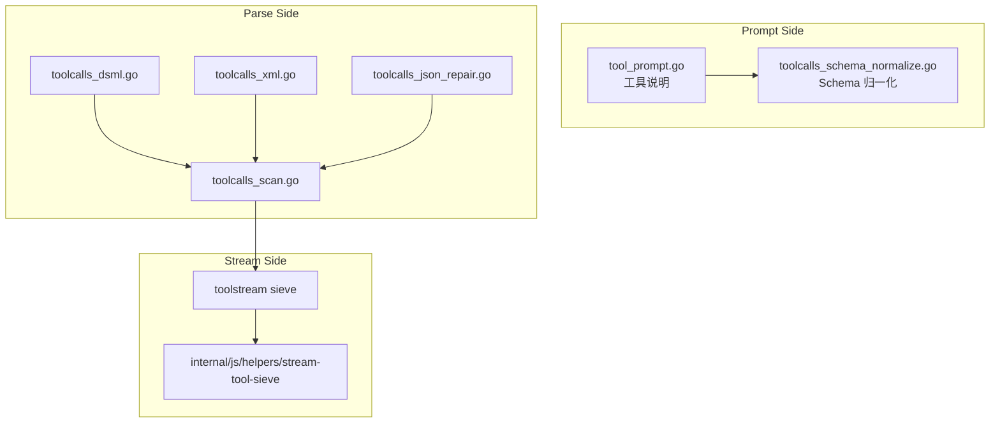
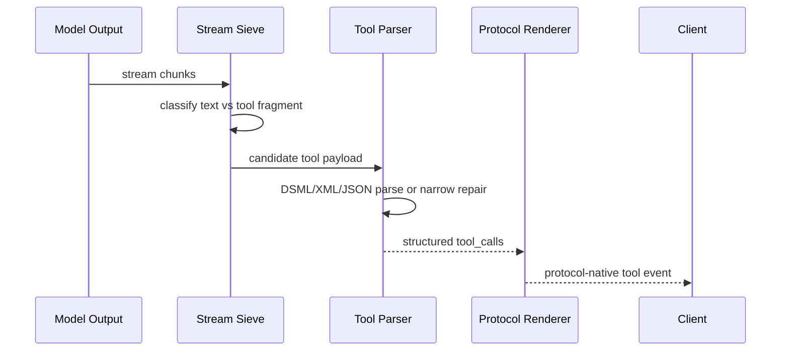

# 工具调用语义

<cite>
**本文档引用的文件**
- [internal/toolcall/toolcalls_parse.go](file://internal/toolcall/toolcalls_parse.go)
- [internal/toolcall/toolcalls_dsml.go](file://internal/toolcall/toolcalls_dsml.go)
- [internal/toolcall/toolcalls_xml.go](file://internal/toolcall/toolcalls_xml.go)
- [internal/toolstream/tool_sieve_core.go](file://internal/toolstream/tool_sieve_core.go)
- [internal/js/helpers/stream-tool-sieve/index.js](file://internal/js/helpers/stream-tool-sieve/index.js)
- [tests/compat/fixtures/toolcalls/canonical_tool_call.json](file://tests/compat/fixtures/toolcalls/canonical_tool_call.json)
</cite>

## 目录

1. [简介](#简介)
2. [项目结构](#项目结构)
3. [核心组件](#核心组件)
4. [架构总览](#架构总览)
5. [详细组件分析](#详细组件分析)
6. [故障排查指南](#故障排查指南)
7. [结论](#结论)

## 简介

工具调用语义的目标是兼容用户客户端的多种工具请求和模型输出形态，同时尽量避免把工具标签泄漏到普通文本。当前实现支持 DSML、XML、JSON 片段和流式筛分，Go 与 Node 侧保持语义对齐。

**章节来源**
- [internal/toolcall/toolcalls_parse.go](file://internal/toolcall/toolcalls_parse.go)
- [internal/toolstream/tool_sieve_core.go](file://internal/toolstream/tool_sieve_core.go)

## 项目结构



**图表来源**
- [internal/toolcall/tool_prompt.go](file://internal/toolcall/tool_prompt.go)
- [internal/toolcall/toolcalls_dsml.go](file://internal/toolcall/toolcalls_dsml.go)
- [internal/toolstream/tool_sieve_core.go](file://internal/toolstream/tool_sieve_core.go)

**章节来源**
- [internal/js/helpers/stream-tool-sieve/index.js](file://internal/js/helpers/stream-tool-sieve/index.js)

## 核心组件

- Tool Prompt：将工具定义转成模型可见的调用格式约束。
- Schema Normalize：修正工具 schema 中的常见客户端兼容问题。
- DSML Parser：解析 `<|DSML|tool_calls>` 及可窄修复的变体。
- XML Parser：兼容旧式 `<tool_calls><invoke><parameter>` 结构。
- JSON Repair：处理常见 JSON 片段和参数字面量。
- Stream Sieve：流式阶段识别工具调用片段，避免泄漏到普通文本。

**章节来源**
- [internal/toolcall/tool_prompt.go](file://internal/toolcall/tool_prompt.go)
- [internal/toolcall/toolcalls_schema_normalize.go](file://internal/toolcall/toolcalls_schema_normalize.go)
- [internal/toolstream/tool_sieve_xml.go](file://internal/toolstream/tool_sieve_xml.go)

## 架构总览



**图表来源**
- [internal/toolstream/tool_sieve_core.go](file://internal/toolstream/tool_sieve_core.go)
- [internal/toolcall/toolcalls_parse.go](file://internal/toolcall/toolcalls_parse.go)
- [internal/format/openai/render_stream_events.go](file://internal/format/openai/render_stream_events.go)

**章节来源**
- [internal/httpapi/openai/responses/responses_stream_runtime_toolcalls.go](file://internal/httpapi/openai/responses/responses_stream_runtime_toolcalls.go)
- [internal/httpapi/claude/tool_call_state.go](file://internal/httpapi/claude/tool_call_state.go)

## 详细组件分析

### 推荐输出格式

推荐模型输出 DSML 外壳：

```xml
<|DSML|tool_calls>
  <|DSML|invoke name="tool_name">
    <|DSML|parameter name="arg">value</|DSML|parameter>
  </|DSML|invoke>
</|DSML|tool_calls>
```

兼容层也接受旧式 XML、常见 DSML wrapper typo、参数 JSON 字面量和可恢复的 CDATA 漏闭合。裸 `<invoke>` 不作为稳定支持格式。

### 早发和最终修复

流式阶段会在高置信工具片段出现时尽早发出协议工具事件；最终 flush 时会再次尝试解析和修复未完整闭合但结构足够明确的工具调用。

### 客户端提交修复

当用户客户端提交的工具定义或工具消息存在轻微格式问题时，兼容层尽量修正为标准结构后继续会话，而不是让当前会话断掉。

**章节来源**
- [internal/toolcall/toolcalls_dsml.go](file://internal/toolcall/toolcalls_dsml.go)
- [internal/toolcall/toolcalls_json_repair.go](file://internal/toolcall/toolcalls_json_repair.go)
- [internal/promptcompat/tool_message_repair.go](file://internal/promptcompat/tool_message_repair.go)

## 故障排查指南

- 工具没有触发：检查模型输出是否有 wrapper，工具名是否和定义一致。
- 工具参数变成字符串：确认参数体是否是合法 JSON 字面量。
- 流式文本夹杂工具标签：检查 sieve 测试，确认输出没有跨 chunk 破坏 wrapper。
- Claude Code 显示异常 tool_result：检查工具结果消息是否被 PromptCompat 修复并写入历史。

**章节来源**
- [tests/compat/fixtures/toolcalls/canonical_tool_call.json](file://tests/compat/fixtures/toolcalls/canonical_tool_call.json)
- [tests/node/stream-tool-sieve.test.js](file://tests/node/stream-tool-sieve.test.js)

## 结论

工具调用兼容的原则是：输入侧容错、输出侧结构化、流式侧防泄漏。新增工具格式时，应同时补 Go 解析、Node sieve 对齐测试和协议渲染测试。

**章节来源**
- [internal/toolcall/regression_test.go](file://internal/toolcall/regression_test.go)
