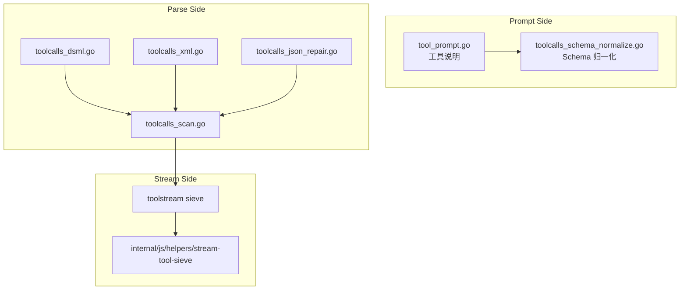
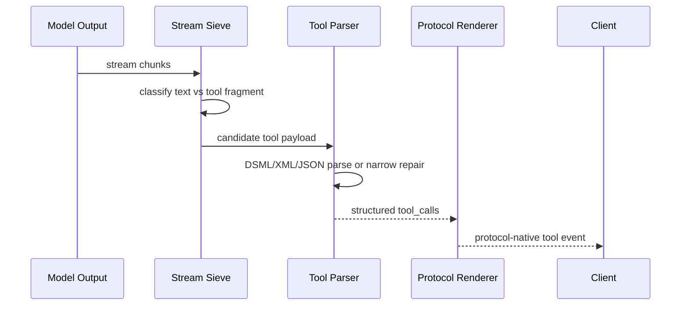

# 工具调用语义

<cite>
**本文档引用的文件**
- [internal/toolcall/toolcalls_parse.go](file://internal/toolcall/toolcalls_parse.go)
- [internal/toolcall/toolcalls_dsml.go](file://internal/toolcall/toolcalls_dsml.go)
- [internal/toolcall/toolcalls_xml.go](file://internal/toolcall/toolcalls_xml.go)
- [internal/toolcall/toolcalls_markup.go](file://internal/toolcall/toolcalls_markup.go)
- [internal/toolcall/toolcalls_parse_markup.go](file://internal/toolcall/toolcalls_parse_markup.go)
- [internal/toolstream/tool_sieve_core.go](file://internal/toolstream/tool_sieve_core.go)
- [internal/js/helpers/stream-tool-sieve/index.js](file://internal/js/helpers/stream-tool-sieve/index.js)
- [internal/js/helpers/stream-tool-sieve/parse_payload.js](file://internal/js/helpers/stream-tool-sieve/parse_payload.js)
- [tests/compat/fixtures/toolcalls/canonical_tool_call.json](file://tests/compat/fixtures/toolcalls/canonical_tool_call.json)
</cite>

## 目录

1. [简介](#简介)
2. [项目结构](#项目结构)
3. [核心组件](#核心组件)
4. [架构总览](#架构总览)
5. [详细组件分析](#详细组件分析)
6. [故障排查指南](#故障排查指南)
7. [结论](#结论)

## 简介

工具调用语义的目标是兼容用户客户端的多种工具请求和模型输出形态，同时尽量避免把工具标签泄漏到普通文本。当前实现支持 DSML、XML、JSON 片段和流式筛分，Go 与 Node 侧保持语义对齐。

> **v1.0.5 ~ v1.0.12 关键变更**
>
> - **v1.0.7 流式提前 finalize**：`internal/httpapi/openai/chat/chat_stream_runtime.go` 的 `onParsed` 在 `evt.ToolCalls` 完整封闭并 `sendDelta` 后立即返回 `Stop: true, StopReason: HandlerRequested`，触发 `finalize()` 走标准 `finish_reason="tool_calls"` + `[DONE]` 路径。修复了上游 DeepSeek 偶发不发 `[DONE]` + 客户端 ctx 取消同时发生时走 `engine.contextDone()` 早退导致客户端读到工具块但拿不到 finish 帧的概率断流。
> - **v1.0.7 token 渗漏清理增强**：`internal/httpapi/openai/shared/leaked_output_sanitize.go` 三个新模式：
>   - `leakedToolResultStartMarkerPattern` / `leakedToolResultEndMarkerPattern` / `leakedMetaMarkerPattern` 尾部斜杠 `/?` → `[/／]?`，覆盖 `<｜Tool／>` 全角斜杠形态。
>   - `leakedDSMLMarkupFragmentPattern`（`(?im)` 多行模式）：清理 sieve 失败时残留的 `<|tool_calls`、`<|DSML|invoke ...>`、`</|DSML|parameter>` 等已知 token 关键字开头的孤立片段（行尾或 `>` 收尾）。
>   - `leakedTrailingPipeTagPattern`：处理 `<|end_of_tool_result|tool_use_error: ...` 这类两个 `|` 之间夹文本无 `>` 收尾的形态。
> - **v1.0.5 MCP 适配**：`expandMCPServersAsTools` 把 Anthropic `mcp_servers[]` 字段中的 `tool_configuration.allowed_tools` 展平为 `<server>.<tool>` 命名虚拟工具，让模型按标准 `tool_use` 块输出供客户端 SDK 调度。详见 [docs/client-compat/claude-coding-clients.md](file://docs/client-compat/claude-coding-clients.md) §6 与 [docs/client-compat/claude-code.md](file://docs/client-compat/claude-code.md)。
> - **v1.0.3 CDATA 管道变体兼容**（Claude Code v2.1.128 子代理名乱码修复）：详见下方"v1.0.3 增量"节。

**章节来源**
- [internal/toolcall/toolcalls_parse.go](file://internal/toolcall/toolcalls_parse.go)
- [internal/toolstream/tool_sieve_core.go](file://internal/toolstream/tool_sieve_core.go)

## 项目结构



**图表来源**
- [internal/toolcall/tool_prompt.go](file://internal/toolcall/tool_prompt.go)
- [internal/toolcall/toolcalls_dsml.go](file://internal/toolcall/toolcalls_dsml.go)
- [internal/toolstream/tool_sieve_core.go](file://internal/toolstream/tool_sieve_core.go)

**章节来源**
- [internal/js/helpers/stream-tool-sieve/index.js](file://internal/js/helpers/stream-tool-sieve/index.js)

## 核心组件

- Tool Prompt：将工具定义转成模型可见的调用格式约束。
- Schema Normalize：修正工具 schema 中的常见客户端兼容问题。
- DSML Parser：解析 `<|DSML|tool_calls>` 及可窄修复的变体。
- XML Parser：兼容旧式 `<tool_calls><invoke><parameter>` 结构；`skipXMLIgnoredSection` 识别并跳过 CDATA 节（含管道变体）与 XML 注释，避免将其内容误解析为标签。
- CDATA 兼容层（v1.0.3 新增）：`extractStandaloneCDATA` 在 Go 与 Node 两端同时识别规范 CDATA `<![CDATA[…]]>`、ASCII 管道变体 `<![CDATA|…]]>`（含可选尾部管道）和全角管道变体 `<![CDATA｜…]]>`，剥离 wrapper 后返回内容值。
- JSON Repair：处理常见 JSON 片段和参数字面量。
- Stream Sieve：流式阶段识别工具调用片段，避免泄漏到普通文本。

**章节来源**
- [internal/toolcall/tool_prompt.go](file://internal/toolcall/tool_prompt.go)
- [internal/toolcall/toolcalls_schema_normalize.go](file://internal/toolcall/toolcalls_schema_normalize.go)
- [internal/toolcall/toolcalls_markup.go](file://internal/toolcall/toolcalls_markup.go)
- [internal/toolstream/tool_sieve_xml.go](file://internal/toolstream/tool_sieve_xml.go)

## 架构总览



**图表来源**
- [internal/toolstream/tool_sieve_core.go](file://internal/toolstream/tool_sieve_core.go)
- [internal/toolcall/toolcalls_parse.go](file://internal/toolcall/toolcalls_parse.go)
- [internal/format/openai/render_stream_events.go](file://internal/format/openai/render_stream_events.go)

**章节来源**
- [internal/httpapi/openai/responses/responses_stream_runtime_toolcalls.go](file://internal/httpapi/openai/responses/responses_stream_runtime_toolcalls.go)
- [internal/httpapi/claude/tool_call_state.go](file://internal/httpapi/claude/tool_call_state.go)

## 详细组件分析

### 推荐输出格式

推荐模型输出 DSML 外壳：

```xml
<|DSML|tool_calls>
  <|DSML|invoke name="tool_name">
    <|DSML|parameter name="arg">value</|DSML|parameter>
  </|DSML|invoke>
</|DSML|tool_calls>
```

兼容层也接受旧式 XML、常见 DSML wrapper typo、全角竖线、零宽字符/`▁` 分隔符、折行闭合标签、参数 JSON 字面量、可恢复的 CDATA 漏闭合，以及 **v1.0.3 新增的 CDATA 管道变体**（`<![CDATA|VALUE]]>` / `<![CDATA|VALUE|]]>` / `<![CDATA｜VALUE]]>`）。裸 `<invoke>` 不作为稳定支持格式。

### 早发和最终修复

流式阶段会在高置信工具片段出现时尽早发出协议工具事件；最终 flush 时会再次尝试解析和修复未完整闭合但结构足够明确的工具调用。

### 客户端提交修复

当用户客户端提交的工具定义或工具消息存在轻微格式问题时，兼容层尽量修正为标准结构后继续会话，而不是让当前会话断掉。

**章节来源**
- [internal/toolcall/toolcalls_dsml.go](file://internal/toolcall/toolcalls_dsml.go)
- [internal/toolcall/toolcalls_json_repair.go](file://internal/toolcall/toolcalls_json_repair.go)
- [internal/promptcompat/tool_message_repair.go](file://internal/promptcompat/tool_message_repair.go)

## v1.0.3 增量：CDATA 管道变体兼容

### 问题根因

DeepSeek 模型在产出 DSML 工具调用时，会把外层 `<|DSML|...|>` 的管道惯例渗入 CDATA opener，产出以下近似 CDATA：

| 变体 | 示例 |
|---|---|
| ASCII 单管道 | `<![CDATA|general-purpose]]>` |
| ASCII 双管道 | `<![CDATA|general-purpose|]]>` |
| 全角管道 | `<![CDATA｜general-purpose]]>` |

原解析器严格要求 `[`，导致变体未被剥离，`subagent_type` 等字符串参数把 wrapper 字面值带回 Claude Code，UI 显示 `<![CDATA|general-purpose]]>` 而非 `general-purpose`。

### Go 侧修复

在 `internal/toolcall/toolcalls_markup.go` 新增：

- `cdataPipeVariantPattern`（第 20 行）：正则匹配三种管道变体，全部映射到内容捕获组。
- `cdataPipeOpenerByteLen`（第 138 行）：按字节长度识别 ASCII `|`（1 byte）和全角 `｜`（UTF-8 3 bytes）开头形态，供后向截取内容用。
- `cdataOpenerByteLenAt`（第 155 行）：定位 `lower` 字符串中任意偏移处的 CDATA 开头（规范 `<![CDATA[` 或管道变体），供 XML 解析遍历时跳过 CDATA 节。
- `extractStandaloneCDATA`（第 116 行）：依次尝试规范 CDATA → 管道变体正则 → 大小写不敏感前缀 → 管道开头字节长度，命中任一分支则返回裸内容。

在 `internal/toolcall/toolcalls_parse_markup.go`，`skipXMLIgnoredSection`（第 209 行）调用 `cdataOpenerByteLenAt` 识别管道变体开头，使 XML 元素遍历正确跳过所有 CDATA 节而不误把管道变体内容当作 XML 标签。

### Node 侧修复

`internal/js/helpers/stream-tool-sieve/parse_payload.js` 新增 `CDATA_PIPE_VARIANT_PATTERN`（第 7 行），在 `extractStandaloneCDATA`（第 1022 行）中与规范 CDATA 正则并列检查，Go 与 Node 双端行为对齐。

### 双层防御

- **解析容错**：三种管道变体均能被正确识别并剥离 wrapper。
- **提示纠正**：`thinking_injection.go` 的 `DefaultThinkingInjectionPrompt` FORMAT 段（见下方 prompt-compatibility.md 章节）显式警告 `<![CDATA|VALUE|]]>` 是无效写法，从源头降低变体出现频率。

**章节来源**
- [internal/toolcall/toolcalls_markup.go:15-170](file://internal/toolcall/toolcalls_markup.go#L15-L170)
- [internal/toolcall/toolcalls_parse_markup.go:209-227](file://internal/toolcall/toolcalls_parse_markup.go#L209-L227)
- [internal/js/helpers/stream-tool-sieve/parse_payload.js:4-31](file://internal/js/helpers/stream-tool-sieve/parse_payload.js#L4-L31)
- [internal/js/helpers/stream-tool-sieve/parse_payload.js:1022-1035](file://internal/js/helpers/stream-tool-sieve/parse_payload.js#L1022-L1035)

## 故障排查指南

- 工具没有触发：检查模型输出是否有 wrapper，工具名是否和定义一致。
- 工具参数变成字符串：确认参数体是否是合法 JSON 字面量。
- 流式文本夹杂工具标签：检查 sieve 测试，确认输出没有跨 chunk 破坏 wrapper。
- Claude Code 显示异常 tool_result：检查工具结果消息是否被 PromptCompat 修复并写入历史。
- Claude Code 子代理名乱码（v1.0.3 前）：若显示 `<![CDATA|general-purpose]]>` 等字样，说明 CDATA 管道变体未被剥离；升级到 v1.0.3 后修复；或检查 `extractStandaloneCDATA` 是否覆盖了该变体形态。

**章节来源**
- [tests/compat/fixtures/toolcalls/canonical_tool_call.json](file://tests/compat/fixtures/toolcalls/canonical_tool_call.json)
- [tests/node/stream-tool-sieve.test.js](file://tests/node/stream-tool-sieve.test.js)

## 结论

工具调用兼容的原则是：输入侧容错、输出侧结构化、流式侧防泄漏。新增工具格式时，应同时补 Go 解析、Node sieve 对齐测试和协议渲染测试。

**章节来源**
- [internal/toolcall/regression_test.go](file://internal/toolcall/regression_test.go)
